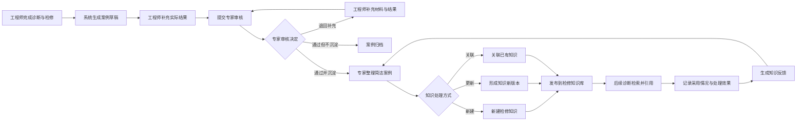

# 后台案例回流与检修知识闭环业务方案

> 版本：V1.2（演示导向业务基线）
> 日期：2026-07-11
> 当前状态：业务闭环与演示范围已确认，可据此制定演示脚本、信息架构和开发 Spec
> 适用阶段：后台管理、案例回流、专家审核与检修知识库建设

## 1. 方案目标

后台的核心不是传统的人员增删改查，而是建立一条可追踪的业务闭环：

> 一线检修产生真实案例，专家审核并提炼为可复用知识，知识参与下一次诊断，实际使用效果再次反馈给专家修订。

第一版采用“专家兼任知识管理员”的简化模式，减少重复审核环节，同时保留以后拆分独立知识管理员角色的能力。

### 1.1 第一版交付目标

第一版以以下两类成果为导向：

1. PPT：展示平台具备多场站、多设备、多类型案例和持续知识沉淀能力；
2. 几分钟演示视频：完整证明一条检修案例能够经过工程师提交、专家修订和知识发布形成闭环。

因此，第一版不追求让所有展示案例都具备完整操作能力，而采用：

> 一条完整可操作案例 + 十余条只读历史摘要 + 一条真实更新知识 + 多条预置知识。

完整案例体现流程深度，历史摘要和预置知识体现系统规模与业务宽度。

## 2. 核心业务主线



## 3. 角色与职责

### 3.1 一线工程师

负责现场事实和实际结果，不负责把经验整理成通用知识。

主要操作：

- 执行诊断、预方案和检修向导；
- 确认实际故障原因；
- 补充实际处理动作和更换部件；
- 填写告警是否解除、设备是否恢复；
- 补充恢复后的温度、转速和观察结果；
- 上传缺失的现场材料；
- 对专家退回项进行补充；
- 提交或重新提交专家审核；
- 查看本人案例的审核结果。

### 3.2 专家（兼知识管理员）

专家同时负责案例真实性审核和检修知识发布，但两个动作在业务上仍然分开记录。

主要操作：

- 审核故障原因是否有证据支持；
- 核对实际操作是否安全、合理；
- 判断恢复验证是否充分；
- 退回并明确需要补充的内容；
- 决定案例通过后是否值得沉淀；
- 将完整案例整理为简洁案例；
- 新建、更新或关联检修知识；
- 发布、修订或停用知识；
- 处理知识使用效果产生的反馈任务。

第一版只设置一个专家账号，该账号可以审核全部场站、设备类型和工程师提交的案例，不划分专业范围或组织数据范围。

### 3.3 系统管理员

管理员只负责平台治理，不参与专业结论审核。

主要操作：

- 管理工程师、专家和管理员账号；
- 管理场站、班组、组织关系和设备权限；
- 分配角色与数据访问范围；
- 查看操作日志和系统配置；
- 停用异常账号或撤销错误权限。

### 3.4 管理人员（第一版只读）

- 查看案例处理数量和平均审核时长；
- 查看知识发布、引用和有效率；
- 查看场站、设备和故障类型分布；
- 不修改专业案例与知识内容。

## 4. 业务对象边界

### 4.1 检修记录

检修记录保存一次作业过程，包括执行了哪些步骤、确认了哪些安全项、何时完成以及由谁完成。

### 4.2 检修案例

检修案例描述一次真实发生的异常及其最终处理结果，是专家审核的主要对象。

案例回答：

> 现场实际发生了什么，系统如何判断，工程师做了什么，最终结果如何？

### 4.3 简洁案例

简洁案例由专家从完整案例中提炼，用于快速阅读和知识编辑，不替代原始案例。

简洁案例回答：

> 这次案例中最值得复用的现象、原因、处理方法和适用边界是什么？

### 4.4 检修知识

检修知识是可被后续诊断检索和引用的正式内容，可以由多个案例共同支持。

知识回答：

> 遇到符合哪些条件的异常，应如何判断和处理，并需要遵守哪些安全边界？

### 4.5 知识反馈

知识反馈记录某条知识在真实诊断中的使用效果，用于决定是否修订、扩展或停用。

## 5. 案例产生与工程师确认

完成检修后，系统自动生成案例草稿，自动带入：

- 发生时间和地点；
- 设备型号、角色和关联告警；
- 图片、视频和音频；
- 现场描述和运行参数；
- 多 Agent 诊断过程和结论；
- 诊断引用的标准、手册和知识；
- 预方案及其修改记录；
- 实际执行步骤和安全确认；
- 恢复验证数据；
- 操作人员和处理时间。

工程师必须补充或确认：

- 最终故障原因；
- 实际处理方法；
- 更换、清理或调整的部件；
- 未执行建议步骤及原因；
- 告警是否解除；
- 设备是否恢复正常；
- 恢复后的关键参数；
- 遗留风险和后续建议；
- 是否建议作为典型案例（仅供专家参考）。

未完成必要结果确认时，不允许提交专家审核。

## 6. 专家审核

### 6.1 审核关注点

- 原因是否有现场材料、参数或检修结果支持；
- Agent 诊断与最终原因是否一致；
- 实际处理动作是否符合设备手册；
- 是否完成必要的安全确认；
- 恢复验证是否能证明问题已解决；
- 内容中是否存在错误或危险经验；
- 是否具有跨人员、跨班组或跨场站复用价值；
- 是否与现有知识重复或冲突。

### 6.2 审核结果

#### 退回补充

专家必须填写结构化退回原因：

- 缺少现场证据；
- 故障原因不明确；
- 实际处理结果不完整；
- 恢复验证不足；
- 安全记录缺失；
- 其他说明。

退回后，工程师修改并重新提交，原审核意见和历史版本必须保留。

#### 通过但不沉淀

适用于案例真实完整，但没有新增复用价值的情况。案例进入历史案例库，不生成或修改知识。

常见原因：

- 现有知识已经完整覆盖；
- 属于普通重复故障；
- 现场条件特殊，不适合推广；
- 仅需作为检修记录留档。

#### 通过并沉淀

专家进入知识整理环节，将案例压缩为简洁案例，并选择：

- 新建知识条目；
- 更新已有知识条目；
- 关联已有知识但不修改；
- 同时更新多条相关知识。

专家允许直接修正案例中的专业表述、简洁案例和知识内容后通过，不必再次退回工程师确认；专家的修改内容、修改时间和原始版本必须保留在审核记录中。涉及现场事实缺失、材料缺失或实际处理结果无法确认时，仍然退回工程师补充。

## 7. 简洁案例结构

专家整理的简洁案例至少包含：

- 标题；
- 适用设备和设备角色；
- 适用场景或环境条件；
- 典型现象；
- 关键告警与阈值；
- 最终确认原因；
- 推荐检查顺序；
- 实际有效处理方法；
- 安全前置条件；
- 恢复验证标准；
- 不适用范围；
- 关联原始案例和证据。

系统可以由 Agent 生成初稿，但专家必须确认后才能发布。

## 8. 知识处理方式

### 8.1 新建知识

适用于知识库中没有对应故障模式或处理方法的情况。

### 8.2 更新已有知识

适用于新案例补充了以下内容：

- 新设备型号；
- 新告警或阈值；
- 更准确的检查顺序；
- 新的环境适用条件；
- 新的安全风险；
- 更可靠的恢复验证标准。

更新不得覆盖旧版本，必须形成新版本并记录修改原因。

一条案例允许同时更新多条知识，例如同时补充故障判断规则、检修步骤、安全条件和恢复验证标准。每条被更新知识都必须分别记录变更内容和案例来源。

### 8.3 关联已有知识

案例可以只作为已有知识的新证据来源，提高可信度，但不改变知识正文。

### 8.4 停用知识（非第一版 P0）

知识停用能力作为后续可选功能，第一版不要求实现自动停用、高风险立即停用或管理员复核流程。后续如实现，可参考以下触发条件：

- 存在安全风险；
- 设备版本变化后不再适用；
- 多次实际应用失败；
- 与新版设备手册或标准冲突。

未来知识停用后不能继续被新诊断推荐，但历史引用记录必须保留。

## 9. 状态模型

### 9.1 案例状态

```text
草稿
→ 待工程师确认
→ 待专家审核
→ 审核中
→ 已通过
→ 已归档
```

退回分支：

```text
待专家审核 / 审核中
→ 退回补充
→ 待工程师确认
→ 待专家审核
```

“已通过”必须记录沉淀结果：

```text
不沉淀 / 新建知识 / 更新知识 / 关联已有知识
```

### 9.2 知识状态

```text
草稿 → 已发布 → 已停用
```

第一版不设置独立的“待知识管理员审核”，因为专家同时承担发布职责。

### 9.3 反馈状态

```text
正常记录 / 待专家关注 / 待修订 / 已处理
```

## 10. 知识引用与效果反馈

每次诊断引用知识时记录：

- 诊断任务和设备；
- 被引用的知识及版本；
- 命中的现象和条件；
- 是否展示给工程师；
- 是否被工程师采用；
- 采用了哪些步骤；
- 最终故障原因是否一致；
- 是否成功解决问题；
- 工程师评价或备注。

系统生成专家反馈任务的建议规则：

- 多次采用且有效：提高可信度；
- 多次未被采用：检查内容是否过于复杂或不适用；
- 推荐原因与最终原因不一致：标记待修订；
- 新设备型号验证有效：建议扩展适用范围；
- 出现安全风险：立即标记高优先级并建议停用；
- 新案例与原知识冲突：要求专家比较证据后处理。

## 11. 后台第一版页面范围

### 11.0 演示数据分层

| 数据层级 | 建议数量 | 交互能力 | 演示用途 |
| --- | ---: | --- | --- |
| 完整闭环案例 | 1 条 | 可补充、提交、审核、修改、沉淀知识 | 视频主流程 |
| 建设中案例 | 1 条 | 只展示资料收集状态和缺失项 | 说明后续扩展 |
| 历史摘要案例 | 10–12 条 | 列表筛选和一页只读详情 | PPT 与后台规模展示 |
| 真实更新知识 | 1 条 | 随完整案例发布产生版本变化 | 视频闭环结果 |
| 预置知识 | 6–8 条 | 列表和只读详情 | 丰富知识库展示 |

建议数据标识：

```js
{
  mode: "interactive" | "readonly",
  dataLevel: "full" | "summary" | "collecting",
  source: "verified_demo" | "presentation_seed"
}
```

只有 `interactive + full + verified_demo` 可以进入专家审核和知识更新流程。展示摘要不得参与真实知识可信度、引用效果或 Agent 诊断依据计算。

### P0：案例回流工作台

- 按当前角色展示待办；
- 待工程师确认、待专家审核、退回补充、待知识整理；
- 最近审核和最近发布；
- 支持按状态、设备、场站和人员筛选。

工作台既是视频的后台入口，也是 PPT 截图的主要页面。需要用摘要案例、状态数量和知识回流结果营造平台已经持续运行的业务背景。

### P0：案例详情与工程师补充页

- 原始异常与现场材料；
- 诊断结论和引用依据；
- 实际检修步骤；
- 工程师实际结果表单；
- 专家退回意见；
- 提交和重新提交。

工程师可以查看其他工程师已经归档的案例，用于参考历史处理经验；草稿、待确认、审核中和退回补充的案例默认只对案例本人、专家和管理员展示。

### P0：专家审核与知识整理页

- 原始案例与系统生成摘要对照；
- 审核检查项；
- 退回、通过归档、通过并沉淀；
- 简洁案例编辑；
- 新建、更新或关联知识；
- 发布知识。

第一版完整编辑和状态变化只服务唯一的完整闭环案例。历史摘要案例即使进入详情，也不显示审核、修改和发布按钮。

### P0：检修知识库管理页

- 知识列表、版本和状态；
- 适用设备与故障类型；
- 关联案例；
- 引用和使用效果；
- 修改、发布和停用。

知识库采用“一条动态知识 + 多条预置知识”：

- 动态知识由完整演示案例实际更新；
- 发布后必须明显展示新版本、更新时间、修改专家和来源案例；
- 预置知识只读，用于展示知识覆盖范围；
- 视频最后回到知识库查看动态知识的变化，作为闭环完成标志。

### P0：历史案例展示页

准备 10–12 条内容可信、结构统一的摘要案例，支持：

- 按故障类型、设备、场站和状态筛选；
- 关键词搜索；
- 卡片或列表展示；
- 点击进入一页只读详情。

只读详情只需要展示：

- 案例编号、标题和状态；
- 场站、设备、工程师和专家；
- 故障现象；
- 最终原因；
- 处理方法；
- 恢复结果；
- 处理日期；
- 是否沉淀知识及关联知识标题。

历史摘要案例不制作完整现场材料、Agent 过程、检修步骤、版本编辑和审核操作。

### P1：工程师与专家管理页

- 账号、角色、班组、场站和状态；
- 专家账号标识；第一版专家默认可以审核全部案例；
- 权限配置和操作记录。

### P1：知识效果与反馈页

- 引用次数、采用次数和有效次数；
- 误判和未采用记录；
- 待修订反馈；
- 专家处理记录。

## 12. 后台首页主次关系

后台首页应优先展示业务待办，不以人员管理为首页主体。

推荐优先级：

1. 当前用户待处理事项；
2. 退回和高风险事项；
3. 最近案例与知识流转；
4. 知识引用效果；
5. 人员、组织和系统配置入口。

## 12.1 视频唯一主流程

视频只演示以下闭环，不展示多个案例的重复操作：

```text
工程师完成检修
→ 系统生成案例草稿
→ 工程师确认结果并提交专家
→ 工程师退出并登录专家账号
→ 专家审核并修正案例
→ 专家编辑简洁案例
→ 更新对应检修知识
→ 发布知识新版本
→ 返回知识库查看更新结果
```

建议压缩成五个画面：

1. 工程师确认实际结果并提交；
2. 专家工作台收到待审核案例；
3. 专家查看证据并修改专业内容；
4. 专家编辑知识并发布；
5. 知识库显示新版本、来源案例和更新时间。

## 12.2 PPT 与视频分工

PPT 负责展示能力宽度：

- 多场站、多设备和多类故障；
- 历史案例列表与状态分布；
- 专家审核机制；
- 知识库规模和引用关系；
- 案例回流闭环及后续扩展。

视频负责证明能力深度：

> 一条真实案例如何从现场检修结果，变成经过专家修订、可以再次参与诊断的检修知识。

管理员和人员管理页面可以用于 PPT 截图，但不进入视频主流程。

## 13. 第一版暂不实现

- 独立知识管理员角色；
- 多级专家会签；
- 跨组织知识发布审批；
- 自动无人工确认发布知识；
- 复杂积分、绩效和排行榜；
- 知识版权和外部共享审批；
- 完整的数据分析大屏；
- 真实消息通知和第三方工单集成。
- 站内待办提醒；待处理事项只在后台工作台列表和数量中展示；
- 高风险知识自动停用和完整停用审批；
- 后台案例与知识的 PDF 导出和打印。
- 历史摘要案例的修改、重新审核、退回和知识发布；
- 十余条案例的完整诊断材料和检修过程；
- 多条案例同时进行完整状态流转；
- 演示视频中与主闭环无关的人员和系统配置操作。

补充说明：后台不提供案例和知识的 PDF/打印功能；前台工程师检修流程中已有或计划中的检修记录、作业卡打印能力不受此限制。

## 14. 已冻结的产品决定

以下决定已经确认，后续信息架构、开发 Spec、接口和数据结构均以此为准：

1. 专家可以修改专业内容后直接通过，系统保留修改记录和原版本；
2. 一条案例允许同时新建、更新或关联多条知识；
3. 高风险知识停用不列入第一版必做范围；
4. 工程师可以查看其他工程师已归档的案例；
5. 第一版只设置一个专家账号，可以审核全部案例；
6. 第一版不做站内待办提醒；
7. 管理员默认不能修改案例专业结论和检修知识内容；
8. 后台案例和知识不提供 PDF 导出与打印，前台工程师检修记录和作业卡除外。

## 15. 建议的下一步

本方案确认后再依次开展：

1. 先编写三至五分钟的视频分镜与演示数据清单，冻结视频必须出现的五个画面；
2. 冻结唯一完整案例、动态知识及历史摘要的字段；
3. 制定后台信息架构和页面流转图；
4. 编写前端骨架开发 Spec；
5. 定义统一 mock service 和未来接口契约；
6. 优先开发案例工作台、完整案例审核页和知识发布结果；
7. 再补历史案例展示页和预置知识列表；
8. 页面与视频主线评审通过后，再决定真实后端、数据库和权限的接入范围。
