# 工控设备智能检修与知识作业系统

# 软件功能设计文档

## 文档信息

| 项目 | 内容 |
| --- | --- |
| 软件名称 | 工控设备智能检修与知识作业系统 |
| 文档名称 | 软件功能设计文档 |
| 软件版本 | V1.0 |
| 文档版本 | V0.11（送审稿） |
| 编制日期 | 2026年7月15日 |
| 文档状态 | 送审稿 |

---

## 1. 引言

### 1.1 编写目的

本文档说明“工控设备智能检修与知识作业系统”的软件功能实现方案，明确系统架构、模块职责、业务对象、处理流程、数据组织、接口协作、安全控制和异常处理机制，为软件开发、功能测试、产品交付和后续维护提供统一设计依据。

本文档承接《软件功能需求分析文档》中已经确定的功能范围，重点回答各项功能如何组织和实现，不重复展开项目建设必要性，也不替代用户操作说明、功能测试结果和安装部署步骤。

### 1.2 项目概述

本系统面向工业现场检修工程师、检修专家和用户管理员，以现场异常为业务起点，组织设备信息、多模态材料、检修资料和运行参数，完成辅助诊断、检修预方案、步骤化作业、恢复验证、专家审核、记录归档和知识更新，并通过独立用户管理后台维护账号、角色和组织归属。

系统围绕以下业务闭环进行设计：

> 工业现场异常接入 → 设备与故障识别 → 检修资料与知识检索 → 智能辅助诊断 → 步骤化检修 → 恢复运行验证 → 专家审核 → 检修记录与作业卡输出 → 案例、知识和图谱回流。

系统以工业计算设备为首期应用对象，通过设备目录、检修知识库和知识图谱扩展设备品牌、型号、部件和故障领域。

### 1.3 设计范围

本文档设计范围包括：

- 面向工程师的异常接入、资料选择、辅助诊断、检修向导、恢复验证、检修记录和作业卡功能；
- 面向专家的任务审核、知识维护、知识图谱维护和知识发布功能；
- 面向用户管理员的账号统计、查询筛选、新增编辑、组织归属、启停和密码重置功能；
- 支撑业务功能的文件处理、语音输入、OCR、语音转写、知识检索、模型调用和PDF生成能力；
- PostgreSQL、pgvector、Neo4j和文件资源库之间的数据组织与协作；
- 身份认证、操作审计、异常恢复、运行监控和扩展机制。

具体安装命令、端口配置、初始化步骤、备份命令和卸载方法由《软件安装包及部署文档》说明；实际测试过程和测试结论由《软件功能测试报告》记录。

### 1.4 设计依据

本设计主要依据以下资料：

- 中国软件杯大学生软件设计大赛A1赛题要求；
- 《软件功能需求分析文档》；
- 《目标技术架构基线》；
- 工业计算设备用户手册、安装手册和维护资料；
- 系统检修知识库、典型案例和知识图谱内容；
- LoongArch64和银河麒麟目标运行环境要求。

### 1.5 术语和缩略语

| 术语 | 说明 |
| --- | --- |
| 异常事件 | 对现场设备异常现象、发生时间、位置、材料和运行参数的统一记录 |
| 检修任务 | 由异常事件发起并贯穿诊断、检修、验证、审核和归档的业务对象 |
| 检修资料包 | 工程师为当前任务选择的手册、案例、知识条目和历史记录集合 |
| 检修预方案 | 系统根据诊断结果和知识依据形成、等待工程师确认的检修阶段及步骤 |
| 当前步骤追问 | 工程师围绕检修向导当前步骤提出的文字或语音问题 |
| 语音输入 | 将用户主动采集的短时语音识别为可编辑文字的输入方式 |
| 音频材料 | 作为设备异响或现场事实证据接入检修任务并按任务生命周期保存的音频文件 |
| 用户管理员 | 负责工程师和专家账号、角色、组织归属及启停状态的独立管理角色 |
| 知识条目 | 从手册、案例或检修记录中形成的结构化检修知识单元 |
| 知识回流 | 将完成并审核通过的检修经验转化为案例、知识条目和图谱关系的过程 |
| RAG | 检索增强生成，将检索到的知识证据与业务上下文共同提供给模型生成回答 |
| SSE | Server-Sent Events，用于服务端向浏览器连续推送智能问答内容 |

---

## 2. 设计目标与原则

### 2.1 设计目标

系统设计需要达到以下目标：

1. 将异常接入、诊断、检修、验证、审核和知识沉淀组织为连续业务流程；
2. 统一处理文字、语音、图片、视频、音频、设备资料和运行参数；
3. 使智能诊断和检修问答能够引用设备手册、历史案例、知识条目和知识图谱关系；
4. 通过标准步骤、安全约束、人工确认和专家审核控制检修过程质量；
5. 自动形成结构一致、可查询、可打印和可追溯的检修记录与PDF作业卡；
6. 支持知识内容和图谱关系的新增、修改、审核、发布与版本追踪；
7. 支持LoongArch64与银河麒麟环境下的安装、运行、监控和维护；
8. 支持后续扩展新的设备、故障领域、资料类型、模型服务和检修流程。

### 2.2 设计原则

#### 2.2.1 业务闭环驱动

系统模块围绕检修任务组织。页面状态、智能能力、文件材料和知识引用均与具体任务或知识变更对象关联，避免形成相互孤立的功能入口。

#### 2.2.2 人机协同

模型负责资料提取、知识检索、故障分析和内容组织，工程师负责确认现场事实、检修方案和操作结果，专家负责审核检修结论和知识更新。模型生成内容不得直接替代现场人员完成危险操作或责任确认。

#### 2.2.3 来源可追溯

诊断建议、检修步骤和问答结果应保留引用资料、适用范围和业务上下文。知识条目及图谱关系保留来源、版本、审核和发布时间。

#### 2.2.4 模块化单体

核心业务后端采用模块化单体架构，在统一FastAPI应用中按业务域划分模块。文档解析、向量化和多媒体处理等耗时能力通过异步任务执行，减少分布式系统复杂度。

#### 2.2.5 数据分工存储

PostgreSQL保存结构化业务数据，pgvector保存知识片段的向量索引，Neo4j保存知识节点和关系，文件资源库保存原始资料、现场材料及导出文件。各类数据通过稳定业务标识关联。

#### 2.2.6 智能能力可替换

语言、视觉、语音、向量和重排序模型通过统一模型网关接入，业务模块不直接绑定厂商请求格式，便于调整模型版本或替换服务实现。

#### 2.2.7 安全与最小留存

系统按照工程师、专家和用户管理员三类固定角色控制访问权限，对关键操作形成审计记录。用户管理员不继承专家的专业内容权限；麦克风、上传文件和模型凭据按最小权限使用；短时语音输入完成识别后不作为检修附件长期保存。

### 2.3 设计约束

- 系统采用B/S架构，主要功能通过PC浏览器访问；
- 核心业务部署目标为LoongArch64处理器和银河麒麟高级服务器操作系统；
- 系统需要适应离线安装和业务网络受限的交付环境；
- 外部模型API不可用时，常规业务数据和已经发布的知识仍应可访问；
- 设备专用参数、接线方式和拆装步骤必须标明适用型号和资料来源；
- Neo4j的具体部署节点须依据LoongArch64兼容性专项验证结果确定；
- 浏览器语音输入依赖用户授权麦克风，拒绝授权时必须保留键盘输入路径；
- 涉及断电、拆装、挂牌和恢复上电的步骤必须保留安全提示与人员确认。

---

## 3. 系统总体设计

### 3.1 系统功能组成

系统功能划分为工程师业务域、专家业务域、用户管理域、知识管理域、智能能力域和运行保障域。六个功能域通过统一的用户身份、检修任务、知识标识和操作审计进行关联。

| 功能域 | 主要模块 | 主要使用者 | 主要输入 | 主要输出 |
| --- | --- | --- | --- | --- |
| 工程师业务域 | 工程师工作台、异常接入、设备确认、资料选择、辅助诊断、检修预方案、检修向导、恢复验证、检修记录、作业卡 | 一线检修工程师 | 现场描述、语音输入、多模态材料、设备信息、运行参数和操作结果 | 诊断建议、确认方案、检修过程、恢复结论、检修记录和PDF作业卡 |
| 专家业务域 | 专家工作台、检修审核、专家会诊、结论修正和知识发布 | 检修专家 | 待审核任务、检修事实、诊断依据、执行步骤和恢复结果 | 审核意见、修正结论、发布决定和知识更新意见 |
| 用户管理域 | 用户统计、查询筛选、新增编辑、组织归属、账号启停、密码重置和操作审计 | 用户管理员 | 用户资料、固定角色、场站班组、机构专业方向和账号状态 | 用户账号、权限边界、组织归属、状态变化和审计记录 |
| 知识管理域 | 检修知识库、资料解析、知识条目、知识图谱、知识回流和版本管理 | 检修专家 | 设备手册、历史案例、检修记录、专家知识和图谱变更 | 可检索知识、图谱节点关系、来源信息和知识版本 |
| 智能能力域 | OCR、语音识别、多模态理解、向量化、混合检索、重排序、RAG问答和知识抽取 | 业务模块调用 | 业务上下文、材料内容、知识片段和模型请求 | 识别文本、检索结果、诊断建议、问答内容和知识候选 |
| 运行保障域 | 基础配置、文件规则、模型配置、日志、监控、备份和版本维护 | 系统部署与运维过程 | 配置变更、运行指标、日志和备份任务 | 配置状态、健康状态、运行日志和备份结果 |

工程师业务域是系统的主要作业入口；专家业务域负责质量控制；用户管理域维护人员账号和访问资格；知识管理域为检修过程提供依据并接收检修结果回流；智能能力域向各业务模块提供统一服务；运行保障域保证系统可配置、可观测和可维护。用户管理域属于产品后台功能，运行保障域属于系统运行机制，二者不共享业务权限。

### 3.2 总体逻辑架构

系统采用前后端分离的B/S架构。前端负责业务页面、图谱可视化、交互状态和浏览器语音采集；Nginx提供统一访问入口；Python核心业务服务承载检修业务规则；智能检索和多模态处理能力通过应用服务及异步任务协作；数据按业务、向量、图关系和文件类型分别存储。

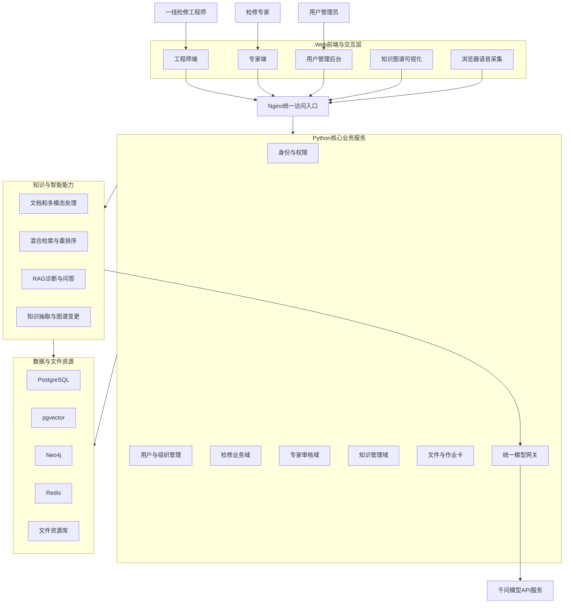

逻辑架构中的主要调用方向如下：

1. 浏览器通过Nginx访问前端资源和后端接口；
2. 核心业务服务完成身份校验、业务规则判断、事务处理和任务状态管理；
3. 耗时的资料解析、向量化、多媒体处理和PDF生成工作提交至异步任务；
4. 智能检索服务组合业务条件、关键词、向量和图关系进行知识召回；
5. 统一模型网关调用语音、OCR、向量、重排序和大语言模型API；
6. 智能输出返回业务服务，由业务服务补充来源、状态和权限信息后提供给前端；
7. 经工程师或专家确认的数据才进入后续业务阶段或正式知识版本。

### 3.3 系统分层设计

系统按照表现、接口、应用、领域、智能能力、基础设施和数据七个层次组织。上层只能通过明确接口使用下层能力，核心业务规则不写入页面组件、模型提示模板或数据库脚本。

| 层次 | 主要组成 | 设计职责 | 禁止承担的职责 |
| --- | --- | --- | --- |
| 表现层 | Vue 3页面、Ant Design Vue组件、Cytoscape.js、ECharts | 页面展示、用户输入、交互状态、图谱操作和浏览器媒体采集 | 不直接访问数据库，不决定审核和发布结果 |
| 接口层 | FastAPI路由、Pydantic请求响应模型、JWT依赖 | 接收请求、身份校验、参数校验、结果序列化和错误转换 | 不直接编排复杂业务流程 |
| 应用服务层 | 检修任务、资料选择、诊断、向导、审核、知识发布等应用服务 | 编排用例、控制事务、调用领域服务和基础设施 | 不包含前端展示逻辑和厂商模型请求格式 |
| 领域服务层 | 状态转换、步骤规则、安全约束、审核规则和知识发布规则 | 实现稳定业务规则与领域校验 | 不依赖具体Web框架和页面组件 |
| 智能能力层 | 多模态处理、混合检索、RAG、知识抽取和模型网关 | 提供识别、检索、生成和抽取能力 | 不替代工程师及专家完成责任确认 |
| 基础设施层 | SQLAlchemy、Neo4j驱动、Celery、Redis、文件服务、PDF服务和HTTP客户端 | 实现数据库、队列、文件、外部服务和模板渲染适配 | 不定义业务状态合法性 |
| 数据层 | PostgreSQL、pgvector、Neo4j和文件资源库 | 持久化业务数据、向量、图关系和文件 | 不通过数据库触发器编排完整业务流程 |

前端状态用于反馈当前交互过程，后端状态是业务事实的唯一依据。例如，语音按钮的“录音中”属于前端媒体状态，而检修任务的“执行中”必须由后端任务状态确定。

### 3.4 功能模块关系

#### 3.4.1 主业务链路

系统以异常事件和检修任务作为主线。异常接入形成异常事件，经设备信息确认后创建或更新检修任务；资料选择和知识检索为诊断提供依据；诊断结论经确认后形成检修预方案；向导记录每个步骤的执行结果；恢复验证决定任务是否具备闭环条件；任务完成后生成记录和作业卡。

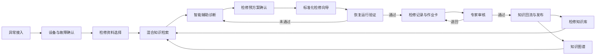

#### 3.4.2 语音能力关系

语音输入、音频材料和语音播报使用不同处理链路：

- 首页语音输入将短时语音识别为异常描述文字，用户确认后进入异常事件；
- 检修智能体语音输入将短时语音识别为追问文字，用户确认后进入当前步骤问答；
- 音频材料保存原始录音及其转写内容，作为现场事实和诊断证据；
- 检修步骤语音播报读取已经确认的步骤文字，不改变步骤内容和完成状态。

#### 3.4.3 专家审核关系

专家审核读取异常事实、资料引用、诊断建议、方案修改、步骤记录、处理措施和恢复参数。审核通过后允许任务归档并产生知识候选；审核退回时保留原提交版本和审核意见，由工程师补充后再次提交。

#### 3.4.4 知识回流关系

知识回流从已完成且审核通过的检修记录中提取案例摘要、故障现象、原因、诊断方法、处置措施和验证结果。候选内容进入专家审核，不直接覆盖已发布知识。发布后同时更新知识条目、向量索引和图谱关系，并保留同一变更批次标识。

#### 3.4.5 用户管理关系

用户管理员通过独立后台访问用户管理模块。用户列表从统一用户数据读取，并根据角色显示不同组织字段：工程师关联场站和班组，专家关联机构和专业方向。新增或编辑操作先完成必填项、登录账号唯一性和角色字段校验，再写入用户数据及审计记录；停用账号后阻止其建立新的登录会话；密码重置形成独立安全事件。用户管理模块不调用检修审核、知识发布和图谱编辑服务。

### 3.5 技术架构

系统采用已经确认的目标技术架构。各项技术与功能设计的对应关系如下。

| 技术范围 | 目标技术 | 在功能设计中的用途 |
| --- | --- | --- |
| Web前端 | Vue 3、TypeScript、Vite、Ant Design Vue | 工程师端、专家端和用户管理后台页面及交互 |
| 前端状态与路由 | Pinia、Vue Router | 用户会话、路由权限和跨页面任务状态 |
| 图谱与数据可视化 | Cytoscape.js、Apache ECharts | 知识图谱交互和业务统计图表 |
| 浏览器语音采集 | MediaDevices、MediaRecorder | 异常描述和当前步骤追问的短时语音采集 |
| 统一入口 | Nginx | 静态资源、反向代理和访问控制 |
| 身份与用户管理 | 账号密码、JWT、固定角色 | 三类用户登录、工作区隔离、账号状态和用户资料管理 |
| 核心业务后端 | Python 3.12、FastAPI、Pydantic | 业务接口、输入输出校验和模块编排 |
| 数据访问与迁移 | SQLAlchemy 2.x、Alembic | PostgreSQL事务访问和数据库版本迁移 |
| 异步任务 | Celery、Redis | 文档解析、向量化、多媒体处理和PDF生成 |
| 业务与向量数据 | PostgreSQL、pgvector | 业务对象、知识元数据及1024维语义向量 |
| 图关系数据 | Neo4j、Cypher、Neo4j Python驱动 | 知识图谱节点、关系、路径查询和变更管理 |
| 文件资源 | 本地受控文件资源库 | 手册、案例附件、现场材料、临时文件和PDF |
| 文档和媒体处理 | pypdf、pdfplumber、Office解析组件、FFmpeg | 文档内容提取、格式处理和音视频预处理 |
| 智能模型 | qwen3.7-plus、qwen3.5-ocr、qwen3-asr-flash、text-embedding-v4、qwen3-rerank | 诊断问答、OCR、语音识别、向量化和重排序 |
| RAG与模型接入 | LangChain Core、OpenAI Python SDK、DashScope Python SDK | 检索链组织、模型调用和结构化输出 |
| 外部请求与配置 | httpx、Tenacity、pydantic-settings | 模型请求、超时重试和环境配置 |
| PDF输出 | Jinja2、WeasyPrint、思源黑体、思源宋体 | 检修作业卡模板渲染和中文PDF生成 |
| 服务与监控 | Uvicorn、systemd、structlog、Prometheus、Grafana | 服务运行、结构化日志、指标采集和状态看板 |
| 自动化测试 | pytest、Playwright | 后端、接口及关键业务流程验证 |

技术组件的固定版本、安装来源和目标环境兼容性由部署设计及实际验证结果确定，不改变本章定义的模块职责和调用边界。

### 3.6 运行拓扑概述

系统采用以LoongArch64业务节点为核心的服务化运行形态。浏览器负责用户交互和受控媒体采集；业务节点运行Web入口、核心业务、异步任务、关系数据库、缓存、文件服务和监控组件；Neo4j根据兼容性验证结果部署在业务节点或独立兼容节点；模型能力通过统一网关访问千问API服务。

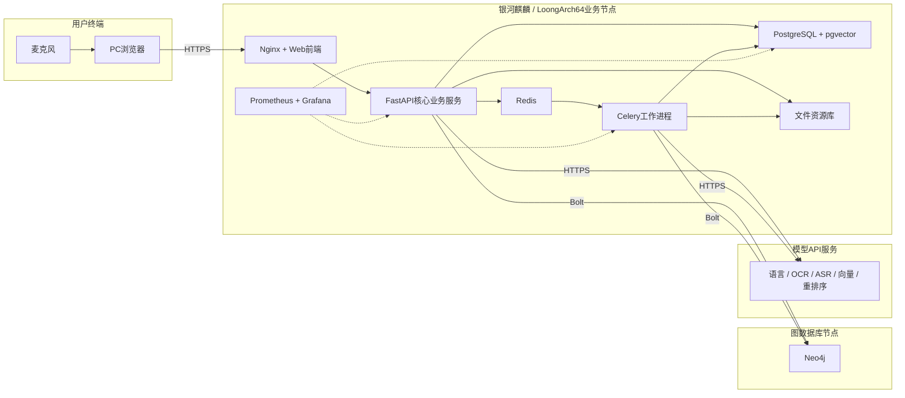

运行拓扑遵循以下边界：

- 浏览器不直接连接数据库、图数据库或模型服务；
- 所有业务访问统一经过Nginx和FastAPI完成认证、授权及审计；
- 用户管理员只访问用户管理接口，前端菜单隔离与后端权限校验同时生效；
- Celery工作进程只处理后端创建的异步任务，不作为用户直接访问入口；
- PostgreSQL、Neo4j和文件资源库使用同一业务标识和备份批次建立关联；
- 外部模型API调用集中通过统一模型网关执行，不向浏览器暴露模型凭据；
- Neo4j在LoongArch64上的原生部署未经验证前，可部署于独立兼容节点，不影响上层功能设计；
- 受限网络环境应允许通过配置限定模型服务访问地址，并对不可用状态给出明确反馈；
- systemd负责后端、工作进程和相关服务的启动、停止、重启及开机自启。

---

## 4. 用户、角色与权限设计

### 4.1 用户模型

系统使用统一用户模型承载工程师、专家和用户管理员三类账号。每个用户只有一个当前角色，角色决定其默认工作区和功能权限；工程师及专家的组织信息进一步限定页面展示和业务数据范围。

#### 4.1.1 用户账号组成

| 数据项 | 设计说明 |
| --- | --- |
| 用户编号 | 系统生成的稳定标识，不随姓名、账号或角色变更 |
| 登录账号 | 用户登录名，在系统内唯一，保存前完成规范化和重复校验 |
| 密码散列 | 只保存安全散列结果，不保存可还原的明文密码 |
| 姓名 | 页面、记录、审核和审计中显示的人员名称 |
| 固定角色 | `engineer`、`expert`或`admin` |
| 账号状态 | `active`或`disabled`，决定能否建立新的登录会话 |
| 组织信息 | 工程师关联场站、班组；专家关联机构、专业方向 |
| 专业范围 | 专家可维护设备范围或故障领域，用于审核任务筛选 |
| 安全状态 | 密码是否需要重置、最近登录时间和认证失败状态 |
| 审计字段 | 创建人、创建时间、更新人、更新时间和数据版本 |

角色变化时，系统保留用户编号和操作历史，并重新校验目标角色所需的组织字段。角色由工程师变为专家时必须补充所属机构和专业方向；由专家变为工程师时必须补充所属场站和班组。与原角色相关但不再适用的字段不参与当前权限判断，可按历史快照保留在审计记录中。

#### 4.1.2 会话模型

用户通过账号和密码完成认证后，后端签发JWT访问令牌。令牌至少包含用户编号、角色、令牌签发时间和会话标识，不写入密码、模型密钥等敏感信息。

前端根据角色进入对应工作区，但前端路由只能作为交互入口控制。每次受保护接口请求均由后端校验令牌有效性、账号状态、固定角色和目标资源数据范围。账号被停用后不得建立新会话；现有会话在下一次受保护请求时根据账号状态拒绝继续访问。

#### 4.1.3 用户操作审计

用户新增、编辑、角色调整、启停、密码重置、登录和退出均形成审计事件。审计记录至少包含：

- 审计编号；
- 操作类型；
- 操作人用户编号和角色；
- 操作对象用户编号；
- 操作前后关键字段摘要；
- 操作时间和结果；
- 请求标识和来源地址；
- 失败时的错误类别。

审计记录不保存明文密码、完整JWT或模型API密钥。密码重置只记录“已发起、已完成或失败”等结果及目标用户，不记录临时密码内容。

### 4.2 工程师权限

工程师负责现场异常接入和检修任务执行。其功能权限如下：

- 进入工程师工作台，查看本人、所属场站和班组信息；
- 创建异常事件并接入文字、语音、图片、视频和音频材料；
- 确认设备、位置、故障现象、告警和运行参数；
- 搜索、查看和选择已经发布的案例、知识条目和设备手册；
- 查看全局知识图谱及已发布节点关系，不可直接发布图谱变更；
- 获取智能诊断建议并对诊断结果进行文字或语音追问；
- 修改并确认检修预方案，但不能删除强制安全步骤；
- 执行检修步骤、记录现场结果并完成恢复运行验证；
- 生成、查看和导出本人负责任务的检修记录与作业卡；
- 将完整检修结果提交专家审核，并查看审核状态和退回意见；
- 查看审核通过后发布的案例和知识更新。

工程师的数据范围默认包括本人创建或负责的任务、所属场站允许访问的设备和已经正式发布的知识。工程师不能查看其他无关场站的未归档任务，不能审核案例，不能直接修改已发布知识，不能管理其他用户账号。

### 4.3 专家权限

专家负责检修质量审核和专业知识维护。其功能权限如下：

- 进入专家工作台，查看权限范围内的待审核、审核中和已归档案例；
- 查看工程师提交的现场事实、多模态材料、诊断依据、方案修改、执行步骤和恢复结果；
- 保存专家审核草稿，修正故障原因、处理结论和知识描述；
- 退回信息不完整或结论不充分的任务，并填写明确审核意见；
- 审核通过符合要求的检修案例；
- 查看、维护和发布检修知识条目；
- 查看全局知识图谱，新增或修改图谱节点及关系并提交发布；
- 审核案例产生的知识条目候选和图谱变更候选；
- 查看不同知识版本和图谱变更差异；
- 使用相似异常验证新知识是否进入检索链路；
- 维护个人所属机构、专业方向和可审核设备范围。

专家的数据范围由专业方向、设备范围和任务分派共同确定。专家可以查看已发布的公共知识，但只能审核或发布其授权范围内的专业内容。专家不能新增、停用其他用户账号，也不能通过专家权限绕过用户管理后台执行密码重置。

### 4.4 用户管理员权限

用户管理员仅负责用户账号和组织归属维护。其功能权限如下：

- 进入独立用户管理后台；
- 查看工程师数、专家数、正常账号数和停用账号数；
- 按角色筛选用户，按姓名、账号、场站、班组、机构和专业方向搜索；
- 查看用户编号、登录账号、姓名、角色、组织归属和账号状态；
- 新增工程师或专家账号；
- 编辑用户姓名、登录账号、角色和组织归属；
- 启用或停用工程师和专家账号；
- 发起工程师和专家账号的密码重置；
- 查看自身发起的用户管理操作结果。

用户管理员不在普通用户列表中管理自身账号，避免误停用当前唯一管理入口。管理员不能访问工程师检修任务、专家审核详情、知识条目编辑、图谱编辑、模型配置和专业内容发布接口。系统部署、数据库备份和服务启停属于部署运维职责，不因拥有用户管理员角色自动获得操作权限。

### 4.5 访问控制机制

#### 4.5.1 登录与工作区路由

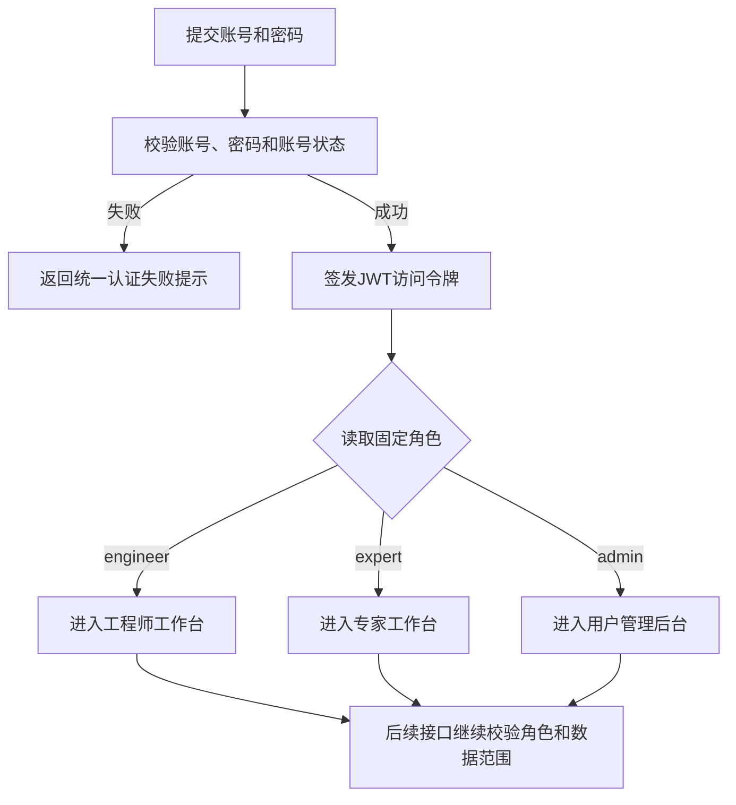

登录失败时不向未认证用户区分“账号不存在”和“密码错误”，避免泄露有效账号。登录成功后，前端只加载当前角色对应的导航和页面。用户直接访问其他角色页面地址时，前端执行路由拦截，后端对相应接口再次拒绝访问。

#### 4.5.2 功能权限矩阵

| 功能 | 工程师 | 专家 | 用户管理员 |
| --- | --- | --- | --- |
| 登录及维护个人会话 | 允许 | 允许 | 允许 |
| 创建异常与执行检修 | 允许 | 只读查看审核材料 | 禁止 |
| 选择已发布检修资料 | 允许 | 允许 | 禁止 |
| 使用检修智能问答 | 允许 | 可用于专业复核 | 禁止 |
| 修改检修预方案 | 允许，受安全步骤约束 | 审核时可提出修正 | 禁止 |
| 完成恢复运行验证 | 允许 | 只读复核 | 禁止 |
| 生成检修记录和作业卡 | 允许 | 只读查看 | 禁止 |
| 审核检修案例 | 禁止 | 允许 | 禁止 |
| 编辑与发布知识条目 | 禁止 | 允许 | 禁止 |
| 编辑与发布图谱关系 | 禁止 | 允许 | 禁止 |
| 查看已发布知识和图谱 | 允许 | 允许 | 禁止 |
| 新增、编辑工程师或专家 | 禁止 | 禁止 | 允许 |
| 启停账号和重置密码 | 禁止 | 禁止 | 允许 |
| 查看系统运行监控 | 禁止 | 禁止 | 不由应用角色直接授权 |

#### 4.5.3 接口授权

接口授权采用“已认证用户 + 固定角色 + 数据范围 + 资源状态”四项联合判断：

1. 验证JWT签名、有效期和会话标识；
2. 根据令牌用户编号读取当前账号，确认账号仍为启用状态；
3. 确认当前固定角色允许调用目标功能；
4. 确认用户可以访问目标任务、组织、知识或审核对象；
5. 确认目标对象当前状态允许执行该操作；
6. 对新增、修改、审核、发布、启停和密码重置等操作写入审计记录。

例如，专家拥有审核权限，但只能审核处于“待审核”或“审核中”状态且属于其专业范围的任务；用户管理员拥有用户编辑权限，但不能编辑管理员自身角色，也不能通过普通用户编辑接口写入专业知识权限。

#### 4.5.4 账号启停与密码重置

停用账号时，用户状态由`active`变为`disabled`，系统记录操作人、原因和时间。停用不删除该用户已经形成的检修记录、审核记录和知识发布记录，这些历史数据继续引用稳定用户编号和当时的人员名称快照。

密码重置由用户管理员主动发起。后端完成权限检查后更新密码安全信息，形成密码重置审计事件，并要求用户在适当流程中取得新凭据。任何接口响应、页面通知和普通日志均不得长期展示明文密码。

---

## 5. 核心业务对象与数据设计

### 5.1 核心业务对象

系统以检修任务为主要聚合对象，以异常事件为任务来源，以检修记录和专家审核形成闭环结果，并通过知识条目与图谱变更实现经验回流。

| 业务对象 | 主要内容 | 生命周期责任模块 |
| --- | --- | --- |
| 用户 | 账号、姓名、固定角色、状态和安全信息 | 身份与用户管理 |
| 组织归属 | 场站、班组、机构、专业方向和设备范围 | 用户管理 |
| 用户操作审计 | 用户管理、认证和关键权限操作记录 | 审计服务 |
| 设备 | 设备类别、品牌、型号、序列标识、现场角色和安装位置 | 设备与故障信息 |
| 异常事件 | 现场描述、发生时间、地点、设备、告警和运行参数 | 异常接入 |
| 现场材料 | 图片、视频、音频及其文件元数据、解析结果和来源 | 文件与多模态处理 |
| 检修任务 | 当前阶段、负责人、设备、异常、资料包和整体状态 | 检修业务 |
| 检修资料引用 | 当前任务选择的案例、知识条目、手册和适用性信息 | 资料选择 |
| 诊断结论 | 故障方向、原因候选、判断依据、风险和确认结果 | 智能辅助诊断 |
| 检修预方案 | 检修阶段、步骤顺序、安全约束及工程师修改记录 | 检修方案 |
| 检修步骤 | 目标、检查项、资料、安全要求、执行结果和完成状态 | 检修向导 |
| 智能问答会话 | 当前任务、当前步骤、问题、回答、引用和模型调用记录 | RAG问答 |
| 恢复验证 | 告警、转速、温度、运行状态、观察时长和恢复判定 | 恢复运行验证 |
| 检修记录 | 异常、诊断、步骤、处理措施和恢复结果的归档汇总 | 检修记录 |
| 检修作业卡 | 作业卡数据快照、模板版本、PDF文件和生成时间 | 作业卡服务 |
| 专家审核 | 审核状态、审核草稿、修正内容、意见和审核人员 | 专家审核 |
| 历史案例 | 审核通过后的检修案例摘要、适用范围和来源任务 | 案例管理 |
| 知识资料 | 厂商手册、内部资料、解析状态、文件版本和来源等级 | 检修知识库 |
| 知识条目 | 现象、原因、检查项、措施、安全要求、适用范围和来源 | 检修知识库 |
| 知识版本 | 知识条目每次修改前后的内容快照和发布状态 | 知识版本管理 |
| 图谱节点与关系 | 设备、部件、故障、现象、原因、方法、措施和依据的关联 | 知识图谱 |
| 图谱变更集 | 一批节点或关系的新增、修改、删除、审核和发布信息 | 图谱变更管理 |
| 异步任务 | 解析、OCR、转写、向量化、抽取、PDF等后台任务状态 | 异步任务服务 |

### 5.2 对象关系设计

#### 5.2.1 核心对象关系

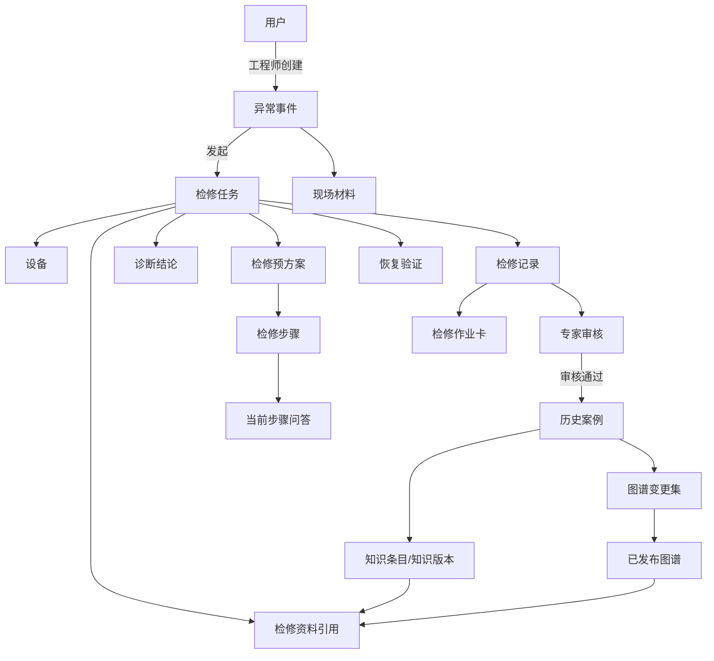

一条异常事件原则上发起一个主要检修任务；同一设备重复出现的新异常建立新的异常事件和任务，通过设备标识与历史案例关联。检修记录是任务完成时形成的业务汇总，作业卡是基于记录快照生成的输出文件，不能反向替代原始过程数据。

#### 5.2.2 用户与组织关系

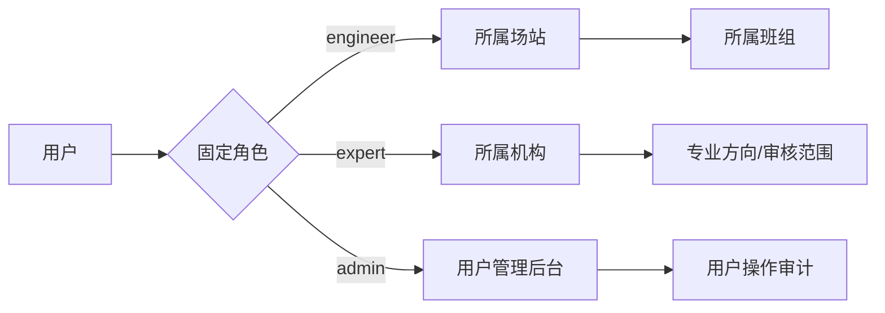

组织归属用于页面展示、任务分派和数据范围控制，不代替固定角色。用户管理员可以修改工程师和专家的组织信息，但角色变更及组织信息变更均形成审计记录。

#### 5.2.3 知识对象关系

知识资料是原始来源，知识条目是结构化内容，知识版本记录条目变化，图谱节点和关系表达知识之间的关联。历史案例可以引用多个知识资料和知识条目，也可以形成一个包含多项节点、关系变化的图谱变更集。

每个知识条目至少关联一种来源：厂商手册及页码、审核通过的历史案例、专家确认记录或正式内部资料。无法确认来源的候选内容只能保存为草稿，不进入正式检索和辅助诊断链路。

### 5.3 状态模型设计

#### 5.3.1 用户账号状态

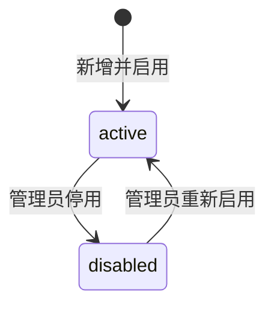

`active`账号可以通过认证并访问其角色功能；`disabled`账号不能建立新会话，现有会话在后端再次校验账号状态时失效。账号状态变化不删除历史业务记录。

#### 5.3.2 异常事件状态

| 状态代码 | 状态名称 | 说明 | 允许的后续状态 |
| --- | --- | --- | --- |
| `draft` | 草稿 | 正在录入异常描述和现场材料 | `confirmed`、`cancelled` |
| `confirmed` | 已确认 | 时间、地点、设备和材料摘要已确认 | `task_created`、`draft` |
| `task_created` | 已生成任务 | 已关联检修任务 | `closed` |
| `closed` | 已闭环 | 关联检修任务已经归档 | 终态 |
| `cancelled` | 已取消 | 无需继续处理或重复录入 | 终态 |

异常事件在`confirmed`前可以编辑主要现场信息；生成检修任务后，关键事实修改以补充记录方式保存，不覆盖任务创建时的异常快照。

#### 5.3.3 检修任务状态

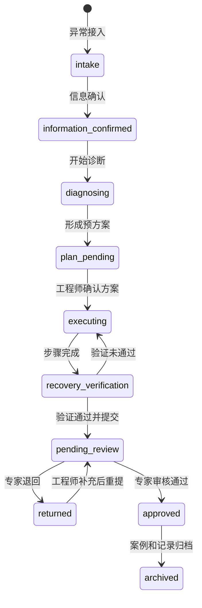

| 状态代码 | 主要可执行操作 |
| --- | --- |
| `intake` | 录入异常、接入材料和选择资料 |
| `information_confirmed` | 查看确认摘要、启动知识检索和诊断 |
| `diagnosing` | 查看诊断进度、补充信息、追问和确认结论 |
| `plan_pending` | 修改、排序并确认检修预方案 |
| `executing` | 执行步骤、步骤追问、记录检查项和处理结果 |
| `recovery_verification` | 记录恢复参数、告警和观察结果 |
| `pending_review` | 工程师只读等待，专家查看并审核 |
| `returned` | 工程师根据审核意见补充记录或验证信息 |
| `approved` | 生成正式审核结论和知识候选 |
| `archived` | 任务及记录只读，进入历史查询和知识回流 |

任务状态变更由应用服务统一执行。前端不能通过直接修改状态字段跳过诊断确认、强制安全步骤、恢复验证或专家审核。

#### 5.3.4 专家审核状态

| 状态代码 | 状态名称 | 进入条件 | 退出条件 |
| --- | --- | --- | --- |
| `pending` | 待审核 | 工程师提交完整检修记录 | 专家开始处理 |
| `in_review` | 审核中 | 专家取得审核任务 | 保存草稿、退回或通过 |
| `returned` | 已退回 | 专家认为信息或结论不足 | 工程师补充并重新提交 |
| `approved` | 已通过 | 专家确认案例结论 | 生成案例和知识候选 |
| `published` | 已发布 | 相关案例及知识变更发布完成 | 终态 |

专家审核草稿与正式审核结论分开保存。只有`approved`状态的审核结果可以触发知识候选生成；只有知识及图谱变更完成发布后，审核记录才进入`published`状态。

#### 5.3.5 知识条目状态

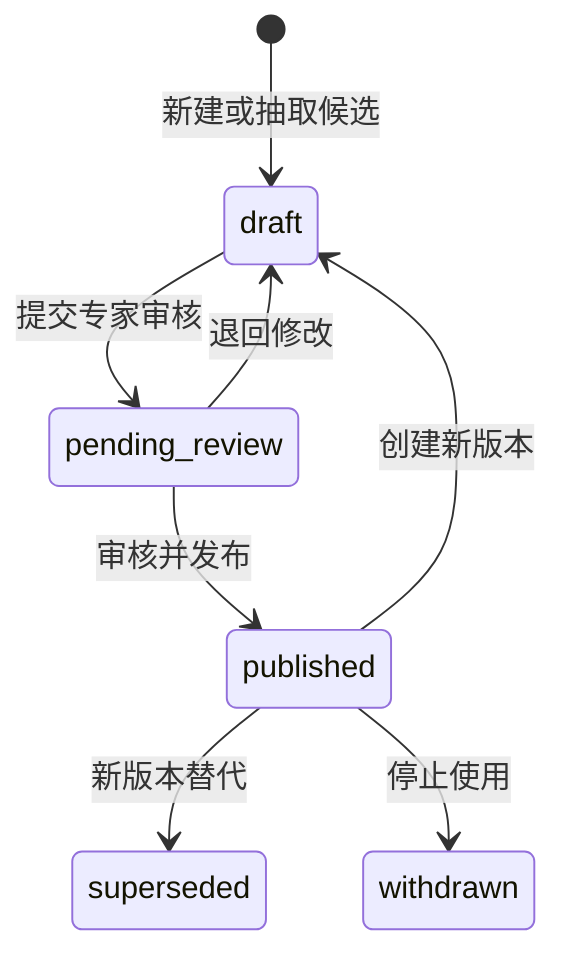

已发布版本保持不可变。修改已发布知识时创建新的草稿版本，审核发布后将上一版本标记为`superseded`。`withdrawn`版本不再参与新任务检索，但历史检修记录仍可按版本标识追溯原引用内容。

#### 5.3.6 图谱变更集状态

| 状态代码 | 状态名称 | 说明 |
| --- | --- | --- |
| `draft` | 草稿 | 专家编辑或系统抽取形成的节点、关系变化 |
| `pending_review` | 待确认 | 已完成差异检查，等待专家确认 |
| `approved` | 已确认 | 变更内容和来源已经确认，等待发布 |
| `rejected` | 已驳回 | 变更不适用或依据不足，不进入全局图谱 |
| `published` | 已发布 | 已写入正式图谱并更新相关索引 |
| `reverted` | 已回退 | 发布后因问题按原变更集执行反向恢复 |

一个变更集中的节点、关系和来源作为整体审核。发布过程必须幂等；部分写入失败时变更集不能标记为`published`，应进入可重试或人工处理状态。

### 5.4 数据标识与关联

系统同时使用内部主键和可读业务编号：内部主键使用UUID并作为数据库关联键；业务编号用于页面、PDF、日志和人工沟通。业务编号创建后不因标题、状态或归属变化而改变。

| 对象 | 业务编号示例 | 关联要求 |
| --- | --- | --- |
| 用户 | `USR-000001` | 审计、任务、审核均引用稳定用户编号 |
| 异常事件 | `INC-20260715-0001` | 关联设备、材料和检修任务 |
| 检修任务 | `MT-20260715-0001` | 贯穿诊断、步骤、验证、记录和审核 |
| 现场材料 | `MAT-20260715-0001` | 关联文件对象、来源事件和解析任务 |
| 诊断结论 | `DIA-20260715-0001` | 关联任务、知识引用和确认人 |
| 检修方案 | `PLN-20260715-0001` | 关联任务、版本和步骤集合 |
| 检修记录 | `REC-20260715-0001` | 关联任务、审核和作业卡 |
| 检修作业卡 | `CARD-20260715-0001` | 关联记录快照、模板和PDF文件 |
| 专家审核 | `REV-20260715-0001` | 关联记录、专家和知识候选批次 |
| 知识条目 | `KB-000001` | 关联知识版本、来源和向量片段 |
| 图谱变更集 | `KGC-20260715-0001` | 关联来源案例、审核和图谱节点关系 |
| 异步任务 | `JOB-20260715-0001` | 关联业务对象、任务类型和执行状态 |
| 审计记录 | `AUD-20260715-0001` | 关联操作人、操作对象和请求标识 |

Neo4j节点使用与业务系统一致的`business_id`属性，知识条目向量片段保存`knowledge_id`和`knowledge_version_id`，文件资源元数据保存`file_id`。任何跨存储关联不得只依赖标题、文件名或显示名称。

### 5.5 数据存储分工

| 存储 | 保存内容 | 不保存内容 |
| --- | --- | --- |
| PostgreSQL | 用户、组织归属、异常、任务、步骤、验证、记录、审核、知识元数据、版本、审计和文件索引 | 不直接保存大体积原始文件，不承担图路径查询 |
| pgvector | 知识片段向量、片段文本引用、模型和维度信息 | 不作为知识正文唯一副本，不保存用户密码 |
| Neo4j | 设备、部件、故障、现象、原因、方法、措施、案例和资料节点及关系 | 不承担用户认证、任务事务和文件存储 |
| Redis | Celery消息、短期任务状态、必要缓存和会话辅助数据 | 不作为检修记录、审核结论和正式知识的唯一持久化存储 |
| 文件资源库 | 厂商手册、现场图片、视频、音频、解析中间文件和PDF作业卡 | 不单独决定文件权限和业务状态 |

PostgreSQL是业务状态和权限判断的主数据来源。Neo4j和pgvector中的知识数据均能通过业务标识追溯到PostgreSQL中的知识元数据及版本。文件访问先通过业务服务检查用户、任务和资料权限，再由受控文件接口或Nginx授权访问。

### 5.6 数据版本与审计

#### 5.6.1 业务快照

系统在以下关键节点形成不可覆盖的业务快照：

- 异常信息确认并创建检修任务时；
- 工程师确认检修预方案时；
- 工程师完成恢复验证并提交专家审核时；
- 专家审核通过时；
- 检修记录归档和作业卡生成时；
- 知识条目或图谱变更正式发布时。

快照用于还原当时的设备信息、现场事实、引用知识版本、方案步骤和责任人员。后续更新设备目录、用户姓名或知识内容时，不修改已经归档记录中的历史快照。

#### 5.6.2 知识版本

知识条目使用稳定知识编号和递增版本号。每个版本保存正文、结构化字段、适用范围、来源、创建人、审核人、发布时间和状态。检修任务引用具体知识版本，而不是只引用最新知识条目。

知识发布后，系统为对应内容片段生成向量并记录嵌入模型、维度和生成时间。知识被替代或撤回时，相应向量索引退出新任务召回范围，但历史任务引用保持可追溯。

#### 5.6.3 图谱版本

图谱以变更集管理版本。每次发布记录新增、修改或删除的节点与关系、变更前后属性、来源案例或手册、审核人和发布时间。全局图谱展示当前已发布状态，“本次新增与修改”视图根据指定变更集呈现差异。

#### 5.6.4 模型调用追踪

语音识别、OCR、向量化、重排序、诊断问答和知识抽取调用保留调用类型、业务对象、模型名称、时间、执行状态和结果引用。涉及生成内容时同时保留输入上下文摘要和引用知识版本，便于复核建议形成过程。日志和追踪数据不得记录用户密码、JWT、模型API密钥或超出业务需要的原始敏感信息。

#### 5.6.5 删除与历史保留

已被检修记录、审核记录、知识版本或审计记录引用的用户、设备、资料和知识对象原则上不执行物理删除，而使用停用、撤回、归档或失效状态。只有未被引用的草稿、上传失败的临时文件和超过保留期限的处理文件可以按清理策略删除。

---

## 6. 功能模块详细设计

本章按照功能需求逐项说明模块实现。各模块统一描述模块职责、使用角色、前置条件、输入、页面与交互、后端处理、数据读写、输出、业务规则和异常处理。模块之间通过检修任务编号、知识版本编号和用户身份衔接，不通过页面临时状态传递关键业务事实。

### 6.1 用户登录与角色功能设计

#### 6.1.1 模块定义

| 设计项 | 设计内容 |
| --- | --- |
| 模块职责 | 完成用户认证、账号状态检查、角色识别、工作区路由、会话保持和安全退出 |
| 使用角色 | 工程师、专家、用户管理员 |
| 前置条件 | 身份服务与用户数据库可用，用户账号已建立且处于可识别状态 |
| 输入 | 登录账号、密码；后续请求携带JWT访问令牌 |
| 页面与交互 | 展示账号和密码输入、登录中状态、统一失败提示；登录成功后进入角色对应工作区；提供当前用户摘要和退出入口 |
| 后端处理 | 规范化账号、查询用户、验证密码散列、检查账号状态、创建会话、签发JWT、记录登录审计 |
| 数据读写 | 读取用户、角色和组织归属；写入会话辅助数据、最近登录信息和认证审计 |
| 输出 | 当前用户编号、姓名、固定角色、组织摘要、访问令牌和默认工作区 |
| 业务规则 | 登录角色以后端用户记录为准；停用账号不能登录；三类角色只能进入对应工作区 |
| 异常处理 | 账号或密码错误返回统一提示；停用账号提示联系管理员；服务异常不签发令牌；令牌失效后返回登录页 |

#### 6.1.2 登录处理流程

1. 前端校验账号和密码非空，提交认证请求并进入“登录中”状态；
2. 后端去除账号首尾空格并按统一规则规范化，不改变密码原文；
3. 后端查询用户并验证密码安全散列，不向前端暴露账号是否存在；
4. 验证账号状态为`active`，读取固定角色和组织归属；
5. 创建会话标识并签发JWT访问令牌；
6. 返回最小必要用户摘要和默认工作区；
7. 前端根据后端返回角色进入工程师端、专家端或用户管理后台；
8. 后续受保护请求继续校验令牌、账号状态、角色和数据范围。

页面可以提供角色入口说明，但不能以用户在页面选择的角色作为授权依据。账号实际角色与入口不一致时，以后端返回角色进入正确工作区。

#### 6.1.3 会话与退出

- 前端仅在运行内存中保存短期访问令牌，不在浏览器持久存储中保存密码、访问令牌或会话标识；
- 页面初始化时获取当前用户信息，恢复角色导航和允许访问的页面；
- 接口返回未认证状态时清除本地会话并跳转登录页；
- 用户主动退出时调用退出接口，使当前会话标识失效并清除前端状态；
- 退出时清理尚未提交的短时语音输入内容和不再需要的页面敏感状态；
- 账号被管理员停用后，下一次受保护请求终止当前访问。

#### 6.1.4 安全与异常规则

- 登录失败提示不区分账号不存在和密码错误；
- 认证接口实施必要的请求频率限制和失败记录；
- JWT、密码散列和临时密码不写入普通日志；
- 用户无权访问的接口返回权限错误，不通过隐藏菜单替代后端校验；
- 用户服务短时不可用时不使用前端缓存身份绕过认证；
- 登录审计失败不得阻断成功认证，但应产生可观测告警并进入补偿记录流程。

### 6.2 工程师工作台设计

#### 6.2.1 模块定义

| 设计项 | 设计内容 |
| --- | --- |
| 模块职责 | 聚合工程师身份、场站设备、待处理异常、当前任务、最近记录和主要功能入口 |
| 使用角色 | 工程师 |
| 前置条件 | 用户已登录且角色为工程师，已关联场站和班组 |
| 输入 | 当前用户编号、所属场站、任务筛选条件和当前时间范围 |
| 页面与交互 | 展示身份与班组、设备对象、待办摘要、当前业务阶段、最近记录、异常接入入口和主导航 |
| 后端处理 | 按工程师和场站数据范围聚合设备、任务、异常和记录摘要，计算待办数量和状态 |
| 数据读写 | 读取用户、组织、设备、异常、检修任务和记录；工作台本身不修改专业业务数据 |
| 输出 | 工作台摘要、设备列表、当前任务、待办数量、最近记录和可用入口 |
| 业务规则 | 只返回当前工程师有权查看的数据；摘要状态以后端业务状态为准 |
| 异常处理 | 单个摘要区加载失败时保留其他区域；整体身份校验失败时退出工作区；无数据时显示明确空状态 |

#### 6.2.2 页面组成

工程师工作台由以下区域组成：

1. **人员与场站摘要。** 展示工程师姓名、角色、所属场站和班组；
2. **设备对象区。** 展示当前场站可管理的工业计算设备、业务位置和状态摘要；
3. **现场接诊区。** 提供异常描述输入、语音输入、材料接入和开始接诊操作；
4. **任务状态区。** 展示最近一项进行中任务的当前阶段、更新时间和继续处理入口；
5. **待办与统计区。** 汇总待补充、执行中、待验证和被退回任务数量；
6. **最近检修记录。** 展示近期记录编号、设备、故障、完成时间和审核状态；
7. **主功能入口。** 提供知识图谱、检修记录和个人设置入口。

工作台突出当前最需要处理的任务。多个进行中任务同时存在时，按照“被专家退回、等待恢复验证、执行中、信息待补充、最近更新时间”的优先级排列，并允许工程师进入完整任务列表查看其他任务。

#### 6.2.3 聚合接口设计

工作台使用聚合接口一次返回页面首屏所需摘要，避免前端并发请求大量零散资源。响应按区域组织，每个区域带有独立状态和更新时间。对于耗时统计，可返回最近一次有效结果并标明统计时间。

聚合服务按以下顺序处理：

1. 读取当前工程师和场站数据范围；
2. 查询所属场站设备摘要；
3. 查询工程师负责的未归档任务并计算阶段数量；
4. 选取优先任务形成继续处理卡片；
5. 查询最近检修记录和审核状态；
6. 组合前端可用功能入口和权限标识。

#### 6.2.4 状态与异常规则

- 工作台不缓存并覆盖检修任务状态，任务卡每次进入页面时从后端刷新；
- 设备状态未知时显示“状态待确认”，不得自动标记为正常；
- 最近记录为空时提供“尚无检修记录”空状态，不使用虚构记录填充；
- 单个设备数据异常不影响现场接诊入口；
- 聚合接口部分数据失败时返回可用区域和失败区域标识，前端提供局部重试；
- 工程师组织归属缺失时限制场站数据访问，并提示联系用户管理员补充资料。

### 6.3 现场异常接入设计

#### 6.3.1 模块定义

| 设计项 | 设计内容 |
| --- | --- |
| 模块职责 | 采集异常描述、发生信息、多模态现场材料和初始运行事实，形成异常事件草稿及接入摘要 |
| 使用角色 | 工程师 |
| 前置条件 | 工程师已登录；新建异常事件或打开本人可编辑的异常草稿 |
| 输入 | 键盘或语音描述、时间、地点、设备线索、告警、运行参数、图片、视频、音频和检修资料选择 |
| 页面与交互 | 提供现场描述输入、语音按钮、材料卡片、上传状态、预览删除、资料选择状态和开始接诊操作 |
| 后端处理 | 保存草稿、校验材料、建立文件记录、创建解析任务、生成现场材料摘要并推进异常状态 |
| 数据读写 | 写入异常事件、现场材料、文件元数据、语音识别记录和异步任务；读取用户、场站和设备目录 |
| 输出 | 异常事件编号、现场描述、材料清单、解析状态、资料选择状态和接入摘要 |
| 业务规则 | 先记录现场事实，不要求工程师提前判断故障原因；提交前由工程师确认识别文字和材料 |
| 异常处理 | 语音、单项上传或解析失败不阻断其他输入；草稿保存失败时保留页面内容并提示重试 |

#### 6.3.2 异常描述与语音输入

异常描述输入框用于记录现场人员看到、听到或测量到的事实。首页语音输入处理如下：

1. 用户点击麦克风按钮，浏览器请求麦克风授权；
2. 授权成功后进入录音状态，显示停止操作和录音时长；
3. 用户停止或达到单次时长限制后结束采集；
4. 前端将临时音频提交语音识别接口，进入“识别中”状态；
5. 识别结果回填异常描述输入框，不自动开始接诊；
6. 用户可以修改、取消或确认识别文字；
7. 临时音频按清理策略删除，除非用户另行将录音作为现场音频材料接入。

已有文字不因语音识别失败而丢失。再次语音输入时，前端明确采用追加或替换方式；默认追加到当前光标位置，并允许用户编辑最终文本。

#### 6.3.3 现场材料接入

| 材料类型 | 接入方式 | 主要校验 | 后续处理 |
| --- | --- | --- | --- |
| 图片 | 选择一个或多个图片文件 | 格式、大小、文件头和可读取性 | 缩略图、OCR、图像理解和预览 |
| 视频 | 选择现场视频文件 | 格式、大小、时长和可读取性 | 元数据提取、关键内容分析和预览 |
| 音频 | 选择设备异响或现场录音 | 格式、大小、时长和可读取性 | 格式规范化、语音转写和音频证据保留 |
| 检修资料 | 打开检修资料选择器 | 发布状态、适用范围和访问权限 | 关联到当前任务资料包，不复制原始文件 |

单项材料使用`selected`、`uploading`、`ready`、`processing`、`failed`和`removed`等界面状态。后端业务状态以文件记录和异步任务状态为准。删除尚未提交的材料时取消其任务并清理临时文件；删除已随异常确认的材料时保留删除审计，不直接破坏已形成的业务快照。

#### 6.3.4 草稿与提交

异常事件创建后处于`draft`状态。页面内容发生变化时按受控频率自动保存，也提供明确的保存反馈。开始接诊前至少校验：

- 异常描述非空，或存在能够说明异常的现场材料；
- 发生地点能够关联到工程师所属场站；
- 已上传材料没有处于无法确认的上传中状态；
- 语音识别文字已经回填并允许用户检查；
- 资料选择结果已经保存或明确选择“暂不添加”。

校验通过后形成接入摘要并将异常事件推进为`confirmed`。后续设备确认模块可以补充精确设备、时间和运行参数；接入模块不在此阶段自动确定最终故障原因。

#### 6.3.5 异常处理

- 麦克风拒绝授权时显示原因和浏览器设置提示，键盘输入继续可用；
- 录音为空或识别无结果时保留原文本并允许重新录音；
- 某个材料格式不支持时只拒绝该文件并说明支持范围；
- 材料处理时间较长时显示处理状态，允许先继续补充其他信息；
- 网络中断时保留未提交页面状态，恢复后由用户确认重新上传；
- 重复点击开始接诊时使用幂等请求，避免生成多个异常事件或检修任务；
- 用户离开未保存草稿页面前进行提示。

### 6.4 设备与故障信息确认设计

#### 6.4.1 模块定义

| 设计项 | 设计内容 |
| --- | --- |
| 模块职责 | 将异常描述和材料中识别出的设备、位置、告警、现象及运行参数组织为可人工确认的现场事实 |
| 使用角色 | 工程师 |
| 前置条件 | 异常事件已确认接入，用户对该事件具有编辑权限 |
| 输入 | 异常描述、现场材料解析结果、场站设备目录、告警规则、设备台账和人工补充信息 |
| 页面与交互 | 按步骤展示发生时间、地点、设备对象、告警与指标、其他现象；标识推荐值、来源和待确认项 |
| 后端处理 | 汇总多来源事实、生成字段推荐、执行设备目录匹配和规则校验、保存人工确认结果 |
| 数据读写 | 读取异常、材料解析、设备目录和告警规则；写入确认字段、来源、修改记录和任务上下文 |
| 输出 | 已确认设备、位置、故障现象、告警、运行参数、信息来源和现场摘要 |
| 业务规则 | 推荐结果必须允许人工修改；设备专用参数不能跨型号默认套用；进入诊断前必须生成确认摘要 |
| 异常处理 | 无法识别设备时允许人工选择或录入；来源冲突时展示差异，不自动覆盖人工确认值 |

#### 6.4.2 确认步骤

设备与故障信息确认按照以下步骤组织：

1. **时间与发生情况。** 确认首次发现时间、持续时长、是否重复发生和当前是否持续；
2. **场站与设备位置。** 确认场站、区域、机柜或设备位置；
3. **设备对象。** 确认设备类别、品牌、型号、序列线索和现场业务角色；
4. **告警与状态。** 确认告警代码、指示灯、蜂鸣器、系统提示和通信状态；
5. **运行参数。** 确认温度、风扇转速、电压、存储健康及其他可用指标；
6. **其他现象。** 补充异响、气味、粉尘、凝露、振动、画面和启动表现；
7. **信息摘要。** 汇总已知事实、未确认项和主要资料来源，由工程师最终确认。

页面按当前信息动态突出需要补充的步骤，但不能隐藏已经确认的信息。工程师返回前一步修改设备型号后，系统重新评估型号相关告警、资料推荐和参数适用范围，并提示可能受影响的后续字段。

#### 6.4.3 信息来源与可信度

每个可确认字段记录值、来源类型、来源标识、推荐置信信息、确认人和确认时间。来源类型包括：

- 设备台账；
- 工程师人工录入；
- 图片或铭牌OCR；
- 视频或图像理解；
- 音频转写；
- 告警规则；
- 系统根据上下文推荐。

人工确认值是当前任务使用的业务事实。系统推荐与设备台账冲突时，页面同时展示两个来源并要求工程师选择或补充说明。人工修改不会删除原推荐值，而是形成字段修改记录。

#### 6.4.4 设备匹配与参数规则

- 优先使用明确的设备编号、铭牌型号或设备台账进行匹配；
- 只能确定设备类别而不能确定型号时，将型号标记为待确认；
- 型号未确认时可以使用通用故障知识，但不得推荐专用端子、拆装位置或备件编号；
- 温度、转速和电压等参数同时保存数值、单位、采集方式和采集时间；
- 阈值判断引用具体设备规则或知识来源，不把页面预填值作为正式判据；
- 设备位置必须位于当前工程师允许访问的场站范围内。

#### 6.4.5 输出与异常处理

确认完成后，后端生成任务上下文快照，并将异常事件关联到检修任务。信息不足但允许继续时，摘要明确列出未确认项；缺少设备类别、位置或主要异常现象等关键事实时，不进入诊断阶段。

- OCR或模型识别失败时允许完全人工填写；
- 设备目录不可用时保存现场设备描述，待服务恢复后再匹配；
- 告警规则不存在时保留原始告警，不生成无来源阈值；
- 不同材料给出冲突结果时提示人工复核；
- 保存冲突时使用数据版本检查，防止覆盖其他已确认修改。

### 6.5 检修资料选择设计

#### 6.5.1 模块定义

| 设计项 | 设计内容 |
| --- | --- |
| 模块职责 | 从案例、知识条目和厂商手册中选择与当前设备及故障相关的资料，形成任务级检修资料包 |
| 使用角色 | 工程师；专家可查看当前任务已选资料 |
| 前置条件 | 用户已登录；当前任务或异常草稿存在；知识资料具有可访问状态 |
| 输入 | 设备类别、品牌、型号、故障领域、异常描述、关键词和资料类型筛选 |
| 页面与交互 | 以资料卡片、分类分组、搜索筛选、推荐标识、详情预览和固定选择状态呈现，不使用单层菜单替代资料浏览 |
| 后端处理 | 查询可用资料、计算推荐条件、返回适用范围和来源；保存选择及取消选择记录 |
| 数据读写 | 读取案例、知识条目、手册、版本和适用范围；写入任务资料引用和选择审计 |
| 输出 | 已选资料包、资料数量、类型分布、来源、适用范围和选择状态 |
| 业务规则 | 只选择当前可用版本；已选状态在任务生命周期内持续保留；跨型号资料明确标注参考边界 |
| 异常处理 | 目录接口失败时保留已有选择；资料版本失效时提示替换；无匹配资料时允许查看通用知识 |

#### 6.5.2 资料目录与展示

资料选择器采用“概览 + 分类浏览 + 详情预览 + 已选资料栏”的结构：

- 概览区展示当前设备、故障领域、推荐资料数和已选数量；
- 分类区区分历史检修案例、结构化知识条目和厂商设备手册；
- 筛选区支持设备型号、故障领域、资料类型和关键词组合筛选；
- 资料卡展示标题、资料类型、设备范围、故障范围、来源等级、版本和摘要；
- 详情区展示适用范围、关键内容、来源手册页码或案例、版本状态和使用边界；
- 已选资料栏持续展示当前选择，支持取消并立即更新数量。

推荐标识说明资料与当前任务的匹配原因，例如“目标型号手册”“相同故障领域”“相似历史案例”或“通用安全知识”。推荐只影响排序，不自动替用户选中。

#### 6.5.3 选择状态与任务关联

每项任务资料引用保存任务编号、资料类型、资料编号、具体版本、选择人、选择时间、选择来源和取消状态。用户确认选择后，已选状态在异常接入、辅助诊断、检修向导和专家审核页面持续可见。

任务引用具体资料版本。资料后续发布新版本时，进行中的任务不自动替换原引用；系统可以提示存在新版本，由工程师或专家确认是否更新。已归档任务永远保留当时引用版本。

#### 6.5.4 适用范围规则

- 目标设备型号完全匹配的手册和案例优先展示；
- 同系列或同类部件资料可以作为参考，但明确显示差异和适用边界；
- 历史版本手册只用于旧设备或版本差异核对，不默认作为当前设备操作依据；
- 无明确来源或仍处于草稿状态的知识不提供给工程师选择；
- 安全知识可以跨型号复用，但仍应标识来源和适用条件；
- 专用接口位置、接线顺序、备件型号和阈值不能因故障类型相同而直接跨型号复用。

#### 6.5.5 异常处理

- 资料目录加载失败时显示重试入口，不清空当前已选资料；
- 某项资料详情不可用时保留卡片摘要并标记暂不可预览；
- 保存选择失败时恢复到后端确认的上一状态；
- 资料在选择后被撤回时，系统提示该引用不再适用于新诊断，并要求重新选择；
- 无直接匹配结果时给出通用知识和补充设备信息的建议，不返回空白页面；
- 重复点击选择使用幂等写入，不产生重复引用。

### 6.6 多模态知识检索设计

#### 6.6.1 模块定义

| 设计项 | 设计内容 |
| --- | --- |
| 模块职责 | 综合现场文字、多模态材料、设备信息、已选资料和知识图谱，检索可追溯的检修依据 |
| 使用角色 | 工程师、专家；由智能诊断和知识验证流程调用 |
| 前置条件 | 当前任务具备基本设备和异常上下文；知识库及索引存在可用版本 |
| 输入 | 异常描述、设备与型号、部件、故障领域、运行参数、材料解析文本、已选资料和当前步骤 |
| 页面与交互 | 展示检索进度、结果类型、标题、摘要、适用范围、来源和选择状态；允许查看详情和引用位置 |
| 后端处理 | 条件过滤、关键词召回、向量召回、图关系扩展、结果融合、重排序和权限过滤 |
| 数据读写 | 读取PostgreSQL知识元数据、pgvector向量和Neo4j关系；写入检索会话、查询摘要和结果引用 |
| 输出 | 排序后的案例、知识条目、手册片段、图谱路径、相关度信息及来源证据 |
| 业务规则 | 结果必须关联具体来源和版本；目标型号专用资料优先；未发布或无权访问内容不得召回 |
| 异常处理 | 单路检索失败时使用其他可用检索通道；全部检索不可用时返回明确状态并允许人工浏览资料 |

#### 6.6.2 查询上下文构建

检索服务将业务输入转换为结构化查询上下文：

- 当前用户及数据访问范围；
- 设备类别、品牌、型号、部件和现场角色；
- 主要异常现象、告警和运行参数；
- 图片OCR、图像理解、视频摘要和音频转写结果；
- 当前任务已选资料及其版本；
- 当前检修阶段和当前步骤；
- 用户本次提出的具体问题；
- 不得跨型号复用的约束条件。

材料解析结果带有来源材料编号和处理状态。尚未处理完成或置信信息不足的内容不作为确定事实，只能作为扩展检索线索，并在结果中标识来源。

#### 6.6.3 混合检索流程

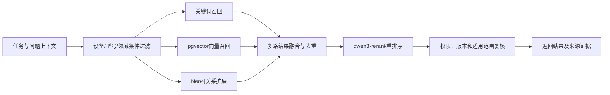

1. 使用设备、型号、故障领域、资料状态和用户权限缩小候选范围；
2. 对标题、摘要、结构化字段和片段内容执行关键词召回；
3. 调用`text-embedding-v4`生成1024维查询向量并通过pgvector召回语义相关片段；
4. 以设备、部件、故障或现象节点为起点，通过Neo4j扩展原因、方法、措施、案例和手册关系；
5. 按知识编号、版本和片段位置融合去重，并保留各召回通道信息；
6. 调用`qwen3-rerank`对候选结果进行相关性重排序；
7. 再次执行权限、发布状态、版本和适用范围检查；
8. 返回可供查看、选择或用于诊断的检索结果。

#### 6.6.4 结果组织与来源

每项检索结果至少包含：

- 结果类型和稳定业务编号；
- 标题、摘要和命中内容片段；
- 设备、型号、部件和故障领域；
- 适用范围及跨型号使用限制；
- 来源资料、案例或审核记录；
- 手册页码或知识版本；
- 命中的检索通道；
- 是否已经加入当前任务资料包。

相关度用于排序，不直接表示故障结论正确性。页面不需要展示内部模型原始分值，但必须展示足以帮助工程师判断适用性的来源、设备范围和内容摘要。

#### 6.6.5 降级与异常处理

- 向量模型不可用时保留条件过滤、关键词和图关系检索；
- Neo4j不可用时保留关键词和向量召回，并隐藏无法形成的图谱路径；
- 重排序服务不可用时使用融合排序结果，并记录降级状态；
- 某份资料解析失败时不阻断其他资料召回，并在资料详情中标识处理状态；
- 全部自动检索通道不可用时，提供按类型和目录人工浏览入口；
- 查询超时后返回已经完成的部分结果，不把未完成结果标记为“无匹配”；
- 检索日志记录业务编号、通道状态和结果引用，不记录模型密钥及超出需要的原始敏感内容。

### 6.7 智能辅助诊断设计

#### 6.7.1 模块定义

| 设计项 | 设计内容 |
| --- | --- |
| 模块职责 | 综合现场事实、设备信息、运行参数、检修资料、历史案例和图谱关系，形成带依据的故障方向与检查建议 |
| 使用角色 | 工程师；专家在审核时查看诊断过程和依据 |
| 前置条件 | 设备与故障信息已经确认，当前任务处于`information_confirmed`或`diagnosing`状态 |
| 输入 | 任务上下文、现场材料解析结果、已选资料、混合检索结果、告警规则、安全约束和用户追问 |
| 页面与交互 | 展示各分析任务状态、检索依据、故障方向、判断理由、风险提示、建议操作和文字或语音追问入口 |
| 后端处理 | 构建诊断上下文、并行执行识别与检索、调用RAG分析、校验引用和结构化结果、保存诊断版本 |
| 数据读写 | 读取任务、设备、材料、资料引用、知识版本和图谱路径；写入诊断结论、证据引用、模型调用和确认记录 |
| 输出 | 故障方向、原因候选、判断依据、不确定项、安全风险、建议检查方向和诊断状态 |
| 业务规则 | 诊断必须引用可追溯依据；模型建议不能直接改变设备或任务状态；工程师确认后才能生成检修预方案 |
| 异常处理 | 模型或部分检索通道失败时返回可用证据和降级状态；信息不足时要求补充，不编造确定结论 |

#### 6.7.2 诊断任务组成

智能辅助诊断由一组可观察的分析任务组成：

1. **设备对象复核。** 检查设备类别、型号、部件和现场角色是否满足诊断条件；
2. **现象与告警归纳。** 从现场描述、材料和运行参数中整理主要现象，不将推测写成现场事实；
3. **判据匹配。** 根据目标设备资料检查温度、转速、电压、告警和状态指示等判据；
4. **知识检索。** 检索设备手册、结构化知识、历史案例和知识图谱路径；
5. **安全条件检查。** 提取断电、挂牌、冷却、防静电、搬运和恢复上电等约束；
6. **故障方向分析。** 基于事实和证据形成原因候选、判断理由和建议检查顺序；
7. **结果结构化。** 生成可展示、可追问、可确认并能转为检修预方案的诊断对象。

页面按任务显示`waiting`、`running`、`completed`、`degraded`和`failed`状态。任务状态用于解释当前进度，不将内部模型思维过程或不可验证推理直接展示给用户。

#### 6.7.3 诊断上下文与证据

诊断上下文包括：

- 已确认的设备、位置、告警、指标和现场现象；
- 图片、视频和音频的可用解析结果及来源材料；
- 当前任务选择的检修资料及具体版本；
- 混合检索返回的知识片段、历史案例和图谱路径；
- 目标设备适用范围和不得跨型号复用的限制；
- 当前用户、任务状态和已经补充的问答内容；
- 与当前故障有关的安全要求。

每条诊断依据保存证据类型、来源业务编号、来源版本、命中片段或页码、适用范围和使用目的。模型输出中出现的设备参数、接线方式、阈值和操作要求必须能关联到已提供证据；无法确认来源时应表述为待核实项。

#### 6.7.4 诊断结果结构

| 结果字段 | 设计说明 |
| --- | --- |
| 主要故障方向 | 当前最符合现场事实的故障领域和部件方向 |
| 原因候选 | 按优先顺序列出可能原因，不把候选直接写成最终原因 |
| 判断理由 | 将现场事实、判据和案例依据组织为可读说明 |
| 证据引用 | 关联手册、知识条目、案例、图谱路径及版本 |
| 不确定项 | 明确信息缺口、冲突来源和仍需测量的内容 |
| 风险提示 | 标识触电、烫伤、静电、误停机和恢复上电等风险 |
| 建议检查方向 | 给出下一阶段需要纳入检修预方案的检查方向 |
| 确认信息 | 记录工程师确认、修改意见和确认时间 |

诊断结论采用版本化保存。用户补充现场信息或修改设备型号后，应创建新的诊断版本，并标识哪些证据或结论受到影响，不覆盖此前已经用于方案生成的诊断快照。

#### 6.7.5 诊断追问

工程师可以围绕诊断结果、判断依据和建议方向进行文字或语音追问。语音识别结果先回填输入框，由工程师修改或确认后发送。诊断追问上下文绑定当前任务和当前诊断版本，但不绑定尚未进入的具体检修步骤。

回答应：

- 先回应问题，再说明适用设备和资料来源；
- 区分现场已经确认的事实和仍待确认的推测；
- 涉及具体参数和操作时给出来源及适用范围；
- 对危险操作提示停止条件和人员确认要求；
- 信息不足时提出需要补充的设备、告警或测量信息；
- 不因用户追问自动完成步骤、修改方案或确认诊断。

#### 6.7.6 确认与异常处理

工程师确认诊断后，后端保存诊断快照并将任务推进至`plan_pending`。确认前如果存在关键设备信息缺失、证据冲突或高风险未处理项，页面给出阻断提示或显著风险确认。

- 大语言模型不可用时，展示已完成的规则匹配、检索结果和人工分析入口；
- 某条引用失效时从结果中标记，不无提示替换为其他资料；
- 返回结构无法解析时执行有限次数修复，仍失败则保留原任务上下文并提示重新生成；
- SSE连接中断时允许根据诊断任务编号恢复查询，不重复创建诊断版本；
- 设备信息发生重大变化时将现有诊断标记为需要复核；
- 不论模型是否可用，安全规则校验和人工确认均不得跳过。

### 6.8 检修预方案设计

#### 6.8.1 模块定义

| 设计项 | 设计内容 |
| --- | --- |
| 模块职责 | 将已确认诊断转换为分阶段、可修改、带安全约束且可执行的检修预方案 |
| 使用角色 | 工程师；专家在审核时查看方案及修改历史 |
| 前置条件 | 诊断结论已由工程师确认，任务状态为`plan_pending` |
| 输入 | 已确认诊断、证据引用、设备手册、知识条目、安全规则、现场条件和工具备件信息 |
| 页面与交互 | 展示阶段和步骤卡片，支持编辑文字、新增、删除非强制步骤、调整顺序、查看依据和确认方案 |
| 后端处理 | 生成结构化阶段步骤、标识强制安全项、校验修改、保存版本和修改事件、形成确认快照 |
| 数据读写 | 读取诊断、知识版本和设备信息；写入方案、阶段、步骤、来源、安全属性、版本和确认记录 |
| 输出 | 已确认检修方案、阶段顺序、步骤集合、工具备件、安全要求、预期结果和版本信息 |
| 业务规则 | 强制安全步骤不可删除或跳过；专用步骤必须匹配设备型号；确认后向导使用固定方案版本 |
| 异常处理 | 生成失败时允许基于检索依据人工建立方案；修改冲突时提示刷新；不合法方案不能确认 |

#### 6.8.2 方案结构

检修预方案采用“方案—阶段—步骤—检查项”四级结构：

- **方案**关联检修任务、诊断版本、设备、版本号、创建方式和确认状态；
- **阶段**用于组织准备、停机安全、外观检查、部件检查、处理更换、复装和验证等工作；
- **步骤**包含目标、操作说明、适用范围、引用依据、工具备件、安全等级和预期结果；
- **检查项**是工程师在向导中逐项确认的具体事实或动作。

步骤同时标记`mandatory`、`safety_required`、`requires_power_off`、`requires_expert`和`evidence_required`等属性，为后续向导控制提供依据。

#### 6.8.3 方案生成

方案生成遵循以下顺序：

1. 读取已确认诊断和建议检查方向；
2. 选择目标设备和故障领域匹配的知识步骤；
3. 根据设备手册补充专用拆装、接线和复装要求；
4. 加入正常关机、切断电源、挂牌、等待冷却和防静电等必要安全步骤；
5. 根据现场条件列出工具、备件和需要测量的参数；
6. 为每个步骤关联来源、预期结果和异常分支；
7. 校验阶段顺序、设备适用范围和安全步骤完整性；
8. 保存为待确认方案版本。

模型可以辅助组织方案文字和顺序，但强制安全步骤由确定性规则加入并校验。模型不得自行降低安全等级或删除现场制度要求。

#### 6.8.4 工程师修改

工程师可以：

- 修改阶段和步骤的说明文字；
- 新增现场需要的检查或记录步骤；
- 删除与现场不适用的非强制步骤；
- 调整同一安全边界内的步骤顺序；
- 补充工具、备件、测量项和预期结果；
- 标记需要专家支持的步骤。

系统为每次修改记录修改人、时间、对象、修改前后内容和原因。以下修改被拒绝：删除强制安全步骤、将带电操作移到断电确认前、移除必要恢复检查、使用与设备型号明显不匹配的专用步骤，以及产生无步骤阶段或循环顺序。

#### 6.8.5 方案确认与异常处理

确认前执行完整性检查：

- 至少存在一个有效检修阶段和一个可执行步骤；
- 所有强制安全步骤存在且顺序正确；
- 设备专用步骤具有适用型号和来源；
- 需要工具、备件或专家支持的步骤已明确标识；
- 每个关键步骤具有完成条件或预期结果；
- 恢复运行前检查和恢复验证入口完整。

工程师确认后生成不可覆盖的方案快照，任务进入`executing`，向导按照该版本建立步骤执行记录。若必须调整已确认方案，应创建新版本并记录调整原因，已经完成的步骤保留原版本引用。

- 自动生成超时时允许保存已完成阶段并重新生成未完成部分；
- 引用资料被撤回时在确认前阻断专用步骤使用；
- 多人同时编辑时使用版本号防止后保存覆盖先保存；
- 确认请求重复提交时返回同一确认结果，不创建重复方案版本。

### 6.9 标准化检修向导设计

#### 6.9.1 模块定义

| 设计项 | 设计内容 |
| --- | --- |
| 模块职责 | 按已确认方案逐步指导现场检修，记录检查项、操作结果、现场补充、当前步骤问答和整体进度 |
| 使用角色 | 工程师；专家可在会诊或审核时查看过程 |
| 前置条件 | 检修方案已经确认，任务状态为`executing` |
| 输入 | 确认方案版本、当前步骤、设备信息、步骤资料、工程师检查结果、补充材料和问题 |
| 页面与交互 | 展示阶段导航、当前步骤、检查项、安全提示、资料依据、语音播报、文字或语音追问、专家会诊和完成操作 |
| 后端处理 | 校验步骤顺序与权限、保存检查项和结果、更新进度、组织步骤问答上下文、处理异常分支 |
| 数据读写 | 读取方案、步骤、设备、资料和问答证据；写入步骤执行、检查项、材料、问答、进度和安全确认 |
| 输出 | 当前步骤状态、完成检查项、现场结果、问答记录、异常分支和整体检修进度 |
| 业务规则 | 向导使用固定方案版本；必要检查项和安全确认完成后才能推进；问答不能自动完成步骤 |
| 异常处理 | 页面中断后从后端进度恢复；保存失败时不前移步骤；问题超出资料范围时提示专家支持 |

#### 6.9.2 页面结构

标准化检修向导采用主工作区和检修智能体侧栏协同布局：

- 顶部展示任务编号、设备、位置、当前阶段和总体进度；
- 左侧或上方阶段导航展示全部阶段及完成状态；
- 主区展示当前步骤目标、操作说明、检查项、安全要求、工具备件和参考材料；
- 现场材料区允许补充当前步骤相关图片、视频或音频；
- 操作区提供保存、上一步、完成当前步骤、标记异常和请求专家支持；
- 智能体侧栏展示当前步骤上下文、资料依据、回答内容及文字或语音追问入口。

页面只突出当前步骤，但允许只读查看已完成步骤及后续步骤概要。返回已完成步骤补充说明时形成追加记录，不无提示改写原完成时间和确认结果。

#### 6.9.3 步骤执行状态

检修步骤使用以下执行状态：

| 状态代码 | 状态名称 | 说明 |
| --- | --- | --- |
| `pending` | 未开始 | 前置步骤尚未完成或未进入 |
| `active` | 当前步骤 | 工程师正在执行和记录 |
| `blocked` | 已阻断 | 缺少条件、出现风险或需要专家支持 |
| `completed` | 已完成 | 必要检查项和确认已经满足 |
| `skipped` | 已跳过 | 仅非强制步骤可使用，并必须填写原因 |
| `reopened` | 已重新打开 | 已完成步骤因后续异常需要复核 |

完成当前步骤时，后端检查所有必要检查项、安全确认、结果字段和材料要求。校验通过后记录完成时间并激活下一步骤；校验不通过时返回缺失项列表，前端保持当前步骤。

#### 6.9.4 当前步骤智能追问

当前步骤追问与普通诊断问答不同，其上下文严格绑定：

- 当前任务和设备型号；
- 当前方案版本、阶段和步骤；
- 当前步骤目标、检查项和安全要求；
- 工程师已经记录的现场结果；
- 当前任务已选资料和步骤引用资料；
- 目标设备匹配的手册页码、案例和知识条目；
- 已完成步骤以及尚未解决的异常。

工程师可以键盘输入或使用麦克风形成可编辑问题。回答优先使用目标型号资料；涉及接线顺序、测量方法、转速判断、阈值或拆装方式时，展示来源和型号适用范围。资料只提供通用机理而没有目标型号细节时，回答明确提示核对铭牌和对应手册。

问答结果保存问题、回答、引用版本、当前步骤和时间。回答只能提供辅助说明，不能自动勾选检查项、完成步骤或改变设备参数。

#### 6.9.5 语音播报与专家会诊

语音播报读取当前步骤标题、关键操作和安全提示，生成适合现场收听的内容。播报文本来自已确认步骤，不读取模型临时输出；暂停、继续和停止播放不改变步骤状态。

工程师遇到资料不足、现场结果冲突、高风险操作或方案外故障时可以发起专家会诊。会诊请求关联任务、当前步骤、问题摘要和已选材料。会诊功能不替代专家审核，专家建议作为步骤补充记录保存，最终操作仍由现场工程师确认。

#### 6.9.6 中断恢复与异常处理

- 页面刷新或重新登录后，根据任务编号恢复当前阶段、步骤和已保存检查项；
- 网络中断时保留尚未提交的本地输入，恢复后由用户确认提交；
- 保存请求失败时不显示步骤已完成，也不推进进度；
- 强制安全步骤和必要检查项不能跳过；
- 非强制步骤跳过时记录原因、人员和时间；
- 发现新风险时可以阻断当前步骤并重新打开相关前置步骤；
- 问答服务不可用时仍可查看步骤正文和引用资料；
- 方案版本失效或任务已进入审核时，向导切换为只读状态。

### 6.10 恢复运行验证设计

#### 6.10.1 模块定义

| 设计项 | 设计内容 |
| --- | --- |
| 模块职责 | 在检修处理后检查复装与上电条件，记录运行参数和观察结果，判断设备是否恢复或需要返回处理 |
| 使用角色 | 工程师；专家在审核时复核 |
| 前置条件 | 方案中的检修步骤已经完成，任务进入`recovery_verification` |
| 输入 | 复装检查、告警状态、设备运行状态、温度、转速、电压、存储或通信指标、观察时长和遗留风险 |
| 页面与交互 | 分为恢复前检查、恢复后参数、持续观察和结论确认，展示判据来源及通过状态 |
| 后端处理 | 校验恢复前条件、保存指标和单位、匹配判据、计算建议状态、保存人工确认和未通过原因 |
| 数据读写 | 读取设备规则、方案、步骤和知识来源；写入验证项、测量值、判定、观察记录和确认快照 |
| 输出 | 恢复通过、未通过或需继续观察的结论，关键参数、告警状态、遗留风险和后续建议 |
| 业务规则 | 恢复结论由工程师确认；阈值必须有来源；未通过时返回检修执行而不是直接归档 |
| 异常处理 | 指标缺失时明确未记录；判据不可用时要求人工核对；保存失败时不能提交审核 |

#### 6.10.2 恢复前检查

恢复上电前至少检查：

- 拆下的部件已经正确复装和固定；
- 风扇、电源、存储、扩展卡和监控线缆连接正确；
- 机箱内部无遗留工具、螺钉、包装物和松动物；
- 滤网、风道、盖板和防护部件已经复位；
- 临时接地、挂牌和隔离措施按现场规程处理；
- 现场人员处于安全位置并具备恢复条件；
- 方案要求的复装检查项均已完成。

恢复前必要检查未完成时，系统不提供“确认恢复正常”操作。涉及恢复上电的动作必须再次展示安全提示并由工程师确认。

#### 6.10.3 恢复后参数与判据

| 验证类别 | 典型记录内容 | 判据来源 |
| --- | --- | --- |
| 告警状态 | TEMP/FAN、电源、存储、通信等告警是否解除 | 设备监控规则或手册 |
| 设备运行 | 启动、画面、业务程序、通信和输入输出状态 | 任务目标和设备运行要求 |
| 风扇状态 | 转速、声音、振动和启停情况 | 目标型号手册、监控规则或确认知识 |
| 温度状态 | 系统温度、CPU温度、进出风或环境温度 | 设备手册、告警规则及现场制度 |
| 供电状态 | 输入输出电压、冗余电源和电源指示 | 电源手册和现场测量要求 |
| 存储状态 | SMART、读写、启动盘和告警状态 | 存储及设备维护资料 |
| 通信状态 | 网络、串口、USB、总线和远程监控 | 接口配置和系统运行要求 |

每个测量值保存数值、单位、采集时间、采集方式、判据范围、判据来源和人工确认。不同型号之间不得共享未标明适用范围的固定阈值。

#### 6.10.4 恢复结论

系统根据验证项形成建议状态：

- `passed`：必要检查完成，关键告警解除，参数满足适用判据，观察期内运行稳定；
- `failed`：告警未解除、关键参数不满足判据、设备无法正常运行或出现新的异常；
- `observing`：主要功能恢复，但观察时长不足或存在需要继续跟踪的非阻断风险。

工程师结合建议状态确认最终恢复结论。`failed`时记录失败原因，任务返回`executing`并重新打开相关步骤或形成补充步骤；`observing`时保持验证阶段，增加观察记录；`passed`后形成恢复验证快照并允许生成检修记录、提交专家审核。

#### 6.10.5 异常处理

- 无法自动获取运行参数时允许人工录入，但必须记录采集方式；
- 单位不一致时先转换为统一单位，保留原始值和原始单位；
- 判据来源已撤回时不自动给出通过结论，提示查阅有效资料；
- 观察期间出现新异常时保留此前记录并创建新的观察条目；
- 重复提交使用任务和验证版本保证幂等；
- 关键验证项缺失、复装检查未完成或恢复结论未确认时不能进入专家审核。

### 6.11 检修记录设计

#### 6.11.1 模块定义

| 设计项 | 设计内容 |
| --- | --- |
| 模块职责 | 汇总异常、诊断、方案、执行、恢复和责任信息，形成可查询、可审核和可归档的检修记录 |
| 使用角色 | 工程师创建和查看；专家审核查看；其他工程师按数据范围查看已归档记录 |
| 前置条件 | 当前任务完成恢复验证；历史记录查询需要相应数据权限 |
| 输入 | 异常快照、设备信息、诊断结论、方案版本、步骤执行、处理措施、恢复验证和人员时间信息 |
| 页面与交互 | 提供记录列表、搜索筛选、状态标识、详情、作业卡入口和提交审核操作 |
| 后端处理 | 汇总业务快照、生成记录编号、计算摘要、保存记录版本、关联材料与依据、控制只读状态 |
| 数据读写 | 读取任务全流程对象；写入检修记录、记录明细、来源引用、状态和归档信息 |
| 输出 | 结构化检修记录、记录摘要、审核状态、关联作业卡和来源追溯信息 |
| 业务规则 | 记录基于后端过程数据生成；归档记录保持只读；缺失字段使用统一未记录状态而非虚构内容 |
| 异常处理 | 部分非关键字段缺失时允许生成草稿并标识；关键结果缺失时不能提交审核；重复生成返回当前有效版本 |

#### 6.11.2 记录内容

检修记录至少包括：

1. **基本信息。** 记录编号、任务编号、设备、型号、序列线索、位置、工程师和处理时间；
2. **异常信息。** 现场现象、告警、运行参数和材料清单；
3. **诊断结论。** 故障方向、主要原因候选、判断依据和工程师确认；
4. **实际处理。** 工程师实际执行的关键步骤、使用工具备件、更换部件和现场补充；
5. **恢复验证。** 告警状态、关键参数、观察时长、恢复结论和遗留风险；
6. **知识依据。** 主要手册、案例、知识条目、图谱路径及版本；
7. **审核信息。** 提交时间、专家、审核状态、意见和最终结论；
8. **输出信息。** 作业卡版本、PDF生成状态和归档时间。

记录中的“诊断建议”和“实际处理措施”分开保存，防止将方案建议误写为实际执行。步骤明细保留完整过程，记录摘要只提取对故障结论和恢复结果有意义的关键步骤。

#### 6.11.3 记录生成与状态

恢复验证通过后，记录服务读取同一任务的已确认快照生成记录草稿。工程师可以补充实际处理总结和遗留风险，但不能直接改写已完成步骤、安全确认和测量原始记录。

记录状态包括：

- `draft`：已生成但尚未由工程师确认；
- `pending_review`：工程师已确认并提交专家审核；
- `returned`：专家退回，等待工程师补充；
- `approved`：专家审核通过；
- `archived`：案例、知识候选和作业卡归档完成。

记录状态与检修任务、专家审核状态保持映射。状态转换由应用服务统一完成，不能单独把记录标记为已审核而不生成专家审核对象。

#### 6.11.4 列表、搜索与详情

记录列表支持按记录编号、设备品牌或型号、故障领域、处理结论、工程师、场站、时间和审核状态筛选。返回结果按用户数据范围过滤，并使用分页加载。

列表卡片或表格展示记录编号、设备、故障摘要、处理结论、完成时间、工程师和审核状态。详情页展示完整记录结构、材料预览、引用依据、版本和作业卡入口。不同型号和不同故障的记录使用同一数据结构，专用字段通过扩展指标和设备属性呈现。

#### 6.11.5 版本与异常处理

- 首次生成、工程师补充、专家退回后修订和专家审核通过分别形成记录版本或快照；
- 已归档记录不允许直接编辑，需要纠正时建立更正记录并保留原版本；
- 用户姓名或组织后续变化不覆盖记录中的人员快照；
- 引用知识更新后，历史记录继续指向原知识版本；
- 汇总过程失败时保留检修任务原数据并允许重新生成；
- 关联材料暂不可用时记录文件状态，不阻断文字记录查看；
- 搜索服务异常时仍可按基础字段查询最近记录；
- 无权限记录不返回摘要信息，避免通过搜索结果泄露任务内容。

### 6.12 检修作业卡设计

#### 6.12.1 模块定义

| 设计项 | 设计内容 |
| --- | --- |
| 模块职责 | 将检修记录整理为结构统一、总结清晰、适合两页A4阅读打印的PDF检修作业卡 |
| 使用角色 | 工程师生成和下载；专家查看审核；有记录访问权限的用户查看归档版本 |
| 前置条件 | 检修记录已形成且关键字段完整；用户具有该记录访问权限 |
| 输入 | 检修记录版本、设备与故障摘要、关键处理步骤、恢复参数、审核信息、模板版本和签字字段 |
| 页面与交互 | 提供作业卡预览、生成状态、重新生成、打印和PDF下载；缺失字段以统一标识显示 |
| 后端处理 | 构建作业卡视图模型、渲染Jinja2模板、使用WeasyPrint生成PDF、保存文件和版本元数据 |
| 数据读写 | 读取检修记录及关联快照；写入作业卡、模板版本、生成任务、PDF文件记录和下载审计 |
| 输出 | 两页A4 PDF、作业卡编号、生成时间、模板版本、文件校验信息和预览数据 |
| 业务规则 | 作业卡是总结性归档输出，不原样堆叠全部操作日志；内容必须与选定记录版本一致 |
| 异常处理 | 字段缺失使用“未记录”；生成失败保留原记录并允许重试；旧PDF不被新版本无提示覆盖 |

#### 6.12.2 两页内容结构

作业卡固定采用总结性两页结构。

**第一页：任务概况与检修结论**

- 软件及作业卡名称、作业卡编号和版本；
- 设备名称、型号、位置、业务角色和任务编号；
- 异常时间、故障现象和主要告警；
- 最终故障方向或审核确认原因；
- 实际处理措施总结；
- 恢复运行结论；
- 检修人员、审核人员和关键时间；
- 安全注意事项和遗留风险摘要。

**第二页：关键作业与恢复验证**

- 关键检修步骤摘要，只保留影响结论、处理和安全的步骤；
- 使用的主要工具、备件或更换部件；
- 恢复前后关键参数对照；
- 告警解除、运行状态和持续观察结果；
- 主要资料依据及来源编号；
- 后续观察或预防性维护建议；
- 工程师、专家和现场责任确认位置。

完整步骤检查项、问答过程和材料列表保留在系统检修记录中，不全部复制到PDF。这样既保证作业卡内容完整，又避免操作日志挤占结论和验证信息。

#### 6.12.3 视图模型与字段规则

作业卡生成前，后端把检修记录转换为专用视图模型。模板不直接拼接数据库对象，避免页面字段变化影响PDF结构。

| 字段类型 | 处理规则 |
| --- | --- |
| 必要标识 | 作业卡编号、记录编号、任务编号和设备信息必须存在 |
| 文本摘要 | 对异常、原因和措施使用确认后的总结字段，限制过长内容并保留完整记录引用 |
| 关键步骤 | 根据安全等级、实际执行、故障处理相关性和专家标记选取 |
| 参数 | 统一数值格式和单位，同时显示判据或恢复状态 |
| 人员时间 | 使用记录快照中的姓名、角色和确认时间 |
| 缺失值 | 使用“未记录”或“不适用”，不得使用`null`、空白错位或虚构默认值 |
| 来源 | 展示主要资料标题或编号、知识版本及必要页码 |

摘要生成遵循确定性字段优先：优先使用工程师确认和专家审核后的总结；没有审核结论时使用记录当前版本，不通过大模型临时改写正式结论。

#### 6.12.4 PDF生成流程


PDF生成作为可追踪任务执行。生成请求记录作业卡编号、记录版本和模板版本；相同输入重复请求时可以返回已有有效文件。记录内容或模板变化后重新生成时创建新的作业卡版本，旧文件继续用于历史追溯。

#### 6.12.5 版式与打印规则

- 页面尺寸固定为A4，采用适合打印的页边距和字号；
- 使用思源黑体作为标题和表格强调字体，思源宋体作为较长正文的可选字体；
- 页眉、页脚、页码和作业卡编号在两页保持一致；
- 表格行不得在页面边界产生不可读切分；
- 长文本采用摘要、自动换行和受控行数，不通过缩小至不可读字号强行容纳；
- 颜色不是传达状态的唯一方式，打印为灰度时仍能识别结论和风险；
- 浏览器预览与最终PDF使用同一视图模型，内容保持一致；
- 生成后检查PDF可打开、页数符合预期且中文字体正确嵌入或可用。

#### 6.12.6 权限、版本与异常处理

- 只有能访问对应检修记录的用户才能预览或下载作业卡；
- 待审核记录生成的作业卡标识当前状态，不能冒充最终归档版本；
- 专家审核改变最终原因或结论后，应基于新记录版本重新生成正式作业卡；
- PDF文件使用受控文件标识访问，不暴露服务器实际路径；
- HTML渲染失败、字体缺失、页数异常或PDF校验失败时任务标记为失败，不发布损坏文件；
- 生成失败不影响检修记录和专家审核，可在修复模板或环境后重试；
- 下载和打印操作根据审计要求记录用户、文件版本和时间；
- 模板升级不批量覆盖历史作业卡，确需重制时形成新的模板与文件版本。

### 6.13 专家审核设计

#### 6.13.1 模块定义

| 设计项 | 设计内容 |
| --- | --- |
| 模块职责 | 对工程师提交的现场事实、诊断、实际处理和恢复结果进行专业复核，形成审核结论及知识更新输入 |
| 使用角色 | 专家；工程师查看审核状态和退回意见 |
| 前置条件 | 检修记录已由工程师确认并提交，任务和记录处于`pending_review` |
| 输入 | 异常快照、多模态材料、诊断依据、方案及修改、步骤执行、实际措施、恢复验证和作业卡预览 |
| 页面与交互 | 展示审核流程导航、锁定事实、可编辑结论、证据引用、差异、审核草稿、退回、通过和发布相关操作 |
| 后端处理 | 校验专家权限与数据范围、建立审核对象、保存草稿、生成差异、执行退回或通过、产生知识候选 |
| 数据读写 | 读取任务全流程快照和引用版本；写入审核草稿、正式结论、差异、意见、状态、人员和时间 |
| 输出 | 审核通过或退回结果、最终原因、实际处理结论、审核意见、案例归档信息和知识更新候选 |
| 业务规则 | 工程师现场事实保持来源和原值；专家修正形成独立结论与差异；未审核内容不得发布为正式知识 |
| 异常处理 | 并发审核冲突时阻止覆盖；资料缺失时可退回；发布失败不撤销已保存的审核结论 |

#### 6.13.2 审核材料包

专家打开待审核任务时，后端按同一检修任务编号组装审核材料包：

1. **现场事实。** 异常描述、时间、地点、设备、告警、指标及信息来源；
2. **现场材料。** 图片、视频、音频、OCR、转写和多模态处理结果；
3. **诊断过程。** 诊断版本、原因候选、判断依据、风险和工程师确认；
4. **方案变化。** 初始预方案、工程师修改、强制安全步骤和最终确认版本；
5. **执行过程。** 关键步骤、检查项、补充材料、异常分支和专家会诊记录；
6. **实际处理。** 清理、更换、接线、配置或其他现场措施；
7. **恢复验证。** 告警、参数、运行状态、观察时长、遗留风险和恢复结论；
8. **归档输出。** 检修记录版本和当前作业卡预览；
9. **知识影响。** 系统根据案例提取的知识条目候选和图谱变更候选。

审核材料包记录生成时间和各对象版本。专家审核期间如果工程师任务数据发生合法补充，系统提示材料包版本变化，由专家刷新后继续，不能无提示使用过期数据发布结论。

#### 6.13.3 事实锁定与专家可编辑内容

工程师提交的原始现场描述、材料、步骤确认和测量值作为事实记录锁定。专家不能无痕覆盖这些字段，可以标注疑点、提出修正意见或形成专家确认值。

| 内容类型 | 专家操作 | 保存方式 |
| --- | --- | --- |
| 原始现场事实 | 查看、标注疑点，不直接覆盖 | 保留原值和来源，新增专家说明 |
| 设备与故障归类 | 可修正 | 保存工程师值、专家值和差异 |
| 诊断原因与结论 | 可修正 | 形成专家最终结论 |
| 实际处理摘要 | 可规范表达，不改变步骤原记录 | 保存审核后摘要及原记录引用 |
| 恢复结论 | 可确认或提出复核 | 保存专家结论和依据 |
| 知识条目候选 | 可增删改 | 保存候选版本和修改差异 |
| 图谱变更候选 | 可接受、修改或驳回 | 保存变更集决策 |

专家编辑区域明确显示当前内容来自工程师、系统抽取还是专家草稿。保存草稿不改变案例和知识发布状态。

#### 6.13.4 审核处理流程

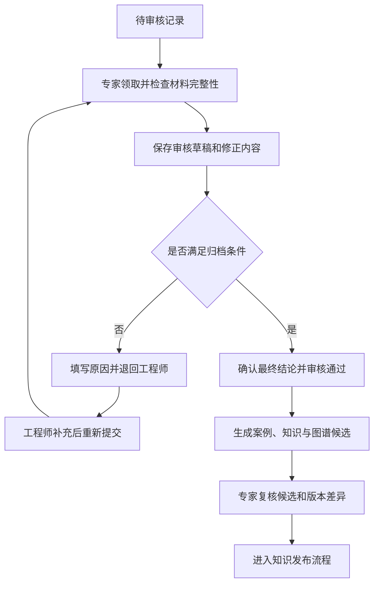

专家退回时必须填写原因和需要补充的内容，可指定返回检修记录、恢复验证或相关步骤。系统保留本次审核草稿和退回记录。工程师补充后生成新的提交版本，专家可以对照前后差异。

审核通过前至少检查：设备和故障归类明确、实际处理与步骤记录一致、恢复验证充分、关键参数有来源、遗留风险已说明、知识候选不存在明显跨型号误用。

#### 6.13.5 审核通过与案例归档

审核通过后：

- 保存专家最终原因、处理结论、恢复结论和审核意见；
- 将检修记录状态更新为`approved`；
- 形成正式历史案例候选并关联原任务和审核；
- 根据最终结论生成知识条目候选和图谱变更集；
- 触发正式作业卡重新生成，使用审核后的记录版本；
- 保留工程师原提交版本、专家修改差异和审核时间；
- 在知识发布完成后将记录和任务推进至归档状态。

案例审核通过与知识发布是两个相邻但独立的事务阶段。知识处理失败时，审核结论保持有效，知识候选进入可重试状态，不把案例退回未审核。

#### 6.13.6 并发、权限与异常处理

- 只有专业范围匹配且有权处理该任务的专家可以审核；
- 同一审核对象使用版本号或审核锁防止多个专家互相覆盖；
- 审核锁超时后可由有权限人员重新取得，但已保存草稿不丢失；
- 材料文件暂不可预览时显示文件状态，专家可决定等待或退回；
- 保存草稿失败时保留页面输入并允许重试，不改变正式审核状态；
- 审核通过请求必须幂等，重复点击不生成重复案例和候选；
- 无权专家访问时不返回材料摘要；
- 退回、通过和发布等关键操作形成不可删除的审计记录。

### 6.14 检修知识库设计

#### 6.14.1 模块定义

| 设计项 | 设计内容 |
| --- | --- |
| 模块职责 | 统一管理历史检修案例、结构化知识条目、厂商设备手册及其来源、版本、适用范围和加工状态 |
| 使用角色 | 专家维护和发布；工程师查看、检索和选择已发布内容 |
| 前置条件 | 用户已登录并具有对应数据权限；新增或编辑需要专家权限 |
| 输入 | 手册与附件、案例、知识正文、设备范围、故障领域、来源、版本和审核信息 |
| 页面与交互 | 提供分类概览、卡片或列表、搜索筛选、详情、原始文件、来源页码、相关知识、版本差异和编辑发布入口 |
| 后端处理 | 文件校验、解析、OCR、分段、元数据管理、知识编辑、版本控制、审核发布和索引更新 |
| 数据读写 | 读取和写入知识资料、案例、知识条目、版本、来源引用、文件、向量片段和发布审计 |
| 输出 | 可检索案例、知识条目、手册目录、详情、版本、来源、适用范围和处理状态 |
| 业务规则 | 工程师只使用已发布内容；每项知识必须有来源和适用范围；历史版本不被无提示覆盖 |
| 异常处理 | 资料解析失败时保留原文件和元数据；索引失败不把内容标记为完全发布；版本冲突时阻止覆盖 |

#### 6.14.2 知识内容分类

知识库包含三类主要内容：

| 内容类型 | 主要内容 | 典型用途 |
| --- | --- | --- |
| 历史检修案例 | 设备、故障现象、原因、实际处理、恢复结果、工程师、专家和来源任务 | 相似故障参考、诊断依据和经验回流 |
| 结构化知识条目 | 适用设备、现象、可能原因、检查项、处理措施、安全要求和恢复条件 | 检索、RAG问答、方案生成和图谱关联 |
| 厂商设备手册 | 工控机及相关设备的用户手册、安装手册、维护手册、规格资料和历史版本 | 参数、接线、拆装、告警和型号专用依据 |

厂商手册不限定为少量预置文件。知识库按设备品牌、产品系列、型号、文档类型、语言、发布日期和版本持续接入各类工控机检修手册。历史版手册保留版本标识和使用边界，用于旧设备核对，不默认替代当前版本。

#### 6.14.3 资料接入与加工


资料接入首先保存原始文件和文件校验信息，再创建解析任务。PDF、Word、Excel和PowerPoint使用对应解析组件；扫描页和图片调用OCR；表格保留行列关系和页码。解析文本片段关联原始文件、页码或工作表位置。

解析和知识候选生成均不直接等于发布。专家需要核对设备范围、型号、参数、接线、拆装和安全内容，确认后才能进入正式知识目录及检索索引。

#### 6.14.4 目录、搜索和详情

知识库首页展示案例、知识条目、设备手册数量和近期更新。用户可以按以下条件组合筛选：

- 内容类型；
- 设备类别、品牌、系列和型号；
- 故障一级领域及具体故障；
- 资料版本、发布日期和语言；
- 来源等级和发布状态；
- 标题、正文和关键词。

案例详情突出现场事实、最终原因、实际处理和恢复结果；知识条目详情展示现象、原因、检查项、措施、安全和恢复条件；手册详情展示产品范围、文档版本、覆盖故障领域、关联知识和原始PDF入口。

所有详情均展示来源和适用范围。手册加工形成的知识条目可以回到原始PDF页码，案例形成的知识可以回到检修记录和专家审核。

#### 6.14.5 知识编辑与版本

专家编辑结构化知识时，以稳定知识编号创建新版本。编辑表单至少包括：

- 标题和摘要；
- 适用设备、型号、部件和故障领域；
- 故障现象和告警；
- 可能原因；
- 检查方法和判断条件；
- 处理措施、工具和备件；
- 安全要求；
- 恢复判断条件；
- 来源资料、页码或案例；
- 跨型号使用限制。

已发布版本不可直接覆盖。修改产生草稿版本，提交审核后发布，新版本生效时上一版本标记为被替代。撤回知识时停止其参与新任务检索，但历史任务继续显示原引用版本。

#### 6.14.6 权限、索引与异常处理

- 工程师只能查看和选择已发布、未撤回且有权访问的内容；
- 专家可以新增、编辑、提交和发布专业范围内知识；
- 用户管理员不能进入知识库专业编辑功能；
- 原始文件、结构化元数据、正文版本和向量索引使用同一知识标识关联；
- 发布只有在正文、来源和必要索引成功后才进入可检索状态；
- 向量生成失败时保留关键词浏览和待重试状态，不伪装为完整发布；
- 文件重复时提示已有资料及版本，不静默创建重复条目；
- 文件损坏或解析失败时保留原始登记并允许重新处理；
- 删除被任务引用的资料时改为撤回或失效，不物理破坏历史引用。

### 6.15 知识图谱设计

#### 6.15.1 模块定义

| 设计项 | 设计内容 |
| --- | --- |
| 模块职责 | 以工控机为中心表达设备、部件、故障、现象、原因、方法、措施、案例和资料之间的知识关系 |
| 使用角色 | 工程师查看已发布图谱；专家查看、编辑、审核和发布图谱变更 |
| 前置条件 | 图谱服务可用；编辑需要专家权限；正式视图只读取已发布图谱版本 |
| 输入 | 图谱视图类型、筛选条件、聚焦节点、查询深度、节点或关系编辑及来源信息 |
| 页面与交互 | 提供全局知识图谱、本次新增与修改、缩放平移、节点聚焦、邻接展开、筛选、详情和专家编辑 |
| 后端处理 | 查询图谱子图、执行权限和版本过滤、建立变更集、校验节点关系、审核发布和更新索引 |
| 数据读写 | 读取Neo4j已发布节点关系和PostgreSQL元数据；写入图谱变更集、审核、发布版本和Neo4j图数据 |
| 输出 | 节点、关系、布局提示、详情、来源、适用范围、变更差异和发布状态 |
| 业务规则 | 页面编辑不直接改写正式图谱；每项关系必须有来源；全局和变更视图使用统一视觉语义 |
| 异常处理 | 图谱服务异常时提供知识库入口；超大子图采用局部加载；发布部分失败时不得标记成功 |

#### 6.15.2 图谱知识模型

图谱以“工控机”设备类别作为全局入口，不绑定单一具体型号。主要节点如下：

| 节点类型 | 示例内容 |
| --- | --- |
| 设备类别 | 工控机、机架式工控机、箱式工控机、面板式工控机 |
| 设备型号 | 各品牌和系列的具体设备型号 |
| 部件 | 风扇、滤网、风道、电源、主板、底板、存储、接口、RTC电池、监控模块 |
| 故障 | 散热、供电、存储、启动、显示、通信、配置、环境和监控告警故障 |
| 现象 | 高温告警、风扇低速、黑屏、启动失败、磁盘告警、电压越限、通信中断等 |
| 原因 | 粉尘堵塞、凝露、部件老化、接线异常、配置错误、供电异常等 |
| 诊断方法 | 外观检查、告警读取、参数测量、替换验证和日志检查 |
| 处置措施 | 清理、紧固、更换、重新接线、参数修正、恢复配置等 |
| 工具与备件 | 万用表、防静电工具、风扇、滤网、电源、存储介质等 |
| 案例 | 审核通过的历史检修案例 |
| 资料 | 厂商手册、知识条目、检修记录和作业卡 |
| 告警与指标 | 温度、转速、电压、SMART、指示灯、蜂鸣器和通信状态 |

主要关系包括“包含部件”“型号属于类别”“部件可能发生故障”“故障表现为现象”“现象可能由原因导致”“原因通过方法确认”“故障采用措施处置”“步骤需要工具或备件”“案例涉及设备和故障”“手册适用于型号”“告警指向现象或故障”以及“知识来源于资料或案例”。

不同故障领域允许具有不同知识粒度。具备充分手册、案例和审核依据的领域可以形成从现象、判据、原因、检查、处置到恢复验证的完整关系链；资料较少的领域先保留可靠节点和关系，后续通过案例和手册持续补充，不使用无依据内容填满图谱。

#### 6.15.3 两类主视图

知识图谱只设置两类主视图：

1. **全局知识图谱。** 展示当前已发布图谱，可按设备、部件和故障领域筛选，并通过节点聚焦查看局部关系；
2. **本次新增与修改。** 以一个图谱变更集为范围，展示新增节点、新增关系、属性修改、关系修改和待删除内容。

两类视图共享节点颜色、关系样式、布局逻辑和详情面板。变更视图额外使用边框、标记和图例表达新增、修改、删除及审核状态，但不改变节点类型的基础视觉语义。

#### 6.15.4 图谱交互

- 滚轮或控件缩放，拖动画布平移；
- 点击节点后聚焦该节点及直接关联关系，非相关内容降低视觉权重；
- 双击或展开操作按需加载下一层邻接节点；
- 详情面板展示节点类型、名称、说明、适用范围、来源和关联知识；
- 支持按节点类型、故障领域、设备范围和关键词筛选；
- 支持恢复全局视角、适应画布和返回上次视图；
- 节点聚焦和局部放大采用平滑过渡，保持用户对位置变化的理解；
- 工程师端与专家端使用同一图谱展示组件，工程师端隐藏编辑操作并保持只读。

全局图谱不一次性加载全部数据。后端根据视图、筛选、聚焦节点和深度返回子图；前端使用Cytoscape.js完成布局、缩放、聚焦和变更高亮。

#### 6.15.5 节点与关系编辑

专家新增或修改节点、关系时，操作写入图谱变更集，不直接更新Neo4j正式图谱。编辑内容包括：

- 节点类型、名称、说明、设备与故障范围；
- 关系类型、起点、终点、方向和说明；
- 来源手册、页码、知识条目或审核案例；
- 适用型号和跨型号限制；
- 修改原因和预期影响。

保存前校验节点类型、关系两端类型、重复关系、自环限制、必要来源和稳定业务标识。删除操作默认采用待删除标记，审核发布后再从当前正式视图中移除，历史变更仍保留。

#### 6.15.6 变更发布与异常处理

变更集经历草稿、待确认、已确认、已发布或已驳回状态。发布时：

1. 锁定变更集版本并再次校验来源和关系约束；
2. 生成发布前差异快照；
3. 在Neo4j事务中幂等写入节点和关系；
4. 更新PostgreSQL中的图谱版本、来源和发布记录；
5. 更新受影响知识的图检索关联；
6. 验证目标子图能够查询并返回；
7. 成功后标记变更集已发布。

- Neo4j不可用时禁止发布，但允许专家继续保存变更草稿；
- 子图过大时限制初始节点数并提示缩小筛选范围；
- 布局失败时使用可重复的备用布局，不丢失节点关系；
- 来源内容被撤回时标记受影响关系并进入复核；
- 发布部分失败时执行事务回滚或补偿，变更集保持可重试状态；
- 同一变更集重复发布不得创建重复节点或关系。

### 6.16 知识回流与更新设计

#### 6.16.1 模块定义

| 设计项 | 设计内容 |
| --- | --- |
| 模块职责 | 将审核通过的检修经验转化为历史案例、知识版本和图谱变更，并验证其能用于后续检索 |
| 使用角色 | 专家审核和发布；工程师查看、同步并使用已发布结果 |
| 前置条件 | 检修案例已经专家审核通过，来源任务、记录和证据完整可追溯 |
| 输入 | 专家最终结论、检修记录、实际措施、恢复验证、引用资料、知识候选和图谱候选 |
| 页面与交互 | 展示案例归档、知识前后差异、图谱变更、来源、验证问题、发布状态和工程师同步状态 |
| 后端处理 | 生成案例、抽取候选、匹配已有知识、形成版本差异、检索验证、发布并更新多类索引 |
| 数据读写 | 写入历史案例、知识版本、图谱变更集、向量索引、发布批次、验证记录和同步状态 |
| 输出 | 正式历史案例、已发布知识版本、已发布图谱关系、检索验证结果和更新通知 |
| 业务规则 | 只有审核通过内容可以发布；候选必须经专家确认；发布失败不破坏上一正式版本 |
| 异常处理 | 单项候选失败可独立处理；跨存储发布使用批次和补偿；验证未通过时不宣告知识可用 |

#### 6.16.2 回流内容生成

系统从专家审核通过的记录中提取：

- 设备、型号、部件和现场角色；
- 故障现象、告警和关键运行参数；
- 专家确认的最终原因；
- 有效检查方法和判断条件；
- 工程师实际处理措施、工具和备件；
- 安全约束；
- 恢复验证条件和结果；
- 来源手册、知识版本、材料和审核信息。

首先生成正式历史案例草稿，再与已有知识条目和图谱节点匹配。匹配结果分为“新增知识”“更新已有知识”“仅补充来源案例”和“不进入知识”四类建议。专家可以调整分类和内容。

#### 6.16.3 知识版本差异

更新已有知识时，页面按结构化字段展示前后差异：标题、适用范围、现象、原因、检查项、措施、安全要求、恢复条件和来源。新增内容、删除内容和修改内容使用不同标记，并显示变更原因和来源案例。

专家可以接受全部、逐项修改或驳回候选。驳回候选不影响历史案例归档；系统记录驳回原因，防止同一内容在没有新依据时反复生成。

#### 6.16.4 图谱变更候选

知识回流根据最终案例生成可能的节点和关系变化，例如新增故障现象、原因、诊断方法、处置措施、案例节点及其来源关系。专家在“本次新增与修改”视图中检查变更，不需要切换到单独的案例聚焦主视图。

每项候选关系关联来源案例、审核编号和对应知识条目。专家可以修改节点名称、关系类型和适用范围，或决定不更新图谱。确认后的内容组成同一发布批次的图谱变更集。

#### 6.16.5 检索验证

正式发布前，系统使用与案例相同或相近的异常描述构造验证问题，执行关键词、向量和图关系检索，检查：

- 新知识是否能够进入候选结果；
- 目标设备和故障领域是否匹配；
- 来源和知识版本是否正确；
- 新图谱关系能否形成预期路径；
- 是否错误影响不适用型号；
- 重排序后是否仍具备合理可见性。

验证结果包括查询、命中内容、排名、图谱路径、适用范围和结论。专家确认验证通过后才能发布；验证失败时返回知识或图谱候选进行调整。

#### 6.16.6 发布与工程师同步

发布使用统一发布批次标识，依次完成：

1. 发布历史案例；
2. 发布知识条目新版本；
3. 生成并启用对应向量索引；
4. 发布图谱变更集；
5. 刷新检索可用版本；
6. 保存验证结果和发布审计；
7. 生成面向工程师端的知识更新通知。

工程师端查看当前知识版本和可同步更新。同步本质上刷新工程师工作区可使用的已发布知识版本、图谱版本和索引版本，不允许工程师取得未发布草稿。同步后可以用相似问题验证智能问答是否引用新知识。

#### 6.16.7 一致性与异常处理

- PostgreSQL、pgvector和Neo4j操作使用同一发布批次标识；
- 上一正式版本在新批次完全可用前保持有效；
- 向量生成失败时不切换知识检索活动版本；
- 图谱发布失败时记录待补偿状态，不丢失已审核变更集；
- 发布请求幂等，重复执行不生成重复版本和关系；
- 工程师同步失败时不影响服务器正式知识，允许重新同步；
- 回退操作恢复上一活动知识和图谱版本，并保留问题版本及发布审计；
- 发布结果必须经过实际检索验证，不能只依据写入接口成功判断可用。

### 6.17 专家工作台设计

#### 6.17.1 模块定义

| 设计项 | 设计内容 |
| --- | --- |
| 模块职责 | 聚合专家待审核任务、案例、知识、手册、图谱变更、会诊请求和个人专业信息 |
| 使用角色 | 专家 |
| 前置条件 | 用户已登录且角色为专家，具有专业方向和审核范围 |
| 输入 | 当前专家、专业范围、案例状态、知识状态、图谱变更、会诊和时间筛选 |
| 页面与交互 | 提供侧边导航、统计摘要、待办列表、最近活动、案例审核、知识库、图谱和个人设置入口 |
| 后端处理 | 按专家范围聚合审核、知识、资料、图谱和会诊数据，计算待办优先级和数量 |
| 数据读写 | 读取用户、审核、案例、知识、手册、图谱变更和会诊；工作台摘要本身不改写专业内容 |
| 输出 | 专家摘要、待办数量、优先任务、最近案例、知识更新和可用功能入口 |
| 业务规则 | 只展示专家有权处理的任务和专业内容；统计口径与列表筛选保持一致 |
| 异常处理 | 单个模块失败时保留其他入口；专业范围缺失时限制审核并提示补充；整体认证失败时退出 |

#### 6.17.2 信息架构

专家工作台采用统一侧边导航，主要入口包括：

- 工作台概览；
- 待审核案例；
- 历史案例；
- 检修知识库；
- 厂商设备手册；
- 知识图谱；
- 知识变更与发布；
- 专家会诊请求；
- 个人专业设置。

用户管理不出现在专家导航中。专家个人设置只维护自身姓名、职称、所属机构、专业方向和可审核范围，不能新增、停用其他用户。

#### 6.17.3 工作台概览

概览展示：

- 全部可见案例数、待审核数、审核中数和已归档数；
- 待发布知识版本数和待确认图谱变更数；
- 新接入手册及解析状态；
- 等待处理的专家会诊请求；
- 按优先级排列的审核任务；
- 最近审核、知识发布和图谱更新活动；
- 当前专家专业方向和审核范围。

待办优先级综合任务退回次数、提交时间、设备风险、是否阻断现场恢复和是否存在专家会诊请求。统计卡点击后进入带对应筛选条件的列表，确保统计数与实际列表一致。

#### 6.17.4 任务与知识入口衔接

专家从待审核任务进入审核流程，审核完成后可以继续检查知识条目差异和图谱变更。页面保留同一任务、审核和发布批次上下文，避免在多个入口间丢失案例来源。

从知识条目详情可以定位其来源手册、历史案例和图谱节点；从手册详情可以查看已加工知识；从图谱节点详情可以打开关联知识和案例；从历史案例可以回到原检修记录及专家审核。

#### 6.17.5 聚合、权限与异常处理

- 工作台聚合接口按区域返回数据及更新时间；
- 专家专业范围变化后刷新可审核任务，不改变已经完成的历史审核归属；
- 某个统计区加载失败时提供局部重试，不阻断直接进入知识库或图谱；
- 审核服务不可用时，知识库和已发布图谱仍可只读访问；
- Neo4j不可用时隐藏图谱统计的实时结果并提供明确状态，不将其显示为零；
- 会诊通信不可用时保留请求记录和任务上下文；
- 专家无权访问的任务、知识草稿和变更集不返回标题或摘要；
- 工作台不使用前端本地统计替代后端正式状态。

### 6.18 用户管理后台设计

#### 6.18.1 模块定义

| 设计项 | 设计内容 |
| --- | --- |
| 模块职责 | 为用户管理员提供工程师和专家账号、固定角色、组织归属、账号状态和密码重置管理 |
| 使用角色 | 用户管理员 |
| 前置条件 | 用户以`admin`角色登录且账号处于`active`状态 |
| 输入 | 用户搜索条件、角色筛选、新增或编辑表单、启停操作和密码重置请求 |
| 页面与交互 | 独立后台、统计卡片、搜索筛选、用户列表、新增编辑弹窗、状态操作、密码重置和结果反馈 |
| 后端处理 | 查询统计与列表、校验唯一性和角色字段、创建或更新用户、启停账号、重置密码并写入审计 |
| 数据读写 | 读取和写入用户、组织归属、安全状态、会话状态和用户操作审计 |
| 输出 | 用户统计、分页列表、用户详情、操作结果、更新后状态和审计编号 |
| 业务规则 | 只管理工程师和专家；不能编辑管理员自身；登录账号唯一；角色决定必填组织字段 |
| 异常处理 | 重复账号、版本冲突、非法角色字段和无权限操作明确拒绝；失败时不更新页面正式状态 |

#### 6.18.2 页面信息架构

用户管理员登录后进入独立用户管理后台，不显示工程师检修、专家审核、知识库编辑和知识图谱编辑入口。页面由以下区域组成：

1. **后台导航。** 展示用户管理、当前管理员摘要和退出登录；
2. **页面标题区。** 显示“用户与角色管理”、功能说明和“新增用户”主操作；
3. **统计摘要。** 展示工程师、专家、正常账号和停用账号数量；
4. **查询工具栏。** 提供关键词搜索和全部、工程师、专家角色筛选；
5. **用户列表。** 展示人员、登录账号、角色与归属、状态和允许的操作；
6. **用户编辑器。** 以弹窗或抽屉方式完成新增和编辑；
7. **操作反馈。** 对新增、修改、启停和重置操作显示明确成功或失败结果。

统计卡片和角色筛选使用同一后端查询口径。点击统计项可以转换为对应筛选条件，列表总数与统计数量保持一致。页面刷新后从后端重新读取数据，不使用浏览器本地数据作为正式用户主数据。

#### 6.18.3 用户列表、搜索与筛选

用户列表至少展示：

- 姓名和稳定用户编号；
- 登录账号；
- 工程师或专家角色；
- 工程师的所属场站和班组；
- 专家的所属机构和专业方向；
- 正常或停用状态；
- 编辑、密码重置和启停操作。

搜索支持姓名、登录账号、场站、班组、机构和专业方向，角色筛选支持全部、工程师和专家。后端对关键词进行必要规范化并使用分页查询，前端不加载全部用户后再进行本地筛选。

默认排序为正常账号优先、最近更新时间倒序；也可按姓名或用户编号排序。搜索无结果时展示空状态和清除筛选入口，不使用虚构用户填充列表。

#### 6.18.4 新增与编辑用户

新增和编辑采用同一结构化表单：

| 字段 | 工程师 | 专家 | 校验规则 |
| --- | --- | --- | --- |
| 姓名 | 必填 | 必填 | 去除首尾空格，长度和字符符合人员名称规则 |
| 登录账号 | 必填 | 必填 | 规范化后全系统唯一，不与停用账号重复 |
| 固定角色 | 工程师 | 专家 | 用户管理员只能在两类目标角色中选择 |
| 账号状态 | 正常或停用 | 正常或停用 | 新增默认状态由系统策略决定 |
| 所属场站 | 必填 | 不适用 | 必须来自有效场站或受控录入范围 |
| 所属班组 | 必填 | 不适用 | 与场站关系有效 |
| 所属机构 | 不适用 | 必填 | 保存专家正式组织名称 |
| 专业方向 | 不适用 | 必填 | 用于审核任务筛选和资料范围 |

新增用户时由后端生成稳定用户编号。保存前依次校验身份权限、必填项、登录账号唯一性、角色与组织字段匹配及数据版本。新增成功后返回用户摘要和审计编号，并刷新统计与列表。

编辑用户时稳定用户编号不变。角色发生变化时，页面切换组织字段并要求补齐目标角色信息；后端在单次事务内更新角色、组织归属和审计记录。原角色历史信息进入审计差异，不用于新的权限判断。

用户管理员不能通过该表单创建其他管理员，也不能编辑当前管理员自身角色或状态。管理员账号维护通过独立安全流程处理。

#### 6.18.5 启用与停用

启停操作使用显式确认：

- 停用前展示目标用户、角色、组织和影响说明；
- 停用后账号状态变为`disabled`，不能建立新会话；
- 已存在会话在下一次后端校验时终止；
- 停用不删除该用户的检修、审核、知识和审计历史；
- 重新启用前确认组织归属和角色信息仍然有效；
- 启用后账号恢复登录资格，但不自动恢复已经重新分派的任务。

启停接口使用用户编号和数据版本防止误操作。重复停用已停用账号或启用正常账号时返回当前状态，不创建相互矛盾的变化。

#### 6.18.6 密码重置

用户管理员可以为工程师和专家发起密码重置。处理流程为：

1. 管理员选择目标用户并确认操作；
2. 后端验证管理员权限、目标角色和账号状态；
3. 创建一次性重置凭据或设置需要用户重新设定密码的安全状态；
4. 使受影响的旧认证凭据按安全策略失效；
5. 返回不包含长期明文密码的操作结果；
6. 写入密码重置审计事件。

页面和日志不得长期显示用户明文密码。重置操作只说明处理成功、有效范围和后续取得新凭据的方式。用户管理员不能读取原密码。

#### 6.18.7 审计、并发与异常处理

- 新增、编辑、角色调整、组织变更、启停和密码重置均写入审计；
- 审计记录包含操作前后关键字段，但不包含密码散列和临时凭据；
- 编辑采用数据版本控制，用户已被他人修改时要求刷新后重试；
- 登录账号重复返回字段级错误，不创建部分用户记录；
- 组织信息保存失败时用户主记录与组织归属同时回滚；
- 统计加载失败时不把数量显示为零，而显示不可用状态；
- 后端不可用时后台只显示失败和重试，不使用前端种子数据接受正式修改；
- 无权限请求返回拒绝结果并形成安全审计；
- 同一操作重复提交使用幂等键，避免重复创建用户或重复重置。

### 6.19 系统设置设计

#### 6.19.1 模块定义

| 设计项 | 设计内容 |
| --- | --- |
| 模块职责 | 管理个人使用偏好、专家专业资料和受控平台业务规则，使设置的作用范围、修改权限和生效方式清晰可追溯 |
| 使用角色 | 工程师、专家；平台规则由受控系统配置维护；用户管理员只维护用户账号及组织字段 |
| 前置条件 | 用户已登录；修改平台规则需要独立的受控配置权限和审计机制 |
| 输入 | 个人关注设备、通知偏好、语音播报、作业卡偏好、专家资料及平台业务规则 |
| 页面与交互 | 按个人偏好、专业资料和系统规则分组，展示当前值、作用范围、保存状态和必要说明 |
| 后端处理 | 按设置类型校验权限与取值、保存配置版本、刷新可动态生效配置并记录变更 |
| 数据读写 | 读取和写入用户偏好、专家资料、业务规则版本和配置审计；敏感连接参数来自部署环境配置 |
| 输出 | 当前设置、保存结果、生效范围、生效时间和配置版本 |
| 业务规则 | 用户只能修改自身偏好；用户管理员不能修改专业规则；安全规则不得被普通用户关闭 |
| 异常处理 | 无效取值拒绝保存；部分设置失败时不覆盖其他组；需重启项明确提示而不伪装即时生效 |

#### 6.19.2 设置分类与权限

| 设置类别 | 主要内容 | 可修改者 | 作用范围 |
| --- | --- | --- | --- |
| 个人基本显示 | 联系信息、界面显示偏好等非授权字段 | 当前用户 | 当前用户 |
| 工程师关注范围 | 当前关注设备、常用故障领域和默认记录筛选 | 工程师本人 | 当前工程师工作台 |
| 通知偏好 | 告警通知方式、审核结果提醒和知识更新提醒 | 当前用户 | 当前用户 |
| 语音播报偏好 | 是否启用、播放速度、音量和自动播报范围 | 工程师本人 | 当前工程师检修向导 |
| 作业卡偏好 | 预览方式、默认打印选项和允许的输出样式 | 工程师本人 | 当前用户生成或预览操作 |
| 专家专业资料 | 职称、所属机构、专业方向和可审核设备范围 | 专家本人在允许范围内维护 | 专家工作台与任务筛选 |
| 用户组织归属 | 工程师场站班组、专家机构专业方向的正式账号资料 | 用户管理员 | 身份展示与数据范围 |
| 专家审核规则 | 哪类任务必须审核、允许退回的阶段和发布前检查 | 受控平台配置 | 全系统业务流程 |
| 安全确认规则 | 断电、挂牌、冷却、防静电、复装和恢复上电要求 | 受控平台配置 | 全系统检修流程 |
| 文件和输出规则 | 上传限制、临时文件期限、作业卡模板活动版本 | 受控平台配置 | 文件处理与PDF服务 |

同一字段在个人资料和正式组织数据中出现时，以职责区分修改来源。例如，专家可以维护专业介绍，但影响任务数据范围的正式机构和审核范围变更需遵循受控流程；工程师不能自行把所属场站改为其他场站以扩大数据访问范围。

#### 6.19.3 个人偏好设置

个人偏好按用户编号保存，登录后随用户配置加载。修改操作只影响当前用户，不改变已归档任务和作业卡。

- 关注设备用于工作台排序和快捷筛选，不扩大实际设备访问权限；
- 通知方式决定页面提醒或受支持的通知通道，不改变任务状态；
- 语音播报设置只影响步骤内容的播放方式，不影响步骤文字和安全要求；
- 作业卡偏好只在系统允许的模板范围内调整预览和打印选项，不能删除必要字段；
- 设置保存后返回规范化结果和配置版本，前端以返回值更新状态。

用户更换终端后仍从服务端读取个人偏好。浏览器本地存储只可保存不敏感的临时界面状态，不能成为正式设置的唯一来源。

#### 6.19.4 专家专业设置

专家设置页面展示姓名、职称、所属机构、专业方向和可审核设备范围。专家可以在允许范围内维护个人介绍和专业标签；涉及正式机构、角色和显著扩大审核范围的变化需要受控确认，并形成配置或用户资料审计。

专业范围变化后影响新任务筛选，不追溯修改已经完成的审核记录。历史审核继续保留当时的专家姓名、机构和专业范围快照。

#### 6.19.5 平台业务规则

专家审核要求、安全确认和作业卡活动模板属于平台业务规则，不作为普通用户偏好。规则使用版本化配置，并包含规则编号、名称、适用设备或故障范围、当前值、启用状态、修改人、修改时间和版本。

平台规则变更遵循：

1. 校验修改权限和配置格式；
2. 创建新配置版本，不直接覆盖历史版本；
3. 检查与强制安全步骤、任务状态和模板字段的兼容性；
4. 明确立即生效、下一任务生效或服务重启后生效；
5. 发布新活动版本并记录审计；
6. 对受影响的新任务使用新版本，进行中和已归档任务保留原引用版本。

用户管理员不因能够管理账号而获得平台业务规则修改权。数据库密码、JWT密钥、模型API密钥和外部服务凭据不通过普通系统设置页面展示或保存，而由部署环境配置安全提供。

#### 6.19.6 保存、生效与异常处理

- 设置按分组独立保存，某组失败不回滚已经成功且无依赖的其他组；
- 输入值由Pydantic配置模型校验类型、范围和枚举；
- 并发修改使用配置版本号，旧版本提交被拒绝并提示重新加载；
- 动态设置保存后立即返回生效值，需重启设置只保存待生效版本并明确提示；
- 安全规则校验失败时拒绝发布，不允许通过关闭前端校验绕过；
- 配置服务不可用时页面显示最近已确认值和不可编辑状态，不接受仅本地保存的正式修改；
- 配置回退创建新的回退版本，不删除问题版本和审计历史；
- 设置变更日志不包含密钥、令牌和其他敏感值。

### 6.20 模块衔接与一致性检查

本节用于检查第6章19个功能模块的输入、输出、状态和后继关系，不构成第20个产品功能模块。

#### 6.20.1 模块链路检查

| 序号 | 功能模块 | 主要输入 | 主要输出 | 状态或数据落点 | 主要后继模块 |
| --- | --- | --- | --- | --- | --- |
| 1 | 用户登录与角色 | 账号、密码 | 用户、角色、会话 | 用户会话与登录审计 | 三类角色工作区 |
| 2 | 工程师工作台 | 工程师、场站、任务 | 待办、设备、最近记录 | 工作台聚合摘要 | 异常接入、记录、图谱 |
| 3 | 现场异常接入 | 描述、语音、材料 | 异常事件与材料摘要 | 异常`draft`→`confirmed` | 设备与故障确认 |
| 4 | 设备与故障确认 | 异常、设备目录、解析结果 | 已确认任务上下文 | 任务`information_confirmed` | 资料选择、智能诊断 |
| 5 | 检修资料选择 | 设备、故障、资料目录 | 任务资料包 | 资料版本引用 | 多模态检索、智能诊断 |
| 6 | 多模态知识检索 | 任务上下文、材料、问题 | 带来源的检索结果 | 检索会话与证据引用 | 智能诊断、问答 |
| 7 | 智能辅助诊断 | 现场事实、检索依据 | 诊断结论和原因候选 | 任务`diagnosing`→`plan_pending` | 检修预方案 |
| 8 | 检修预方案 | 已确认诊断、知识和安全规则 | 确认方案版本 | 任务`plan_pending`→`executing` | 检修向导 |
| 9 | 标准化检修向导 | 方案步骤、现场结果 | 步骤执行和检修进度 | 步骤执行状态 | 恢复运行验证 |
| 10 | 恢复运行验证 | 复装检查、参数、观察 | 恢复结论 | `recovery_verification` | 检修记录或返回向导 |
| 11 | 检修记录 | 全流程快照 | 结构化检修记录 | 记录`draft`/`pending_review` | 作业卡、专家审核 |
| 12 | 检修作业卡 | 检修记录版本 | 两页A4 PDF | 作业卡及文件版本 | 专家查看、归档下载 |
| 13 | 专家审核 | 记录、材料、依据和恢复结果 | 审核结论与知识候选 | 审核`pending`→`approved`/`returned` | 知识回流或工程师补充 |
| 14 | 检修知识库 | 手册、案例、知识候选 | 已发布资料与知识版本 | 知识版本及向量片段 | 检索、图谱、资料选择 |
| 15 | 知识图谱 | 已发布知识、案例和变更集 | 全局图谱与变更视图 | 图谱版本和Neo4j关系 | 检索、诊断、图谱查看 |
| 16 | 知识回流与更新 | 审核案例、知识和图谱候选 | 案例、知识、图谱发布批次 | 发布、验证和同步状态 | 工程师同步、后续检索 |
| 17 | 专家工作台 | 专家范围、审核和知识状态 | 专家待办与功能入口 | 聚合摘要 | 审核、知识库、图谱 |
| 18 | 用户管理后台 | 用户资料与管理操作 | 用户、组织、状态和审计 | 用户`active`/`disabled` | 登录授权与数据范围 |
| 19 | 系统设置 | 个人偏好和平台规则 | 配置值及版本 | 用户设置与规则版本 | 工作台、向导、审核、PDF |

#### 6.20.2 状态衔接检查

- 异常事件确认后才建立正式任务上下文，未确认草稿不进入诊断；
- 诊断必须由工程师确认后才能生成待确认方案；
- 方案必须通过安全完整性校验并确认后才能创建步骤执行记录；
- 必要步骤和恢复验证完成前不能提交专家审核；
- 专家退回时任务、记录和审核状态同步进入可补充状态；
- 专家审核通过先形成案例和知识候选，知识发布失败不撤销审核结论；
- 知识和图谱只有完成审核、发布及检索验证后才进入工程师可用版本；
- 用户停用即时影响新登录和后续授权，但不改变历史任务、审核和知识责任记录；
- 设置变更通过版本控制影响新业务，不无提示改写进行中或已归档对象。

#### 6.20.3 数据与权限衔接检查

- 19个模块均通过稳定业务编号关联，不使用标题、文件名或页面序号作为跨模块主键；
- 工程师、专家和用户管理员的数据范围在后端接口中强制校验；
- 工程师现场事实、专家审核结论、知识发布版本分别保存，不相互覆盖；
- 任务引用具体资料和知识版本，归档后不随最新知识变化；
- PostgreSQL保存正式业务状态，pgvector和Neo4j不能反向决定用户权限或任务状态；
- 文件材料和PDF必须先经过业务权限检查再访问；
- 用户管理员不进入检修和知识链路，专家不进入用户管理链路；
- 个人偏好不扩大用户数据权限，平台安全规则不能被普通用户关闭。

#### 6.20.4 异常与降级衔接检查

- 模型、向量、图谱或文件处理的单项失败不删除已经确认的业务数据；
- 自动识别失败时保留人工录入和人工确认路径；
- 智能服务不可用时，已发布资料浏览、步骤正文和检修记录仍可访问；
- 异步任务使用业务编号、任务类型和幂等键避免重复处理；
- 跨存储发布失败时保留上一活动知识版本并进入补偿或重试；
- 页面加载部分失败时显示局部状态，不把“不可用”错误显示为“零数据”或“无匹配”；
- 关键提交、审核、发布、启停和配置变更失败时，前端不得提前显示成功状态。

---

## 7. 核心业务流程设计

本章从跨模块角度说明主要业务流程。流程中的状态转换由后端应用服务执行，页面负责采集输入和展示结果；任何智能模型输出均不能绕过人工确认、安全校验和专家审核直接推进业务状态。

### 7.1 异常接入与任务创建流程

#### 7.1.1 流程目标与参与者

该流程将工程师看到、听到或测量到的现场异常转化为具有稳定编号、材料清单和设备上下文的检修任务。

主要参与者包括工程师、Web前端、异常接入服务、文件服务、语音识别服务、多模态处理服务、设备目录服务和PostgreSQL。

#### 7.1.2 主流程

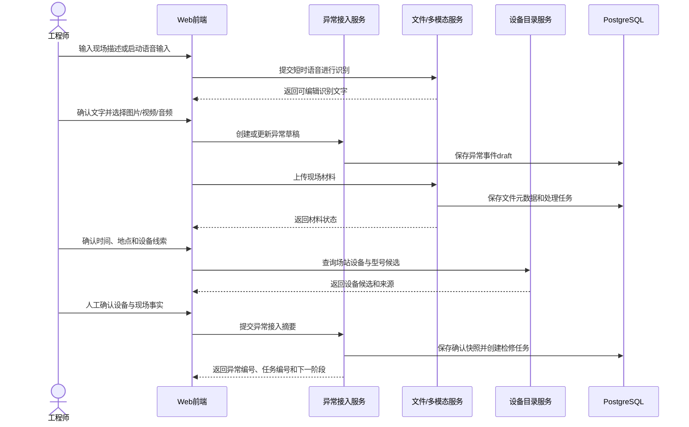

主流程步骤如下：

1. 工程师从工作台进入现场接诊，系统创建异常事件草稿；
2. 工程师通过键盘或语音输入异常描述，并接入现场图片、视频或音频；
3. 文件服务保存材料元数据并异步执行OCR、转写或多模态处理；
4. 工程师确认发生时间、场站、设备位置、设备对象、告警和运行参数；
5. 系统汇总设备台账、材料识别和人工输入，标识每个字段来源；
6. 工程师确认现场信息摘要；
7. 后端在事务中将异常状态由`draft`推进为`confirmed`，生成检修任务和任务上下文快照；
8. 系统返回任务编号并进入资料选择和诊断准备阶段。

#### 7.1.3 分支与异常

- 麦克风不可用时使用键盘输入，不阻断异常接入；
- 单项材料上传或解析失败时标记该材料，不影响其他材料和文字事实；
- 设备型号不能确定时保存设备类别和现场描述，后续只允许使用通用知识；
- 设备台账与现场铭牌冲突时要求人工确认并保留两个来源；
- 必要地点、设备类别和异常现象缺失时保留草稿，不创建正式检修任务；
- 重复提交使用草稿编号和幂等键返回同一任务，避免重复创建；
- 网络中断后恢复草稿及已完成上传，由工程师确认继续。

#### 7.1.4 数据与状态结果

流程完成后至少形成异常事件、现场材料、设备引用、字段来源、确认快照、检修任务和任务负责人。异常状态为`task_created`，检修任务进入`information_confirmed`；尚未完成的材料处理任务继续异步执行，其结果作为后续诊断线索而不是已确认事实。

### 7.2 智能诊断与预方案生成流程

#### 7.2.1 流程目标与参与者

该流程把已确认现场事实和检修资料转化为带来源的诊断建议，再由工程师确认并形成可执行检修方案。

参与者包括工程师、诊断应用服务、混合检索服务、PostgreSQL、pgvector、Neo4j、统一模型网关、安全规则服务和方案服务。

#### 7.2.2 主流程

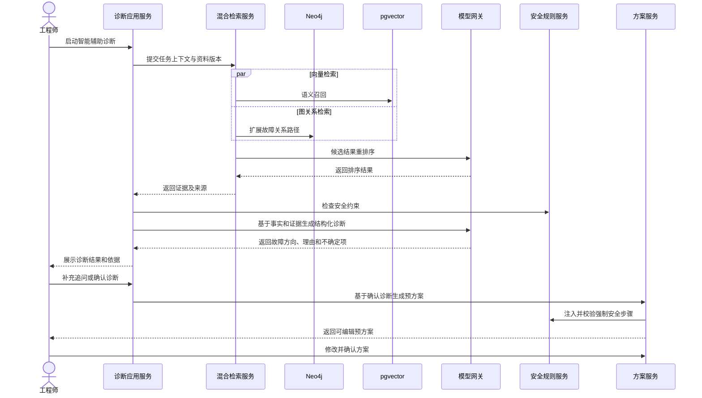

#### 7.2.3 诊断与方案边界

- 检索服务负责找出候选证据，不直接形成最终故障原因；
- 大语言模型基于提供的事实和证据组织诊断建议，不读取未授权知识；
- 安全规则由确定性服务检查，不由模型自由决定是否需要；
- 工程师确认诊断后才允许生成预方案；
- 预方案中的强制安全步骤由规则加入并保护，模型和工程师均不能删除；
- 工程师确认方案后生成固定版本，检修向导不直接读取临时模型输出。

#### 7.2.4 分支与异常

- 信息不足时诊断返回待补充项，任务保持`diagnosing`；
- 向量服务不可用时使用关键词和图关系检索；
- Neo4j不可用时使用关键词和向量检索；
- 重排序失败时使用融合排序并标记降级；
- 模型不可用时展示规则、检索证据和人工方案入口；
- 用户修改设备型号后，现有诊断和方案标记为需要复核；
- 方案不满足安全顺序、设备适用范围或完整性时不能确认。

#### 7.2.5 数据与状态结果

流程形成检索会话、证据引用、诊断版本、诊断确认、方案版本、步骤集合、方案修改事件和方案确认快照。任务依次由`information_confirmed`进入`diagnosing`、`plan_pending`和`executing`。

### 7.3 标准化检修执行流程

#### 7.3.1 流程目标与参与者

该流程按照已确认方案逐步指导工程师完成现场作业，并把检查结果、实际措施、补充材料和问答依据保存为可审核过程记录。

参与者包括工程师、检修向导服务、步骤规则服务、文件服务、检修智能问答服务、语音输入与播报服务以及专家会诊服务。

#### 7.3.2 主流程

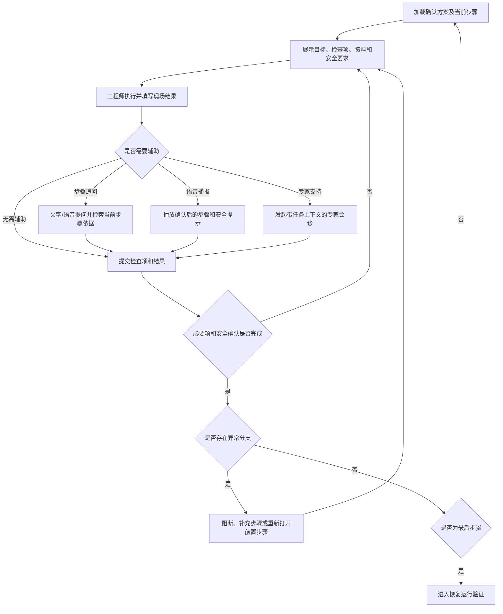

#### 7.3.3 步骤推进规则

1. 向导读取已确认方案版本和后端保存的当前步骤；
2. 工程师逐项记录检查结果和实际操作，可补充现场材料；
3. 步骤问答绑定任务、设备、方案版本、当前步骤和资料版本；
4. 完成操作由后端检查必要检查项、安全确认、结果字段和材料要求；
5. 校验通过后保存完成快照并激活下一步骤；
6. 非强制步骤允许跳过，但必须填写原因；
7. 新异常可以阻断当前步骤、补充步骤或重新打开前置步骤；
8. 全部步骤完成后，任务进入恢复运行验证。

#### 7.3.4 中断、会诊与恢复

- 页面刷新或重新登录时从后端恢复当前步骤和已保存检查项；
- 未保存输入可在浏览器短时保留，但不得覆盖后端正式完成状态；
- 问答服务不可用时仍能阅读步骤正文和原始资料；
- 专家会诊意见作为补充记录，不自动完成步骤；
- 方案必须调整时创建新版本并说明原因，已完成步骤保留原版本；
- 任务已提交审核后向导只读；
- 强制安全步骤无论何种降级模式均不能跳过。

#### 7.3.5 数据与状态结果

流程形成步骤执行记录、检查项结果、安全确认、实际措施、步骤材料、当前步骤问答、会诊记录和进度快照。任务保持`executing`，全部步骤完成后进入`recovery_verification`。

### 7.4 恢复验证与任务闭环流程

#### 7.4.1 流程目标

该流程验证设备在检修后的复装、告警、运行和关键参数状态，决定返回检修、继续观察或进入记录与专家审核。

#### 7.4.2 主流程

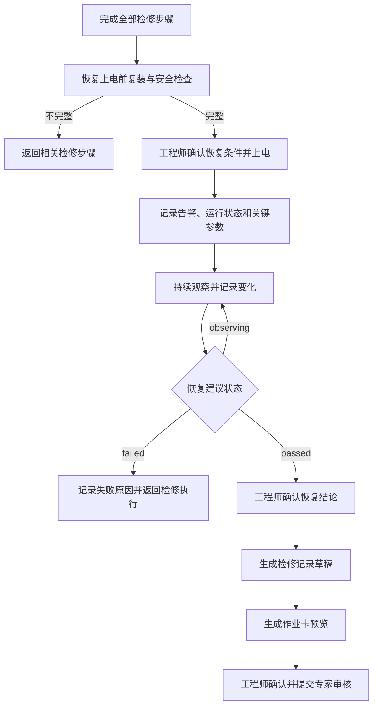

#### 7.4.3 判定规则

- 恢复上电前必须完成复装、线缆、工具遗留和安全措施检查；
- 关键参数同时保存值、单位、采集方式、采集时间和判据来源；
- 系统可以形成建议状态，但最终恢复结论由工程师确认；
- `failed`返回`executing`并重新打开相关步骤，不生成虚假闭环；
- `observing`保持验证状态并追加观察记录；
- `passed`形成恢复快照，允许生成检修记录；
- 关键验证项、遗留风险或实际措施缺失时不能提交专家审核。

#### 7.4.4 记录与提交

记录服务从异常、诊断、方案、步骤和恢复快照生成检修记录草稿。工程师补充实际处理总结和遗留风险后确认记录，作业卡服务生成两页预览。提交审核时后端同时校验记录版本、恢复状态、必要材料和作业卡生成状态，创建专家审核对象并将任务与记录推进至`pending_review`。

#### 7.4.5 异常与幂等

- 参数自动采集失败时允许人工录入并标识采集方式；
- 作业卡生成失败不丢失记录，可修复后重试；
- 重复生成记录或作业卡返回同一有效版本；
- 重复提交审核不创建多个活动审核对象；
- 提交后发现材料未处理完成时，专家可以查看处理状态或退回补充；
- 所有状态转换在单个业务事务或可补偿流程中完成。

### 7.5 专家审核流程

#### 7.5.1 流程目标与参与者

该流程由专家复核工程师提交内容，决定退回补充或审核通过，并为案例归档和知识更新建立可靠输入。

#### 7.5.2 主流程

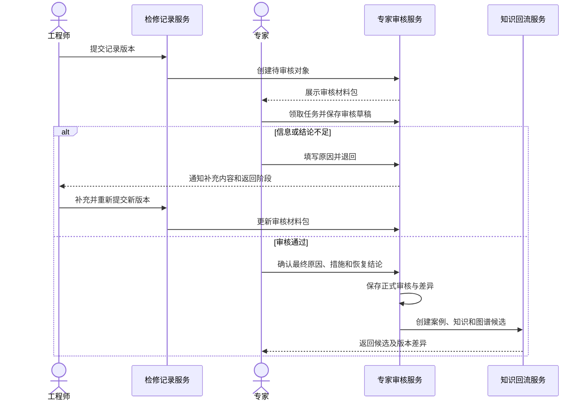

#### 7.5.3 审核控制

- 审核材料包锁定工程师原始事实并展示来源；
- 专家修改形成独立专家结论，不覆盖原始材料和测量值；
- 退回必须说明原因和需要补充的具体内容；
- 工程师补充后形成新的提交版本，专家可以查看差异；
- 审核通过检查实际处理、恢复结果和知识候选的型号适用性；
- 同一审核任务通过版本或锁避免并发覆盖；
- 案例审核通过与知识发布分离，知识失败不撤销审核结论。

#### 7.5.4 状态结果

审核对象依次处于`pending`、`in_review`、`returned`或`approved`。退回时任务与记录进入`returned`，重新提交后回到`pending_review`；通过时任务和记录进入`approved`，并产生历史案例、知识条目和图谱变更候选。

### 7.6 作业卡生成流程

#### 7.6.1 流程目标

该流程把指定检修记录版本转换为总结性两页A4 PDF，并保证内容、模板、权限和文件版本可追溯。

#### 7.6.2 主流程

1. 用户选择有权访问的检修记录版本；
2. 作业卡服务读取记录、关键步骤、恢复参数和审核信息；
3. 构建独立作业卡视图模型并校验必要字段；
4. 使用Jinja2渲染HTML，使用WeasyPrint生成PDF；
5. 检查PDF页数、中文字体、文件可打开性和关键字段；
6. 保存PDF、文件校验值、模板版本和生成任务；
7. 返回预览、打印和下载入口；
8. 审核结论改变记录版本时，基于新版本生成正式作业卡，保留旧版本。

#### 7.6.3 内容选择规则

第一页汇总设备、异常、最终原因、实际措施、恢复结论、人员时间和风险；第二页汇总关键步骤、工具备件、恢复参数、资料依据和签字确认。完整步骤日志、全部问答和所有材料保留在系统记录中，不原样堆叠到PDF。

#### 7.6.4 异常处理

- 字段缺失时使用“未记录”或“不适用”，不使用虚构默认值；
- HTML、字体、页数或PDF完整性检查失败时不发布文件；
- 相同记录和模板版本重复请求时返回已有有效文件；
- 生成失败只影响作业卡任务，不影响检修记录和审核；
- 文件通过受控标识访问，不向浏览器暴露服务器路径。

### 7.7 知识回流与发布流程

#### 7.7.1 流程目标与参与者

该流程把审核通过的检修经验转化为可检索案例、知识版本和图谱关系，并通过检索验证确认发布结果真正可用。

#### 7.7.2 主流程

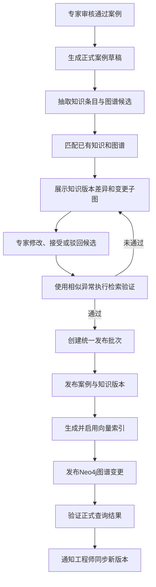

#### 7.7.3 发布一致性

- 发布批次关联案例、知识版本、向量片段、图谱变更集和审核记录；
- 上一活动版本在新批次完全可用前继续服务；
- PostgreSQL记录发布状态和批次，pgvector与Neo4j保存相同业务标识；
- 每一步幂等执行，失败时可以从批次状态恢复；
- 向量或图谱失败时不把整个批次标记为已完成；
- 发布后执行正式查询验证，而不是只检查写入接口返回；
- 回退创建新的回退记录并恢复上一活动版本，不删除问题版本。

#### 7.7.4 工程师同步

工程师端读取服务器当前已发布知识和图谱版本。存在新版本时展示更新摘要，确认同步后刷新工作区使用的知识版本、图谱版本和检索索引标识。同步不复制未发布草稿，也不改变已归档任务的历史引用。

### 7.8 用户账号生命周期流程

#### 7.8.1 流程目标

该流程由用户管理员维护工程师和专家账号，保证账号、角色、组织归属、启停状态和密码重置均可审计。

#### 7.8.2 新增与编辑流程

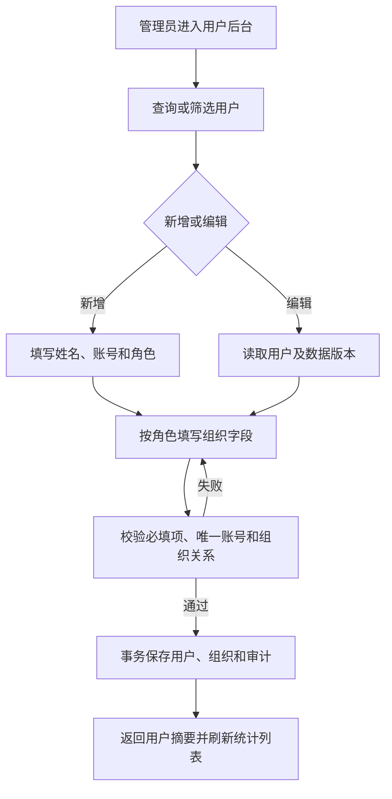

#### 7.8.3 启停与密码重置

- 停用前确认目标用户及影响，成功后阻止新登录并使现有会话在再次校验时失效；
- 重新启用前检查角色和组织信息，不自动恢复已经重新分派的任务；
- 密码重置创建一次性凭据或重新设置状态，管理员不能读取原密码；
- 页面、接口和普通日志不长期展示明文密码；
- 管理员不能在普通列表中创建或编辑其他管理员，也不能误停用当前自身账号；
- 启停和重置均使用用户数据版本与幂等键。

#### 7.8.4 历史数据与异常

用户角色、姓名或组织变化不覆盖历史任务、审核和知识记录中的人员快照。用户停用不删除历史责任记录。重复账号、组织无效、数据版本冲突或审计写入失败时事务回滚，不产生半完成用户数据。

---

## 8. 知识与智能能力专项设计

本章说明知识内容如何从原始资料转化为可检索、可引用、可审核和可更新的智能能力。知识与模型服务只提供辅助识别、检索、分析和生成能力，业务状态、权限、安全规则和发布结论仍由核心业务服务控制。

### 8.1 知识分类体系

#### 8.1.1 分类目标

知识分类用于统一资料接入、目录浏览、检索过滤、图谱建模、模型上下文和适用范围控制。分类采用多维标签，不把全部内容强行放入单一目录树。

#### 8.1.2 设备分类维度

| 维度 | 设计内容 |
| --- | --- |
| 设备类别 | 工控机、机架式工控机、箱式工控机、面板式工控机及相关工业计算设备 |
| 品牌与系列 | 厂商、产品系列和硬件代次 |
| 设备型号 | 具体型号、硬件版本和可识别变体 |
| 部件 | 风扇、滤网、风道、电源、主板、底板、CPU、内存、存储、扩展卡、接口、RTC电池和监控模块 |
| 现场角色 | 站控机、操作员站、工程师站、通信前置机、数据采集节点或其他业务角色 |
| 安装环境 | 控制室、机柜、户外箱体、温湿度、粉尘、振动、接地和供电条件 |

设备类别用于通用知识，型号用于专用参数和操作。知识同时标识最低适用层级：类别级知识可以跨型号参考，型号级知识只有在目标型号或明确兼容范围内使用。

#### 8.1.3 故障分类维度

系统使用五个一级故障领域组织知识：

1. **环境工况异常。** 温度、湿度、凝露、粉尘、风道、振动、安装和接地；
2. **供电系统故障。** 外部供电、电源模块、冗余电源、配电附件和电压监测；
3. **硬件部件故障。** 风扇、存储、主板、底板、内存、扩展部件、显示和RTC电池；
4. **配置与维护异常。** POST、BIOS/UEFI、操作系统、驱动、接口配置、安装检修和备件管理；
5. **监控与告警异常。** 温度、风扇、电压、存储、网络、指示灯、蜂鸣器、总线和远程监控。

一级领域下继续使用故障、现象、原因、诊断方法、处置措施和恢复条件等结构化字段。一个知识条目可以关联多个故障领域，但必须指定主要领域用于目录和统计。

#### 8.1.4 内容和来源分类

| 分类维度 | 可选类型 |
| --- | --- |
| 内容类型 | 厂商手册、历史案例、结构化知识、检修记录、作业卡、告警规则、图谱节点和关系 |
| 资料类型 | 用户手册、安装手册、维护手册、规格书、服务指南、内部制度和培训资料 |
| 来源等级 | 厂商原始资料、专家确认知识、审核通过案例、内部正式资料和待核实候选 |
| 发布状态 | 草稿、待审核、已发布、已替代和已撤回 |
| 语言 | 中文、英文及其他资料语言 |
| 时效属性 | 当前版本、历史版本和无明确版本资料 |

待核实候选只能供专家编辑，不参与工程师诊断。历史资料可以检索和对照，但返回时明确版本边界，不与当前有效资料混为一体。

#### 8.1.5 适用范围模型

每项知识保存结构化适用范围：设备类别、品牌、系列、型号、硬件版本、部件、故障领域、环境条件、来源版本和排除条件。适用范围计算结果分为：

- `exact`：目标型号和版本明确匹配；
- `series`：同系列设备，需核对硬件差异；
- `generic`：类别或部件通用机理；
- `historical`：历史版本对照资料；
- `incompatible`：明确不适用。

检索可以召回前四类，但排序和页面标识不同；`incompatible`不进入诊断证据。接线顺序、端子位置、拆装方式、固件参数和备件编号默认要求`exact`或资料明确声明兼容。

### 8.2 文档与多模态处理

#### 8.2.1 处理目标与状态

多模态处理把原始文件转化为带来源位置、结构和处理状态的内容片段。处理任务使用以下状态：

| 状态 | 说明 |
| --- | --- |
| `queued` | 已登记，等待工作进程处理 |
| `processing` | 正在解析、识别或转码 |
| `needs_review` | 已获得结果，等待专家检查关键内容 |
| `completed` | 结果已确认并可供后续加工 |
| `partial` | 部分页面或媒体处理失败，其余结果可用 |
| `failed` | 无可用处理结果，需要重试或人工处理 |
| `cancelled` | 原文件撤回或任务被明确取消 |

处理状态与知识发布状态分开。`completed`只表示技术处理完成，不代表内容已经成为正式知识。

#### 8.2.2 文件接入

文件接入流程包括：

1. 校验用户权限、文件类型、大小、文件头和可读取性；
2. 计算文件校验值，检查完全重复文件和已有版本；
3. 保存原始文件到受控文件资源库；
4. 在PostgreSQL建立文件和知识资料元数据；
5. 根据文件类型创建相应Celery处理任务；
6. 返回稳定文件编号和处理任务编号；
7. 前端通过任务接口查看进度和结果。

原始文件一经作为正式资料来源发布，不因后续解析重试而改变文件标识。新版本文件建立新的文件对象和资料版本关系。

#### 8.2.3 文档解析

| 文档类型 | 处理组件 | 结构保留要求 |
| --- | --- | --- |
| PDF | pypdf、pdfplumber、OCR | 页码、段落、表格、图片位置和扫描页标识 |
| Word | python-docx | 标题层级、段落、列表、表格和图片引用 |
| Excel | openpyxl | 工作表、单元格区域、表头、单位和合并关系 |
| PowerPoint | python-pptx | 幻灯片编号、标题、文本框、表格和备注 |
| 图片/扫描件 | qwen3.5-ocr | 图片编号、识别区域、文字和结构化字段 |

解析结果不只保存连续纯文本。表格中的参数、告警代码、端子编号和型号对应关系需要保留行列结构；页码、工作表或幻灯片编号作为来源位置进入知识引用。

#### 8.2.4 图片、音频与视频处理

- **图片。** 提取文件元数据和缩略图，调用OCR识别铭牌、告警和面板文字；必要时使用多模态模型理解指示灯、部件和现场环境；
- **音频。** 使用FFmpeg规范化格式，调用`qwen3-asr-flash`完成语音转写；设备异响原始音频作为材料保留，转写只作为补充；
- **视频。** 提取时长、编码等元数据，使用FFmpeg提取音轨和代表性画面，再调用语音和视觉能力形成带时间位置的摘要；
- **短时语音输入。** 只用于形成文本输入，独立采用第8.3节流程，不自动进入长期材料库。

模型结果关联原始材料编号、处理模型、时间和状态。视觉或语音模型不能确认的内容标记为候选，不直接覆盖工程师人工事实。

#### 8.2.5 清洗与语义分段

内容清洗处理重复页眉页脚、断行、乱码、目录噪声和明显扫描错误，同时保留原始文本引用。语义分段优先依据标题、章节、步骤、告警条目和表格边界，不使用固定字符长度粗暴切断完整操作步骤。

每个片段至少保存：

- 片段编号和所属资料版本；
- 原始文件编号；
- 页码、章节、工作表、幻灯片或媒体时间范围；
- 片段正文和结构类型；
- 设备、型号、部件和故障标签；
- 语言、来源等级和适用范围；
- 内容校验值和处理版本。

#### 8.2.6 异常与人工复核

- 单页OCR失败时资料状态可以为`partial`，其他页面继续使用；
- 参数表结构无法恢复时保留页面图像和原始文本，要求人工核对；
- 文件加密或损坏时提示重新提供，不尝试绕过访问控制；
- 模型超时执行有限重试，失败结果进入人工处理队列；
- 重新解析生成新处理版本，不无提示覆盖专家已经引用的旧片段；
- 专家可以修正识别文本和标签，修正内容与原始结果同时保留；
- 处理日志不记录原始敏感文件全文。

### 8.3 语音输入设计

#### 8.3.1 功能边界

语音输入用于首页异常描述和检修智能体追问，将用户主动采集的短时语音转为可编辑文字。它不等同于上传音频材料，也不等同于检修步骤语音播报。

| 能力 | 输入 | 输出 | 是否长期保存原音频 |
| --- | --- | --- | --- |
| 语音输入 | 用户短时说话 | 可编辑文字 | 否，按短时音频保留策略清理 |
| 音频材料 | 设备异响或现场录音文件 | 原文件、转写和证据 | 是，随检修任务保存 |
| 语音播报 | 已确认步骤文字 | 播放音频 | 按播报缓存策略，不作为现场证据 |

#### 8.3.2 前端状态机

```mermaid
stateDiagram-v2
    [*] --> idle
    idle --> requesting_permission: 用户点击麦克风
    requesting_permission --> recording: 授权成功
    requesting_permission --> failed: 拒绝或无设备
    recording --> uploading: 用户停止或达到时长限制
    recording --> cancelled: 用户取消
    uploading --> recognizing: 临时音频提交成功
    recognizing --> completed: 返回识别文本
    recognizing --> failed: 超时或识别失败
    completed --> idle: 用户确认、修改或再次输入
    failed --> idle: 关闭提示或重试
    cancelled --> idle
```

前端使用`navigator.mediaDevices.getUserMedia`取得授权，通过`MediaRecorder`采集浏览器支持的音频格式。页面离开、用户取消或录音结束时停止所有媒体轨道并释放麦克风指示。

#### 8.3.3 后端识别流程

1. 接收临时音频、业务上下文类型和请求标识；
2. 校验用户、文件格式、大小、时长和空音频；
3. 必要时使用FFmpeg转换为模型支持格式；
4. 通过统一模型网关调用`qwen3-asr-flash`；
5. 规范化识别文本并返回，不自动提交业务表单；
6. 记录模型名称、耗时、状态和业务请求标识；
7. 删除临时音频及转换文件，记录清理结果。

首页入口将文字回填异常描述，检修智能体入口将文字回填当前问题输入框。识别内容与输入框原文字的追加或替换由前端明确处理，默认在当前光标位置追加。

#### 8.3.4 安全与异常

- 只有用户主动操作时请求麦克风权限；
- 拒绝授权、无麦克风或浏览器不支持时保留键盘输入；
- 录音达到单次时长限制后自动停止并提示用户；
- 识别失败不清空原有文字，也不自动发送空问题；
- 用户多次点击时防止并行创建多个录音会话；
- 临时文件无论成功、失败或取消均进入清理；
- 语音文字可能包含识别错误，必须由用户确认后提交；
- 临时音频只有在用户另行选择“作为现场材料保存”时才进入材料接入流程。

### 8.4 向量索引设计

#### 8.4.1 索引对象

向量索引用于语义召回，不作为知识正文唯一存储。可建立向量的对象包括：

- 已发布知识条目片段；
- 当前有效厂商手册片段；
- 审核通过的历史案例摘要与关键过程片段；
- 允许参与检索的内部正式资料；
- 已归档检修记录中经审核确认的可复用片段。

草稿、待审核、已撤回和明确不适用内容不进入活动向量索引。

#### 8.4.2 向量记录结构

| 字段 | 说明 |
| --- | --- |
| 向量记录编号 | pgvector表内稳定主键 |
| 片段编号 | 对应知识片段或案例片段 |
| 业务对象编号 | 知识、手册、案例或记录编号 |
| 业务版本编号 | 具体知识或资料版本 |
| 1024维向量 | `text-embedding-v4`生成的语义表示 |
| 片段文本摘要 | 用于结果预览和校验，不替代正式正文 |
| 设备与故障标签 | 用于检索前条件过滤 |
| 适用范围 | 型号、部件、版本和排除条件 |
| 发布状态 | 是否属于当前活动检索版本 |
| 模型信息 | 模型名称、维度、生成时间和处理版本 |

#### 8.4.3 生成与更新

知识版本发布时创建向量任务，按语义片段批量调用`text-embedding-v4`生成1024维向量。写入前检查模型、维度、片段校验值和业务版本，避免同一版本重复生成。

新知识向量全部生成并通过数量与维度检查后，才切换为活动索引。知识被替代或撤回时，旧向量退出新任务召回，但继续供历史引用追溯。嵌入模型或维度变化时建立新的索引版本，不在同一活动集合中混用不可比较向量。

#### 8.4.4 查询与性能

查询向量使用与活动索引一致的模型和维度。检索前先按发布状态、用户权限、设备和故障标签过滤，再执行相似度查询。索引类型和检索参数根据目标数据规模及LoongArch环境性能测试确定。

向量召回结果保存片段编号、距离或相似度、索引版本和查询编号，供后续融合与审计。模型服务不可用时不复用与查询文本无关的缓存向量冒充新结果。

#### 8.4.5 异常处理

- 维度不一致的向量拒绝写入活动索引；
- 单个片段失败时记录失败原因并重试，不重复生成成功片段；
- 发布批次向量不完整时保持上一活动版本；
- 片段正文变化后必须重新生成向量；
- 业务对象撤回时同步更新活动状态；
- pgvector不可用时降级到关键词和图谱检索。

### 8.5 混合检索与重排序

#### 8.5.1 检索层次

混合检索由查询理解、候选过滤、多路召回、融合去重、重排序和结果复核六个层次组成。

```mermaid
flowchart LR
    Q["用户问题与任务上下文"] --> U["查询理解和实体识别"]
    U --> F["权限、状态、设备和范围过滤"]
    F --> K["关键词召回"]
    F --> V["向量召回"]
    F --> G["图关系扩展"]
    F --> S["已选资料定向召回"]
    K --> M["融合、去重和来源合并"]
    V --> M
    G --> M
    S --> M
    M --> R["qwen3-rerank精排"]
    R --> C["权限、版本、适用范围终检"]
    C --> O["带证据结果"]
```

#### 8.5.2 查询理解

查询理解提取设备、型号、部件、故障现象、告警、参数、操作意图和当前步骤。任务上下文中的已确认字段优先于从问题文本推测出的字段；冲突时保留用户问题原文并标识需要确认。

查询按用途区分：资料浏览、诊断证据、方案生成、当前步骤问答、知识验证和图谱定位。不同用途使用不同候选数量、来源优先级和结果字段。

#### 8.5.3 多路召回

- **关键词召回。** 匹配标题、型号、告警代码、结构化字段和正文片段，适合精确术语；
- **向量召回。** 处理同义表达、现场口语和相似故障描述；
- **图关系扩展。** 从设备、部件、现象或故障节点扩展原因、方法、措施、案例和手册；
- **资料包定向召回。** 优先在工程师明确选择的资料版本内查找相关片段；
- **案例召回。** 结合设备、现象、处理和恢复结果寻找审核通过的相似案例。

各召回通道返回统一候选结构并保留原通道分值、匹配位置和来源。融合按业务编号、版本和片段位置去重，同一内容由多通道命中时合并证据而不是重复展示。

#### 8.5.4 重排序与适用性复核

融合候选调用`qwen3-rerank`按照问题、任务上下文和候选片段进行精排。重排序只改变候选顺序，不绕过发布状态、权限和适用范围过滤。

精排后再次检查：

- 用户是否有权访问；
- 知识版本是否处于活动或允许历史引用状态；
- 设备型号、硬件版本和部件是否适用；
- 专用参数是否达到精确适配要求；
- 来源是否存在且可追溯；
- 是否属于被撤回或明确不兼容内容。

#### 8.5.5 结果与降级

结果返回类型、标题、摘要、设备范围、故障领域、来源、版本、页码或图谱路径以及适用性标识。内部综合分值不直接作为“正确率”展示。

某一路失败时保留其他通道并记录降级；重排序失败时使用融合顺序；全部自动检索失败时提供知识目录和已选资料人工浏览。超时返回已完成部分并标识未完成通道，不把技术失败解释为“无知识”。

### 8.6 RAG问答设计

#### 8.6.1 适用场景

RAG问答用于智能辅助诊断追问、检修向导当前步骤追问、知识验证和专家专业复核。不同场景共享检索和模型网关，但使用不同上下文模板、权限和输出结构。

#### 8.6.2 上下文组装

上下文按以下优先级组织：

1. 系统角色、任务目标和安全边界；
2. 当前用户、数据权限和问答场景；
3. 已确认设备、型号、部件、位置和故障事实；
4. 当前任务、诊断版本、方案版本或当前步骤；
5. 工程师已选择的资料；
6. 混合检索返回的证据片段和图谱路径；
7. 已完成操作、现场补充和历史问答摘要；
8. 用户本次文字问题。

上下文超过模型限制时，优先保留安全要求、目标设备专用资料、当前步骤和高相关证据；较早对话转换为摘要并保留关键确认，不简单截断当前问题或来源标识。

#### 8.6.3 提示与输出结构

LangChain Core组织系统提示、场景模板、证据列表和结构化输出解析。提示明确要求模型：

- 只基于提供的现场事实和证据作答；
- 区分已确认事实、合理推断和未知内容；
- 涉及型号专用操作时说明适用范围；
- 涉及危险操作时先给出安全约束；
- 引用对应证据编号；
- 资料不足时说明需要补充什么；
- 不声称已经执行现场操作或完成步骤。

标准输出包括回答正文、引用编号、适用范围、风险提示、不确定项和建议下一动作。诊断场景可以额外包含故障方向；当前步骤场景额外包含步骤相关性，但不能返回自动完成指令。

#### 8.6.4 流式输出与保存

后端通过SSE推送开始、检索状态、回答片段、引用和完成事件。前端按事件类型更新状态，不解析未定义的自由文本控制业务。

回答完成后保存问题、回答、场景、任务、步骤、诊断或方案版本、引用知识版本、模型名称、生成时间和执行状态。连接中断后客户端根据问答编号查询最终状态，避免重复生成多个回答。

#### 8.6.5 结果约束与异常

- 回答引用必须对应实际提供给模型的证据；
- 输出中出现未引用的具体阈值、端子或备件编号时标记待核实或拒绝作为正式建议；
- 模型输出结构解析失败时有限修复，仍失败则返回可读错误和检索依据；
- 模型超时、限流或不可用时保留人工浏览和规则结果；
- 有害、越权或与任务无关请求不进入专业检修回答；
- 回答不能触发设备控制、步骤完成、方案确认或知识发布；
- 专家和工程师对回答的后续确认分别记录，不修改模型原始结果。

### 8.7 当前步骤智能追问

#### 8.7.1 与一般问答的区别

当前步骤追问必须绑定检修任务、方案版本和步骤编号，回答目标是帮助工程师理解并完成当前步骤，而不是重新进行无边界故障诊断。

#### 8.7.2 步骤上下文

步骤上下文包含：

- 设备、型号、部件和安装位置；
- 当前阶段、步骤标题、目标和操作说明；
- 当前检查项、必要材料、工具备件和安全要求；
- 工程师已经填写的检查结果；
- 当前步骤引用的手册、知识和案例；
- 已选择资料包中与问题相关的内容；
- 已完成前置步骤和仍未解决的异常；
- 专家会诊补充意见。

#### 8.7.3 问题处理

工程师可以询问接线顺序、测量方法、风扇转速异常原因、温度判据、部件状态、工具使用和操作注意事项。系统先识别问题是否属于当前步骤：

- 属于当前步骤时，优先检索步骤引用和目标型号资料；
- 属于同一任务其他步骤时，回答概览并提示对应步骤，不提前完成操作；
- 需要改变确认方案时，提示创建方案调整而不是在问答中暗改；
- 超出资料或专业范围时，建议发起专家会诊；
- 涉及危险操作时，先确认当前安全前置条件。

#### 8.7.4 语音、引用与操作隔离

语音问题先转为可编辑文字，工程师确认后才发送。回答展示资料标题、版本、页码或知识编号。工程师采纳回答后仍需在主步骤区域完成检查项和结果记录，聊天操作与步骤完成操作相互隔离。

### 8.8 知识图谱模型

#### 8.8.1 节点公共属性

Neo4j节点至少具有：

| 属性 | 说明 |
| --- | --- |
| `business_id` | 与业务系统一致的稳定编号，具有唯一约束 |
| `node_type` | 设备、型号、部件、故障、现象、原因、方法、措施等类型 |
| `name` | 统一显示名称 |
| `description` | 经过审核的简要说明 |
| `applicability` | 设备、型号、版本和条件范围摘要 |
| `status` | 已发布、已撤回等当前状态 |
| `version` | 节点属性当前版本 |
| `source_ids` | 可追溯的知识、手册或案例编号 |
| `created_at`、`updated_at` | 创建和更新时间 |

不同节点类型可以增加专用属性，例如型号节点的品牌和系列、告警节点的代码、指标节点的单位、资料节点的版本和页码。

#### 8.8.2 关系公共属性

关系至少具有关系业务编号、关系类型、说明、适用范围、来源编号、发布批次、版本和状态。常用关系包括：

- `CONTAINS_COMPONENT`：设备或型号包含部件；
- `INSTANCE_OF`：型号属于设备类别；
- `MAY_HAVE_FAULT`：部件可能发生故障；
- `MANIFESTS_AS`：故障表现为现象；
- `MAY_BE_CAUSED_BY`：现象或故障可能由原因导致；
- `VERIFIED_BY`：原因通过诊断方法确认；
- `RESOLVED_BY`：故障采用处置措施；
- `REQUIRES_TOOL`、`REQUIRES_SPARE`：步骤需要工具或备件；
- `APPLIES_TO`：资料、知识或手册适用于设备或型号；
- `SUPPORTED_BY`：节点或关系由案例、手册或知识支持；
- `INDICATES`：告警或指标指向现象或故障。

#### 8.8.3 约束与查询

- `business_id`全图唯一；
- 节点类型和关系两端类型遵循预定义约束；
- 无业务意义的自环和完全重复关系不允许发布；
- 每项正式关系至少有一个有效来源；
- 删除业务对象优先使用状态和变更集，不直接破坏历史来源；
- 查询从设备、型号、部件、故障或现象等受控入口开始，限制深度和返回数量；
- 图谱查询结果再次通过业务服务检查权限和发布状态。

#### 8.8.4 图谱到检索结果

图关系扩展返回路径中的节点、关系、来源和适用范围。检索服务将路径转换为候选证据，例如“目标型号—包含—风扇—可能发生—低速故障—表现为—告警”，并关联支持该关系的手册或案例。路径本身用于解释关系，不替代资料正文。

### 8.9 图谱变更管理

#### 8.9.1 变更集结构

每次图谱编辑属于一个变更集，包含：

- 变更集编号、标题、来源案例或任务；
- 基准图谱版本；
- 新增、修改、待删除的节点和关系；
- 每项变更前后属性；
- 来源知识、手册页码或审核案例；
- 编辑人、审核人、状态和时间；
- 发布批次、验证结果和回退信息。

#### 8.9.2 差异展示

“本次新增与修改”视图以变更集为范围。新增、修改和删除使用不同变更标识，节点类型仍保持与全局图谱一致的基础颜色。详情面板显示基准值、新值、来源和修改原因。

专家可以逐项接受、修改或驳回候选，也可以对整个变更集退回。图谱编辑保存到PostgreSQL变更数据，只有发布阶段才写入Neo4j正式图谱。

#### 8.9.3 发布流程

1. 锁定待发布变更集和基准图谱版本；
2. 校验业务标识、节点类型、关系约束、来源和适用范围；
3. 检查基准版本之后是否存在冲突变更；
4. 生成发布前快照和可执行Cypher操作；
5. 在Neo4j事务中幂等执行；
6. 更新PostgreSQL图谱版本和发布批次；
7. 验证目标节点、关系和典型路径查询；
8. 标记变更集`published`并通知相关索引刷新。

#### 8.9.4 冲突、回退与异常

- 两个变更集修改同一节点属性时，后发布者必须重新基于最新版本解决冲突；
- Neo4j事务失败时不更新正式发布状态；
- PostgreSQL状态更新失败时通过发布批次和查询结果执行补偿；
- 回退根据原变更集生成反向变更，不删除原发布审计；
- 来源撤回时创建影响分析任务并标记相关关系待复核；
- 工程师端只读取当前已发布图谱，不显示未确认草稿。

### 8.10 模型服务管理

#### 8.10.1 统一模型网关

统一模型网关屏蔽不同模型API的请求格式，向上提供语言生成、视觉理解、OCR、语音识别、文本向量和重排序能力。业务模块通过内部标准接口传入场景、模型能力、业务编号、输入和超时策略，不直接拼接厂商URL和密钥。

#### 8.10.2 模型映射

| 能力 | 目标模型 | 主要场景 |
| --- | --- | --- |
| 文本向量 | `text-embedding-v4` | 1024维知识和问题向量 |
| 检索重排序 | `qwen3-rerank` | 混合检索候选精排 |
| 大语言与多模态 | `qwen3.7-plus` | 诊断、问答、知识抽取、图片和视频理解 |
| OCR | `qwen3.5-ocr` | 扫描手册、铭牌、告警和现场图片文字 |
| 短语音识别 | `qwen3-asr-flash` | 首页语音输入、步骤追问和音频材料转写 |

OpenAI Python SDK用于兼容接口，DashScope Python SDK用于需要阿里云原生能力的调用。模型标识、端点和凭据通过环境配置提供。

#### 8.10.3 内部请求与响应

模型请求至少包含请求编号、能力类型、场景、业务对象、模型配置、输入、超时和可选结构化输出模式。响应统一为成功结果或标准错误，并包含模型名称、调用时间、耗时、用量摘要和原始响应追踪标识。

业务服务只接收完成安全过滤和格式规范化的结果。原始厂商异常由网关转换为认证错误、限流、超时、输入错误、内容错误、服务错误或响应解析错误。

#### 8.10.4 超时、重试与降级

httpx负责异步HTTP访问，Tenacity根据能力和错误类型执行有限重试：

- 网络瞬断、部分超时和可恢复服务错误允许重试；
- 认证失败、参数错误、内容过大和明确拒绝不盲目重试；
- 重试使用退避和抖动，避免并发请求集中冲击服务；
- 请求带有业务幂等标识，避免重试产生重复业务对象；
- 达到重试上限后返回标准错误并触发对应降级路径。

降级策略按能力执行：向量失败保留关键词和图谱检索；重排序失败使用融合排序；语言模型失败展示证据和人工处理入口；OCR或ASR失败允许人工输入；图像理解失败保留原始材料。

#### 8.10.5 配置与凭据

pydantic-settings从环境变量和受控配置加载模型端点、模型标识、超时和重试参数。API密钥不写入代码、前端、普通配置页面和日志。不同环境使用独立凭据，凭据轮换不改变业务接口。

模型配置变更记录配置版本和生效时间。进行中任务保存实际使用的模型名称和处理版本，便于复核，但不把模型版本变化当作业务知识版本变化。

#### 8.10.6 监控与数据保护

模型调用记录请求量、成功率、错误类型、耗时和任务积压等指标，并使用请求编号关联结构化日志。监控不记录完整敏感提示、原始文件内容和模型密钥。

发送模型API前按场景选择必要输入，避免上传与当前任务无关的用户或业务数据。临时音频、图片和文档片段按照文件和模型服务策略处理，完成后执行清理或保留审计。模型输出作为辅助内容保存来源和人工确认状态，不自动写入正式知识或完成业务操作。

---

## 9. 前端与交互设计

### 9.1 前端信息架构

#### 9.1.1 应用入口

Web前端采用Vue 3、TypeScript和Vite构建，通过统一登录页进入三个相互隔离的工作区：

| 工作区 | 主要用户 | 一级导航 |
| --- | --- | --- |
| 工程师端 | 一线检修工程师 | 工作台、知识图谱、检修记录、设置 |
| 专家端 | 检修专家 | 工作台、待审核案例、历史案例、检修知识库、设备手册、知识图谱、知识变更、会诊、设置 |
| 用户管理后台 | 用户管理员 | 用户管理、当前账号、退出登录 |

登录成功后，前端根据后端返回角色加载对应路由。不同工作区不共享可操作导航；跨角色地址由路由守卫拦截，接口仍由后端再次授权。

#### 9.1.2 工程师端页面层次

```text
工程师端
├── 工作台
│   ├── 现场异常接入
│   ├── 设备与故障信息确认
│   ├── 检修资料选择
│   ├── 智能辅助诊断
│   ├── 检修预方案
│   ├── 标准化检修向导
│   └── 恢复运行验证
├── 知识图谱
├── 检修记录
│   ├── 记录列表
│   ├── 记录详情
│   └── 作业卡预览与下载
└── 设置
```

异常接入到恢复验证使用同一任务上下文和阶段导航。工程师从其他页面返回任务时，根据任务状态进入可继续处理的阶段，不依赖浏览器历史猜测当前步骤。

#### 9.1.3 专家端页面层次

专家端以审核和知识沉淀为主线。待审核案例进入审核材料、结论修正、知识差异和图谱变更；知识库、手册和图谱之间通过业务编号相互定位。专家端保留统一侧边导航，避免审核流程中切换页面后丢失任务和发布批次上下文。

#### 9.1.4 用户管理后台层次

用户管理后台采用独立布局，只展示用户统计、搜索筛选、用户列表、新增编辑、启停和密码重置。后台不加载检修、知识、模型或图谱菜单，也不在前端代码中复用专家发布操作。

### 9.2 页面布局规范

#### 9.2.1 通用页面框架

桌面端页面由导航区、页面标题区、主工作区、辅助信息区和反馈层组成：

- **导航区**显示当前角色允许访问的一级功能；
- **标题区**显示页面名称、任务或对象摘要、主要状态和主操作；
- **主工作区**承载当前业务的核心输入、列表、图谱或步骤；
- **辅助信息区**展示检修智能体、资料依据、详情面板或统计；
- **反馈层**使用消息、确认框、进度、错误和空状态反馈操作结果。

同一页面只设置一个视觉上最突出的主操作。危险、删除、停用、退回和发布使用不同语义样式，并在执行前展示影响对象和结果。

#### 9.2.2 检修任务布局

检修任务页面使用“阶段上下文 + 主任务区 + 智能辅助区”布局：

- 顶部显示任务编号、设备、位置、当前阶段和状态；
- 主任务区按阶段展示表单、材料、方案、步骤或验证内容；
- 检修智能体位于固定侧栏，显示当前场景、引用和追问入口；
- 资料和材料详情使用抽屉或弹窗，不覆盖当前任务已填写内容；
- 页面底部或步骤操作区提供返回、保存、继续和确认操作。

智能体侧栏宽度保持稳定，长回答内部滚动；主任务区优先保证关键表单和现场图片可读。侧栏收起后保留当前会话和未发送草稿。

#### 9.2.3 列表与详情布局

记录、案例、知识、手册和用户管理采用“摘要统计 + 查询工具 + 列表 + 详情”的一致结构。筛选条件显示当前生效值，列表使用稳定业务编号作为行标识。详情打开后保留列表筛选和滚动位置，返回时不重新丢失上下文。

#### 9.2.4 图谱布局

知识图谱页面由视图切换、筛选工具、图谱画布、图例、节点详情和变更摘要组成。图谱画布获得主要空间，详情面板在选中节点后出现；未选中节点时详情区显示操作提示和当前筛选摘要。

### 9.3 交互状态设计

#### 9.3.1 通用状态

| 状态 | 交互表现 | 处理要求 |
| --- | --- | --- |
| 初始加载 | 骨架、进度或明确加载文本 | 不显示虚构业务内容 |
| 空数据 | 说明当前无数据及可执行下一步 | 区分无权限、无匹配和确实为空 |
| 编辑中 | 显示未保存状态 | 离开前提示保存或放弃 |
| 提交中 | 禁止重复主操作并显示进度 | 使用幂等键，不能提前显示成功 |
| 成功 | 显示结果、对象编号和下一入口 | 以后端确认结果更新页面 |
| 失败 | 说明失败对象、原因类别和重试方式 | 保留用户输入和已有正式数据 |
| 只读 | 隐藏或禁用编辑操作并说明原因 | 已归档、无权限或状态不允许时使用 |
| 部分可用 | 展示成功区域和失败区域 | 提供局部重试，不将失败显示为零数据 |

#### 9.3.2 异步任务状态

文档解析、OCR、音视频处理、向量化、诊断、知识抽取和PDF生成均展示排队、处理中、需要复核、完成、部分完成、失败或取消状态。前端通过任务编号查询，不使用固定定时动画冒充处理结果。

异步任务完成后，页面读取正式结果对象；仅任务状态为完成但结果对象不可用时，仍显示处理异常而不是成功。

#### 9.3.3 语音输入状态

语音输入显示待机、请求权限、录音、上传、识别、完成、失败和取消状态。录音状态提供停止和时长反馈；识别完成只回填文字，不自动提交异常或发送问题；失败后保留键盘输入。

#### 9.3.4 审核与发布状态

审核页面明确区分工程师原始内容、系统候选、专家草稿和正式结论。知识与图谱发布展示草稿、待确认、已确认、发布中、已发布、失败和已回退。发布中禁止再次编辑同一变更集，失败后保留草稿和差异。

### 9.4 知识图谱交互设计

#### 9.4.1 视图与视觉语义

图谱只提供“全局知识图谱”和“本次新增与修改”两个主视图。节点颜色表达节点类型，边样式表达关系类型；变更状态通过外边框、角标、虚线或图例叠加，不改变节点基础类型颜色。

全局视图默认展示工控机及主要故障领域概览，根据筛选和聚焦按需加载局部子图。本次变更视图加载指定变更集，突出新增、修改和待删除内容。

#### 9.4.2 缩放、平移和聚焦

- 鼠标滚轮和控件均可缩放，缩放中心跟随指针或画布中心；
- 拖动空白画布平移，拖动节点只改变当前前端布局位置；
- 单击节点选中并打开详情，画布平滑聚焦该节点及直接关系；
- 非直接关联节点降低透明度但不立即消失，帮助用户理解上下文；
- 双击或展开按钮加载下一层邻接节点；
- 提供适应画布、恢复概览和返回上次视角；
- 动画尊重减少动态效果偏好，必要时使用即时状态变化。

#### 9.4.3 节点详情与编辑

详情面板展示节点名称、类型、说明、适用范围、来源、关联知识和邻接关系。工程师端只读；专家端在有权限且处于可编辑变更集时显示编辑操作。

编辑使用结构化表单，不在画布上通过自由文本直接写Neo4j。新增关系时先选择起点、关系类型和终点，页面即时检查允许的节点类型组合，并要求选择来源或关联案例。

#### 9.4.4 大图谱性能交互

- 初始只加载概览和有限节点；
- 筛选、聚焦和展开请求后端返回子图；
- 大量节点时采用聚类、分层或分页展开；
- 布局计算期间保持取消和恢复概览操作；
- 查询超时保留已显示图谱并提示缩小范围；
- 节点详情按需加载，避免初始传输全部正文和来源。

### 9.5 可用性与适配设计

#### 9.5.1 桌面适配

系统以常见PC桌面分辨率为主要使用环境。主任务区在较小宽度下优先保持表单、步骤和参数表可读，辅助侧栏可以折叠；导航收窄为图标时保留提示和当前选中状态。

表格在空间不足时采用横向滚动或卡片重排，不截断用户编号、状态和关键操作。图谱画布设置最小可用高度，避免被标题和工具栏挤压。

#### 9.5.2 输入与反馈

- 表单标签、必填标识、单位和示例清晰；
- 校验错误靠近对应字段显示，并提供整体错误摘要；
- 保存、提交、审核、发布和停用等操作具有明确进行中状态；
- 危险操作说明影响范围，确认按钮使用具体动作名称；
- 上传显示单项进度和失败原因；
- 长任务支持离开页面后通过任务编号继续查看；
- 业务编号、来源和版本可以复制或打开详情。

#### 9.5.3 无障碍与键盘操作

- 交互控件使用语义化元素和可读标签；
- 键盘焦点顺序与页面视觉顺序一致；
- 弹窗打开后管理焦点，关闭后返回触发控件；
- 状态变化通过`aria-live`等方式提供读屏反馈；
- 颜色不作为状态的唯一表达，配合文字、图标或线型；
- 动画支持`prefers-reduced-motion`；
- 主要文字和背景保持足够对比度。

#### 9.5.4 防误操作

已确认方案、已完成步骤、专家审核、知识发布、用户停用和配置变更等关键操作均由后端状态约束。前端提供确认和影响说明，但不能仅依赖按钮禁用保证安全。重复点击、页面回退和多窗口操作通过幂等键、数据版本和后端校验处理。

---

## 10. 后端服务与接口设计

### 10.1 后端模块结构

核心业务后端采用FastAPI模块化单体。代码按业务域组织，每个业务模块包含接口、应用服务、领域规则、数据模型和仓储适配，公共基础设施不反向依赖具体页面。

```text
app/
├── api/                     # 路由注册、依赖和统一错误处理
├── modules/
│   ├── auth/                # 登录、会话和JWT
│   ├── users/               # 用户、组织和账号状态
│   ├── equipment/           # 设备目录、型号和现场位置
│   ├── incidents/           # 异常事件和现场材料关联
│   ├── maintenance/         # 任务、诊断、方案、步骤和恢复验证
│   ├── records/             # 检修记录和作业卡
│   ├── reviews/             # 专家审核
│   ├── knowledge/           # 资料、知识、案例和版本
│   ├── knowledge_graph/     # 图谱查询、变更和发布
│   ├── retrieval/           # 向量、关键词、图关系和重排序
│   ├── assistant/           # RAG问答和SSE
│   ├── files/               # 文件元数据、授权和处理任务
│   ├── settings/            # 个人偏好和规则版本
│   └── audit/               # 操作审计
├── infrastructure/
│   ├── database/            # SQLAlchemy、事务和Alembic
│   ├── graph/               # Neo4j驱动与Cypher适配
│   ├── queue/               # Celery和Redis
│   ├── storage/             # 本地文件资源库
│   ├── models/              # 统一模型网关
│   ├── pdf/                 # Jinja2与WeasyPrint
│   └── observability/       # 日志、指标和健康检查
└── main.py                  # FastAPI应用装配
```

模块之间通过应用服务接口和稳定业务对象协作，不直接访问其他模块的数据库表。共享事务需要由上层用例服务明确编排，避免形成隐式跨模块写入。

### 10.2 内部服务协作

#### 10.2.1 同步调用

需要立即返回业务结果且能在单次PostgreSQL事务中完成的操作采用同步调用，例如：

- 登录认证和当前用户查询；
- 异常草稿保存与现场信息确认；
- 资料选择；
- 方案编辑与确认；
- 步骤检查项保存与完成校验；
- 恢复结果确认；
- 专家审核草稿、退回和通过；
- 用户新增、编辑和启停；
- 个人设置保存。

同步应用服务负责权限、状态、业务规则和事务边界。返回成功前，PostgreSQL中的主业务状态和审计记录已经完成持久化。

#### 10.2.2 异步调用

耗时、可重试或涉及外部模型与文件的工作提交Celery：

- 文档解析、OCR、表格提取和语义分段；
- 图片理解、音频转写和视频处理；
- 向量生成与索引更新；
- 智能诊断和知识抽取中的后台子任务；
- 图谱发布后的索引刷新；
- PDF作业卡生成；
- 清理临时文件和执行补偿任务。

应用服务先在PostgreSQL创建异步任务和业务事件，再提交队列。工作进程通过任务编号读取输入并幂等执行，完成后写入结果及状态。队列消息不是业务事实的唯一来源。

#### 10.2.3 领域事件

模块协作使用业务事件表达已经发生的事实，例如：

- `maintenance_task.created`；
- `diagnosis.confirmed`；
- `maintenance_plan.confirmed`；
- `recovery_verification.passed`；
- `review.approved`；
- `knowledge_version.published`；
- `graph_change.published`；
- `user.disabled`。

事件记录包含事件编号、聚合对象、对象版本、事件类型、载荷摘要、创建时间和处理状态。事件消费者必须幂等，重复消息不能重复创建知识版本、文件或图谱关系。

### 10.3 REST接口规范

#### 10.3.1 基本约定

- 接口统一使用`/api/v1`版本前缀；
- 资源名称使用复数名词和短横线，例如`maintenance-tasks`；
- `GET`查询，`POST`创建或执行明确命令，`PATCH`局部更新，`DELETE`仅用于允许删除的草稿或临时资源；
- 请求和响应使用UTF-8 JSON，文件接口使用`multipart/form-data`或受控二进制响应；
- 时间使用带时区的ISO 8601格式，数据库统一保存可比较时间；
- 数值参数同时传递单位或使用接口定义的固定单位；
- 受保护接口使用`Authorization: Bearer <token>`；
- 每个响应返回或携带`request_id`用于日志追踪。

#### 10.3.2 成功响应

单对象成功响应：

```json
{
  "data": {
    "id": "MT-20260715-0001",
    "status": "executing",
    "version": 4
  },
  "request_id": "req-..."
}
```

分页响应：

```json
{
  "data": [],
  "meta": {
    "page": 1,
    "page_size": 20,
    "total": 0
  },
  "request_id": "req-..."
}
```

创建接口返回新资源和可访问位置；无响应正文的成功操作仍返回请求标识或使用规范状态码。

#### 10.3.3 错误响应

```json
{
  "error": {
    "code": "TASK_STATE_CONFLICT",
    "message": "当前任务状态不允许完成该操作",
    "details": {
      "current_status": "pending_review"
    }
  },
  "request_id": "req-..."
}
```

错误码按认证、权限、校验、状态冲突、资源不存在、文件、异步任务、外部服务和系统错误分类。前端使用`code`决定交互，`message`用于用户提示；不解析服务器堆栈或数据库错误文本。

#### 10.3.4 查询、筛选和排序

列表接口统一支持`page`、`page_size`、`sort`和领域筛选参数。关键词使用`q`，状态使用`status`，设备、故障和时间范围使用明确字段。后端限制最大页大小和允许排序字段，防止任意SQL排序或过滤。

复杂筛选条件仍需保持可读和可缓存；确有必要时使用专门搜索接口并通过请求体提交结构化条件，不把完整查询表达式暴露给客户端。

#### 10.3.5 幂等与并发

- 创建任务、提交审核、发布知识、生成作业卡、密码重置等关键`POST`支持`Idempotency-Key`；
- 编辑对象携带`version`或使用`If-Match`表达预期版本；
- 状态转换接口同时校验当前状态和对象版本；
- 重复幂等请求返回第一次成功结果；
- 相同幂等键但请求内容不同返回冲突错误；
- 并发版本冲突返回当前版本摘要，前端提示刷新和比较。

#### 10.3.6 主要资源接口

| 资源组 | 代表性接口 | 用途 |
| --- | --- | --- |
| 认证 | `POST /api/v1/auth/login`、`POST /api/v1/auth/logout`、`GET /api/v1/auth/me` | 登录、退出和当前用户 |
| 工作台 | `GET /api/v1/engineer/workbench`、`GET /api/v1/expert/workbench` | 角色工作台聚合 |
| 异常 | `POST /api/v1/incidents`、`PATCH /api/v1/incidents/{id}`、`POST /api/v1/incidents/{id}/confirm` | 异常草稿与确认 |
| 任务 | `GET /api/v1/maintenance-tasks/{id}` | 获取任务和当前阶段 |
| 资料选择 | `GET /api/v1/maintenance-references`、`PUT /api/v1/tasks/{id}/references` | 查询和保存任务资料包 |
| 诊断 | `POST /api/v1/tasks/{id}/diagnoses`、`POST /api/v1/diagnoses/{id}/confirm` | 启动和确认诊断 |
| 方案 | `POST /api/v1/tasks/{id}/plans`、`PATCH /api/v1/plans/{id}`、`POST /api/v1/plans/{id}/confirm` | 方案生成、编辑和确认 |
| 步骤 | `GET /api/v1/tasks/{id}/steps`、`PATCH /api/v1/steps/{id}`、`POST /api/v1/steps/{id}/complete` | 向导执行 |
| 恢复验证 | `PUT /api/v1/tasks/{id}/recovery-verification`、`POST /api/v1/recovery-verifications/{id}/confirm` | 恢复参数和结论 |
| 记录与作业卡 | `GET /api/v1/maintenance-records`、`POST /api/v1/records/{id}/job-cards` | 记录查询与PDF生成 |
| 专家审核 | `POST /api/v1/records/{id}/reviews`、`PATCH /api/v1/reviews/{id}`、`POST /api/v1/reviews/{id}/approve` | 审核草稿、退回和通过 |
| 知识库 | `GET /api/v1/knowledge-items`、`POST /api/v1/knowledge-items`、`POST /api/v1/knowledge-versions/{id}/publish` | 知识查询、编辑和发布 |
| 图谱 | `GET /api/v1/knowledge-graph`、`POST /api/v1/graph-change-sets`、`POST /api/v1/graph-change-sets/{id}/publish` | 图谱查询、编辑和发布 |
| 设置 | `GET /api/v1/settings/me`、`PATCH /api/v1/settings/me` | 个人偏好 |

接口路径表示目标资源结构，最终OpenAPI冻结时可在不改变业务语义的前提下统一命名。

### 10.4 用户管理接口

#### 10.4.1 接口清单

| 方法与路径 | 用途 | 权限 |
| --- | --- | --- |
| `GET /api/v1/admin/users/stats` | 获取工程师、专家、正常和停用数量 | 用户管理员 |
| `GET /api/v1/admin/users` | 分页搜索和筛选工程师、专家 | 用户管理员 |
| `POST /api/v1/admin/users` | 新增工程师或专家 | 用户管理员 |
| `GET /api/v1/admin/users/{id}` | 获取用户详情和数据版本 | 用户管理员 |
| `PATCH /api/v1/admin/users/{id}` | 编辑用户、角色和组织归属 | 用户管理员 |
| `POST /api/v1/admin/users/{id}/disable` | 停用账号 | 用户管理员 |
| `POST /api/v1/admin/users/{id}/enable` | 重新启用账号 | 用户管理员 |
| `POST /api/v1/admin/users/{id}/password-reset` | 发起密码重置 | 用户管理员 |

#### 10.4.2 创建和编辑约束

请求模型根据角色验证组织字段。`engineer`需要场站和班组，`expert`需要机构和专业方向。后端忽略或拒绝客户端提交的管理员角色、密码散列、系统权限和审计字段。

登录账号规范化后建立数据库唯一约束，应用层预校验用于友好提示，数据库约束作为最终保证。创建和编辑在单个事务中同时保存用户、组织归属和审计事件。

#### 10.4.3 状态和密码操作

启停和密码重置使用命令接口，而不是允许客户端任意修改安全字段。接口检查目标用户只能为工程师或专家，不能操作当前管理员自身或其他管理员。密码重置响应不包含原密码和长期明文凭据。

### 10.5 SSE流式接口

#### 10.5.1 使用范围

SSE用于智能诊断状态和RAG回答增量输出。文件上传、任务列表和图谱查询不使用SSE替代正常REST接口。

#### 10.5.2 事件格式

```text
event: answer.delta
id: 17
data: {"conversation_id":"QA-...","text":"请先确认..."}
```

| 事件类型 | 内容 |
| --- | --- |
| `process.started` | 任务或问答已开始 |
| `retrieval.status` | 检索通道和阶段状态，不包含内部推理 |
| `answer.delta` | 回答增量文本 |
| `answer.citations` | 引用知识、版本和来源 |
| `answer.completed` | 完整回答编号、状态和保存结果 |
| `process.failed` | 标准错误码和可重试信息 |
| `heartbeat` | 保持连接并帮助检测中断 |

#### 10.5.3 连接与恢复

- 建立SSE前先完成普通认证和任务权限检查；
- 事件包含递增事件编号，客户端可以携带最后事件编号尝试恢复；
- 连接断开不取消已经进入后台执行的问答任务；
- 客户端使用问答或诊断编号查询最终状态，避免重复请求；
- 服务端设置合理心跳、空闲超时和并发连接限制；
- 完成或失败事件发送后关闭流式连接。

### 10.6 文件接口

#### 10.6.1 上传

文件上传采用两步或受控单步流程：先创建文件上传会话并取得文件编号，再传输内容并完成校验。小文件可以使用单个`multipart/form-data`请求，大文件可采用分块方式，但对上层业务统一返回文件编号和状态。

上传请求包含业务用途、关联草稿或任务、文件名、媒体类型、大小和可选校验值。服务端检查用户权限、用途允许的格式、大小、文件头和存储空间，再写入受控目录。

#### 10.6.2 文件状态与处理

| 接口 | 用途 |
| --- | --- |
| `POST /api/v1/files` | 创建并上传文件 |
| `GET /api/v1/files/{id}` | 获取元数据和处理状态 |
| `GET /api/v1/files/{id}/preview` | 获取受控预览 |
| `GET /api/v1/files/{id}/download` | 下载有权限的原文件或输出文件 |
| `DELETE /api/v1/files/{id}` | 删除允许删除的临时或草稿文件 |
| `POST /api/v1/files/{id}/process` | 创建或重试解析任务 |

文件状态与解析任务状态分开返回。上传完成不等于OCR、转写或知识加工完成。

#### 10.6.3 访问与路径

客户端只使用文件编号，不接触服务器绝对路径。下载前业务服务检查文件关联对象和用户数据范围，再由应用流式返回或签发短时受控访问。响应设置安全的内容类型和下载文件名，防止浏览器把不可信内容当作页面执行。

#### 10.6.4 文件异常

- 文件校验值不符时拒绝完成上传；
- 格式、大小和文件头不符合用途时返回字段化错误；
- 分块缺失时保留短期上传会话并允许继续，超时后清理；
- 存储写入失败不创建可用文件记录；
- 解析失败保留原文件和失败原因，允许重试；
- 已被归档记录或知识引用的文件不能直接物理删除。

### 10.7 语音识别接口

#### 10.7.1 接口定义

短时语音输入使用`POST /api/v1/speech/transcriptions`。请求包含临时音频、场景`incident_description`或`step_question`、可选任务编号和请求幂等键。

成功响应包含识别编号、文本、语言、时长、模型名称和处理状态，不自动修改异常事件或问答草稿。前端将文本回填对应输入框，用户确认后通过正常业务接口提交。

#### 10.7.2 校验与处理

- 校验当前用户能够访问对应任务和场景；
- 校验格式、大小、时长和空音频；
- 必要时转换格式后调用统一模型网关；
- 返回规范化文本和可追踪识别编号；
- 在成功、失败或取消后清理临时音频；
- 日志不保存完整临时音频内容。

拒绝麦克风授权发生在浏览器，不调用该接口。识别失败时返回标准错误，键盘输入继续可用。

### 10.8 异步任务接口

#### 10.8.1 任务模型

异步任务包含任务编号、任务类型、关联对象、输入版本、状态、进度、尝试次数、创建人、创建时间、开始时间、完成时间、结果引用和错误摘要。

#### 10.8.2 接口清单

| 接口 | 用途 |
| --- | --- |
| `POST /api/v1/jobs` | 由允许的业务场景创建任务，普通客户端不能提交任意任务类型 |
| `GET /api/v1/jobs/{id}` | 查询状态、进度和结果引用 |
| `POST /api/v1/jobs/{id}/retry` | 对可重试失败任务发起重试 |
| `POST /api/v1/jobs/{id}/cancel` | 在允许阶段取消任务 |

任务创建通常由文档、知识、诊断或作业卡业务接口内部完成，而不是要求前端了解Celery任务名称。

#### 10.8.3 状态与重试

状态包括`queued`、`running`、`succeeded`、`partial`、`failed`和`cancelled`。工作进程使用任务编号和输入版本保证幂等；重试增加尝试次数但不创建新的业务结果编号，除非业务明确要求新版本。

不可恢复的输入错误不自动重试；网络和外部服务短时错误按任务策略有限重试。达到上限后保存错误类别和人工处理建议。

### 10.9 模型与外部服务接口

#### 10.9.1 内部能力接口

统一模型网关向业务模块提供以下内部能力：

- `embed_texts`：文本批量向量化；
- `rerank_documents`：候选文档重排序；
- `generate_structured`：按模式生成结构化诊断或知识候选；
- `stream_answer`：流式RAG回答；
- `recognize_ocr`：图片或扫描页OCR；
- `transcribe_audio`：短语音或音频材料转写；
- `understand_media`：图片和视频内容理解。

内部接口使用Pydantic模型约束输入输出，业务代码不直接处理厂商SDK响应对象。

#### 10.9.2 调用元数据

每次调用携带请求编号、业务对象、能力、场景、模型别名、输入摘要、超时策略和输出模式。响应包含标准结果、厂商追踪标识、模型实际名称、耗时、状态和用量摘要。

#### 10.9.3 外部错误映射

网关把厂商异常转换为统一类别：`authentication_error`、`rate_limited`、`timeout`、`invalid_input`、`content_rejected`、`service_unavailable`和`invalid_response`。业务模块根据类别决定重试、降级或提示，不依赖厂商错误字符串。

---

## 11. 数据一致性与事务设计

### 11.1 业务事务边界

#### 11.1.1 事务原则

PostgreSQL是业务状态主数据源。能够在一个数据库事务中完成的状态、数据和审计写入必须原子提交。外部模型、文件处理、Neo4j和耗时任务不放入长时间数据库事务，而通过任务、事件和补偿协作。

#### 11.1.2 主要事务边界

| 业务操作 | 同一事务内完成 | 事务外处理 |
| --- | --- | --- |
| 创建异常草稿 | 异常事件、负责人、初始审计 | 文件上传与解析 |
| 确认异常并创建任务 | 异常快照、任务、状态和事件记录 | 后续诊断和检索 |
| 确认诊断 | 诊断版本、确认人、任务状态 | 方案异步生成可在事务后执行 |
| 确认方案 | 方案快照、步骤、任务状态和审计 | 资料预加载 |
| 完成步骤 | 检查项、步骤状态、进度和审计 | 补充材料处理 |
| 确认恢复 | 验证快照、任务状态和事件 | 记录和作业卡生成 |
| 提交审核 | 记录版本、审核对象、任务与记录状态 | 通知专家 |
| 审核退回或通过 | 审核结论、状态、差异和事件 | 知识候选生成 |
| 用户新增或编辑 | 用户、组织归属和审计 | 通知或索引刷新 |
| 用户停用 | 用户状态、会话失效标识和审计 | 通知相关人员 |
| 知识版本确认 | 知识版本、审核和发布事件 | 向量及图谱发布 |

事务内不调用耗时模型API。确需模型结果才能保存的用例先完成模型任务，再在短事务中校验输入版本和保存结果，防止模型等待期间锁住业务数据。

### 11.2 跨存储一致性

#### 11.2.1 一致性策略

PostgreSQL、pgvector、Neo4j和文件资源库采用“业务主记录 + 事件/任务 + 幂等执行 + 状态验证 + 补偿恢复”的一致性策略，不尝试跨四类存储建立分布式数据库事务。

```mermaid
flowchart LR
    A["PostgreSQL事务写入业务状态"] --> E["同事务写入事件/任务记录"]
    E --> W["Celery工作进程读取"]
    W --> F["写文件/pgvector/Neo4j"]
    F --> V["验证目标结果"]
    V -->|"成功"| S["更新任务和发布批次成功"]
    V -->|"失败"| R["记录可重试或补偿状态"]
    R --> W
```

事件或任务记录与业务状态在同一PostgreSQL事务创建，避免业务已提交但后台工作完全不可发现。独立调度器把待处理记录发送到Celery，即使队列短时不可用也能重新投递。

#### 11.2.2 文件一致性

- 先写临时文件并计算校验值，再在数据库事务中建立正式文件元数据；
- 元数据提交成功后把文件移动或标记到正式受控位置；
- 文件写入成功但元数据失败时进入孤立文件清理；
- 元数据存在但文件缺失时文件状态为异常，不返回空内容冒充成功；
- 已归档对象引用文件时，不因临时清理任务删除正式文件；
- PDF和处理结果使用文件编号、输入版本和校验值关联。

#### 11.2.3 向量一致性

- 知识正文和版本先在PostgreSQL形成待发布状态；
- 向量任务以知识版本和片段校验值生成；
- 全部必要向量完成并验证维度后切换活动索引版本；
- 向量失败时上一知识活动版本继续参与检索；
- 知识撤回或被替代时通过版本状态退出新召回，历史引用保留。

#### 11.2.4 图谱一致性

- 图谱变更先保存在PostgreSQL变更集中；
- 发布任务锁定变更集和基准图谱版本；
- Neo4j事务幂等写入节点和关系；
- 写入后执行目标子图查询验证；
- 验证成功再更新PostgreSQL图谱活动版本；
- 状态更新失败时通过发布批次和Neo4j查询结果进行补偿；
- 回退通过反向变更集执行，不直接删除发布审计。

#### 11.2.5 统一发布批次

案例、知识、向量和图谱联合发布使用统一批次编号。批次记录各阶段状态：案例、知识正文、向量、图谱、正式查询验证和工程师可用版本。只有必要阶段全部成功，批次才标记为`completed`。

### 11.3 并发与幂等控制

#### 11.3.1 乐观并发

用户、异常、任务、方案、步骤、记录、审核、知识版本、图谱变更和设置均具有数据版本。更新语句同时匹配对象编号和预期版本；受影响行数为零表示对象已变化，返回冲突而不是覆盖。

前端收到冲突后展示当前版本摘要，允许用户刷新、比较和重新提交。专家审核、知识编辑和用户管理等高价值表单应保留本地未提交内容用于人工合并。

#### 11.3.2 业务锁

专家审核和图谱发布可以使用带过期时间的业务锁，显示当前处理人并减少重复操作。业务锁只控制协作，不替代数据库版本检查；锁过期、进程崩溃或管理员释放后，下一处理者仍需基于最新版本继续。

#### 11.3.3 幂等键

以下操作必须支持幂等：

- 确认异常并创建任务；
- 启动诊断和方案生成；
- 完成检修步骤；
- 提交专家审核；
- 审核通过；
- 生成作业卡；
- 发布知识或图谱；
- 新增用户；
- 启停用户和密码重置；
- 创建文件处理任务。

后端保存幂等键、用户、操作类型、请求摘要、处理状态和响应引用。相同键与相同请求返回原结果，相同键与不同请求返回冲突。

#### 11.3.4 异步任务幂等

工作进程以任务编号、输入对象版本和任务类型构成执行唯一性。写入外部存储前检查目标结果是否已经存在且校验值一致。重试只补充未完成阶段，不重复生成知识版本、向量、图谱关系或PDF文件。

### 11.4 数据归档与清理

#### 11.4.1 归档对象

检修任务审核并完成知识候选处理后进入归档。归档对象包括异常快照、任务、诊断版本、方案、步骤、恢复验证、记录、审核、作业卡、材料引用和知识来源。归档后主要业务内容只读。

#### 11.4.2 保留策略

| 数据类型 | 处理原则 |
| --- | --- |
| 用户和组织 | 停用替代删除，保留历史责任引用 |
| 检修任务与记录 | 按业务档案要求长期保留，不由普通清理任务删除 |
| 审核与审计 | 不可由普通用户删除，按审计策略归档 |
| 已发布知识和图谱版本 | 保留版本和来源，使用替代、撤回或回退状态 |
| 正式现场材料 | 按任务和档案策略保留 |
| 语音输入临时音频 | 识别完成、取消或失败后按短期策略清理 |
| 上传临时分块 | 上传会话超时后清理 |
| 解析中间文件 | 结果确认且超过处理保留期后清理 |
| PDF作业卡 | 随记录版本保存，旧版本不被新文件覆盖 |
| 运行日志与指标 | 按容量和审计要求轮转及保留 |

#### 11.4.3 清理任务

清理任务先查询数据库中的文件用途和引用状态，再删除允许清理的物理文件。删除成功后更新清理记录；删除失败保留待重试状态。禁止通过扫描目录并按文件时间直接删除无法确认业务归属的文件。

#### 11.4.4 备份关联

归档和清理不得破坏当前备份批次。PostgreSQL、Neo4j和文件资源库使用统一备份批次和时间点信息，清理策略应晚于必要备份完成及恢复验证。具体周期和命令由部署文档确定。

---

## 12. 安全设计

### 12.1 安全设计目标与边界

系统安全设计覆盖浏览器端、Nginx接入层、FastAPI业务服务、异步任务、PostgreSQL、Neo4j、Redis、文件资源库以及外部智能模型服务。安全控制遵循身份可信、权限最小、输入不可信、输出最少、过程可审计和故障不泄密原则。

前端路由守卫、按钮隐藏和页面菜单仅用于改善操作体验，不能作为授权依据。所有读取、变更、发布、下载和管理操作均由后端重新验证当前身份、角色、对象范围和对象状态。外部模型、上传资料、检索片段、语音转写文本以及用户输入统一视为不可信数据，不能直接转换为系统指令或数据库操作。

安全责任边界如下：

| 层级 | 主要安全职责 |
| --- | --- |
| 浏览器端 | 安全渲染、受控导航、会话最小暴露、敏感信息不落浏览器持久存储 |
| Nginx接入层 | TLS接入、请求体限制、访问频率限制、安全响应头、可信代理边界 |
| FastAPI服务 | 身份认证、授权校验、输入输出模型、业务规则、审计记录 |
| 数据与文件层 | 最小权限访问、参数化查询、安全路径、版本与备份保护 |
| 异步任务层 | 任务身份、幂等执行、资源限额、失败隔离和结果校验 |
| 模型服务边界 | 凭据保护、数据最小化、提示词隔离、输出验证和调用审计 |

### 12.2 身份认证与授权

#### 12.2.1 账号与口令

账号由用户管理员创建和维护，普通用户不能自行提升角色。口令只保存采用成熟口令哈希算法生成的摘要和必要参数，不保存明文或可逆密文。新建用户、管理员重置密码和首次登录场景均要求用户设置符合规则的新口令。

登录过程执行以下控制：

1. 对账号标识进行规范化处理后查询账号；
2. 使用恒定流程校验口令，避免通过响应差异枚举账号；
3. 校验账号启停状态、组织归属和角色状态；
4. 记录成功或失败事件，但不记录口令；
5. 对连续失败实施账号与来源维度的短时限制；
6. 登录成功后签发短期访问令牌，并建立可撤销的会话状态。

口令重置使用一次性、短时有效且不可重复使用的重置凭证。管理员不能读取用户原口令；重置、停用、角色变更和会话强制失效均形成审计事件。

#### 12.2.2 会话与令牌

系统使用JWT承载短期访问身份，令牌通过`Authorization: Bearer <token>`请求头提交，不放入URL、日志、文件名或页面参数。服务端严格校验签名、允许算法、有效期、签发方、接收方、用户状态和会话状态，不接受由令牌头动态指定的非允许算法。

浏览器端将访问令牌限制在当前运行内存中，不写入`localStorage`或`sessionStorage`。用于页面刷新后恢复身份的仅是服务端签发的随机会话标识，保存在`HttpOnly`、`Secure`和适当`SameSite`属性的Cookie中；实际会话状态保存在Redis，并可在用户停用、角色调整、口令重置或管理员强制退出时撤销。Cookie只用于会话恢复和退出接口，这些接口校验CSRF令牌及`Origin`；其余业务接口继续使用`Authorization`请求头中的短期JWT。若部署时改变令牌传输方式，必须同步调整Cookie、CSRF和跨域策略，不能混用后省略相应防护。

#### 12.2.3 权限判定

FastAPI在路由组级应用身份依赖，在具体操作级应用角色、资源归属和状态校验，默认拒绝未明确授权的访问。权限判定至少包含：

- 当前用户是否有效；
- 当前角色是否允许执行该类操作；
- 目标对象是否属于用户可访问组织或任务范围；
- 对象当前状态是否允许操作；
- 请求是否基于最新数据版本；
- 高风险操作是否满足再次确认条件。

工程师可处理本人或授权范围内的异常与检修任务；专家可审核检修记录并维护知识内容和图谱变更；用户管理员只处理账号、角色、组织和会话管理。固定角色不在前端动态创建，角色边界以服务端权限配置为准。

对象列表查询在数据库查询阶段加入可见范围条件，不能先查询全部数据再由前端过滤。单对象接口同时执行对象级授权，防止通过修改编号越权读取或变更。响应使用独立的公开响应模型，只返回当前业务所需字段，不直接序列化数据库实体。

#### 12.2.4 高风险操作保护

知识发布、图谱发布、审核通过、用户停用、密码重置、角色调整、备份恢复和系统参数变更属于高风险操作。此类操作要求显式权限、二次确认、幂等键、数据版本检查和完整审计。批量操作在执行前返回影响范围摘要，执行后返回逐项结果，禁止因部分成功而给出整体成功结论。

### 12.3 数据与文件安全

#### 12.3.1 数据分类与最小化

系统数据按访问敏感程度划分为身份认证数据、业务档案数据、知识资产、现场材料、系统配置和运行观测数据。接口、日志、模型请求和导出文件只携带完成当前任务所需的最少数据。

数据库账号按服务职责分离，业务服务、迁移工具、备份任务和只读监控分别使用受限权限。PostgreSQL和Neo4j不直接暴露给浏览器或外部网络；Redis仅在受控服务网络内使用，并禁止作为长期业务事实的唯一存储。

模型密钥、JWT签名材料、数据库口令和文件加密密钥通过部署环境的秘密配置注入，不写入前端环境变量、代码仓库、构建产物或普通日志。前端所有`VITE_*`配置均按公开信息处理。

#### 12.3.2 上传文件安全

文件上传采用“接收—隔离—校验—入库—授权访问”流程：

1. Nginx与应用同时限制请求体、单文件、文件数量和表单字段数量；
2. 根据业务场景校验允许的扩展名、声明MIME、文件头特征和实际可解析性；
3. 使用服务端生成的文件编号和存储名，不使用原始文件名拼接物理路径；
4. 上传文件先进入隔离区，校验成功后移动到受控资源目录；
5. 保存原始名称仅用于展示，并执行长度、控制字符和路径字符清理；
6. 解析任务使用受限资源和超时，失败文件不进入知识检索与正式档案；
7. 可执行脚本、活动HTML及不在允许范围内的格式拒绝接收。

文件资源库不作为可浏览静态目录公开。下载接口接收文件编号，由服务端查询业务引用、验证权限并解析到受控根目录内的物理路径。潜在活动内容以附件方式返回，并设置`X-Content-Type-Options: nosniff`和受控的`Content-Disposition`。任何用户输入均不能直接传入文件系统读取、删除或响应函数。

#### 12.3.3 临时文件与多模态材料

分块上传、OCR中间文件、语音输入音频、转码产物和PDF临时文件都绑定任务编号、所有者、有效期和处理状态。识别完成、用户取消、处理失败或上传会话超时后，由清理任务按引用关系删除；清理前必须确认未被正式记录、知识条目或作业卡引用。

图片、视频和音频预览通过授权接口访问。浏览器对象URL在预览组件销毁后释放，前端不将受保护文件地址写入长期缓存。现场材料进入模型调用前进行用途校验和数据最小化，不向无关模型服务发送完整任务档案。

#### 12.3.4 查询与模板安全

PostgreSQL查询通过SQLAlchemy表达式或参数化SQL完成，不拼接用户输入。Neo4j查询使用参数化Cypher；允许动态选择的标签、关系类型、排序字段和模板编号必须来自服务端白名单。

作业卡Jinja2模板由系统维护并采用自动转义，用户只能填写定义好的数据字段，不能提交或执行模板表达式。PDF生成不执行来自文件名、知识内容或用户输入的系统命令。确需调用外部转换程序时，使用固定程序和参数列表、受限工作目录、资源配额及超时，不启用Shell解释用户数据。

### 12.4 接口与前端安全

#### 12.4.1 请求与响应控制

所有写接口使用显式Pydantic请求模型和字段白名单；对不应扩展的写入模型拒绝额外字段，防止未经许可的属性被批量写入。设备编号、任务编号、组织编号、分页值、枚举、时间和URL在进入业务逻辑前完成类型、长度、范围及格式校验。

接口使用独立响应模型过滤内部字段。异常响应只包含错误码、可操作提示、请求编号和允许公开的字段信息，不返回堆栈、SQL、Cypher、物理路径、模型密钥或内部服务地址。详细信息写入受控结构化日志。

Nginx与应用共同配置请求大小、连接数、调用频率、读取超时和上游超时。模型推理、语音识别、OCR、图谱发布、全文解析和PDF生成等高成本接口按用户和任务限流。重复提交由幂等机制处理，限流不能替代权限校验。

#### 12.4.2 网络与跨域边界

生产环境只开放Nginx统一入口，Uvicorn、数据库、Redis和Neo4j监听在受控地址。Nginx终止TLS并向受信任的Uvicorn实例转发；应用只信任已配置代理地址提供的转发头，并对`Host`使用明确允许列表。

前后端同源部署时关闭不必要的CORS。确需跨域时，只允许明确来源、必要方法和必要请求头，不使用任意来源反射，也不将通配来源与凭据请求组合。CORS仅控制浏览器跨域读取，不能替代身份认证和授权。

外部HTTP调用限定为配置中的模型服务和受信任资源地址，校验协议和目标主机，启用TLS证书校验、连接与读取超时，并限制重定向。系统不提供接收任意URL并由服务器代为访问的通用功能，避免访问本机、内网或元数据地址。

生产环境关闭调试和自动重载。OpenAPI文档、接口架构和管理端点仅向授权运维环境开放，不作为公开入口。

#### 12.4.3 浏览器端安全

Vue默认插值和属性转义作为文本展示主路径。检索摘要、案例正文、模型回答、OCR文本和图谱属性不通过`v-html`、`innerHTML`、`document.write`或字符串事件处理器直接写入DOM。确需显示受控富文本时，先经过集中式白名单清洗，并将富文本组件作为唯一审核入口。

页面跳转优先使用已定义路由；外部链接解析后校验协议和主机，拒绝`javascript:`等活动协议。新窗口链接显式设置`rel="noopener noreferrer"`。前端不使用`eval`、动态函数或用户控制的脚本地址。

Nginx统一设置内容安全策略和浏览器安全响应头，包括受控`script-src`、`frame-ancestors`、`X-Content-Type-Options`、`Referrer-Policy`和必要的`Permissions-Policy`。前端构建避免依赖`unsafe-eval`和非必要内联脚本；第三方脚本优先随构建自托管，确需CDN加载时固定版本并配置完整性校验。

### 12.5 智能模型调用安全

#### 12.5.1 调用代理与凭据

浏览器不直接调用模型供应商。所有`text-embedding-v4`、`qwen3-rerank`、`qwen3.7-plus`、`qwen3.5-ocr`和`qwen3-asr-flash`请求均由后端模型适配层发起，模型凭据仅存在于服务端秘密配置中。

模型适配层按能力配置允许的模型、端点、超时、并发、重试和最大输入输出长度。调用记录保存任务编号、能力类型、模型标识、耗时、用量、状态和结果版本，不保存密钥；含敏感业务信息的提示词与结果按日志规则脱敏或不落普通运行日志。

#### 12.5.2 提示词与检索内容隔离

系统提示、业务约束、检索证据、用户问题和上传文本使用结构化边界分别组织。检索资料和上传资料即使包含类似“忽略规则”或“执行操作”的文本，也只作为待分析证据，不获得系统指令权限。

模型只能产生建议、结构化候选和解释文本，不直接执行数据库写入、图谱发布、用户管理、文件删除或审核通过。所有状态变更由业务服务根据权限、请求模型和业务规则执行。知识候选与图谱候选必须由专家确认后发布。

#### 12.5.3 输出验证与可追溯性

结构化模型输出通过Pydantic模式验证，枚举、数值范围、引用编号和步骤结构不符合约束时拒绝入库或触发一次受控修复。模型提供的知识引用必须能够映射到实际检索片段、案例或手册；无法确认来源的内容标记为推断，不能伪装为资料结论。

诊断、预方案、步骤问答和知识候选保存模型版本、提示模板版本、检索批次、来源引用和生成时间。模型输出不得覆盖工程师原始观测、专家审核意见或已发布知识版本。

#### 12.5.4 异常与内容控制

模型拒答、超时、限流、配额不足、格式错误和服务不可用均转换为明确的业务状态。系统保留人工继续检修、查看原始资料和稍后重试能力，不因模型失败阻断现场安全处置。

对可能包含账号口令、密钥、无关个人信息或超出业务范围的数据，在调用前执行屏蔽或阻止。OCR与ASR结果必须由用户确认后进入正式异常描述或检修记录，不能把识别结果直接视为事实。

### 12.6 操作审计

#### 12.6.1 审计事件范围

以下事件进入安全与业务审计：

- 登录成功、登录失败、退出和会话撤销；
- 新建、启停、重置和调整用户；
- 查看或下载受保护材料和作业卡；
- 创建、修改、完成和归档检修任务；
- 专家审核、退回和通过；
- 知识、案例、手册和图谱的新增、修改、发布、撤回及回退；
- 模型调用、失败、降级和人工接管；
- 系统设置、模型配置、备份恢复和高风险运维操作。

#### 12.6.2 审计字段与保护

审计记录包含事件编号、时间、用户、角色、组织、会话、来源地址、请求编号、操作类型、目标类型与编号、操作结果、失败原因码、变更摘要和关联业务版本。变更摘要记录字段级前后差异或版本引用，但不记录口令、令牌、模型密钥和完整敏感正文。

审计文本在写入前清理换行和控制字符，避免伪造日志行。审计记录采用追加写入，普通业务角色不能修改或删除；查询和导出审计也被审计。运行日志与审计日志分开管理，按容量、业务要求和安全要求轮转归档。

#### 12.6.3 审计告警与可用性

系统对连续登录失败、权限拒绝突增、批量下载、频繁密码重置、知识或图谱连续发布失败、异常模型调用量和备份失败建立监控规则。审计服务短时异常时，高风险操作默认失败并提示稍后重试；普通只读操作可以继续，但必须产生待补充的运行事件，避免静默丢失关键责任链。

---

## 13. 异常处理与恢复设计

### 13.1 统一错误处理

#### 13.1.1 错误分类

系统将异常分为输入校验、身份认证、权限拒绝、资源不存在、业务状态冲突、并发版本冲突、调用频率限制、外部依赖、异步任务、数据一致性和系统内部错误。错误分类与第10章统一响应结构对应，确保前端、日志、监控和测试使用相同语义。

| 类别 | 典型场景 | 用户侧处理 | 系统侧处理 |
| --- | --- | --- | --- |
| 输入校验 | 必填缺失、格式错误、文件不支持 | 定位字段并允许修正 | 记录校验结果，不进入业务事务 |
| 身份认证 | 令牌失效、会话撤销 | 返回登录并保留可恢复页面信息 | 清理当前会话状态 |
| 权限拒绝 | 角色或对象范围不允许 | 说明无权操作 | 记录审计，不泄露目标详情 |
| 状态冲突 | 已审核任务再次提交 | 刷新当前状态 | 返回当前对象摘要和允许动作 |
| 版本冲突 | 两人同时编辑知识 | 比较并重新提交 | 拒绝覆盖，保留双方内容 |
| 外部依赖 | 模型、数据库或图谱不可用 | 提供重试或人工路径 | 限次重试、告警和降级 |
| 系统内部 | 未预期异常 | 显示请求编号 | 回滚事务、记录堆栈和告警 |

#### 13.1.2 处理原则

业务服务在统一异常中间件中将内部异常转换为标准错误响应。前端根据错误码而不是错误文本决定交互，避免文案调整破坏流程。可重试错误明确给出是否可重试和建议等待时间；不可重试错误给出需要修正的输入或当前允许动作。

所有错误均关联请求编号、用户和业务对象。用户界面不展示堆栈、数据库语句、文件路径或模型内部报错；服务端日志保存必要诊断上下文并进行敏感信息脱敏。

### 13.2 模型服务异常处理

#### 13.2.1 超时、限流与服务不可用

模型适配层为连接、读取和总调用设置独立超时。仅对超时、临时网络错误和明确可重试的服务端错误执行有限次数、带退避的重试；认证失败、输入超限和格式错误不盲目重试。

连续失败达到阈值后暂停该能力的即时重复调用，并通过健康状态提示用户。不同能力独立隔离，例如OCR不可用不应阻断手工录入，重排服务不可用时可退化为向量召回排序，生成模型不可用时仍可查看手册、案例和历史检修记录。

#### 13.2.2 输出不合格

结构化输出无法解析、缺少必要字段、引用不存在或数值越界时，原始结果标记为无效，不写入正式业务对象。系统可根据错误类型执行一次受约束的格式修复；仍失败则返回人工处理入口，并保留调用追踪信息供诊断。

诊断结论、检修方案和问答内容出现来源不足时，以“建议核实”状态展示，不进入已确认结论。模型输出和人工修订分别保存，禁止以重试结果覆盖已经提交的工程师意见。

#### 13.2.3 异步任务恢复

嵌入、OCR、ASR、大文档解析和知识发布任务在Celery中记录阶段、尝试次数、输入版本和最后错误。工作进程重启后只领取未完成或已到重试时间的任务。任务通过唯一键和结果校验避免重复生成向量、转写、图谱关系或文件。

超过最大重试次数的任务进入人工处理队列，管理员或专家可以查看失败阶段、重新提交或终止，不直接编辑内部队列数据。

### 13.3 文件处理异常

#### 13.3.1 上传中断

分块上传记录已接收分块、分块校验值和会话有效期。网络中断后，客户端查询上传状态并继续缺失分块；合并前再次校验数量、顺序、总大小和整体校验值。超时会话进入清理队列，已正式引用的文件不会被误删。

#### 13.3.2 格式与解析失败

文件扩展名、MIME、文件头或解析结果不一致时，文件保持隔离并返回明确原因。文档局部页面解析失败时，任务记录成功页和失败页；只有业务允许且用户确认时才接收部分结果，否则整体不进入知识发布。

OCR或ASR失败不改变原始文件，用户可以重新识别、改为手工录入或删除临时材料。转码、缩略图和预览生成失败不影响原始材料归档，但界面必须明确提示预览不可用。

#### 13.3.3 作业卡生成失败

作业卡生成以已冻结的检修记录版本为输入。模板渲染、字体、图片或PDF转换失败时，不创建新的有效作业卡版本，也不覆盖已有文件。系统保存失败阶段和缺失资源，允许修复后使用相同输入版本重新生成。

文件写入采用临时文件加原子替换：完整生成并校验可打开后才登记为有效资源。数据库登记失败时，临时文件进入孤儿清理；文件落盘失败时数据库事务不提交有效文件引用。

### 13.4 数据一致性恢复

#### 13.4.1 本地事务回滚

单一PostgreSQL事务内的业务失败统一回滚，避免任务、步骤、审核和审计只完成一部分。外部模型调用和长文件处理不放在数据库事务中，先记录任务意图，再由异步任务执行并回写结果。

#### 13.4.2 跨存储补偿

PostgreSQL是业务状态与发布编排的事实来源。Neo4j、向量索引和文件资源库通过发布批次或处理任务与其关联。跨存储流程不宣称分布式强事务，而是通过幂等写入、阶段状态、结果校验和补偿实现最终一致。

恢复任务定期检查以下异常：

- 数据库存在文件引用但物理文件缺失；
- 物理文件存在但超过保留期且无业务引用；
- 知识版本已登记但向量任务长期未完成；
- Neo4j已写入发布批次但活动版本未切换；
- 活动版本指向的向量或图谱验证失败；
- 审核完成但知识候选任务未建立；
- 作业卡文件存在但记录版本未登记。

自动补偿只执行可证明安全且幂等的动作。涉及覆盖、撤回、回退或删除正式数据时生成待处理项，由具备权限的人员确认。

#### 13.4.3 发布回退

知识或图谱新版本验证失败时，当前活动版本保持不变。发布后发现业务问题时，通过版本状态切回上一已验证版本，并保存回退原因、执行人和关联批次。历史检修记录继续引用当时版本，不随当前活动版本变化。

### 13.5 业务中断恢复

#### 13.5.1 页面与会话恢复

异常接入、检修步骤、专家审核、知识编辑和图谱变更等长流程保存服务端草稿与最近确认阶段。页面刷新或浏览器异常关闭后，用户重新登录可恢复到对应业务对象和最近保存内容。尚未提交的表单可在内存中短期保留，但认证信息和敏感正文不写入浏览器长期存储。

会话到期时前端暂停提交，提示重新认证；认证成功后基于对象当前版本恢复。若期间对象已被他人修改，进入版本冲突处理而不是直接重放旧请求。

#### 13.5.2 检修流程恢复

每个检修步骤完成后立即保存输入、材料引用、问答记录、执行人和时间。设备断网或服务重启后，任务从最后一个已确认步骤继续；未确认的按钮状态不视为完成。恢复验证、专家审核和知识沉淀均可独立重试，不要求重新执行已归档的现场步骤。

现场智能能力不可用时，工程师仍可查看已选检修资料、历史案例和已生成方案，记录人工判断并继续作业。恢复后系统可补充模型分析，但不得自动覆盖中断期间的人工记录。

#### 13.5.3 服务重启与降级运行

FastAPI由systemd管理并支持异常退出后重启；Celery任务依赖持久任务状态恢复；Nginx在上游短时不可用时返回统一维护提示。健康检查区分进程存活和依赖就绪，未就绪实例不接收新业务请求。

降级状态在页面显著显示，不把缓存或旧结果伪装为最新结果。数据库不可用时停止所有写操作；Neo4j不可用时可使用检索与列表入口；Redis不可用时停止新异步任务并采用受控的同步只读路径；文件资源库不可用时保留业务表单但禁止提交缺失材料引用。

---

## 14. 性能、可维护性与可扩展性设计

### 14.1 性能设计

#### 14.1.1 页面与接口性能

工程师工作台、检修记录、知识库、用户列表和审计列表采用服务端分页、条件筛选和字段裁剪。首页聚合接口一次返回当前用户所需摘要，避免多个组件重复请求同一数据。静态资源通过Vite生产构建、压缩和缓存指纹由Nginx提供。

前端按角色和路由拆分代码，知识图谱、文件预览、PDF预览等较大模块按需加载。长列表使用分页或虚拟滚动；图片先加载缩略图，视频和音频在用户操作后加载。页面切换取消不再需要的请求，防止旧响应覆盖新状态。

接口统一设置分页上限，禁止无界列表和无界图谱查询。响应只包含当前视图所需字段，大文本、文件内容和图谱详情使用独立按需接口。

#### 14.1.2 数据查询性能

PostgreSQL围绕任务状态、设备、组织、处理人、发生时间、更新时间、知识类型和发布状态建立组合索引；向量字段使用与数据规模匹配的pgvector索引。查询通过执行计划验证，避免逐条加载关联对象和在应用层过滤大结果集。

Neo4j为稳定业务编号、节点类型、版本和发布批次建立约束或索引。全局图谱采用分层、限制深度和限制节点数的查询；用户点击节点后再加载邻域和属性，不一次返回全部节点详情。

知识检索先通过元数据过滤缩小候选集，再进行向量召回和重排。嵌入结果按内容校验值复用，知识内容未变化时不重复向量化。

#### 14.1.3 异步与缓存

OCR、ASR、嵌入、大文档解析、图谱发布和PDF生成进入Celery队列，交互请求只负责校验、登记任务和返回任务编号。任务按能力划分队列和并发上限，防止大型文档处理占满现场问答资源。

Redis缓存设备基础字典、权限摘要、热点知识元数据和短时任务进度。缓存键包含租用范围、对象版本和数据版本；业务写入后主动失效，缓存不可作为审核、发布和权限判定的唯一依据。

实时进度通过SSE推送，连接中断后客户端使用最后事件编号或任务查询接口恢复。推送频率受控，细粒度内部进度合并后发送，避免大量无意义刷新。

#### 14.1.4 性能验证口径

功能测试报告按目标部署环境记录并发用户、数据规模、文件大小、图谱节点关系规模、知识片段数、模型服务条件和网络条件。重点测量登录、首页、异常接入提交、知识检索、局部图谱展开、任务状态查询和作业卡生成。

最终响应时间、并发量和资源占用阈值由部署容量验证确定，文档不使用脱离环境的固定数字替代实测结论。模型接口耗时与系统本地处理耗时分别统计。

### 14.2 可维护性设计

#### 14.2.1 模块化与依赖方向

后端按账号权限、异常接入、诊断方案、检修执行、审核记录、知识检索、图谱、文件、模型和系统管理划分模块。API层只处理协议和校验，应用服务编排用例，领域逻辑维护规则，基础设施层实现数据库、文件、队列和外部模型适配。

模块通过明确服务接口和业务编号协作，禁止页面或路由直接操作数据库。共享代码限定为错误模型、身份上下文、分页、审计和基础类型，避免形成包含全部业务逻辑的通用模块。

前端按业务域组织页面、组合逻辑、状态和接口客户端。跨页面状态仅放入Pinia，局部表单和弹窗状态保留在组件内。接口类型、枚举和错误码保持统一定义。

#### 14.2.2 配置与版本管理

环境差异通过配置文件模板和环境变量表达，开发、测试和生产配置分离。秘密配置不进入仓库。模型、提示模板、知识、图谱、作业卡模板和数据库结构均有明确版本，业务记录保存实际使用版本。

PostgreSQL结构变化由Alembic迁移管理，迁移脚本进入版本控制并支持升级前检查。Neo4j约束和初始化数据使用受控脚本维护；不通过人工临时修改替代正式变更。

#### 14.2.3 日志、文档与测试

服务使用结构化日志，字段至少包括时间、级别、服务、请求编号、用户、业务对象、任务编号、耗时和结果。日志文案与字段保持稳定，禁止以临时打印替代运行日志。

接口契约由FastAPI模型生成并在受控环境提供，关键业务规则、状态机和异常语义在设计文档与测试用例中同步维护。单元测试覆盖领域规则，集成测试覆盖数据库和存储协作，端到端测试覆盖异常接入、检修、审核、知识发布和用户管理主流程。

依赖版本通过锁定文件管理，定期检查Python、FastAPI、Starlette、文件解析组件、Vue及构建工具的安全更新。变更合入前执行格式、类型、测试和构建检查。

### 14.3 可扩展性设计

#### 14.3.1 设备与故障领域扩展

设备型号、部件、现象、故障模式、原因、检测项、处置措施、工具、安全要求和资料来源均以稳定业务编号组织。新增工控机型号或故障领域主要通过维护设备主数据、知识条目、案例和图谱关系完成，不修改检修主流程。

不同设备可定义专属检测参数和步骤模板，但仍复用异常、任务、方案、步骤、验证、审核和记录基础对象。领域特有字段通过受控扩展属性或版本化模式表达，不能任意向核心表追加无约束字段。

#### 14.3.2 知识与图谱扩展

知识来源类型可扩展为制造商手册、检修案例、规程、告警说明、部件资料和专家经验。解析器使用统一文档输入、片段输出和来源定位接口，新格式通过新增适配器接入。

图谱模式对节点类型、关系类型、属性定义和校验规则进行版本管理。新增类型先进入模式草案和兼容性检查，再允许专家在变更集中使用。可视化样式通过类型映射配置扩展，避免为每种故障编写独立页面。

#### 14.3.3 模型能力扩展

模型适配层以嵌入、重排、生成、OCR和ASR能力接口屏蔽供应商差异。新增模型只实现对应适配器和能力配置，并通过输入输出契约、超时、错误映射和效果验证后启用。

业务模块不直接依赖供应商响应结构。提示模板、模型选择和检索策略均版本化，可按业务场景灰度切换并保留旧版本追溯。模型切换不改变已归档记录中的历史结论和引用。

#### 14.3.4 外部集成扩展

系统为设备监测平台、工单系统和统一身份平台预留版本化接口边界，但核心业务不依赖未接入系统才能运行。外部事件先转换为内部异常输入模型，外部工单状态通过映射层同步，避免把第三方字段直接作为内部领域模型。

扩展接口沿用身份认证、幂等、审计、限流和错误响应规范。回调地址、目标系统和消息类型必须配置允许列表，不能接受用户任意指定的外部地址。

### 14.4 运行监控设计

#### 14.4.1 健康检查

服务提供进程存活和业务就绪两类健康检查。存活检查只判断进程能否响应，不访问全部依赖；就绪检查验证PostgreSQL、必要配置和关键存储是否可用。Neo4j、Redis、文件资源库和模型服务以独立能力状态呈现，便于判断可降级范围。

健康接口不返回版本密钥、数据库地址、堆栈或配置详情。详细诊断只在授权运维环境查看。

#### 14.4.2 指标与仪表盘

Prometheus采集以下指标，Grafana按业务与基础设施建立仪表盘：

- 请求量、成功率、错误码、分位响应时间和在途请求；
- 登录失败、权限拒绝和高风险操作次数；
- Celery队列长度、等待时间、执行时间、重试和失败任务；
- PostgreSQL连接、慢查询、事务回滚和存储增长；
- Neo4j查询耗时、发布批次和验证失败；
- Redis连接、内存、命中率和过期量；
- 文件上传、解析、下载、容量和孤儿文件；
- 模型能力调用量、耗时、超时、限流、用量和降级次数；
- 检修任务积压、审核等待、知识发布和图谱发布状态。

指标标签使用角色、能力、错误类别和业务状态等有限枚举，不使用用户问题、文件名、知识正文或无限增长的对象编号，避免敏感信息泄露和指标基数失控。

#### 14.4.3 告警与处置

告警分为可用性、性能、容量、安全、数据一致性和备份六类。告警包含服务、时间、影响能力、观测值、请求或任务引用和建议处置，不包含秘密信息。

同一根因的重复告警进行聚合，恢复后发送恢复事件。模型外部依赖故障与本地系统故障分别告警，以便选择降级、切换或内部修复。告警阈值在试运行和容量测试后校准。

### 14.5 备份与恢复设计

#### 14.5.1 备份范围

备份覆盖PostgreSQL业务与审计数据、Neo4j图谱数据、文件资源库、系统配置模板、图谱模式、提示模板和必要的版本清单。Redis中的缓存和可重建进度不作为唯一备份对象，未完成任务的事实状态保存在PostgreSQL。

各存储使用统一备份批次编号、开始结束时间、应用版本、模式版本和校验清单。PostgreSQL使用一致性备份工具，Neo4j使用与部署版本匹配的官方备份能力，文件资源库使用支持校验和增量的复制方式。

#### 14.5.2 备份保护

备份目录与在线业务目录隔离，备份账号只有必要读取和写入权限。备份文件按部署安全要求加密并限制访问，备份日志不记录秘密配置。备份完成后校验文件数量、大小、校验值和数据库可读性，失败批次不得标记为可恢复。

备份保留采用日常、周期和重要版本节点相结合的策略。具体周期、介质、异地副本、恢复点目标和恢复时间目标由安装部署文档结合现场容量与保障条件确定。

#### 14.5.3 恢复流程

恢复遵循“隔离环境验证—停止业务写入—恢复事实数据—恢复派生存储—执行一致性检查—开放服务”的顺序：

1. 确认目标备份批次、应用版本和恢复范围；
2. 在隔离环境验证备份可读及迁移兼容性；
3. 停止入口写请求和异步任务领取；
4. 恢复PostgreSQL和文件资源库；
5. 恢复Neo4j，或依据已发布批次重新构建图谱；
6. 重新构建可派生的缓存和向量索引；
7. 执行文件引用、知识版本、图谱版本、审计链和用户状态校验；
8. 完成抽样业务验证后恢复服务并记录恢复审计。

恢复演练必须覆盖账号登录、异常与任务查询、知识检索、图谱局部展开、文件下载和历史作业卡打开。仅完成备份文件生成不能作为备份功能验收结论，必须以可恢复和恢复后数据一致为准。

---

## 15. 需求与设计追溯

### 15.1 功能需求对应关系

本节建立《软件功能需求分析文档》第5章与本设计文档之间的对应关系。每项功能需求均落实到功能模块、核心流程、数据对象和接口边界，后续《软件功能测试报告》可沿用相同功能名称建立测试用例与验收结果。

| 需求分析章节 | 需求主题 | 主要设计章节 | 核心数据或接口落点 |
| --- | --- | --- | --- |
| 5.1 | 用户登录与角色功能 | 4.1—4.6、6.1、7.8、12.2 | 用户、组织归属、会话、认证审计；认证与当前用户接口 |
| 5.2 | 工程师工作台功能 | 6.2、9.1—9.3 | 工程师工作台聚合接口、任务摘要、设备与最近记录 |
| 5.3 | 现场异常接入功能 | 6.3、7.1、8.2—8.3、10.6—10.7 | 异常事件、现场材料、语音识别、文件上传与处理接口 |
| 5.4 | 设备与故障信息确认功能 | 6.4、7.1 | 设备、告警、运行参数、信息来源与异常快照 |
| 5.5 | 检修资料选择功能 | 6.5、8.1、9.1 | 检修资料引用、任务资料包、资料查询与保存接口 |
| 5.6 | 多模态知识检索功能 | 6.6、8.2、8.4—8.5、10.9 | 检索会话、知识片段、向量召回、重排序及来源引用 |
| 5.7 | 智能辅助诊断功能 | 6.7、7.2、8.6、10.5、10.9 | 诊断结论、证据引用、智能追问、SSE和模型能力接口 |
| 5.8 | 检修预方案功能 | 6.8、7.2 | 检修方案、阶段、步骤、安全约束和方案版本 |
| 5.9 | 标准化检修向导功能 | 6.9、7.3、8.3、8.7 | 检修步骤、检查项、步骤问答、语音播报和专家会诊 |
| 5.10 | 恢复运行验证功能 | 6.10、7.4 | 恢复验证、恢复前检查、运行参数、观察时长和结论 |
| 5.11 | 检修记录功能 | 6.11、7.4、11.4 | 检修记录、任务快照、列表搜索、归档及历史保留 |
| 5.12 | 检修作业卡功能 | 6.12、7.6、10.6、13.3 | 作业卡快照、模板版本、PDF文件、打印和异常恢复 |
| 5.13 | 专家审核功能 | 6.13、7.5、11.1—11.3 | 专家审核、审核草稿、修正内容、审核状态和审计 |
| 5.14 | 检修知识库功能 | 6.14、8.1—8.5 | 知识资料、知识条目、知识版本、来源与向量片段 |
| 5.15 | 知识图谱功能 | 6.15、8.8—8.9、9.4 | 图谱节点、关系、变更集、全局图谱和本次变更视图 |
| 5.16 | 知识回流与更新功能 | 6.16、7.7、8.9、11.2 | 历史案例、知识候选、发布批次、检索验证和同步状态 |
| 5.17 | 专家工作台功能 | 6.17、9.1—9.3 | 专家工作台聚合、待审核任务、案例和知识统计 |
| 5.18 | 用户管理功能 | 4.3—4.6、6.18、7.8、10.4、12.6 | 用户、组织、账号状态、密码重置、用户管理审计 |
| 5.19 | 系统设置功能 | 6.19、10.3、12.6 | 个人偏好、专家专业设置、平台规则和配置版本 |

功能需求与主要流程之间的关系如下：

| 核心流程 | 覆盖的功能需求 | 主要输入 | 闭环输出 |
| --- | --- | --- | --- |
| 异常接入与任务创建 | 5.2—5.5 | 异常描述、语音、现场材料、设备及资料选择 | 已确认异常快照和检修任务 |
| 智能诊断与预方案生成 | 5.6—5.8 | 现场事实、资料包、知识检索结果 | 已确认诊断和检修预方案 |
| 标准化检修执行 | 5.9 | 已确认方案、步骤资料和现场检查结果 | 完成的步骤、问答和处理记录 |
| 恢复验证与任务闭环 | 5.10—5.12 | 检修过程、恢复参数和观察结果 | 检修记录与PDF作业卡 |
| 专家审核 | 5.13、5.17 | 现场事实、诊断、步骤、恢复和记录 | 审核结论及归档案例 |
| 知识回流与发布 | 5.14—5.16 | 审核通过案例和专家修订 | 新知识版本、图谱变更及工程师可用版本 |
| 用户账号生命周期 | 5.1、5.18 | 用户资料、角色、组织和安全操作 | 可用或停用账号及完整审计 |

### 15.2 非功能需求对应关系

| 需求分析章节 | 非功能主题 | 设计措施 | 主要设计章节 | 验证方向 |
| --- | --- | --- | --- | --- |
| 6.1 | 易用性 | 三角色工作区、连续任务主线、统一状态反馈、语音与键盘双通道、桌面适配 | 6.1—6.19、9.1—9.5 | 主流程完成、状态可见、失败后可继续、常用分辨率布局 |
| 6.2 | 性能 | 服务端分页、按需加载、索引、缓存、异步任务、SSE和模型耗时分离 | 10.5、10.8、14.1 | 页面、检索、图谱交互、后台任务及资源占用实测 |
| 6.3 | 稳定性 | 统一错误、幂等、乐观并发、异步重试、降级、补偿和中断恢复 | 11.1—11.4、13.1—13.5 | 依赖失败、重复操作、刷新重启和跨存储恢复 |
| 6.4 | 安全性 | 固定角色授权、安全步骤保护、文件校验、模型隔离、审计和秘密管理 | 4.1—4.6、12.1—12.6 | 越权拦截、停用账号、危险步骤、文件与模型安全 |
| 6.5 | 兼容性 | B/S架构、Vue生产构建、Python运行环境、LoongArch与银河麒麟部署拓扑 | 3.2—3.7、9.5 | 目标服务器安装启动及PC浏览器访问 |
| 6.6 | 可扩展性 | 模块化单体、稳定标识、版本化模式、知识/图谱/模型适配层 | 5.4—5.6、8.1—8.10、14.2—14.3 | 新型号、新故障、新资料、新关系和新模型接入 |
| 6.7 | 可追溯性 | 业务快照、来源引用、模型调用记录、审核链、知识版本和图谱变更集 | 5.6、8.4—8.10、11.2、12.6 | 从结论反查事实、资料、人员、版本和发布时间 |

非功能指标中与实际硬件能力、并发规模和网络条件相关的数值，由《软件功能测试报告》基于最终比赛环境记录。设计文档定义测量对象和保障机制，不以未经实测的固定数值代替验证结果。

### 15.3 赛题要求对应关系

| 赛题要求 | 系统实现设计 | 主要设计章节 | 形成的可检查结果 |
| --- | --- | --- | --- |
| 大模型服务与可视化界面 | 统一模型能力网关、RAG诊断问答、工程师与专家工作台 | 3.2—3.5、6.2、6.7、6.17、8.6、10.9 | 可视化工作区、诊断建议、引用依据和模型调用记录 |
| 多模态知识检索 | 文字、语音、图片、视频和音频接入；知识、案例和手册混合检索 | 6.3、6.5—6.7、8.2—8.6 | 多模态材料汇总、资料包、检索结果和来源引用 |
| 标准化作业指引 | 预方案编辑、强制安全步骤、步骤向导、恢复验证和作业卡 | 6.8—6.12、7.3—7.6 | 已确认方案、步骤进度、恢复结论和两页PDF作业卡 |
| 知识沉淀与更新 | 专家审核、案例归档、知识版本、图谱变更和检索验证 | 6.13—6.16、7.5、7.7、8.8—8.9 | 正式案例、知识差异、图谱变更集和发布批次 |
| 用户与权限管理 | 工程师、专家和用户管理员固定角色及独立用户管理后台 | 4.1—4.6、6.1、6.18、7.8、10.4 | 角色工作区、账号维护、启停、密码重置和审计记录 |
| B/S软件形态 | Vue浏览器端、FastAPI服务端、Nginx统一接入 | 3.2、3.6、9.1—9.5、10.1 | PC浏览器可访问的工程师端、专家端和管理后台 |
| LoongArch适配 | 使用支持LoongArch的软件组件和Python运行时，避免依赖特定封闭指令集 | 3.5—3.7、14.2 | 目标架构安装、服务启动及完整业务链路运行记录 |
| 银河麒麟适配 | 以银河麒麟高级服务器操作系统作为目标运行环境，采用systemd管理服务 | 3.6—3.7、13.5、14.4—14.5 | 服务启动、健康检查、日志、监控和恢复结果 |
| 界面与易用性 | 任务主线、角色导航、状态反馈、局部图谱交互和语音输入 | 9.1—9.5、8.3 | 连续检修流程、明确交互状态和常用桌面分辨率页面 |
| 稳定性与结果输出 | 统一异常、事务补偿、中断恢复、记录归档和PDF生成 | 11.1—11.4、13.1—13.5、14.4—14.5 | 可恢复任务、历史记录、审计、作业卡及运行监控 |

赛题要求、需求分析、功能设计和后续测试报告使用同一组业务名称。若后续调整模块名称或接口路径，应同时更新本追溯表，避免文档之间出现相同功能使用不同术语的情况。

---

## 16. 附录

### 16.1 主要数据字典

本节列出实现和接口协作所需的主要字段。完整数据库字段、索引和迁移定义以开发阶段的数据模型与Alembic迁移为准；任何扩展不得破坏稳定业务编号、版本字段和来源追溯字段。

| 对象 | 主要字段 | 建议类型 | 关键约束与说明 |
| --- | --- | --- | --- |
| 用户 | `id`、`business_id`、`login_name`、`display_name`、`role`、`status`、`password_hash`、`version` | UUID、字符串、枚举、整数 | 登录账号规范化后唯一；角色为`engineer`、`expert`或`admin`；口令摘要不可返回前端 |
| 组织归属 | `user_id`、`site_id`、`team_id`、`institution`、`specialties`、`device_scope` | UUID、字符串、JSON | 按用户角色校验工程师与专家字段；与用户同事务更新 |
| 设备 | `business_id`、`category`、`brand`、`model`、`serial_no`、`site_id`、`location`、`role` | 字符串、UUID | 业务编号稳定；型号、位置和设备角色可用于检索过滤 |
| 异常事件 | `business_id`、`reporter_id`、`description`、`occurred_at`、`location`、`device_id`、`status`、`version` | 字符串、UUID、时间、枚举 | 确认后形成不可覆盖快照；提交前允许草稿修改 |
| 运行参数 | `incident_id`、`parameter_code`、`value`、`unit`、`source`、`observed_at` | UUID、字符串、数值、时间 | 参数代码与单位匹配；保存来源和观测时间 |
| 现场材料 | `business_id`、`incident_id`、`file_id`、`media_type`、`purpose`、`processing_status` | 字符串、UUID、枚举 | 文件编号映射受控路径；原始文件与处理结果分开 |
| 检修任务 | `business_id`、`incident_id`、`device_id`、`assignee_id`、`status`、`current_stage`、`version` | 字符串、UUID、枚举、整数 | 一条主要异常对应一个任务；状态只能通过应用服务转换 |
| 检修资料引用 | `task_id`、`resource_type`、`resource_id`、`resource_version`、`selected_by`、`selected_at` | UUID、枚举、整数、时间 | 引用具体版本；同一任务与资料版本不重复 |
| 诊断结论 | `business_id`、`task_id`、`version`、`fault_direction`、`reason_candidates`、`evidence_refs`、`risk_notes`、`status` | 字符串、UUID、JSON、枚举 | 保存证据引用和确认人；模型结果与人工确认分离 |
| 检修方案 | `business_id`、`task_id`、`version`、`stages`、`safety_constraints`、`status`、`confirmed_by` | 字符串、UUID、JSON、枚举 | 确认版本不可覆盖；强制安全内容受规则保护 |
| 检修步骤 | `id`、`plan_id`、`sequence_no`、`title`、`checks`、`safety_level`、`status`、`result`、`version` | UUID、整数、字符串、JSON、枚举 | 顺序在方案内唯一；必要检查未完成不能完成步骤 |
| 问答会话 | `business_id`、`task_id`、`step_id`、`question`、`answer`、`citation_refs`、`model_trace_id` | 字符串、UUID、文本、JSON | 步骤问答必须绑定当前步骤；引用指向实际知识版本 |
| 恢复验证 | `business_id`、`task_id`、`alarm_status`、`parameters`、`observation_duration`、`remaining_risks`、`conclusion`、`version` | 字符串、UUID、JSON、时长、枚举 | 结论由工程师确认；未通过可返回执行阶段 |
| 检修记录 | `business_id`、`task_id`、`record_snapshot`、`status`、`submitted_at`、`archived_at`、`version` | 字符串、UUID、JSON、枚举、时间 | 汇总过程快照；归档后只读 |
| 检修作业卡 | `business_id`、`record_id`、`record_version`、`template_version`、`file_id`、`generated_at`、`status` | 字符串、UUID、整数、时间、枚举 | 同一输入和模板幂等生成；新版本不覆盖旧文件 |
| 专家审核 | `business_id`、`record_id`、`reviewer_id`、`status`、`draft_content`、`decision`、`comments`、`version` | 字符串、UUID、枚举、JSON、整数 | 草稿与正式结论分离；通过后触发知识候选 |
| 历史案例 | `business_id`、`source_task_id`、`title`、`summary`、`device_scope`、`fault_scope`、`published_at` | 字符串、UUID、JSON、时间 | 只来源于审核通过记录；保留来源任务和审核 |
| 知识资料 | `business_id`、`resource_type`、`title`、`source_level`、`applicable_scope`、`file_version`、`parse_status` | 字符串、枚举、JSON | 手册、规程和资料均保留来源、版本与解析状态 |
| 知识条目与版本 | `business_id`、`version_id`、`version_no`、`content`、`applicable_scope`、`source_refs`、`status` | 字符串、UUID、整数、JSON、枚举 | 已发布版本不可变；至少关联一个可追溯来源 |
| 知识片段向量 | `chunk_id`、`knowledge_version_id`、`content_hash`、`embedding`、`model`、`dimension`、`active` | UUID、字符串、向量、布尔 | 内容校验值与模型共同决定复用；不作为正文唯一副本 |
| 图谱节点 | `business_id`、`node_type`、`name`、`properties`、`source_refs`、`graph_version` | 字符串、枚举、JSON、整数 | `business_id`跨PostgreSQL与Neo4j一致；类型符合图谱模式 |
| 图谱关系 | `business_id`、`source_node_id`、`relation_type`、`target_node_id`、`properties`、`source_refs` | 字符串、JSON | 起止节点必须存在；关系类型符合模式和方向约束 |
| 图谱变更集 | `business_id`、`base_version`、`changes`、`status`、`reviewer_id`、`publish_batch_id`、`version` | 字符串、整数、JSON、枚举、UUID | 一批变更整体审核发布；发布与回退均可追踪 |
| 文件对象 | `business_id`、`storage_name`、`original_name`、`media_type`、`size`、`checksum`、`status`、`retention_until` | 字符串、整数、时间、枚举 | 存储名由服务端生成；路径不由客户端指定 |
| 异步任务 | `business_id`、`job_type`、`object_ref`、`input_version`、`status`、`progress`、`attempts`、`result_ref`、`error_code` | 字符串、JSON、枚举、整数 | 任务类型受白名单控制；业务编号与输入版本保证幂等 |
| 审计记录 | `business_id`、`occurred_at`、`actor_id`、`action`、`target_ref`、`result`、`request_id`、`change_summary` | 字符串、时间、UUID、JSON | 追加写入；不保存口令、令牌、密钥和完整敏感正文 |

通用字段约定如下：

- 数据库内部主键使用UUID，页面和跨系统协作使用稳定业务编号；
- 时间字段使用带时区时间并统一保存为可比较时间；
- 可并发编辑对象使用整数`version`实施乐观并发；
- 状态字段使用受控枚举，不以任意字符串驱动状态机；
- JSON字段只承载有模式约束的扩展结构，不绕过核心字段校验；
- 创建人、修改人、创建时间和修改时间适用于所有需要责任追踪的业务对象。

### 16.2 接口清单

下表汇总主要外部REST与流式接口。服务内部模型能力接口见10.9，数据库和消息队列不向浏览器直接开放。

| 接口组 | 代表性方法与路径 | 主要调用方 | 服务模块 | 用途 |
| --- | --- | --- | --- | --- |
| 认证会话 | `POST /api/v1/auth/login`、`POST /api/v1/auth/logout`、`GET /api/v1/auth/me` | 三类工作区 | 身份认证 | 登录、退出、会话恢复和当前用户 |
| 工程师工作台 | `GET /api/v1/engineer/workbench` | 工程师端 | 工作台聚合 | 返回设备、异常、任务和最近记录摘要 |
| 专家工作台 | `GET /api/v1/expert/workbench` | 专家端 | 工作台聚合 | 返回待审核、案例和知识统计 |
| 异常事件 | `POST /api/v1/incidents`、`PATCH /api/v1/incidents/{id}`、`POST /api/v1/incidents/{id}/confirm` | 工程师端 | 异常接入 | 保存异常草稿并确认现场事实 |
| 检修任务 | `GET /api/v1/maintenance-tasks/{id}` | 工程师端、专家端 | 检修业务 | 获取任务快照、阶段和允许动作 |
| 检修资料 | `GET /api/v1/maintenance-references`、`PUT /api/v1/tasks/{id}/references` | 工程师端 | 资料选择 | 查询资料并保存任务资料包 |
| 知识检索 | `POST /api/v1/knowledge-searches`、`GET /api/v1/knowledge-searches/{id}` | 检修业务、工程师端 | 检索服务 | 创建混合检索并获取来源结果 |
| 智能诊断 | `POST /api/v1/tasks/{id}/diagnoses`、`POST /api/v1/diagnoses/{id}/confirm` | 工程师端 | 诊断服务 | 启动诊断、查看证据并确认结论 |
| 检修方案 | `POST /api/v1/tasks/{id}/plans`、`PATCH /api/v1/plans/{id}`、`POST /api/v1/plans/{id}/confirm` | 工程师端 | 方案服务 | 生成、修改并确认预方案 |
| 检修步骤 | `GET /api/v1/tasks/{id}/steps`、`PATCH /api/v1/steps/{id}`、`POST /api/v1/steps/{id}/complete` | 工程师端 | 向导服务 | 获取步骤、保存检查结果和完成步骤 |
| 步骤问答 | `POST /api/v1/steps/{id}/questions`、`GET /api/v1/conversations/{id}/events` | 工程师端 | RAG问答 | 提交当前步骤追问并接收流式回答 |
| 语音识别 | `POST /api/v1/speech/transcriptions` | 工程师端 | 语音适配 | 将短时语音转为待确认文字 |
| 恢复验证 | `PUT /api/v1/tasks/{id}/recovery-verification`、`POST /api/v1/recovery-verifications/{id}/confirm` | 工程师端 | 恢复验证 | 保存恢复参数并确认恢复结论 |
| 检修记录 | `GET /api/v1/maintenance-records`、`GET /api/v1/maintenance-records/{id}` | 工程师端、专家端 | 记录服务 | 分页搜索和查看检修记录 |
| 作业卡 | `POST /api/v1/records/{id}/job-cards`、`GET /api/v1/job-cards/{id}` | 工程师端、专家端 | 作业卡服务 | 生成、查询和下载PDF作业卡 |
| 专家审核 | `POST /api/v1/records/{id}/reviews`、`PATCH /api/v1/reviews/{id}`、`POST /api/v1/reviews/{id}/approve` | 工程师端、专家端 | 审核服务 | 提交、保存、退回或通过审核 |
| 检修知识库 | `GET /api/v1/knowledge-items`、`POST /api/v1/knowledge-items`、`POST /api/v1/knowledge-versions/{id}/publish` | 工程师端、专家端 | 知识服务 | 查询、维护和发布知识版本 |
| 知识图谱 | `GET /api/v1/knowledge-graph`、`POST /api/v1/graph-change-sets`、`POST /api/v1/graph-change-sets/{id}/publish` | 工程师端、专家端 | 图谱服务 | 查询全局图谱、编辑和发布变更 |
| 文件资源 | `POST /api/v1/files`、`GET /api/v1/files/{id}/preview`、`GET /api/v1/files/{id}/download` | 各业务页面 | 文件服务 | 上传、预览、下载和处理受控文件 |
| 异步任务 | `GET /api/v1/jobs/{id}`、`POST /api/v1/jobs/{id}/retry`、`POST /api/v1/jobs/{id}/cancel` | 各业务页面、管理端 | 任务服务 | 查询进度、重试或取消允许的任务 |
| 用户管理 | `GET /api/v1/admin/users`、`POST /api/v1/admin/users`、`PATCH /api/v1/admin/users/{id}` | 用户管理后台 | 用户管理 | 搜索、新增和编辑工程师或专家 |
| 用户安全操作 | `POST /api/v1/admin/users/{id}/enable`、`disable`、`password-reset` | 用户管理后台 | 用户管理 | 启停账号和密码重置 |
| 个人设置 | `GET /api/v1/settings/me`、`PATCH /api/v1/settings/me` | 工程师端、专家端 | 设置服务 | 读取和保存个人偏好及专业信息 |

所有受保护接口执行后端身份和对象范围校验。创建、确认、发布、审核、作业卡生成和用户安全操作使用幂等键；可并发编辑接口携带对象版本。接口路径在OpenAPI冻结时统一确认，路径调整不改变本表定义的资源职责和业务语义。

### 16.3 状态与错误码清单

#### 16.3.1 主要业务状态

| 状态对象 | 状态代码 | 状态含义 |
| --- | --- | --- |
| 用户账号 | `active`、`disabled` | 可登录或已停用 |
| 异常事件 | `draft`、`confirmed`、`task_created`、`closed`、`cancelled` | 草稿、确认、已建任务、闭环或取消 |
| 检修任务 | `intake`、`information_confirmed`、`diagnosing`、`plan_pending`、`executing`、`recovery_verification`、`pending_review`、`returned`、`approved`、`archived` | 从异常接入到审核归档的主流程状态 |
| 检修步骤 | `pending`、`active`、`blocked`、`completed`、`skipped`、`reopened` | 未开始、当前步骤、受阻、已完成、允许跳过或重新打开 |
| 恢复验证 | `draft`、`passed`、`failed`、`observing` | 草稿、通过、未通过或继续观察 |
| 检修记录 | `draft`、`pending_review`、`approved`、`archived` | 生成、待审、已通过或归档 |
| 专家审核 | `pending`、`in_review`、`returned`、`approved`、`published` | 待审核到知识发布完成 |
| 知识版本 | `draft`、`pending_review`、`published`、`superseded`、`withdrawn` | 草稿、待审、发布、被替代或撤回 |
| 图谱变更集 | `draft`、`pending_review`、`approved`、`rejected`、`published`、`reverted` | 编辑、审核、发布和回退状态 |
| 多模态处理 | `queued`、`processing`、`needs_review`、`completed`、`partial`、`failed`、`cancelled` | 等待处理、处理中、待检查、完成、部分成功、失败或取消 |
| 异步任务 | `queued`、`running`、`succeeded`、`partial`、`failed`、`cancelled` | 排队、执行和终止状态 |
| 发布批次 | `pending`、`running`、`completed`、`failed`、`reverted` | 知识和图谱联合发布状态 |

状态转换由对应应用服务执行。`blocked`只表示步骤存在阻断项，`skipped`仅允许非强制步骤；强制安全步骤不能进入`skipped`。终态对象若需要修正，创建新版本或补充记录，不直接改写历史状态。

#### 16.3.2 统一错误码

| 错误码 | HTTP语义 | 含义 | 前端处理 |
| --- | --- | --- | --- |
| `AUTH_INVALID_CREDENTIALS` | 401 | 账号或口令校验失败 | 使用统一登录失败提示，不区分账号是否存在 |
| `AUTH_SESSION_EXPIRED` | 401 | 访问令牌或会话已失效 | 暂停提交并引导重新认证 |
| `AUTH_ACCOUNT_DISABLED` | 403 | 账号已停用 | 清除当前状态并提示联系管理员 |
| `PERMISSION_DENIED` | 403 | 角色或操作权限不足 | 隐藏不可用动作并显示无权操作 |
| `RESOURCE_SCOPE_DENIED` | 403 | 无权访问目标组织、任务或资料 | 返回安全提示，不展示目标详情 |
| `RESOURCE_NOT_FOUND` | 404 | 资源不存在或对当前用户不可见 | 返回列表或上一级页面 |
| `VALIDATION_ERROR` | 422 | 请求字段不符合模型约束 | 定位字段并保留已填内容 |
| `FILE_TYPE_UNSUPPORTED` | 422 | 文件格式或内容类型不允许 | 提示支持格式并允许重新选择 |
| `FILE_SIZE_EXCEEDED` | 413 | 文件或请求体超过限制 | 提示大小限制，不继续上传 |
| `FILE_CHECKSUM_MISMATCH` | 422 | 上传内容校验失败 | 重新上传缺失或损坏内容 |
| `FILE_PROCESSING_FAILED` | 422/500 | OCR、转写、解析或预览失败 | 保留原文件，提供重试或手工入口 |
| `TASK_STATE_CONFLICT` | 409 | 当前任务状态不允许操作 | 刷新当前阶段和允许动作 |
| `VERSION_CONFLICT` | 409 | 对象已被其他用户或任务修改 | 显示最新版本，允许比较后重提 |
| `IDEMPOTENCY_CONFLICT` | 409 | 相同幂等键对应不同请求 | 阻止重复提交并提示刷新 |
| `SAFETY_STEP_REQUIRED` | 409 | 强制安全步骤未完成 | 定位必要检查项并禁止继续 |
| `REVIEW_INCOMPLETE` | 409 | 审核材料或必要结论不完整 | 返回缺失项并保留审核草稿 |
| `KNOWLEDGE_SOURCE_REQUIRED` | 422 | 知识候选缺少可追溯来源 | 阻止发布并要求补充来源 |
| `GRAPH_SCHEMA_VIOLATION` | 422 | 节点、关系或属性不符合图谱模式 | 标记具体变更项并返回编辑 |
| `MODEL_RATE_LIMITED` | 429 | 模型服务达到频率或配额限制 | 显示等待状态并允许稍后重试 |
| `MODEL_TIMEOUT` | 504 | 模型调用超时 | 提供有限重试、资料查看或人工路径 |
| `MODEL_INVALID_RESPONSE` | 502 | 模型输出不符合结构或引用要求 | 不写入正式结果，提示重新生成或人工处理 |
| `DEPENDENCY_UNAVAILABLE` | 503 | 数据库、图谱、文件或队列能力不可用 | 显示降级范围和可恢复操作 |
| `RATE_LIMITED` | 429 | 用户或来源请求过于频繁 | 按建议等待时间重试 |
| `INTERNAL_ERROR` | 500 | 未分类系统异常 | 显示请求编号，不展示内部细节 |

所有错误响应包含`request_id`。可重试错误可附带`retry_after`，字段错误可附带允许公开的字段定位；响应不得包含堆栈、SQL、Cypher、物理路径、令牌或模型密钥。

### 16.4 图表清单

| 图表所在章节 | 图表名称 | 图表用途 |
| --- | --- | --- |
| 3.2 | 总体逻辑架构图 | 展示浏览器端、接入层、业务服务、智能能力、异步任务和数据层关系 |
| 3.4.1 | 主业务链路图 | 展示异常接入到知识回流的完整业务闭环 |
| 3.6 | 运行拓扑图 | 展示Nginx、FastAPI、Celery、Redis、PostgreSQL、Neo4j和文件资源库部署关系 |
| 4.5.1 | 登录与工作区路由图 | 展示三类角色认证后进入相应工作区的过程 |
| 5.2.1 | 核心对象关系图 | 展示异常、任务、记录、审核、知识和图谱之间的关系 |
| 5.2.2 | 用户与组织关系图 | 展示固定角色及工程师、专家组织归属 |
| 5.3.1 | 用户账号状态图 | 展示账号启用与停用转换 |
| 5.3.3 | 检修任务状态图 | 展示检修任务从接入到归档的状态机 |
| 5.3.5 | 知识条目状态图 | 展示知识草稿、审核、发布、替代和撤回 |
| 6.6.3 | 混合检索流程图 | 展示元数据过滤、向量召回、图谱补充和重排序 |
| 6.12.4 | PDF生成流程图 | 展示记录冻结、视图模型、模板渲染和文件登记 |
| 6.13.4 | 专家审核处理流程图 | 展示审核草稿、退回、通过和归档分支 |
| 6.14.3 | 资料接入与加工流程图 | 展示资料上传、解析、切片、向量化和发布 |
| 7.1.2 | 异常接入主流程图 | 展示异常草稿、材料、信息确认和任务创建 |
| 7.2.2 | 智能诊断与预方案流程图 | 展示检索、诊断、追问、确认和方案生成 |
| 7.3.2 | 标准化检修执行流程图 | 展示步骤执行、安全检查、问答和中断恢复 |
| 7.4.2 | 恢复验证与任务闭环图 | 展示恢复前检查、参数确认和提交审核 |
| 7.5.2 | 专家审核流程图 | 展示专家处理、修正、退回和审核通过 |
| 7.7.2 | 知识回流与发布流程图 | 展示案例、知识版本、图谱变更和正式发布 |
| 7.8.2 | 用户新增与编辑流程图 | 展示管理员维护用户和角色组织字段 |
| 8.3.2 | 语音输入状态机 | 展示待机、录音、识别、确认、失败和取消状态 |
| 8.5.1 | 知识检索层次图 | 展示查询理解、召回、图谱扩展和重排层次 |
| 11.2.1 | 跨存储一致性策略图 | 展示PostgreSQL事实状态与文件、向量、Neo4j派生结果协作 |

图表均采用Mermaid源代码保存在正文中，便于后续统一修改和导出。正式提交前应使用文档转换工具检查中文字体、节点换行、页面宽度和跨页位置，确保导出的Word或PDF中图表清晰可读。
