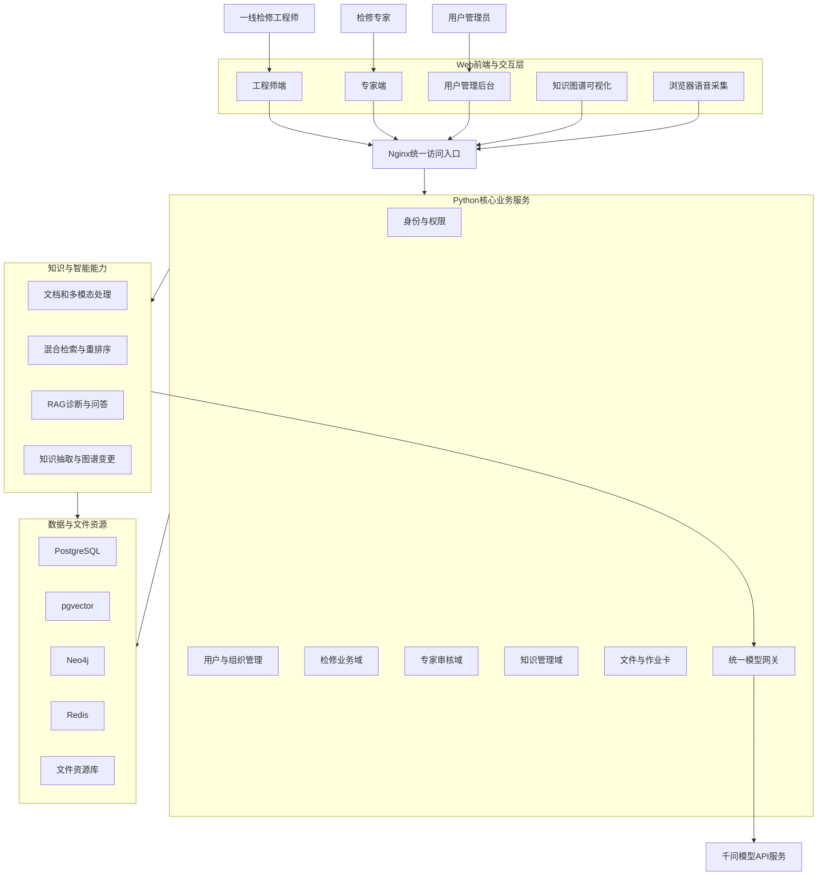
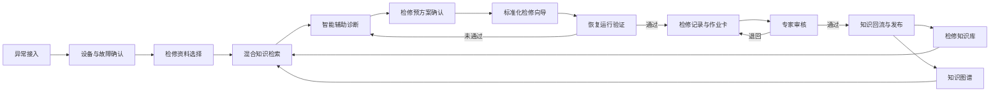
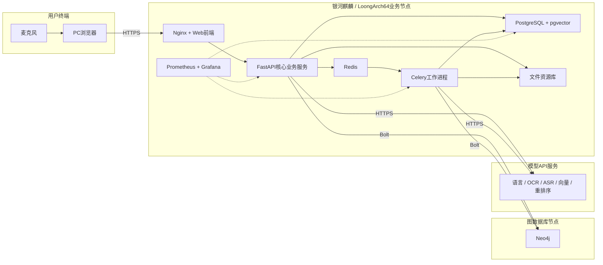

# 工控设备智能检修与知识作业系统

# 软件功能设计文档

## 文档信息

| 项目 | 内容 |
| --- | --- |
| 软件名称 | 工控设备智能检修与知识作业系统 |
| 文档名称 | 软件功能设计文档 |
| 软件版本 | V1.0 |
| 文档版本 | V0.2（初稿） |
| 编制日期 | 2026年7月15日 |
| 文档状态 | 编制中 |

## 修订记录

| 版本 | 日期 | 修订内容 |
| --- | --- | --- |
| V0.1 | 2026-07-15 | 建立功能设计文档并完成系统总体设计 |
| V0.2 | 2026-07-15 | 增加用户管理员后台并更新总体设计 |

---

## 1. 引言

### 1.1 编写目的

本文档说明“工控设备智能检修与知识作业系统”的软件功能实现方案，明确系统架构、模块职责、业务对象、处理流程、数据组织、接口协作、安全控制和异常处理机制，为软件开发、功能测试、产品交付和后续维护提供统一设计依据。

本文档承接《软件功能需求分析文档》中已经确定的功能范围，重点回答各项功能如何组织和实现，不重复展开项目建设必要性，也不替代用户操作说明、功能测试结果和安装部署步骤。

### 1.2 项目概述

本系统面向工业现场检修工程师、检修专家和用户管理员，以现场异常为业务起点，组织设备信息、多模态材料、检修资料和运行参数，完成辅助诊断、检修预方案、步骤化作业、恢复验证、专家审核、记录归档和知识更新，并通过独立用户管理后台维护账号、角色和组织归属。

系统围绕以下业务闭环进行设计：

> 工业现场异常接入 → 设备与故障识别 → 检修资料与知识检索 → 智能辅助诊断 → 步骤化检修 → 恢复运行验证 → 专家审核 → 检修记录与作业卡输出 → 案例、知识和图谱回流。

系统以工业计算设备为首期应用对象，通过设备目录、检修知识库和知识图谱扩展设备品牌、型号、部件和故障领域。

### 1.3 设计范围

本文档设计范围包括：

- 面向工程师的异常接入、资料选择、辅助诊断、检修向导、恢复验证、检修记录和作业卡功能；
- 面向专家的任务审核、知识维护、知识图谱维护和知识发布功能；
- 面向用户管理员的账号统计、查询筛选、新增编辑、组织归属、启停和密码重置功能；
- 支撑业务功能的文件处理、语音输入、OCR、语音转写、知识检索、模型调用和PDF生成能力；
- PostgreSQL、pgvector、Neo4j和文件资源库之间的数据组织与协作；
- 身份认证、操作审计、异常恢复、运行监控和扩展机制。

具体安装命令、端口配置、初始化步骤、备份命令和卸载方法由《软件安装包及部署文档》说明；实际测试过程和测试结论由《软件功能测试报告》记录。

### 1.4 设计依据

本设计主要依据以下资料：

- 中国软件杯大学生软件设计大赛A1赛题要求；
- 《软件功能需求分析文档》；
- 《目标技术架构基线》；
- 工业计算设备用户手册、安装手册和维护资料；
- 系统检修知识库、典型案例和知识图谱内容；
- LoongArch64和银河麒麟目标运行环境要求。

### 1.5 术语和缩略语

| 术语 | 说明 |
| --- | --- |
| 异常事件 | 对现场设备异常现象、发生时间、位置、材料和运行参数的统一记录 |
| 检修任务 | 由异常事件发起并贯穿诊断、检修、验证、审核和归档的业务对象 |
| 检修资料包 | 工程师为当前任务选择的手册、案例、知识条目和历史记录集合 |
| 检修预方案 | 系统根据诊断结果和知识依据形成、等待工程师确认的检修阶段及步骤 |
| 当前步骤追问 | 工程师围绕检修向导当前步骤提出的文字或语音问题 |
| 语音输入 | 将用户主动采集的短时语音识别为可编辑文字的输入方式 |
| 音频材料 | 作为设备异响或现场事实证据接入检修任务并按任务生命周期保存的音频文件 |
| 用户管理员 | 负责工程师和专家账号、角色、组织归属及启停状态的独立管理角色 |
| 知识条目 | 从手册、案例或检修记录中形成的结构化检修知识单元 |
| 知识回流 | 将完成并审核通过的检修经验转化为案例、知识条目和图谱关系的过程 |
| RAG | 检索增强生成，将检索到的知识证据与业务上下文共同提供给模型生成回答 |
| SSE | Server-Sent Events，用于服务端向浏览器连续推送智能问答内容 |

---

## 2. 设计目标与原则

### 2.1 设计目标

系统设计需要达到以下目标：

1. 将异常接入、诊断、检修、验证、审核和知识沉淀组织为连续业务流程；
2. 统一处理文字、语音、图片、视频、音频、设备资料和运行参数；
3. 使智能诊断和检修问答能够引用设备手册、历史案例、知识条目和知识图谱关系；
4. 通过标准步骤、安全约束、人工确认和专家审核控制检修过程质量；
5. 自动形成结构一致、可查询、可打印和可追溯的检修记录与PDF作业卡；
6. 支持知识内容和图谱关系的新增、修改、审核、发布与版本追踪；
7. 支持LoongArch64与银河麒麟环境下的安装、运行、监控和维护；
8. 支持后续扩展新的设备、故障领域、资料类型、模型服务和检修流程。

### 2.2 设计原则

#### 2.2.1 业务闭环驱动

系统模块围绕检修任务组织。页面状态、智能能力、文件材料和知识引用均与具体任务或知识变更对象关联，避免形成相互孤立的功能入口。

#### 2.2.2 人机协同

模型负责资料提取、知识检索、故障分析和内容组织，工程师负责确认现场事实、检修方案和操作结果，专家负责审核检修结论和知识更新。模型生成内容不得直接替代现场人员完成危险操作或责任确认。

#### 2.2.3 来源可追溯

诊断建议、检修步骤和问答结果应保留引用资料、适用范围和业务上下文。知识条目及图谱关系保留来源、版本、审核和发布时间。

#### 2.2.4 模块化单体

核心业务后端采用模块化单体架构，在统一FastAPI应用中按业务域划分模块。文档解析、向量化和多媒体处理等耗时能力通过异步任务执行，减少分布式系统复杂度。

#### 2.2.5 数据分工存储

PostgreSQL保存结构化业务数据，pgvector保存知识片段的向量索引，Neo4j保存知识节点和关系，文件资源库保存原始资料、现场材料及导出文件。各类数据通过稳定业务标识关联。

#### 2.2.6 智能能力可替换

语言、视觉、语音、向量和重排序模型通过统一模型网关接入，业务模块不直接绑定厂商请求格式，便于调整模型版本或替换服务实现。

#### 2.2.7 安全与最小留存

系统按照工程师、专家和用户管理员三类固定角色控制访问权限，对关键操作形成审计记录。用户管理员不继承专家的专业内容权限；麦克风、上传文件和模型凭据按最小权限使用；短时语音输入完成识别后不作为检修附件长期保存。

### 2.3 设计约束

- 系统采用B/S架构，主要功能通过PC浏览器访问；
- 核心业务部署目标为LoongArch64处理器和银河麒麟高级服务器操作系统；
- 系统需要适应离线安装和业务网络受限的交付环境；
- 外部模型API不可用时，常规业务数据和已经发布的知识仍应可访问；
- 设备专用参数、接线方式和拆装步骤必须标明适用型号和资料来源；
- Neo4j的具体部署节点须依据LoongArch64兼容性专项验证结果确定；
- 浏览器语音输入依赖用户授权麦克风，拒绝授权时必须保留键盘输入路径；
- 涉及断电、拆装、挂牌和恢复上电的步骤必须保留安全提示与人员确认。

---

## 3. 系统总体设计

### 3.1 系统功能组成

系统功能划分为工程师业务域、专家业务域、用户管理域、知识管理域、智能能力域和运行保障域。六个功能域通过统一的用户身份、检修任务、知识标识和操作审计进行关联。

| 功能域 | 主要模块 | 主要使用者 | 主要输入 | 主要输出 |
| --- | --- | --- | --- | --- |
| 工程师业务域 | 工程师工作台、异常接入、设备确认、资料选择、辅助诊断、检修预方案、检修向导、恢复验证、检修记录、作业卡 | 一线检修工程师 | 现场描述、语音输入、多模态材料、设备信息、运行参数和操作结果 | 诊断建议、确认方案、检修过程、恢复结论、检修记录和PDF作业卡 |
| 专家业务域 | 专家工作台、检修审核、专家会诊、结论修正和知识发布 | 检修专家 | 待审核任务、检修事实、诊断依据、执行步骤和恢复结果 | 审核意见、修正结论、发布决定和知识更新意见 |
| 用户管理域 | 用户统计、查询筛选、新增编辑、组织归属、账号启停、密码重置和操作审计 | 用户管理员 | 用户资料、固定角色、场站班组、机构专业方向和账号状态 | 用户账号、权限边界、组织归属、状态变化和审计记录 |
| 知识管理域 | 检修知识库、资料解析、知识条目、知识图谱、知识回流和版本管理 | 检修专家 | 设备手册、历史案例、检修记录、专家知识和图谱变更 | 可检索知识、图谱节点关系、来源信息和知识版本 |
| 智能能力域 | OCR、语音识别、多模态理解、向量化、混合检索、重排序、RAG问答和知识抽取 | 业务模块调用 | 业务上下文、材料内容、知识片段和模型请求 | 识别文本、检索结果、诊断建议、问答内容和知识候选 |
| 运行保障域 | 基础配置、文件规则、模型配置、日志、监控、备份和版本维护 | 系统部署与运维过程 | 配置变更、运行指标、日志和备份任务 | 配置状态、健康状态、运行日志和备份结果 |

工程师业务域是系统的主要作业入口；专家业务域负责质量控制；用户管理域维护人员账号和访问资格；知识管理域为检修过程提供依据并接收检修结果回流；智能能力域向各业务模块提供统一服务；运行保障域保证系统可配置、可观测和可维护。用户管理域属于产品后台功能，运行保障域属于系统运行机制，二者不共享业务权限。

### 3.2 总体逻辑架构

系统采用前后端分离的B/S架构。前端负责业务页面、图谱可视化、交互状态和浏览器语音采集；Nginx提供统一访问入口；Python核心业务服务承载检修业务规则；智能检索和多模态处理能力通过应用服务及异步任务协作；数据按业务、向量、图关系和文件类型分别存储。

逻辑架构中的主要调用方向如下：

1. 浏览器通过Nginx访问前端资源和后端接口；
2. 核心业务服务完成身份校验、业务规则判断、事务处理和任务状态管理；
3. 耗时的资料解析、向量化、多媒体处理和PDF生成工作提交至异步任务；
4. 智能检索服务组合业务条件、关键词、向量和图关系进行知识召回；
5. 统一模型网关调用语音、OCR、向量、重排序和大语言模型API；
6. 智能输出返回业务服务，由业务服务补充来源、状态和权限信息后提供给前端；
7. 经工程师或专家确认的数据才进入后续业务阶段或正式知识版本。

### 3.3 系统分层设计

系统按照表现、接口、应用、领域、智能能力、基础设施和数据七个层次组织。上层只能通过明确接口使用下层能力，核心业务规则不写入页面组件、模型提示模板或数据库脚本。

| 层次 | 主要组成 | 设计职责 | 禁止承担的职责 |
| --- | --- | --- | --- |
| 表现层 | Vue 3页面、Ant Design Vue组件、Cytoscape.js、ECharts | 页面展示、用户输入、交互状态、图谱操作和浏览器媒体采集 | 不直接访问数据库，不决定审核和发布结果 |
| 接口层 | FastAPI路由、Pydantic请求响应模型、JWT依赖 | 接收请求、身份校验、参数校验、结果序列化和错误转换 | 不直接编排复杂业务流程 |
| 应用服务层 | 检修任务、资料选择、诊断、向导、审核、知识发布等应用服务 | 编排用例、控制事务、调用领域服务和基础设施 | 不包含前端展示逻辑和厂商模型请求格式 |
| 领域服务层 | 状态转换、步骤规则、安全约束、审核规则和知识发布规则 | 实现稳定业务规则与领域校验 | 不依赖具体Web框架和页面组件 |
| 智能能力层 | 多模态处理、混合检索、RAG、知识抽取和模型网关 | 提供识别、检索、生成和抽取能力 | 不替代工程师及专家完成责任确认 |
| 基础设施层 | SQLAlchemy、Neo4j驱动、Celery、Redis、文件服务、PDF服务和HTTP客户端 | 实现数据库、队列、文件、外部服务和模板渲染适配 | 不定义业务状态合法性 |
| 数据层 | PostgreSQL、pgvector、Neo4j和文件资源库 | 持久化业务数据、向量、图关系和文件 | 不通过数据库触发器编排完整业务流程 |

前端状态用于反馈当前交互过程，后端状态是业务事实的唯一依据。例如，语音按钮的“录音中”属于前端媒体状态，而检修任务的“执行中”必须由后端任务状态确定。

### 3.4 功能模块关系

#### 3.4.1 主业务链路

系统以异常事件和检修任务作为主线。异常接入形成异常事件，经设备信息确认后创建或更新检修任务；资料选择和知识检索为诊断提供依据；诊断结论经确认后形成检修预方案；向导记录每个步骤的执行结果；恢复验证决定任务是否具备闭环条件；任务完成后生成记录和作业卡。

#### 3.4.2 语音能力关系

语音输入、音频材料和语音播报使用不同处理链路：

- 首页语音输入将短时语音识别为异常描述文字，用户确认后进入异常事件；
- 检修智能体语音输入将短时语音识别为追问文字，用户确认后进入当前步骤问答；
- 音频材料保存原始录音及其转写内容，作为现场事实和诊断证据；
- 检修步骤语音播报读取已经确认的步骤文字，不改变步骤内容和完成状态。

#### 3.4.3 专家审核关系

专家审核读取异常事实、资料引用、诊断建议、方案修改、步骤记录、处理措施和恢复参数。审核通过后允许任务归档并产生知识候选；审核退回时保留原提交版本和审核意见，由工程师补充后再次提交。

#### 3.4.4 知识回流关系

知识回流从已完成且审核通过的检修记录中提取案例摘要、故障现象、原因、诊断方法、处置措施和验证结果。候选内容进入专家审核，不直接覆盖已发布知识。发布后同时更新知识条目、向量索引和图谱关系，并保留同一变更批次标识。

#### 3.4.5 用户管理关系

用户管理员通过独立后台访问用户管理模块。用户列表从统一用户数据读取，并根据角色显示不同组织字段：工程师关联场站和班组，专家关联机构和专业方向。新增或编辑操作先完成必填项、登录账号唯一性和角色字段校验，再写入用户数据及审计记录；停用账号后阻止其建立新的登录会话；密码重置形成独立安全事件。用户管理模块不调用检修审核、知识发布和图谱编辑服务。

### 3.5 技术架构

系统采用已经确认的目标技术架构。各项技术与功能设计的对应关系如下。

| 技术范围 | 目标技术 | 在功能设计中的用途 |
| --- | --- | --- |
| Web前端 | Vue 3、TypeScript、Vite、Ant Design Vue | 工程师端、专家端和用户管理后台页面及交互 |
| 前端状态与路由 | Pinia、Vue Router | 用户会话、路由权限和跨页面任务状态 |
| 图谱与数据可视化 | Cytoscape.js、Apache ECharts | 知识图谱交互和业务统计图表 |
| 浏览器语音采集 | MediaDevices、MediaRecorder | 异常描述和当前步骤追问的短时语音采集 |
| 统一入口 | Nginx | 静态资源、反向代理和访问控制 |
| 身份与用户管理 | 账号密码、JWT、固定角色 | 三类用户登录、工作区隔离、账号状态和用户资料管理 |
| 核心业务后端 | Python 3.12、FastAPI、Pydantic | 业务接口、输入输出校验和模块编排 |
| 数据访问与迁移 | SQLAlchemy 2.x、Alembic | PostgreSQL事务访问和数据库版本迁移 |
| 异步任务 | Celery、Redis | 文档解析、向量化、多媒体处理和PDF生成 |
| 业务与向量数据 | PostgreSQL、pgvector | 业务对象、知识元数据及1024维语义向量 |
| 图关系数据 | Neo4j、Cypher、Neo4j Python驱动 | 知识图谱节点、关系、路径查询和变更管理 |
| 文件资源 | 本地受控文件资源库 | 手册、案例附件、现场材料、临时文件和PDF |
| 文档和媒体处理 | pypdf、pdfplumber、Office解析组件、FFmpeg | 文档内容提取、格式处理和音视频预处理 |
| 智能模型 | qwen3.7-plus、qwen3.5-ocr、qwen3-asr-flash、text-embedding-v4、qwen3-rerank | 诊断问答、OCR、语音识别、向量化和重排序 |
| RAG与模型接入 | LangChain Core、OpenAI Python SDK、DashScope Python SDK | 检索链组织、模型调用和结构化输出 |
| 外部请求与配置 | httpx、Tenacity、pydantic-settings | 模型请求、超时重试和环境配置 |
| PDF输出 | Jinja2、WeasyPrint、思源黑体、思源宋体 | 检修作业卡模板渲染和中文PDF生成 |
| 服务与监控 | Uvicorn、systemd、structlog、Prometheus、Grafana | 服务运行、结构化日志、指标采集和状态看板 |
| 自动化测试 | pytest、Playwright | 后端、接口及关键业务流程验证 |

技术组件的固定版本、安装来源和目标环境兼容性由部署设计及实际验证结果确定，不改变本章定义的模块职责和调用边界。

### 3.6 运行拓扑概述

系统采用以LoongArch64业务节点为核心的服务化运行形态。浏览器负责用户交互和受控媒体采集；业务节点运行Web入口、核心业务、异步任务、关系数据库、缓存、文件服务和监控组件；Neo4j根据兼容性验证结果部署在业务节点或独立兼容节点；模型能力通过统一网关访问千问API服务。

运行拓扑遵循以下边界：

- 浏览器不直接连接数据库、图数据库或模型服务；
- 所有业务访问统一经过Nginx和FastAPI完成认证、授权及审计；
- 用户管理员只访问用户管理接口，前端菜单隔离与后端权限校验同时生效；
- Celery工作进程只处理后端创建的异步任务，不作为用户直接访问入口；
- PostgreSQL、Neo4j和文件资源库使用同一业务标识和备份批次建立关联；
- 外部模型API调用集中通过统一模型网关执行，不向浏览器暴露模型凭据；
- Neo4j在LoongArch64上的原生部署未经验证前，可部署于独立兼容节点，不影响上层功能设计；
- 受限网络环境应允许通过配置限定模型服务访问地址，并对不可用状态给出明确反馈；
- systemd负责后端、工作进程和相关服务的启动、停止、重启及开机自启。
