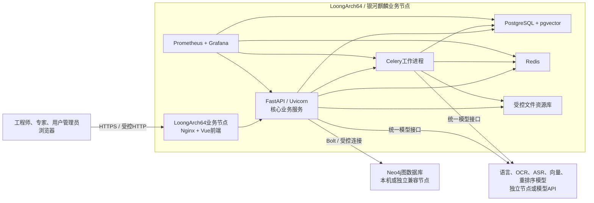
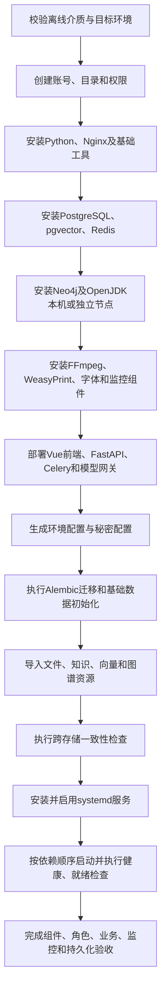

# 工控设备智能检修与知识作业系统

# 软件安装包及部署文档

## 文档信息

| 项目 | 内容 |
| --- | --- |
| 文档名称 | 软件安装包及部署文档 |
| 软件名称 | 工控设备智能检修与知识作业系统 |
| 文档版本 | V1.0 |
| 文档状态 | 完整送审稿，待最终安装包参数与目标机验证结果回填 |
| 编制日期 | 2026年7月18日 |
| 目标平台 | LoongArch64、银河麒麟 V10 系列 |
| 部署形态 | 目标架构组件随包交付、离线一体化部署 |

## 编写与使用边界

1. 本文档面向最终参赛交付版本，所有部署章节均以目标技术架构为主线。
2. 正式安装包使用 LoongArch64 离线交付介质，包含应用、运行环境、离线依赖、数据组件、监控组件、配置模板、初始化资源和维护脚本；标准安装过程不得临时访问外部系统软件源。
3. 统一模型网关、模型调用适配器、配置模板和检查工具随包部署；千问语言、OCR、ASR、向量化和重排序能力通过模型 API 或独立推理节点提供，不把外部模型服务表述为业务节点本地已安装组件。
4. Neo4j 是正式系统的图数据库。安装包包含相应部署资源、配置模板、模式和初始化内容；最终采用 LoongArch64 原生部署还是独立兼容节点部署，由固定版本专项验证结论决定。
5. 本文档中的组件固定版本、硬件容量、安装包文件名、SHA-256、服务名和部分端口在最终安装介质冻结后统一回填。未冻结内容集中标记，不以未经验证的数值代替实际结论。
6. 当前研发或演示实现不作为本文档的正式部署对象。最终安装包、目标机实测和软件功能测试报告是正式命令与结果的最终校准依据。
7. 涉及覆盖、迁移、恢复、删除、卸载和进程停止的操作必须先确认目标、形成备份或回退点，并在操作后执行验证。

---

## 1. 引言

### 1.1 编写目的

本文档用于说明“工控设备智能检修与知识作业系统”最终参赛交付版本的安装包组成、运行环境、部署拓扑、安装配置、数据初始化、服务管理、部署验收和运行维护方法，为比赛现场部署、软件验收、故障恢复和版本维护提供统一操作依据。

本文档重点解决以下问题：

- 如何识别并校验收到的正式离线安装介质；
- 如何确认 LoongArch64、银河麒麟目标环境满足部署条件；
- 如何在不访问外部系统软件源的情况下安装全部随包组件；
- 如何配置 Nginx、FastAPI、Celery、PostgreSQL、pgvector、Redis、Neo4j、文件资源库和监控组件；
- 如何安全提供数据库、JWT、会话和模型访问凭据；
- 如何初始化业务数据、知识库、向量索引、图谱和文件资源；
- 如何按依赖关系启动、停止、重启和检查系统；
- 如何验证三类角色、完整检修闭环、智能能力、作业卡、监控和持久化；
- 如何进行日志检查、数据备份、恢复演练、版本升级、失败回退和安全卸载。

文档完成后，具备相应 Linux 运维基础的部署人员应能够仅依靠正式安装介质和本文档，在目标环境中独立完成系统部署并形成可追溯的验收记录。

### 1.2 软件概述

“工控设备智能检修与知识作业系统”面向工业现场检修工程师、检修专家和用户管理员，以现场设备异常为业务起点，组织设备信息、多模态现场材料、厂商手册、检修知识、历史案例和运行参数，辅助完成设备与故障识别、智能诊断、检修预方案、步骤化作业、恢复运行验证、检修记录、作业卡、专家审核和知识更新。

系统采用 B/S 架构。用户通过浏览器访问统一入口；前端负责工程师端、专家端、用户管理后台、知识库和知识图谱交互；核心业务服务负责身份、权限、状态、任务、审核和知识发布；异步任务负责文档解析、OCR、语音转写、向量化、多媒体处理和 PDF 生成；PostgreSQL、pgvector、Neo4j 和文件资源库分别保存业务、向量、图关系和原始文件数据。

系统的核心业务闭环为：

> 工业现场异常接入 → 设备与故障确认 → 检修资料与知识检索 → 智能辅助诊断 → 检修预方案 → 标准化检修向导 → 恢复运行验证 → 检修记录与作业卡 → 专家审核 → 案例、知识和图谱回流。

本项目以 ACP-4000 / IPC-610 散热异常作为内容最完整的典型案例，同时通过多品牌厂商手册、知识条目、历史案例和知识图谱覆盖供电、存储、启动、显示、通信、配置、环境和监控告警等其他故障领域。

### 1.3 文档范围

本文档覆盖：

- 正式离线安装包及其配套交付物；
- 单业务节点和多节点部署拓扑；
- LoongArch64、银河麒麟 V10 系列目标环境；
- 前端、统一接入、核心后端、异步任务、业务数据库、向量检索、缓存消息、图数据库、文件资源、模型网关、PDF、音视频和监控组件；
- 安装包校验、解压、组件安装、配置、数据库迁移和初始数据导入；
- 服务启动、停止、重启、状态、健康和就绪检查；
- 部署后技术验收、角色验收、业务闭环验收和智能能力验收；
- 运行日志、指标、告警、容量、配置变更和日常巡检；
- PostgreSQL、Neo4j、文件资源库和配置的统一备份与恢复；
- 应用、组件、数据库模式、知识和图谱版本的升级及回退；
- 常见故障、安全卸载、数据保留和现场清理。

本文档不展开软件功能需求论证、源代码模块设计、普通用户操作说明和功能测试用例。上述内容分别由《软件功能需求分析文档》《软件功能设计文档》《软件产品说明书》和《软件功能测试报告》承担。

### 1.4 适用部署场景

#### 1.4.1 比赛现场正式部署

在 LoongArch64、银河麒麟目标机上使用完整离线介质部署系统，完成目标组件安装、初始化和核心业务验收。这是本文档的主要适用场景。

#### 1.4.2 赛前目标环境验证

在与比赛环境相同或经批准的等效环境中重复执行安装、升级、备份恢复、回退和卸载，验证组件兼容性、资源占用和操作可重复性。

#### 1.4.3 受限网络部署

业务节点不能访问公共软件源，只允许用户浏览器访问和受控的模型服务出站连接。安装所需组件、运行依赖和工具全部来自正式离线介质。

#### 1.4.4 完全隔离部署

当目标环境完全不能连接外部模型 API 时，基础业务、知识浏览、历史案例、图谱和本地数据管理仍按最终降级方案运行；需要模型能力的操作明确提示服务不可用或连接经批准的独立推理节点。完全隔离模式支持到何种业务深度，以最终模型部署方案和功能测试结果为准。

### 1.5 读者对象

| 读者 | 主要职责 | 建议重点章节 |
| --- | --- | --- |
| 现场部署人员 | 校验介质、安装组件、配置节点、初始化和启动 | 第2—12章及附录A—J |
| 系统运维人员 | 服务控制、日志、监控、备份、恢复和故障处理 | 第11—17章及附录F—K |
| 数据库管理员 | PostgreSQL、pgvector、Neo4j的账号、迁移和数据保护 | 第7、9、10、14、15章 |
| 安全与网络人员 | TLS、端口、防火墙、秘密、账号与访问控制 | 第4、5、9、17章及附录C—E |
| 项目交付人员 | 交付物、版本、安装记录、验收和回退协调 | 第2、5、12、15章及附录H—K |
| 比赛评委与验收人员 | 核对目标架构、平台适配、部署结果和业务可用性 | 第2、4、12、18章 |

### 1.6 术语与缩略语

| 术语 | 说明 |
| --- | --- |
| 业务节点 | 运行Nginx、前端、FastAPI、Celery、PostgreSQL/pgvector、Redis、文件资源和监控等核心组件的LoongArch64节点 |
| 图数据库节点 | 运行Neo4j的节点，可以与业务节点合并，也可以是独立兼容节点 |
| 模型节点 | 提供语言、视觉、OCR、ASR、向量化和重排序能力的独立推理节点或外部API服务 |
| 离线安装介质 | 包含目标架构应用、组件、依赖、配置、初始化资源、维护脚本和校验清单的完整交付物 |
| 组件锁定清单 | 记录第三方组件名称、版本、架构、来源、许可证和校验值的清单 |
| 业务就绪 | 进程存活且全部关键依赖可用，系统能够安全接收业务请求的状态 |
| 数据迁移 | 使用Alembic等受控机制将数据库模式和必要数据升级到目标版本的过程 |
| 知识初始化 | 导入厂商手册、知识条目、历史案例、片段和向量索引的过程 |
| 图谱初始化 | 在Neo4j中创建约束、索引、节点、关系和图谱版本的过程 |
| 文件资源库 | 保存厂商手册、现场材料、解析结果和导出文件的受控本地存储 |
| 备份批次 | 对PostgreSQL、Neo4j、文件资源和配置使用同一编号建立的一组一致性备份 |
| RPO | 恢复点目标，表示可接受的数据丢失时间范围 |
| RTO | 恢复时间目标，表示系统恢复到可用状态的目标时长 |
| 就绪检查 | 判断应用及其关键依赖是否能够接收新业务的检查 |
| 健康检查 | 判断组件进程和基础功能是否正常的检查 |
| 回退 | 升级或变更失败后，将应用、数据和配置恢复到同一已验证版本的过程 |

### 1.7 参考资料

| 资料 | 主要用途 |
| --- | --- |
| 《比赛文档编写注意事项》 | 统一五份比赛文档的范围、语言和交付要求 |
| 《软件功能需求分析文档》 | 确认平台、功能、角色、非功能和验收要求 |
| 《目标技术架构基线》 | 确认技术栈、组件职责、目标平台和部署形态 |
| 《软件功能设计文档》 | 确认模块、数据、接口、安全、异常、监控和备份设计 |
| 《软件产品说明书》 | 确认用户入口、标准操作流程和部署后业务验收路径 |
| 《软件功能测试报告》 | 确认被测版本、目标环境、测试范围、执行结果和限制 |
| 最终安装包版本与组件清单 | 确认实际交付文件、组件版本、构建信息和校验值 |
| 固定版本组件官方文档 | 校准具体安装、配置、备份恢复和兼容性命令 |

---

## 2. 最终交付物与部署方案

### 2.1 交付目标

最终软件以 LoongArch64 离线安装介质交付。交付物应做到版本唯一、组件完整、来源可追溯、安装过程无外部软件源依赖、默认配置不包含生产秘密，并支持环境检查、安装、初始化、服务控制、健康检查、备份恢复、升级回退和安全卸载。

正式交付应同时满足以下要求：

1. **可识别。** 安装包名称、产品版本、完整提交哈希、构建时间和目标架构明确。
2. **可校验。** 主包和关键组件均有SHA-256，能够发现传输损坏和文件缺失。
3. **可离线安装。** 运行时、系统组件安装资源、Python依赖、字体和工具均来自安装介质。
4. **可配置。** 默认模板与现场配置分离，秘密由部署阶段安全生成或注入。
5. **可初始化。** 数据库模式、基础账号、知识、向量、图谱和文件资源具有受控初始化流程。
6. **可运维。** 各服务由systemd管理，具有状态、日志、健康、监控、备份和恢复手段。
7. **可升级回退。** 新版本安装和迁移前建立统一备份批次，失败时可以整体回退。
8. **可验收。** 部署后能够验证全部关键组件、三类角色、核心业务闭环和数据持久化。

### 2.2 正式交付物组成

| 交付物 | 内容 | 主要作用 | 完整性要求 |
| --- | --- | --- | --- |
| 主离线安装包 | 应用、运行时、组件资源、配置、初始化数据、字体、脚本和文档 | 在目标环境完成一体化部署 | 文件名、版本、架构和总校验值明确 |
| 主包校验文件 | 主安装包SHA-256 | 验证传输和介质完整性 | 文件名与主包严格对应 |
| 组件锁定清单 | 组件版本、架构、来源、许可证、文件及校验值 | 固定软件物料清单 | 与包内文件逐项一致 |
| 文件总清单 | 包内相对路径、大小、类型和校验值 | 验证解压后文件完整性 | 安装前后均可复核 |
| 第三方许可证 | 组件与字体许可证及分发说明 | 满足第三方软件交付要求 | 覆盖全部随包第三方内容 |
| 版本说明 | 产品版本、提交、构建、模式、知识和图谱版本 | 建立应用与数据追溯关系 | 与安装包及测试报告一致 |
| 初始化资源 | 数据库迁移、基础数据、知识、向量、图谱和文件资源 | 建立可用初始系统 | 有版本、数量、来源和校验信息 |
| 配置模板 | 应用、数据库、Redis、Neo4j、Nginx、模型和监控配置 | 按现场环境生成正式配置 | 不包含默认生产秘密 |
| 服务配置 | systemd单元、Nginx配置、日志轮转和监控配置 | 管理服务与运行状态 | 服务依赖和运行账号明确 |
| 运维脚本 | 检查、安装、配置、初始化、启停、备份、恢复、升级、回退、卸载 | 标准化高风险操作 | 有明确退出码和安全检查 |
| 部署文档 | 本文档及必要速查表 | 指导部署、验收与维护 | 命令与最终介质一致 |

最终安装包文件名、大小和SHA-256在安装介质冻结后填写至附录A和附录J。交付时不得只提供主包而缺少校验文件、组件清单或许可证资料。

### 2.3 随包组件范围

| 组件域 | 目标组件 | 安装位置 | 主要职责 |
| --- | --- | --- | --- |
| Web前端 | Vue 3、TypeScript、Vite生产构建、Ant Design Vue、Cytoscape.js、ECharts | 业务节点，由Nginx托管 | 工程师端、专家端、用户管理后台、知识与图谱交互 |
| 统一入口 | Nginx | 业务节点 | TLS、静态资源、API/SSE代理、文件访问和安全控制 |
| 核心业务 | Python 3.12、FastAPI、Pydantic、SQLAlchemy、Alembic、Uvicorn | 业务节点 | 身份、权限、检修流程、记录、审核、知识与接口 |
| 异步任务 | Celery | 业务节点 | 文档解析、向量化、多媒体处理、知识抽取和PDF任务 |
| 缓存与消息 | Redis | 业务节点 | Celery消息、短期缓存、任务状态和会话辅助 |
| 业务与向量数据 | PostgreSQL、pgvector | 业务节点 | 结构化业务数据、知识元数据、审计和1024维向量 |
| 图关系数据 | Neo4j、OpenJDK、Neo4j Python驱动 | 业务节点或独立兼容节点 | 知识图谱节点、关系、路径查询和图谱版本 |
| 文件资源 | 受控本地文件资源库 | 业务节点的数据目录 | 手册、现场材料、解析结果、导出文件和作业卡 |
| 文档与媒体 | pypdf、pdfplumber、python-docx、openpyxl、python-pptx、FFmpeg | 业务节点 | 文档提取、音视频转换和音频提取 |
| PDF生成 | Jinja2、WeasyPrint、思源黑体、思源宋体 | 业务节点 | 两页A4检修作业卡渲染与导出 |
| 模型接入 | 统一模型网关、OpenAI/DashScope客户端、httpx、Tenacity、LangChain Core | 业务节点 | 模型协议适配、超时、重试、降级和RAG编排 |
| 运行监控 | Prometheus、Grafana | 业务节点或受控监控节点 | 指标采集、状态看板和告警 |
| 服务管理 | systemd、日志轮转配置 | 业务节点及图数据库节点 | 启停、重启、开机自启、日志和资源限制 |

“随包组件”表示安装介质提供应用构建、离线依赖、安装资源或经批准的可再分发组件包。若个别系统组件因许可证只能由目标系统介质提供，必须在交付清单中明确来源、固定版本、离线取得方式和校验要求，不得在现场临时联网搜索或下载。

### 2.4 目标部署拓扑

系统以 LoongArch64 业务节点为核心，用户只访问 Nginx 统一入口。业务节点承载前端、核心业务、异步任务、关系与向量数据、缓存消息、文件资源和监控。Neo4j 根据目标平台兼容性部署在业务节点或独立兼容节点。模型能力通过统一模型网关访问外部API或独立推理节点。



部署拓扑遵循以下约束：

- 浏览器不直接访问Uvicorn、PostgreSQL、Redis或Neo4j；
- 所有业务请求经Nginx进入FastAPI并执行认证、授权和审计；
- Celery只消费由业务服务创建的受控任务，不作为用户访问入口；
- PostgreSQL是业务状态、用户、权限、审核和知识元数据的主数据来源；
- pgvector与PostgreSQL共享知识元数据和业务标识；
- Neo4j保存图谱节点和关系，不能反向决定用户权限或业务任务状态；
- 文件资源必须先通过业务服务完成权限判断，再由受控接口或Nginx授权机制提供；
- 模型密钥只在业务节点或模型节点的秘密配置中提供，浏览器不接触模型凭据；
- 监控组件只读取必要指标，不取得业务写权限和秘密配置。

### 2.5 单节点部署方案

单节点方案将Nginx、前端、FastAPI、Celery、Redis、PostgreSQL/pgvector、文件资源、Prometheus、Grafana以及经验证可原生运行的Neo4j部署在同一LoongArch64节点。模型能力仍通过统一模型网关访问外部API或独立推理服务。

| 项目 | 说明 |
| --- | --- |
| 适用条件 | 目标机资源满足容量要求；全部组件完成LoongArch64兼容性验证；比赛希望减少节点和网络依赖 |
| 主要优点 | 部署拓扑简单；节点间网络配置少；离线交付和现场维护集中 |
| 主要风险 | CPU、内存、磁盘与I/O竞争集中；Neo4j和监控组件兼容性要求高；单节点故障影响全部本地能力 |
| 数据保护 | PostgreSQL、Neo4j和文件资源仍使用独立目录及统一备份批次，不因同机部署而混合存储 |
| 安全要求 | 数据库和队列仅监听本机或受控地址；只开放Nginx统一入口和必要运维访问 |

单节点方案只有在Neo4j、PostgreSQL/pgvector、Prometheus和Grafana等组件均通过LoongArch64、银河麒麟目标机安装和运行验证后，才可列为正式推荐方案。

### 2.6 多节点部署方案

多节点方案至少包含LoongArch64业务节点和独立Neo4j兼容节点；根据模型部署策略，还可以包含独立模型推理节点。业务节点仍承载Nginx、前端、FastAPI、Celery、Redis、PostgreSQL/pgvector、文件资源和监控入口。

| 节点 | 必需组件 | 可选组件 | 网络要求 |
| --- | --- | --- | --- |
| LoongArch64业务节点 | Nginx、前端、FastAPI、Celery、Redis、PostgreSQL/pgvector、文件资源、systemd | Prometheus、Grafana、模型网关代理 | 用户访问入口；到Neo4j和模型节点的受控出站连接 |
| Neo4j兼容节点 | Neo4j、OpenJDK、备份工具、systemd | Neo4j监控导出器 | 仅向指定业务节点开放Bolt和必要管理通道 |
| 模型推理节点 | 语言、视觉、OCR、ASR、向量、重排序接口 | 模型监控和限流网关 | 仅向业务节点开放统一模型接口 |

多节点部署必须满足：

1. 节点间系统时间和时区一致；
2. 节点地址、证书和DNS或主机名解析稳定；
3. Neo4j和模型端口只向指定业务节点开放；
4. 连接凭据通过秘密配置提供并支持轮换；
5. 节点中断时，业务服务能够区分依赖不可用和业务无数据；
6. 备份、升级和回退记录覆盖全部相关节点；
7. 监控能够识别节点间连接、延迟、错误和服务状态。

### 2.7 部署方案选择

| 选择条件 | 单节点方案 | 多节点方案 |
| --- | --- | --- |
| Neo4j可在LoongArch64稳定运行 | 可选 | 可选 |
| Neo4j无法在LoongArch64原生运行 | 不适用 | 必须使用兼容节点 |
| 目标机资源较充足 | 适合 | 适合 |
| 目标机资源有限但有额外节点 | 不建议承载全部组件 | 优先拆分Neo4j或模型能力 |
| 现场网络不稳定 | 本地组件依赖较少 | 必须额外保障节点间网络 |
| 部署维护人员较少 | 拓扑较简单 | 需要更完整的节点管理和证据记录 |

最终推荐拓扑在安装包冻结前确定，并在 `VERSION`、部署参数表、组件清单和软件功能测试报告中使用相同结论。若正式包同时支持两种拓扑，必须分别提供配置模板、安装命令和验收清单。

### 2.8 组件依赖关系

| 组件 | 直接依赖 | 依赖不可用时的状态 |
| --- | --- | --- |
| Nginx | 前端静态文件、FastAPI上游 | 静态资源缺失时安装失败；上游不可用时返回维护或服务不可用提示 |
| FastAPI | PostgreSQL、Redis、文件资源；按功能依赖Neo4j与模型网关 | 关键业务依赖未就绪时不进入业务就绪；可降级依赖明确提示 |
| Celery | Redis、PostgreSQL、文件资源；按任务依赖模型网关 | 不接收无法安全执行的任务；失败状态写回主数据 |
| PostgreSQL | 本地文件系统、服务账号 | 不可用时系统不接收业务写入 |
| pgvector | PostgreSQL及匹配扩展版本 | 向量检索不可用，知识元数据仍由PostgreSQL保护 |
| Redis | 本地文件系统、服务账号 | 异步任务、会话辅助和缓存能力受限，不得把缓存结果当正式事实 |
| Neo4j | OpenJDK、数据目录、网络或本机连接 | 图谱查询和发布受限；PostgreSQL正式业务状态保持可用 |
| 文件资源库 | 可写数据目录、磁盘空间、权限 | 上传、解析、下载和PDF归档功能受限 |
| 模型网关 | 网络、模型地址、凭据 | 智能诊断、OCR、ASR、向量化或重排序按功能降级并明确提示 |
| Prometheus/Grafana | 指标端点、数据目录 | 不影响业务事实，但必须产生监控不可用告警或运维记录 |

### 2.9 安装与初始化顺序

目标架构按照以下顺序部署：



安装脚本可以自动编排上述步骤，但必须保留每一步的日志、退出状态和失败组件。自动安装不得在某个关键组件失败后继续把系统标记为安装成功。

### 2.10 服务启动与停止顺序

#### 2.10.1 启动顺序

1. 检查目录、配置、秘密和端口；
2. 启动PostgreSQL、Redis和Neo4j；
3. 检查数据组件健康及数据库模式版本；
4. 启动FastAPI/Uvicorn；
5. 启动Celery工作进程及可选调度服务；
6. 启动Nginx并开放统一访问入口；
7. 启动Prometheus、Grafana及相关指标采集；
8. 执行综合健康、就绪和核心只读检查。

#### 2.10.2 停止顺序

1. 从Nginx或维护模式停止接收新的业务写入；
2. 停止创建新的异步任务；
3. 等待正在执行的Celery任务完成或安全转为可恢复状态；
4. 停止Nginx、Celery和FastAPI；
5. 确认无应用连接和未完成数据迁移；
6. 根据维护范围停止Neo4j、Redis和PostgreSQL；
7. 记录停止结果、未完成任务和数据状态。

普通应用重启不要求停止数据库和图数据库。只有系统维护、备份工具要求、版本升级或数据恢复时，才按完整顺序停止相应数据组件。

### 2.11 模型能力部署边界

安装包在业务节点部署统一模型网关和以下能力的调用适配：

| 能力 | 目标模型 | 主要用途 |
| --- | --- | --- |
| 语言与多模态理解 | qwen3.7-plus API | 智能问答、诊断分析、知识抽取、多模态理解 |
| OCR | qwen3.5-ocr API | 扫描资料、铭牌和现场图片文字识别 |
| ASR | qwen3-asr-flash API | 首页语音描述、检修追问和音频材料转写 |
| 向量化 | text-embedding-v4 API | 知识片段、案例片段和查询向量生成 |
| 重排序 | qwen3-rerank API | 混合召回结果相关性重排 |

部署文档只记录模型地址、名称、鉴权、超时、重试、限流、连通性和降级策略。模型密钥由部署人员通过秘密配置注入。若比赛环境使用本地或独立推理节点，只替换模型网关连接参数，不改变上层业务模块和数据流程。

模型服务不可用时，系统必须：

- 明确区分网络、鉴权、限流、超时和服务端错误；
- 不把预设演示文本伪装为实时模型成功结果；
- 保留用户已提交的业务事实和材料；
- 对可重试任务进入受控重试或待处理状态；
- 对不可恢复错误停止重试并给出运维提示；
- 不在错误响应和日志中暴露模型密钥或完整敏感输入。

### 2.12 Neo4j 部署策略

Neo4j的产品选型和上层数据职责已确定。部署位置按以下决策执行：

1. 固定Neo4j、OpenJDK和相关本地依赖版本；
2. 在LoongArch64、银河麒麟目标机验证安装、启动、Bolt连接、Cypher、事务、索引、备份和恢复；
3. 若全部关键项目通过，允许使用业务节点原生部署配置；
4. 若存在无法接受的兼容性、稳定性或许可证限制，使用独立兼容节点配置；
5. 无论采用哪种配置，FastAPI均通过相同的Neo4j适配层和环境配置连接；
6. PostgreSQL中的图谱变更集、发布状态和审计保持为正式业务依据；
7. Neo4j不可用时禁止图谱发布，但允许保存待发布变更和继续访问不依赖图谱的业务功能。

最终结论必须同时更新本文档的拓扑、安装步骤、端口、防火墙、备份、升级和验收章节。

### 2.13 访问与安全边界

- 用户浏览器只访问Nginx统一入口；
- 前后端同源部署，默认关闭不必要的CORS；
- 业务服务只信任明确配置的反向代理和主机名；
- PostgreSQL、Redis、Uvicorn和本机Neo4j不对用户网络开放；
- 独立Neo4j和模型节点只接受指定业务节点访问；
- 所有服务使用专用非登录账号运行，安装账号不作为长期业务服务账号；
- 数据库业务账号、迁移账号、备份账号和监控账号相互分离；
- JWT、会话、数据库和模型秘密在部署阶段生成或注入，不随普通配置模板交付；
- 日志、监控、安装输出和备份清单不记录密码、令牌、密钥和完整敏感材料；
- 上传文件、导出文件和厂商手册只能通过受控路径访问，不直接暴露服务器目录。

### 2.14 可用性与降级边界

| 故障组件 | 必须停止的能力 | 可继续的能力 | 恢复要求 |
| --- | --- | --- | --- |
| PostgreSQL | 登录、业务写入、任务、审核、知识发布 | 仅维护页面和静态错误说明 | 数据库恢复并通过模式和读写检查后恢复业务 |
| Redis | 新异步任务、依赖会话辅助的操作 | 已有正式业务数据的受控只读能力 | 队列、会话和任务状态检查通过 |
| Neo4j | 图谱发布、图查询和关系扩展检索 | PostgreSQL业务流程、知识元数据和文件访问 | Bolt、Cypher、版本和一致性检查通过 |
| 模型服务 | 对应模型推理、OCR、ASR、向量化或重排序 | 人工输入、已发布知识浏览和不依赖模型的业务操作 | 鉴权、连通性、最小调用和降级任务恢复通过 |
| 文件资源库 | 上传、下载、解析、PDF归档 | 不依赖文件的结构化业务查询 | 权限、空间、文件校验和读写检查通过 |
| Celery | 文档解析、媒体、向量、PDF等异步处理 | FastAPI同步业务和已完成结果查询 | 工作进程、队列积压和失败任务检查通过 |
| Prometheus/Grafana | 指标采集或可视化 | 核心业务可继续，但必须记录监控失效 | 采集目标、数据源和看板恢复 |

任何降级状态均必须显式显示，不得把依赖失败显示为“无数据”或“处理成功”。

### 2.15 版本与追溯要求

一次正式交付必须形成统一发布标识，并关联：

- 产品版本、构建编号和完整提交哈希；
- 主安装包文件名、大小和SHA-256；
- 组件锁定清单版本；
- PostgreSQL模式版本和Alembic修订；
- 基础数据版本；
- 知识数据和向量索引版本；
- Neo4j模式和图谱数据版本；
- 文件资源清单版本及校验值；
- 配置模板版本；
- 监控和systemd配置版本；
- 部署记录、备份批次和软件功能测试轮次。

部署、升级、备份和恢复记录均引用该统一发布标识。禁止只记录“最新版”或使用无法关联到安装包的模糊名称。

### 2.16 本章待冻结参数

以下内容在后续章节设计和目标机验证后统一回填：

| 项目 | 当前状态 | 冻结依据 |
| --- | --- | --- |
| 主安装包名称与格式 | 待冻结 | 最终打包方案和交付要求 |
| 各组件固定版本 | 待冻结 | LoongArch64兼容性及许可证核查 |
| 最低与推荐硬件配置 | 待验证 | 目标机容量与性能测试 |
| Neo4j最终部署位置 | 待验证 | 原生安装、运行、备份恢复专项测试 |
| Prometheus/Grafana部署位置 | 待冻结 | 目标机资源和兼容性测试 |
| 模型服务部署位置 | 待冻结 | 比赛网络、算力和模型接入方案 |
| 外部统一访问端口与TLS方式 | 待冻结 | 现场网络和证书方案 |
| systemd服务名称 | 待冻结 | 最终安装脚本与服务配置 |
| Celery队列和工作进程数量 | 待验证 | 任务规模与目标机资源测试 |
| 备份周期、RPO和RTO | 待确认 | 现场容量与保障要求 |

上述参数集中维护，不影响后续章节先完成操作结构、依赖关系和验收规则。最终定稿前必须关闭或明确保留全部待冻结与待验证项。

---

## 3. 安装包目录与文件说明

### 3.1 安装介质目录结构

正式交付介质采用单一发布根目录，根目录名称包含产品简称、产品版本、目标架构和构建编号。以下结构作为安装包规范，最终文件名在发布冻结后回填：

```text
<release-root>/
├── VERSION
├── MANIFEST.sha256
├── COMPONENTS.lock
├── INSTALLATION-GUIDE.md
├── LICENSES/
├── frontend/
│   ├── dist/
│   └── public-config.template.js
├── backend/
│   ├── app/
│   ├── alembic/
│   ├── alembic.ini
│   ├── requirements.lock
│   └── templates/
├── workers/
│   ├── celery/
│   ├── model-gateway/
│   └── task-policies/
├── runtimes/
│   ├── python/
│   ├── wheels/
│   └── java/
├── packages/
│   ├── os/
│   ├── nginx/
│   ├── postgresql/
│   ├── pgvector/
│   ├── redis/
│   ├── neo4j/
│   ├── ffmpeg/
│   ├── prometheus/
│   └── grafana/
├── migrations/
│   ├── database/
│   ├── knowledge/
│   └── graph/
├── seed-data/
│   ├── organizations/
│   ├── users/
│   ├── business-rules/
│   └── demo-cases/
├── knowledge-data/
│   ├── manuals/
│   ├── entries/
│   ├── chunks/
│   └── index-manifest.json
├── graph-data/
│   ├── schema/
│   ├── nodes/
│   ├── relationships/
│   └── graph-manifest.json
├── file-resources/
│   ├── manuals/
│   ├── templates/
│   └── examples/
├── config/
│   ├── app/
│   ├── nginx/
│   ├── postgresql/
│   ├── redis/
│   ├── neo4j/
│   ├── prometheus/
│   ├── grafana/
│   └── logrotate/
├── services/
│   └── systemd/
├── monitoring/
│   ├── prometheus/
│   ├── grafana/
│   └── alerts/
├── fonts/
├── scripts/
│   ├── la-deploy
│   ├── lib/
│   └── checks/
├── docs/
└── tests/
    ├── smoke/
    └── fixtures/
```

安装包内部不预置运行时业务数据目录。`/var/lib`、`/var/log`、`/var/backups` 等运行目录在安装阶段按第3.13节创建，避免把构建机数据、临时任务或历史数据库混入正式交付物。

### 3.2 根目录文件

| 文件 | 必要内容 | 使用阶段 |
| --- | --- | --- |
| `VERSION` | 产品版本、构建号、完整提交哈希、构建时间、目标架构、模式版本、知识版本、图谱版本 | 校验、安装、升级、验收 |
| `MANIFEST.sha256` | 安装介质内全部受控文件的相对路径和SHA-256 | 解压后完整性检查 |
| `COMPONENTS.lock` | 第三方组件名称、固定版本、架构、来源文件、许可证和校验值 | 环境检查、组件安装、审计 |
| `INSTALLATION-GUIDE.md` | 本文档的随包副本或指向正式版本的说明 | 离线部署 |

`VERSION` 和 `COMPONENTS.lock` 是部署参数的主来源。脚本读取失败、字段缺失或目标架构不匹配时必须停止安装，不允许使用脚本内隐藏默认值继续部署。

### 3.3 版本文件字段

`VERSION` 至少包含以下字段：

| 字段 | 示例格式 | 说明 |
| --- | --- | --- |
| `product_name` | 工控设备智能检修与知识作业系统 | 正式软件名称 |
| `product_version` | `<major>.<minor>.<patch>` | 产品语义版本 |
| `release_id` | `<version>-<build>-loongarch64` | 统一发布标识 |
| `source_commit` | `<40位Git提交哈希>` | 源代码追溯 |
| `built_at` | ISO 8601时间 | 构建时间与时区 |
| `target_arch` | `loongarch64` | 目标CPU架构 |
| `target_os` | 银河麒麟V10系列 | 目标操作系统 |
| `db_schema_version` | `<Alembic revision>` | PostgreSQL模式版本 |
| `knowledge_version` | `<知识数据版本>` | 初始知识与向量版本 |
| `graph_version` | `<图谱模式及数据版本>` | Neo4j初始版本 |
| `config_schema_version` | `<配置模式版本>` | 配置兼容性判断 |

### 3.4 前端资源

`frontend/dist/` 保存经批准构建环境生成的 Vue 3 生产资源。部署时只复制和校验构建结果，不在目标机重新执行 `npm install`。目录应包含入口HTML、带内容指纹的JavaScript和CSS、图标及必要静态资源。

`public-config.template.js` 只允许包含浏览器可公开读取的参数，例如站点名称、API同源前缀、上传限制展示值和功能开关。数据库地址、模型密钥、JWT密钥及任何秘密不得使用 `VITE_*` 或其他前端变量注入。

### 3.5 后端与异步任务资源

`backend/` 保存 FastAPI 应用、Pydantic模型、SQLAlchemy映射、Alembic迁移、Jinja2作业卡模板和锁定依赖清单。`workers/` 保存Celery入口、任务策略和统一模型网关实现。

后端和工作进程使用同一受控Python运行环境，但以不同systemd单元、运行参数和权限启动。Celery任务不得通过导入前端配置取得秘密；所有服务从 `/etc/la-maintenance/` 下的环境与秘密配置读取连接参数。

### 3.6 运行时与离线依赖

`runtimes/` 和 `packages/` 提供目标架构安装资源：

- Python 3.12运行环境或经批准的目标系统Python适配资源；
- 由锁定依赖生成的LoongArch64 Python wheel仓；
- Neo4j所需固定OpenJDK资源；
- Nginx、PostgreSQL、pgvector、Redis、Neo4j、FFmpeg、Prometheus和Grafana的离线包；
- WeasyPrint所需本地库、中文字体及其他受控系统依赖；
- 包索引、依赖顺序、许可证和SHA-256。

离线包只保留目标操作系统和目标架构所需内容。不得混入x86_64、ARM64、Windows或macOS二进制作为兜底，以免安装脚本误选错误架构。

### 3.7 迁移与初始化资源

| 目录 | 内容 | 执行要求 |
| --- | --- | --- |
| `migrations/database/` | Alembic版本、迁移辅助脚本、兼容性检查 | 按当前模式版本顺序执行 |
| `migrations/knowledge/` | 知识结构、片段和索引版本迁移 | 与数据库知识元数据版本一致 |
| `migrations/graph/` | Neo4j约束、索引、节点关系迁移 | 与PostgreSQL图谱发布记录关联 |
| `seed-data/` | 组织、初始账号、业务规则和典型案例 | 只在明确的初始化或种子升级阶段执行 |
| `knowledge-data/` | 手册元数据、知识条目、片段和索引清单 | 导入前验证来源与校验值 |
| `graph-data/` | 图谱模式、节点、关系和清单 | 使用稳定业务标识幂等导入 |

所有初始化数据必须包含数据版本、来源、记录数量、生成时间和文件校验值。安装脚本不得通过重复运行创建重复账号、知识版本、向量片段或图谱关系。

### 3.8 文件资源与字体

`file-resources/` 保存厂商原始手册、作业卡模板和经批准示例文件。每份受控文件在清单中记录相对路径、类型、适用设备、来源、文档版本和SHA-256。

`fonts/` 保存作业卡PDF所需的思源黑体和思源宋体资源及许可证。安装后由字体检查脚本确认字体可发现、WeasyPrint可使用、中文无缺字，且不会依赖部署人员个人字体目录。

### 3.9 配置与服务资源

`config/` 只保存默认模板和非秘密基线。安装阶段将模板渲染到 `/etc/la-maintenance/` 或各组件受控配置目录。包内模板不得包含实际口令、令牌、私钥和模型密钥。

`services/systemd/` 保存本系统应用单元及覆盖配置；`monitoring/` 保存Prometheus抓取规则、告警规则、Grafana数据源和仪表盘。所有模板带有配置模式版本，升级时使用显式合并而不是覆盖现场配置。

### 3.10 运维脚本接口

安装介质统一提供 `scripts/la-deploy` 入口，计划支持以下子命令：

| 子命令 | 作用 | 是否允许修改系统 |
| --- | --- | --- |
| `inspect-media` | 检查版本、清单、架构、校验和许可证 | 否 |
| `preflight` | 检查系统、资源、账号、目录、端口和网络 | 否 |
| `install` | 安装随包组件、应用和服务配置 | 是，需安装权限 |
| `configure` | 生成环境与秘密配置并检查 | 是 |
| `initialize` | 迁移数据库并导入基础、知识、图谱和文件数据 | 是 |
| `start` | 按依赖顺序启动系统 | 是 |
| `status` | 汇总systemd、端口、版本和依赖状态 | 否 |
| `healthcheck` | 执行组件健康与业务就绪检查 | 否 |
| `stop` | 安全停止入口、任务、应用和指定数据组件 | 是 |
| `backup` | 创建统一备份批次 | 是 |
| `restore` | 从指定备份批次恢复 | 是，高风险 |
| `upgrade` | 校验升级包并执行升级 | 是，高风险 |
| `rollback` | 回退到指定版本和备份批次 | 是，高风险 |
| `uninstall` | 按保留策略卸载 | 是，高风险 |

正式脚本实现必须支持 `--help`、`--dry-run`（适用操作）、明确退出码、日志路径和非交互参数。秘密不得作为普通命令行参数显示在进程列表或Shell历史中。

### 3.11 测试与随包检查资源

`tests/smoke/` 提供不依赖生产数据的部署冒烟检查，包括版本、数据库、向量、Redis、Neo4j、文件、模型网关和PDF最小验证。测试账号和固定输入位于受控fixtures目录，不包含生产口令或个人信息。

冒烟脚本只用于部署验收，不应修改正式知识或图谱发布状态。需要写入的检查使用独立事务、临时标识并在结束时受控清理。

### 3.12 安装包排除项

正式介质不得包含：

- 源码仓库的 `.git/`、编辑器配置和个人工作区；
- 开发机虚拟环境、`node_modules`、构建缓存和测试缓存；
- 运行时PostgreSQL、Neo4j、Redis数据目录；
- 开发或测试环境的数据库备份；
- 真实用户数据、现场材料和未脱敏日志；
- 数据库密码、JWT材料、模型密钥、TLS私钥和个人访问令牌；
- Python字节码、临时音频、解析中间文件和失败任务残留；
- 未登记、无来源或许可证不允许分发的第三方文件；
- 非LoongArch64平台二进制和无关安装包。

### 3.13 安装后目录规划

以下为目标目录基线，最终冻结时可根据银河麒麟目录策略调整，但全文只能使用一套确认值：

| 目录 | 默认规划 | 所有者 | 用途 |
| --- | --- | --- | --- |
| 程序根目录 | `/opt/la-maintenance` | `root:laapp` | 应用、前端和只读程序文件 |
| 当前版本链接 | `/opt/la-maintenance/current` | `root:laapp` | 指向当前活动版本 |
| 配置根目录 | `/etc/la-maintenance` | `root:laapp` | 环境、节点和受控配置 |
| 秘密目录 | `/etc/la-maintenance/secrets` | `root:laapp` | 数据库、JWT、会话和模型秘密 |
| 数据根目录 | `/var/lib/la-maintenance` | `laapp:laapp` | 应用数据、文件资源和任务数据 |
| 文件资源库 | `/var/lib/la-maintenance/files` | `laapp:laapp` | 手册、现场材料、导出文件 |
| 临时任务目录 | `/var/lib/la-maintenance/tmp` | `laapp:laapp` | OCR、ASR、解析和PDF临时文件 |
| 日志根目录 | `/var/log/la-maintenance` | 对应服务账号 | 应用、任务、安装和运维日志 |
| 备份根目录 | `/var/backups/la-maintenance` | `labackup:labackup` | 统一备份批次 |
| 运行状态目录 | `/run/la-maintenance` | `laapp:laapp` | 运行时套接字和短期状态 |

PostgreSQL、Redis、Neo4j、Prometheus和Grafana的数据目录优先遵循固定组件包的系统规范；若迁移至统一数据根目录，必须在组件参数表中明确并经过备份恢复验证。

---

## 4. 软硬件与网络环境要求

### 4.1 环境等级

正式部署区分以下环境：

| 环境 | 用途 | 结论边界 |
| --- | --- | --- |
| 目标正式环境 | 比赛现场或批准的最终交付环境 | 可形成正式安装与运行结论 |
| 目标验证环境 | 与正式硬件、系统和组件版本一致 | 可用于兼容、升级、恢复和回归验证 |
| 参考环境 | 非LoongArch64或非批准系统的编写、构建和预检查环境 | 不能替代目标平台结论 |

正式验收必须记录目标机型号、CPU架构、操作系统、内核、内存、磁盘、组件版本、网络和测试时间。

### 4.2 CPU 与操作系统

| 项目 | 要求 | 检查方式 |
| --- | --- | --- |
| CPU架构 | LoongArch64 | `uname -m`应返回`loongarch64` |
| 操作系统 | 比赛批准的银河麒麟V10系列 | 读取`/etc/os-release`并记录完整版本 |
| 内核 | 与固定组件版本兼容 | `uname -r`并与兼容清单核对 |
| glibc | 满足随包二进制要求 | 记录`ldd --version`首行 |
| Shell | Bash | `bash --version` |
| systemd | 能管理本系统服务 | `systemctl --version`及系统运行状态 |
| OpenJDK | 与固定Neo4j版本匹配 | 在Neo4j节点执行`java -version` |

安装脚本必须拒绝在目标架构不匹配时继续安装。参考环境仅允许使用显式的检查模式，不得生成“目标平台部署成功”结论。

### 4.3 硬件容量

最低与推荐配置由目标机容量测试冻结。正式文档按以下项目记录，不在实测前承诺固定数值：

| 资源 | 最低配置 | 推荐配置 | 主要影响 |
| --- | --- | --- | --- |
| CPU核心 | 待验证 | 待验证 | FastAPI并发、Celery任务、解析和监控 |
| 内存 | 待验证 | 待验证 | PostgreSQL、Neo4j、Redis、Grafana和任务并发 |
| 程序盘 | 待验证 | 待验证 | 应用、运行时和离线组件 |
| 数据盘 | 待验证 | 待验证 | 业务、向量、图谱和文件资源 |
| 日志空间 | 待验证 | 待验证 | 结构化日志、访问日志和任务日志 |
| 备份空间 | 至少覆盖一个完整可恢复批次 | 按保留策略计算 | PostgreSQL、Neo4j、文件和配置备份 |
| 显存或加速设备 | 仅本地模型节点需要 | 按模型方案确定 | 本地模型推理 |

部署前脚本分别检查总量和可用量。磁盘空间不足时必须在写入组件或迁移数据前失败，不能依赖安装中途报错。

### 4.4 磁盘与文件系统

- 程序目录和数据目录不得位于临时文件系统；
- PostgreSQL和Neo4j数据目录使用支持文件锁、持久化和可靠刷盘的本地文件系统；
- 不使用不支持数据库一致性要求的共享目录直接承载数据库数据；
- 文件资源库保存原始资料和导出文件，应支持足够的文件数、中文文件名和校验操作；
- 备份目录与在线数据目录分离，正式环境优先使用独立磁盘或独立介质；
- 临时目录设置容量上限和清理策略，不与正式文件资源混用；
- 挂载点、设备、文件系统类型和剩余空间作为部署证据保存。

### 4.5 基础系统命令

目标机至少具备或由离线介质提供以下工具：

| 工具 | 用途 | 要求 |
| --- | --- | --- |
| `bash` | 运行部署脚本 | 固定脚本兼容版本 |
| `tar`、`gzip` | 解包和备份 | 支持安装包格式 |
| `sha256sum` | 文件校验 | 必须 |
| `systemctl`、`journalctl` | 服务和日志管理 | 必须 |
| `ss` | 端口和监听检查 | 必须 |
| `curl` | 健康、就绪和模型连通性检查 | 必须 |
| `openssl` | TLS、随机秘密和证书检查 | 必须 |
| `findmnt`、`df`、`du` | 文件系统和容量检查 | 必须 |
| `install` | 安全创建目录和复制文件 | 必须 |
| `rsync`或等效工具 | 文件资源备份与恢复 | 随最终方案冻结 |

### 4.6 网络模式

| 模式 | 系统软件源 | 模型服务 | 适用说明 |
| --- | --- | --- | --- |
| 完全离线安装、受控模型出站 | 安装过程禁止访问 | 仅允许业务节点访问批准模型地址 | 推荐比赛部署模式 |
| 完全隔离 | 禁止访问 | 使用本地模型节点或关闭对应智能能力 | 需明确功能降级范围 |
| 内网多节点 | 禁止访问 | Neo4j/模型节点位于受控内网 | 需配置节点间防火墙、证书和时间同步 |

无论何种模式，前端静态资源、Python依赖、数据库组件、字体、FFmpeg和监控组件均不能依赖运行时CDN或公共下载地址。

### 4.7 节点与时间同步

多节点部署要求：

- 节点使用同一时区，默认 `Asia/Shanghai`；
- 系统时间误差满足审计、TLS和任务调度要求；
- 节点名称和地址稳定，可使用受控DNS或固定主机名映射；
- 备份、发布、任务和审计时间使用带时区时间戳；
- 时间同步不可用时产生运维告警，不静默使用明显错误的系统时间。

### 4.8 端口规划

以下为计划默认值，最终以附录C冻结表为准：

| 服务 | 计划端口 | 监听范围 | 访问方 | 外部开放 |
| --- | ---: | --- | --- | --- |
| Nginx HTTP | 80 | 业务节点批准地址 | 用户浏览器 | 可选，用于跳转或受控HTTP |
| Nginx HTTPS | 443 | 业务节点批准地址 | 用户浏览器 | 是，推荐唯一业务入口 |
| Uvicorn | 8000 | `127.0.0.1` | Nginx、本机健康检查 | 否 |
| 模型网关本地入口 | 8090 | `127.0.0.1` | FastAPI、Celery | 否 |
| PostgreSQL | 5432 | 本机或受控服务网 | FastAPI、Celery、迁移、备份 | 否 |
| Redis | 6379 | 本机或受控服务网 | FastAPI、Celery | 否 |
| Neo4j HTTP管理 | 7474 | 本机或管理网 | 授权运维人员 | 默认否 |
| Neo4j Bolt | 7687 | 本机或指定业务节点 | FastAPI、Celery、检查工具 | 仅节点间 |
| Prometheus | 9090 | 本机或管理网 | 授权运维人员、Grafana | 默认否 |
| Grafana | 3000 | 本机或管理网，优先经Nginx代理 | 授权运维人员 | 按方案 |

防火墙只开放实际使用的端口。多节点端口使用源地址限制，不以“内网”作为无需认证和访问控制的理由。

### 4.9 浏览器与终端环境

- 使用比赛批准的Chromium内核浏览器版本；
- 推荐显示分辨率为1920×1080，同时支持1366×768主要流程；
- 允许用户主动授权麦克风，用于短时语音采集；
- 支持下载和预览PDF，浏览器打印不附加无关页眉页脚；
- 支持UTF-8、中文输入和中文字体显示；
- 浏览器时间与服务端时间差异不得影响令牌和审计；
- 前端不依赖浏览器扩展、公共CDN和开发者工具才能完成业务。

### 4.10 账号与权限规划

| 账号或角色 | 类型 | 主要权限 | 禁止事项 |
| --- | --- | --- | --- |
| `<deploy-user>` | 操作系统安装账号 | 校验介质、执行受控安装和systemd配置 | 不作为长期应用服务账号 |
| `laapp` | 操作系统服务账号 | 读取程序配置、写文件资源和应用日志 | 无交互登录、无系统管理权限 |
| `labackup` | 操作系统备份账号 | 读取受控数据、写备份目录 | 不修改在线业务数据 |
| `la_app` | PostgreSQL业务角色 | 业务表最小读写权限 | 不执行模式迁移和创建超级用户 |
| `la_migrate` | PostgreSQL迁移角色 | 执行批准的模式迁移 | 不用于日常业务请求 |
| `la_backup` | PostgreSQL备份角色 | 执行一致性备份所需权限 | 不修改业务数据 |
| `la_monitor` | PostgreSQL监控角色 | 读取批准指标和状态 | 不读取不必要业务明细 |
| `<neo4j-app-user>` | Neo4j业务账号 | 图查询和批准的图谱发布 | 不管理系统和其他账号 |
| `<neo4j-backup-user>` | Neo4j备份账号 | 使用批准备份能力 | 不用于业务查询 |
| `<grafana-admin>` | 监控管理员 | 配置数据源、看板和用户 | 不与软件用户管理员角色混用 |

系统内的工程师、专家和用户管理员属于应用业务角色，不自动获得服务器、数据库、备份和监控管理权限。

### 4.11 目录权限基线

| 目录 | 建议权限原则 | 说明 |
| --- | --- | --- |
| `/opt/la-maintenance/releases` | root写、服务账号只读 | 防止运行进程修改程序 |
| `/etc/la-maintenance` | root写、服务组按需读 | 配置不可由应用任意覆盖 |
| `/etc/la-maintenance/secrets` | root与指定服务账号最小读 | 禁止其他用户读取和目录遍历 |
| `/var/lib/la-maintenance/files` | `laapp`受控读写 | 文件名和路径由应用校验 |
| `/var/lib/la-maintenance/tmp` | `laapp`受控读写、定期清理 | 不作为正式文件存储 |
| `/var/log/la-maintenance` | 对应服务写、运维组读 | 日志轮转且不含秘密 |
| `/var/backups/la-maintenance` | `labackup`写、授权恢复账号读 | 与在线数据隔离 |

不使用 `chmod -R 777`。权限调整必须指定明确目录、所有者、组和权限，并在调整后检查父目录和文件继承结果。

### 4.12 TLS 与证书条件

正式环境优先由Nginx终止TLS。部署前准备：

- 经批准的站点证书、私钥和证书链；
- 与访问域名或IP匹配的证书主题；
- 私钥最小读取权限；
- 证书有效期、算法和时间同步检查；
- 证书轮换和失败回退方案。

若比赛现场仅允许受控HTTP，必须在部署记录中说明网络隔离、访问范围和批准依据，不能将HTTP作为默认生产安全配置。

### 4.13 模型网络与凭据条件

部署前确认：

- 模型服务地址和解析方式；
- 业务节点到模型服务的出站网络和TLS信任；
- 语言、OCR、ASR、向量化和重排序模型名称；
- 访问凭据的安全交付方式；
- 请求超时、重试、限流和并发额度；
- 完全离线或模型不可用时的功能降级规则。

模型连通性检查使用最小、无敏感信息的固定请求，不上传真实现场材料作为网络测试。

### 4.14 环境冻结记录

目标环境冻结时至少记录：

| 分类 | 记录内容 |
| --- | --- |
| 硬件 | 机器型号、CPU、核心、内存、磁盘、网络和可选加速设备 |
| 系统 | 银河麒麟完整版本、内核、glibc、systemd、时区和文件系统 |
| 节点 | 业务、Neo4j、模型和访问终端的地址与角色 |
| 组件 | 固定版本、安装来源、架构和许可证 |
| 访问 | 域名、TLS、开放端口、防火墙和代理 |
| 容量 | 初始数据规模、文件规模、备份空间和预期并发 |
| 外部服务 | 模型地址、网络条件、额度和降级策略 |
| 证据 | 命令输出、截图、配置摘要和采集时间 |

环境冻结记录与最终安装包共同确定软件功能测试报告的被测对象。环境或组件版本发生变化时，必须重新评估兼容性、安装步骤和测试范围。

---

## 5. 部署前准备与环境检查

### 5.1 部署前提

开始部署前必须同时满足：

1. 已取得主离线安装包、同名校验文件、组件与许可证清单；
2. 已明确采用单节点还是多节点拓扑；
3. 已获得目标机部署权限和批准的维护窗口；
4. 已确认程序、数据、日志和备份目录；
5. 已准备TLS证书或明确现场HTTP批准边界；
6. 已准备数据库、JWT、会话和模型秘密的安全生成或交付方式；
7. 已确认模型服务的网络与降级方案；
8. 已检查并备份可能存在的旧版本；
9. 所有目标节点时间同步、地址和防火墙变更已协调；
10. 部署人员了解回退方案及验收责任人。

### 5.2 交付物接收

接收时不得更改主包或校验文件名称。建议将介质暂存到部署账号可读、其他普通用户不可写的目录 `<media-root>`。接收后先记录：

- 文件名、大小和修改时间；
- 介质来源和传输方式；
- 接收人、接收时间和目标环境；
- 外部提供的SHA-256；
- 安装文档和许可证是否齐全。

在校验完成前不得解压到正式程序目录，也不得执行包内脚本。

### 5.3 目标节点信息采集

在每个节点使用普通只读命令采集环境：

```bash
date --iso-8601=seconds
hostnamectl 2>/dev/null || hostname
uname -m
uname -r
cat /etc/os-release
ldd --version | head -1
systemctl --version | head -1
free -h
df -hT
findmnt
ip -brief address
ss -lntup
```

Neo4j节点额外记录：

```bash
java -version
```

命令输出保存到部署证据目录，不在报告中记录网卡密钥、口令或其他秘密。若 `uname -m` 不是 `loongarch64`，该节点不能作为LoongArch64正式业务节点继续安装。

### 5.4 资源检查

根据冻结的最低配置检查：

- CPU架构与核心数；
- 可用内存与交换空间策略；
- 程序、数据、日志和备份挂载点空间；
- 文件系统类型和读写状态；
- inode或等效文件数量容量；
- 多节点网络延迟和丢包；
- 本地模型节点的加速设备及驱动。

`preflight` 在不足时返回失败并列出需求值、实际值和受影响组件。不得通过跳过空间检查完成安装。

### 5.5 旧版本与进程检查

先检查计划端口及本系统服务：

```bash
sudo ss -lntup | grep -E ':(80|443|8000|8090|5432|6379|7474|7687|9090|3000)\b' || true
systemctl list-unit-files | grep -E '^(la-|nginx|postgresql|redis|neo4j|prometheus|grafana)' || true
```

若发现端口占用：

1. 记录进程PID、执行文件、运行账号和systemd单元；
2. 判断是否属于本系统旧版本、共享基础服务或其他应用；
3. 对本系统旧版本优先使用其正式停止脚本或systemd单元；
4. 对共享组件先评估版本、数据和其他消费者，禁止直接替换；
5. 对来源不明的进程停止部署并协调确认。

禁止使用 `pkill python`、`killall java` 或按进程名批量终止服务。

### 5.6 旧数据与配置检查

检查计划目录是否存在：

```bash
for path in \
  /opt/la-maintenance \
  /etc/la-maintenance \
  /var/lib/la-maintenance \
  /var/log/la-maintenance \
  /var/backups/la-maintenance; do
  if [ -e "$path" ]; then
    sudo ls -ld "$path"
  fi
done
```

发现旧目录时不得直接覆盖。记录其绝对路径、所有者、版本文件和数据规模，按第14章建立统一备份批次。新版本优先部署到独立版本目录，通过活动版本链接切换。

### 5.7 部署前备份

已有正式版本时，部署前至少备份：

- PostgreSQL业务、审计和知识元数据；
- Neo4j图谱数据；
- 文件资源库；
- `/etc/la-maintenance` 配置；
- systemd、Nginx、监控和日志轮转配置；
- 当前 `VERSION`、组件清单和数据库模式版本。

备份使用统一 `<backup-id>`，完成校验后才能进入升级或覆盖性安装。全新环境在部署记录中标记“无旧版本，无需旧数据备份”，不能留空。

### 5.8 账号和权限准备

安装账号必须能够通过批准方式执行 `sudo`。长期服务账号由安装脚本幂等创建：

```bash
sudo useradd --system --home-dir /var/lib/la-maintenance \
  --shell /usr/sbin/nologin laapp 2>/dev/null || true
sudo useradd --system --home-dir /var/backups/la-maintenance \
  --shell /usr/sbin/nologin labackup 2>/dev/null || true
```

若目标系统的不可登录Shell路径不同，安装脚本从系统账号配置中选择批准值。`useradd` 返回“账号已存在”时必须检查UID、主目录、Shell和组，不能直接假定符合要求。

### 5.9 网络与端口检查

多节点部署分别检查：

- 业务节点到Neo4j节点的Bolt端口；
- 业务节点到模型服务的HTTPS或批准端口；
- 运维终端到Nginx和监控入口；
- DNS或固定主机名解析；
- TLS证书链和系统时间。

连通性检查只验证批准目标，不扫描无关网段。模型检查使用固定无敏感请求，Neo4j检查在账号创建后使用官方驱动或受控客户端。

### 5.10 秘密准备

部署前准备秘密项名称和安全来源，不在安装介质中预置实际值：

| 秘密 | 生成或交付方 | 使用者 |
| --- | --- | --- |
| PostgreSQL业务、迁移、备份密码 | 部署安全流程 | FastAPI、Celery、迁移、备份 |
| Neo4j业务与备份凭据 | 部署安全流程 | FastAPI、Celery、备份工具 |
| Redis认证材料 | 部署安全流程 | FastAPI、Celery |
| JWT签名材料 | 目标机本地生成或安全交付 | FastAPI |
| 会话与CSRF密钥 | 目标机本地生成 | FastAPI |
| 模型API密钥 | 模型服务管理方 | 模型网关 |
| TLS私钥 | 证书管理方 | Nginx |
| Grafana初始管理凭据 | 监控管理方 | Grafana |

秘密通过受限文件、systemd凭据或最终批准的秘密机制注入，不作为普通命令行参数。

### 5.11 自动环境检查

在介质校验和只读解压后运行：

```bash
cd <release-root>
sudo ./scripts/la-deploy preflight --topology <single|multi>
```

检查至少包括：

- `VERSION`、`MANIFEST.sha256`和`COMPONENTS.lock`完整；
- 架构、操作系统、内核和glibc满足要求；
- systemd、基础命令和文件系统可用；
- CPU、内存、磁盘和备份空间满足冻结值；
- 目录无未处理冲突；
- 端口无未确认占用；
- 节点地址、时间和必要网络可用；
- 离线组件包架构和版本正确；
- Neo4j部署配置与拓扑一致；
- 不存在包内秘密和禁止文件。

结果保存到 `<deployment-log-dir>/preflight-<timestamp>.log`。任一关键项失败时退出码非零，安装命令必须拒绝继续，除非问题修复后重新执行检查。

### 5.12 部署前检查结论

部署负责人在进入安装前确认：

| 检查类别 | 结果 |
| --- | --- |
| 交付物及校验 | 通过/失败 |
| CPU与操作系统 | 通过/失败 |
| 资源和文件系统 | 通过/失败 |
| 旧版本备份 | 通过/不适用/失败 |
| 账号和目录 | 通过/失败 |
| 端口和网络 | 通过/失败 |
| 秘密和证书准备 | 通过/失败 |
| Neo4j拓扑 | 已确认/未确认 |
| 模型服务条件 | 通过/按降级方案/失败 |

只有全部必需项通过并记录后才能进入第6章。

---

## 6. 离线安装包校验与解压

### 6.1 校验主包SHA-256

在 `<media-root>` 中执行，文件名以实际交付值替换：

```bash
cd <media-root>
sha256sum -c <release-package>.sha256
```

预期输出包含 `<release-package>: OK`。失败时：

1. 不解压、不执行包内内容；
2. 比较文件大小和传输记录；
3. 删除或隔离损坏副本前先确认具体文件；
4. 重新从受信任介质传输；
5. 再次校验并记录新结果。

### 6.2 检查压缩包结构

使用只读列表检查：

```bash
tar -tzf <media-root>/<release-package> | sed -n '1,80p'
```

确认只有一个发布根目录，且根目录包含 `VERSION`、`MANIFEST.sha256`、`COMPONENTS.lock`、`scripts/`、`config/` 和必要组件目录。出现绝对路径、`..` 路径、未知顶层目录或异常设备文件时停止部署。

### 6.3 创建临时展开目录

使用明确的临时目录：

```bash
release_stage="$(mktemp -d /var/tmp/la-release.XXXXXX)"
printf '临时展开目录：%s\n' "$release_stage"
tar -xzf <media-root>/<release-package> -C "$release_stage"
```

记录实际 `$release_stage`，后续命令使用解析后的发布根目录。不得将未校验内容直接解压到 `/opt/la-maintenance/current`。

### 6.4 校验包内清单

进入唯一发布根目录后执行：

```bash
cd "$release_stage"/<release-root-name>
sha256sum -c MANIFEST.sha256
```

所有条目必须通过。清单缺少关键文件、存在未登记可执行文件或校验失败时停止安装。安装日志记录失败路径，但不输出秘密文件内容。

### 6.5 检查版本与组件

```bash
sed -n '1,120p' VERSION
sed -n '1,200p' COMPONENTS.lock
./scripts/la-deploy inspect-media
```

确认：

- 产品名称和目标架构正确；
- 发布标识与外部交付清单一致；
- 组件均为LoongArch64或明确的独立节点架构；
- 数据库、知识、图谱和配置模式版本完整；
- 许可证清单覆盖全部组件；
- 包内没有秘密、运行数据库或开发缓存。

### 6.6 创建正式版本目录

安装脚本从 `VERSION` 读取 `<release-id>`，创建只读版本目录：

```bash
sudo install -d -o root -g laapp -m 0750 /opt/la-maintenance/releases
sudo install -d -o root -g laapp -m 0750 \
  /opt/la-maintenance/releases/<release-id>
```

复制发布内容时保留清单所需权限和时间信息，完成后重新校验。不得覆盖已存在且内容不同的同名版本目录；同一 `<release-id>` 内容不一致属于发布错误。

### 6.7 安装介质状态记录

记录：

- 主包文件名、大小和SHA-256；
- 发布标识和完整提交哈希；
- 组件清单版本；
- 临时展开目录和正式版本目录；
- 外部校验及包内校验结果；
- 执行人、时间和目标节点。

临时展开目录只在正式版本复制、校验和安装完成后清理。清理前解析并确认它位于 `/var/tmp/` 且名称符合本次部署记录。

---

## 7. 基础组件离线安装

### 7.1 安装原则

基础组件按照锁定清单和目标拓扑安装。所有软件包来自正式介质，标准流程设置包管理器为不访问外部仓库或使用随包本地仓。安装脚本必须输出实际安装版本并与 `COMPONENTS.lock` 比较。

基础组件安装顺序为：

1. 服务账号、目录及本地离线仓；
2. Python运行环境及wheel依赖；
3. Nginx；
4. PostgreSQL；
5. pgvector；
6. Redis；
7. OpenJDK及Neo4j；
8. FFmpeg、WeasyPrint本地库和字体；
9. Prometheus及Grafana；
10. 组件版本、服务、端口和最小功能检查。

### 7.2 准备本地离线仓

安装脚本识别银河麒麟实际包管理器，将 `packages/os/` 及各组件目录配置为本次部署专用本地源。专用源配置文件应：

- 指向正式版本目录中的只读资源；
- 默认禁用外部仓；
- 使用组件清单固定版本；
- 在安装结束后保留可审计配置或按规定撤销临时源；
- 不修改无关系统仓库的长期设置。

执行：

```bash
cd /opt/la-maintenance/releases/<release-id>
sudo ./scripts/la-deploy install --phase repository
```

预期结果为本地仓元数据可读、包架构正确、外部访问检查为零。

### 7.3 创建运行目录

```bash
sudo install -d -o root -g laapp -m 0750 /etc/la-maintenance
sudo install -d -o root -g laapp -m 0750 /etc/la-maintenance/secrets
sudo install -d -o laapp -g laapp -m 0750 /var/lib/la-maintenance
sudo install -d -o laapp -g laapp -m 0750 /var/lib/la-maintenance/files
sudo install -d -o laapp -g laapp -m 0750 /var/lib/la-maintenance/tmp
sudo install -d -o laapp -g laapp -m 0750 /var/log/la-maintenance
sudo install -d -o labackup -g labackup -m 0750 /var/backups/la-maintenance
```

脚本检查现有目录所有者和权限，不对未知内容递归改权。发现冲突时停止并给出具体路径。

### 7.4 Python 运行环境

目标Python版本为3.12，固定补丁版本由组件锁定清单确定。优先使用随包、经LoongArch64验证的Python运行环境；如使用目标系统Python，必须确认版本、SSL、`venv`和本地库兼容。

安装流程：

```bash
sudo ./scripts/la-deploy install --component python
sudo -u laapp /opt/la-maintenance/runtime/python/bin/python -V
sudo -u laapp /opt/la-maintenance/runtime/python/bin/python \
  -m pip install --no-index --require-hashes \
  --find-links /opt/la-maintenance/current/runtimes/wheels \
  -r /opt/la-maintenance/current/backend/requirements.lock
```

必须使用锁定版本和哈希。安装后执行：

```bash
sudo -u laapp /opt/la-maintenance/runtime/python/bin/python -m pip check
sudo -u laapp /opt/la-maintenance/runtime/python/bin/python \
  -c 'import fastapi, uvicorn, sqlalchemy, celery, redis, pydantic; print("python-runtime-ok")'
```

任何依赖从外网下载、哈希不符、架构不匹配或 `pip check` 失败均视为安装失败。

### 7.5 Nginx 离线安装

```bash
sudo ./scripts/la-deploy install --component nginx
nginx -v
sudo nginx -t
```

此阶段只安装程序和基线目录，不开放正式入口。应用代理、TLS和安全配置在第8、9章部署。安装后确认Nginx版本、模块、systemd单元和默认站点状态，不允许默认欢迎站点对外长期开放。

### 7.6 PostgreSQL 离线安装

固定PostgreSQL版本必须来自LoongArch64验证资源，并与pgvector、备份工具和Python驱动兼容。执行：

```bash
sudo ./scripts/la-deploy install --component postgresql
sudo -u postgres psql --version
systemctl status postgresql --no-pager
```

安装阶段完成二进制、服务账号、数据目录和systemd单元准备。正式数据库、业务账号和参数在第9、10章配置。初始集群必须使用UTF-8和明确时区；若组件包自动创建了默认集群，脚本核对数据目录、权限和认证配置，禁止同时保留多个不明集群。

### 7.7 pgvector 离线安装

pgvector包必须与PostgreSQL主版本和LoongArch64架构匹配：

```bash
sudo ./scripts/la-deploy install --component pgvector
sudo -u postgres psql -Atqc \
  "SELECT name, default_version FROM pg_available_extensions WHERE name='vector';"
```

此时只验证扩展可用。正式数据库中的 `CREATE EXTENSION vector` 和1024维检索检查在第10章执行。扩展不可用或版本不匹配时不得继续初始化知识库。

### 7.8 Redis 离线安装

```bash
sudo ./scripts/la-deploy install --component redis
redis-server --version
systemctl status redis --no-pager
```

Redis正式监听、认证、内存、持久化和危险命令策略在第9章应用。安装后确认服务由专用账号运行、数据目录不位于临时文件系统、默认外部监听已关闭或尚未启用。

### 7.9 OpenJDK 安装

Neo4j节点安装与固定Neo4j版本匹配的OpenJDK：

```bash
sudo ./scripts/la-deploy install --component java
java -version
```

脚本必须确认实际Java主版本、架构和运行库。不得使用系统中未知来源的Java版本绕过兼容性检查。

### 7.10 Neo4j 配置A：业务节点原生安装

仅在专项验证批准后使用：

```bash
sudo ./scripts/la-deploy install --component neo4j --topology single
neo4j version
systemctl status neo4j --no-pager
```

验证：

- 固定Neo4j和OpenJDK版本；
- 数据、日志、导入和备份目录；
- 文件锁、内存映射和JNA相关能力；
- systemd启动和停止；
- 本机Bolt监听；
- 创建测试数据库或使用最小检查执行Cypher事务；
- 官方备份与恢复工具可用。

任一关键验证失败时，不得将原生方案写为通过，应切换配置B并保留失败证据。

### 7.11 Neo4j 配置B：独立兼容节点安装

在独立节点执行：

```bash
sudo ./scripts/la-deploy install --component neo4j --topology graph-node
neo4j version
systemctl status neo4j --no-pager
```

随后配置：

- Bolt仅监听内网批准地址；
- 防火墙仅允许 `<business-node-ip>` 访问；
- 业务、迁移或备份账号分离；
- TLS或最终批准的节点间加密；
- 独立数据、日志和备份目录；
- 节点时间与业务节点同步；
- Prometheus或批准方式采集Neo4j指标。

业务节点此阶段只执行网络和TLS检查，不在命令行暴露Neo4j密码。

### 7.12 FFmpeg 安装

```bash
sudo ./scripts/la-deploy install --component ffmpeg
ffmpeg -version | sed -n '1,5p'
ffmpeg -hide_banner -formats 2>/dev/null | sed -n '1,20p'
```

使用随包无敏感测试媒体验证批准格式的音频提取和转换。测试输出写入 `/var/lib/la-maintenance/tmp/install-check/`，检查完成后由脚本删除本次具体测试目录。

### 7.13 WeasyPrint 与中文字体

Python依赖由本地wheel仓安装，本地渲染库和字体由离线组件包提供：

```bash
sudo ./scripts/la-deploy install --component pdf
fc-cache -f
fc-match 'Source Han Sans SC'
fc-match 'Source Han Serif SC'
sudo -u laapp /opt/la-maintenance/runtime/python/bin/python \
  -c 'import weasyprint; print(weasyprint.__version__)'
```

运行随包固定HTML样本生成两页A4 PDF，检查页数、纸张尺寸、中文字体和缺字。失败时不允许把浏览器打印作为服务器PDF生成已通过的替代结果。

### 7.14 Prometheus 安装

```bash
sudo ./scripts/la-deploy install --component prometheus
prometheus --version
systemctl status prometheus --no-pager
```

此阶段安装二进制、服务账号和数据目录。抓取目标、保留周期、告警和访问控制在第8、13章配置。

### 7.15 Grafana 安装

```bash
sudo ./scripts/la-deploy install --component grafana
grafana-server -v
systemctl status grafana-server --no-pager
```

安装后不使用默认管理密码投入运行。正式管理员凭据、数据源和仪表盘在第8、9章配置。

### 7.16 基础组件汇总检查

```bash
sudo ./scripts/la-deploy status --scope components
sudo ./scripts/la-deploy healthcheck --scope components
```

检查表至少包含：

| 组件 | 版本 | 架构 | systemd | 最小功能 | 结论 |
| --- | --- | --- | --- | --- | --- |
| Python及依赖 | 实际值 | loongarch64 | 不适用 | 导入及`pip check` | 通过/失败 |
| Nginx | 实际值 | loongarch64 | 可加载 | 配置语法 | 通过/失败 |
| PostgreSQL | 实际值 | loongarch64 | 正常 | 本地连接 | 通过/失败 |
| pgvector | 实际值 | loongarch64 | 随PostgreSQL | 扩展可用 | 通过/失败 |
| Redis | 实际值 | loongarch64 | 正常 | 本地PING | 通过/失败 |
| Neo4j | 实际值 | 对应节点 | 正常 | Bolt/Cypher | 通过/失败 |
| FFmpeg | 实际值 | loongarch64 | 不适用 | 固定媒体转换 | 通过/失败 |
| WeasyPrint/字体 | 实际值 | loongarch64 | 不适用 | 两页中文PDF | 通过/失败 |
| Prometheus | 实际值 | loongarch64 | 正常 | 本地健康 | 通过/失败 |
| Grafana | 实际值 | loongarch64 | 正常 | 本地健康 | 通过/失败 |

所有关键组件通过后，记录安装日志、实际版本、离线包校验值和目标节点，进入应用部署。失败组件修复后必须重新执行本组件及受影响依赖检查。

---

## 8. 应用安装与配置

### 8.1 应用部署顺序

基础组件通过后，按以下顺序部署应用：

1. 将当前发布目录设为待激活版本，但不切换外部流量；
2. 部署Vue前端生产资源；
3. 部署FastAPI应用和Alembic配置；
4. 部署Celery工作进程和任务策略；
5. 部署统一模型网关；
6. 创建文件资源库和受控临时目录；
7. 渲染Nginx、应用、任务和监控配置；
8. 安装systemd单元和日志轮转；
9. 检查配置语法和文件权限；
10. 完成第9章秘密配置后再进入数据初始化。

执行入口：

```bash
cd /opt/la-maintenance/releases/<release-id>
sudo ./scripts/la-deploy install --phase application
```

应用安装只复制程序、模板和服务定义，不启动对外业务入口，不执行数据库迁移。

### 8.2 活动版本目录

每个版本部署在 `/opt/la-maintenance/releases/<release-id>`。活动链接 `/opt/la-maintenance/current` 只在应用文件、配置兼容性和数据迁移条件满足后切换。

切换前脚本解析并显示：

- 当前活动版本；
- 待切换版本；
- 当前数据库模式版本；
- 目标数据库模式版本；
- 配置模式兼容性；
- 是否存在可用备份批次。

不得把新版本直接复制覆盖当前版本目录。程序目录由root写入，`laapp`只读。

### 8.3 Vue 前端部署

将 `frontend/dist/` 复制到当前发布目录的只读Web资源位置，重新执行清单校验。安装脚本确认：

- `index.html`存在；
- JavaScript、CSS和字体资源均在清单中；
- 构建不引用公共CDN、开发服务器或本机绝对路径；
- Source Map是否随包交付符合最终安全策略；
- 公开配置不包含数据库、JWT或模型秘密；
- 路由基路径与Nginx配置一致。

生成公开运行配置时，只允许以下类型字段：

```text
APP_DISPLAY_NAME
PUBLIC_BASE_PATH
PUBLIC_API_PREFIX
PUBLIC_MAX_UPLOAD_SIZE
PUBLIC_FEATURE_FLAGS
PUBLIC_BUILD_VERSION
```

所有公开字段均视为用户可见信息，不能依赖前端变量保护秘密。

### 8.4 Nginx 站点配置

Nginx承担：

- Vue静态资源和历史路由回退；
- `/api/`到FastAPI的反向代理；
- SSE流式响应的缓冲与超时控制；
- 受控文件下载或内部授权转发；
- TLS终止、可信Host和安全响应头；
- 请求体、连接、速率和超时限制；
- 访问日志与错误日志。

计划站点结构：

```nginx
server {
    listen 443 ssl;
    server_name <approved-host>;

    root /opt/la-maintenance/current/frontend/dist;
    index index.html;

    location /api/ {
        proxy_pass http://127.0.0.1:8000;
        proxy_http_version 1.1;
        proxy_set_header Host $host;
        proxy_set_header X-Request-ID $request_id;
        proxy_set_header X-Forwarded-Proto $scheme;
        proxy_set_header X-Forwarded-For $proxy_add_x_forwarded_for;
    }

    location / {
        try_files $uri $uri/ /index.html;
    }
}
```

正式配置由模板生成，并补充第9章TLS、上传、SSE、安全响应头、限流和文件访问规则。模板通过 `nginx -t` 后才能加载。

### 8.5 FastAPI 应用部署

FastAPI应用使用 `/opt/la-maintenance/runtime/python/` 下的锁定环境，由 `laapp` 运行。部署内容包括：

- 应用模块和入口；
- Pydantic配置模型；
- SQLAlchemy数据访问；
- Alembic迁移；
- Neo4j、Redis和文件适配器；
- 模型网关客户端；
- 作业卡模板；
- 健康、就绪、指标和版本接口；
- 结构化日志配置。

应用配置从以下层级加载：

1. 随包默认值；
2. `/etc/la-maintenance/app.env` 环境配置；
3. `/etc/la-maintenance/secrets/` 秘密文件；
4. systemd允许的非秘密运行覆盖项。

启动前使用配置检查命令：

```bash
sudo -u laapp /opt/la-maintenance/runtime/python/bin/python \
  -m app.cli config-check \
  --config /etc/la-maintenance/app.env
```

检查只输出字段名称、来源、是否设置和脱敏摘要，不输出秘密值。

### 8.6 FastAPI systemd 单元

计划单元名为 `la-api.service`，最终名称在附录F冻结。单元至少配置：

- `User=laapp`和`Group=laapp`；
- 只读程序目录及受控可写目录；
- `EnvironmentFile`或批准的凭据加载方式；
- 启动前配置和数据库模式检查；
- 明确的Uvicorn监听地址 `127.0.0.1:8000`；
- 异常退出重启和重启间隔；
- 文件描述符、进程、内存等资源限制；
- 安全加固选项；
- 结构化日志输出位置；
- 对PostgreSQL、Redis和必要网络的依赖关系。

应用不能以root运行，也不能写入 `/opt/la-maintenance/current`。

### 8.7 Celery 工作进程部署

Celery按照任务成本和外部依赖划分队列：

| 队列 | 主要任务 | 资源特点 |
| --- | --- | --- |
| `documents` | PDF、Word、Excel、PPT解析和分段 | CPU、内存和文件I/O |
| `media` | 音视频转换、音频提取、OCR、ASR | 临时空间、FFmpeg和模型调用 |
| `knowledge` | 向量化、重排序、知识抽取和索引更新 | 模型调用、PostgreSQL、pgvector |
| `graph` | 图谱候选校验和批准后的发布任务 | PostgreSQL、Neo4j和幂等控制 |
| `documents_pdf` | 作业卡及受控PDF生成 | WeasyPrint、字体和文件资源 |

最终可合并队列，但任务路由、并发、超时和失败状态必须保持可识别。任务至少配置：

- 幂等业务键；
- 软超时和硬超时；
- 仅对可恢复错误执行有限重试；
- 指数或受控间隔；
- 失败原因、请求ID和任务ID；
- 临时文件清理；
- 结果写入PostgreSQL正式任务状态；
- 工作进程异常后的任务恢复策略。

### 8.8 Celery systemd 单元

计划使用 `la-worker.service`，如任务规模需要可拆为多个实例单元。单元由 `laapp` 运行，连接Redis和PostgreSQL，不开放用户端口。

启动前检查Redis、数据库模式、文件目录和模型网关配置。停止时先停止接收新任务，再等待运行任务完成到批准超时；强制停止前必须记录仍在执行的任务并确认其可恢复性。

如使用Celery Beat或其他调度器，计划单元为 `la-scheduler.service`。同一部署只允许一个活动调度实例，避免重复备份、清理或索引任务。

### 8.9 统一模型网关部署

统一模型网关负责：

- 标准化语言、OCR、ASR、向量化和重排序调用；
- 根据能力选择模型和端点；
- 注入服务端凭据；
- 设置连接、读取和总超时；
- 对可恢复错误执行有限重试；
- 限制并发、请求大小和调用频率；
- 记录脱敏的模型、耗时、状态和用量；
- 提供健康检查和最小连通性检查；
- 在外部模型不可用时返回结构化降级结果。

网关计划监听 `127.0.0.1:8090`，只允许FastAPI和Celery调用。若网关以内嵌库方式部署，则保持相同配置、日志、检查和错误语义，不单独开放端口。

### 8.10 模型能力配置

非秘密配置示例：

```text
MODEL_GATEWAY_MODE=<local-service|embedded>
MODEL_LANGUAGE_NAME=<approved-language-model>
MODEL_OCR_NAME=<approved-ocr-model>
MODEL_ASR_NAME=<approved-asr-model>
MODEL_EMBEDDING_NAME=<approved-embedding-model>
MODEL_RERANK_NAME=<approved-rerank-model>
MODEL_CONNECT_TIMEOUT_SECONDS=<frozen-value>
MODEL_READ_TIMEOUT_SECONDS=<frozen-value>
MODEL_MAX_RETRIES=<frozen-value>
MODEL_MAX_CONCURRENCY=<frozen-value>
```

API地址和密钥按第9章保护。部署检查分别调用每项能力，不能只以语言模型成功推断OCR、ASR、向量化和重排序均可用。

### 8.11 文件资源库部署

文件资源库按业务用途分目录：

```text
/var/lib/la-maintenance/files/
├── manuals/
├── task-attachments/
├── parsed/
├── exports/
├── job-cards/
└── quarantine/
```

临时文件位于 `/var/lib/la-maintenance/tmp/`，不得与正式归档混用。文件服务规则包括：

- 服务端校验类型、大小、数量和内容特征；
- 使用系统生成的内部标识，不直接信任用户文件名；
- 保存原始文件SHA-256和来源业务标识；
- 隔离未完成检查或处理失败的文件；
- 下载前通过业务权限判断；
- 临时语音、转码和解析文件按任务清理；
- 正式手册、记录和作业卡纳入备份；
- 路径解析后必须位于批准根目录。

### 8.12 PDF 与模板资源部署

将作业卡Jinja2模板部署到只读程序目录，将生成文件写入文件资源库。模板记录模板版本，生成记录关联：

- 检修记录版本；
- 模板版本；
- 生成时间和执行服务版本；
- 文件路径、页数和SHA-256；
- 专家审核状态。

模板升级不得覆盖历史PDF。字体检查和固定样本渲染作为启动前检查的一部分。

### 8.13 Prometheus 配置

Prometheus抓取目标至少包括：

- FastAPI服务、接口耗时、错误率和连接池；
- Celery工作进程、任务状态、队列积压和耗时；
- PostgreSQL连接、事务、锁、容量和慢查询摘要；
- Redis连接、内存、队列和拒绝；
- Neo4j连接、事务、查询和容量；
- Nginx请求、状态码和上游状态；
- 文件资源空间、临时目录和处理失败；
- 模型调用成功率、错误类型、耗时和限流；
- 主机CPU、内存、磁盘和网络；
- 备份批次成功、耗时和最近可恢复时间。

抓取账号只拥有必要指标权限。指标标签不包含用户名、任务描述、原始文件名、提示词、密钥和高基数完整业务内容。

### 8.14 Grafana 配置

随包导入以下看板：

1. 系统总览；
2. Nginx与FastAPI；
3. Celery与异步任务；
4. PostgreSQL与pgvector；
5. Redis；
6. Neo4j；
7. 文件与PDF处理；
8. 模型调用；
9. 主机与容量；
10. 备份与恢复状态。

Grafana数据源凭据使用受限账号，管理入口通过Nginx或管理网访问。默认匿名访问关闭，默认管理员密码在首次配置时替换。

### 8.15 日志与轮转

| 日志 | 计划位置 | 主要内容 |
| --- | --- | --- |
| 安装与升级 | `/var/log/la-maintenance/deploy/` | 阶段、命令摘要、退出码和版本 |
| FastAPI | `/var/log/la-maintenance/api/` | 请求ID、用户ID摘要、接口、状态和耗时 |
| Celery | `/var/log/la-maintenance/worker/` | 任务ID、类型、重试、结果和耗时 |
| 模型网关 | `/var/log/la-maintenance/model-gateway/` | 模型、能力、错误类型、耗时和用量摘要 |
| Nginx | 系统Nginx日志目录或统一目录 | 访问、状态、上游和错误 |
| 数据初始化 | `/var/log/la-maintenance/initialize/` | 模式、数据版本、数量、失败项 |
| 备份恢复 | `/var/log/la-maintenance/backup/` | 批次、组件、文件、校验和结果 |

日志轮转按容量和保留周期配置，轮转不删除尚在缺陷调查或审计保留期内的日志。日志中不记录密码、访问令牌、模型密钥、完整提示词和原始敏感文件内容。

### 8.16 应用配置检查

完成应用资源部署后执行：

```bash
sudo ./scripts/la-deploy configure --check-only
sudo nginx -t
sudo systemd-analyze verify \
  /etc/systemd/system/la-api.service \
  /etc/systemd/system/la-worker.service
```

此阶段允许提示秘密尚未注入，但必须验证模板字段、目录、服务账号、二进制、监听地址和依赖关系。错误配置必须在第9章完成后全部关闭。

---

## 9. 安全配置与秘密管理

### 9.1 配置分层

| 层级 | 位置 | 内容 | 权限原则 |
| --- | --- | --- | --- |
| 随包默认模板 | `/opt/la-maintenance/current/config/` | 无秘密的基线和注释 | root写、服务只读 |
| 环境配置 | `/etc/la-maintenance/app.env`等 | 节点、端口、功能、超时和路径 | root写、指定服务读 |
| 秘密配置 | `/etc/la-maintenance/secrets/` | 数据库、JWT、会话、模型和TLS秘密 | 最小账号读取 |
| 运行时覆盖 | systemd受控覆盖 | 资源限制和临时维护参数 | root管理、记录变更 |

配置生成工具只覆盖由它管理且已确认的目标文件。现场已存在配置时先备份并执行模式兼容检查，不能使用新模板整体覆盖。

### 9.2 秘密生成原则

- 使用操作系统加密安全随机源或批准的密钥管理工具；
- 每个环境生成独立秘密，不跨测试和正式环境复用；
- 不使用产品名、默认口令、日期或可猜测字符串；
- 数据库、JWT、会话、模型和监控秘密相互独立；
- 生成过程不在终端回显完整值，不写入普通部署日志；
- 秘密文件使用原子写入和最小权限；
- 初始凭据交付和轮换有责任人及记录。

### 9.3 秘密文件权限

计划文件及读取主体：

| 文件 | 读取主体 | 建议权限 |
| --- | --- | --- |
| `postgres-app` | `laapp` | root所有，服务组只读 |
| `postgres-migrate` | 仅迁移过程 | root只读或一次性凭据 |
| `postgres-backup` | `labackup` | root与备份账号只读 |
| `redis-auth` | `laapp` | root所有，服务组只读 |
| `neo4j-app` | `laapp` | root所有，服务组只读 |
| `jwt-signing-key` | `laapp` | root所有，服务组只读 |
| `session-secret` | `laapp` | root所有，服务组只读 |
| `model-api-key` | 模型网关运行账号 | root所有，指定服务只读 |
| TLS私钥 | Nginx运行主体 | root所有，Nginx最小读取 |

安装脚本检查秘密目录及父目录不可被其他普通用户读取或遍历。

### 9.4 PostgreSQL 账号与权限

创建以下数据库角色：

- `la_migrate`：创建和修改批准模式对象，仅在迁移时使用；
- `la_app`：对业务模式执行最小查询和写入；
- `la_backup`：执行批准备份所需读取；
- `la_monitor`：读取监控视图和必要状态；
- 可选只读审计角色：只读取经批准的审计视图。

业务连接不使用PostgreSQL超级用户。`pg_hba.conf` 只允许本机或指定服务节点使用批准的认证方式，禁止无密码信任跨节点连接。

### 9.5 Redis 安全配置

Redis配置至少包括：

- 只监听 `127.0.0.1` 或受控服务网地址；
- 使用批准的ACL或认证方式；
- 禁止外部网络直接访问；
- 设置内存上限和明确淘汰策略；
- 根据任务可靠性要求配置持久化；
- 限制或重命名高风险管理命令，具体方式按固定版本验证；
- 日志不输出认证材料；
- FastAPI和Celery使用受限应用身份。

### 9.6 Neo4j 安全配置

- 首次启动立即替换默认凭据；
- 为应用、备份和管理分别配置账号；
- Bolt只监听本机或指定服务网地址；
- 独立节点防火墙只允许批准业务节点；
- 按最终方案启用节点间TLS；
- 业务账号不拥有数据库管理和用户管理权限；
- 导入目录不能读取任意服务器文件；
- HTTP管理界面不对普通用户网络开放；
- 查询和备份日志不记录密码或完整敏感图数据。

### 9.7 JWT、会话与Cookie

应用使用短期JWT和服务端可撤销会话。部署配置至少冻结：

- JWT签名算法、密钥或密钥对；
- 访问令牌有效期；
- 会话恢复标识有效期；
- Redis会话命名空间；
- Cookie的 `HttpOnly`、`Secure` 和 `SameSite`；
- CSRF令牌和 `Origin` 检查；
- 角色调整、账号停用和密码重置后的会话撤销。

浏览器端不在 `localStorage` 或 `sessionStorage` 长期保存访问令牌。使用HTTP的批准现场环境必须重新评估 `Secure` Cookie和网络隔离，不能简单关闭全部会话保护。

### 9.8 TLS 与Nginx安全配置

正式Nginx配置包括：

- 批准的TLS协议和密码套件；
- 完整证书链和私钥权限；
- HTTP到HTTPS跳转或经批准的HTTP边界；
- 明确 `server_name` 和默认拒绝站点；
- 内容安全策略、`frame-ancestors`、`X-Content-Type-Options`、`Referrer-Policy`和必要的`Permissions-Policy`；
- 上传总大小、单文件大小、文件数量和请求字段限制；
- 连接、读取、上游和SSE超时；
- 登录、模型、文件和高成本接口的受控限流；
- 隐藏不必要的服务器版本信息；
- 只信任批准代理提供的转发头。

配置后执行 `nginx -t` 和TLS检查，再平滑加载。配置失败时保留上一有效配置。

### 9.9 文件与路径安全

- 上传扩展名、MIME和内容特征多重检查；
- 文件名只作为显示元数据，内部路径使用系统生成标识；
- 解析后路径必须位于批准根目录；
- 禁止符号链接逃逸和路径穿越；
- 可执行文件、脚本和不支持格式进入隔离目录或拒绝；
- 压缩文件限制展开层级、文件数和总大小；
- 临时音频在识别结束、取消或失败后按规则清理；
- Nginx不直接公开文件资源根目录；
- 下载由业务权限和审计控制。

### 9.10 模型凭据和调用安全

- 模型密钥仅由模型网关读取；
- 前端和用户接口不能读取模型服务配置；
- 日志只记录模型名称、能力、耗时、状态、用量摘要和请求引用；
- 不记录完整提示词、原始现场材料或密钥；
- 鉴权失败和参数错误不盲目重试；
- 超时、限流和临时网络错误按冻结策略有限重试；
- 对外发送的业务上下文遵循必要最少原则；
- 网络和模型服务变化需要配置审计和连通性复测。

### 9.11 Grafana 与监控安全

- 禁止匿名管理访问；
- 初始管理员密码首次配置时替换；
- 监控账号与应用用户管理员分离；
- 数据源使用只读凭据；
- 仪表盘不展示秘密和完整业务内容；
- 管理入口只在本机、管理网或经Nginx保护的路径提供；
- Prometheus指标端点按网络或认证策略保护。

### 9.12 配置生成与检查

执行：

```bash
sudo ./scripts/la-deploy configure \
  --topology <single|multi> \
  --config-input <approved-config-file>
sudo ./scripts/la-deploy configure --check-only
```

工具应：

1. 验证所有必填字段；
2. 检查端口、目录和节点拓扑；
3. 检查秘密存在、权限和长度，不显示值；
4. 检查Nginx、PostgreSQL、Redis、Neo4j、应用和监控配置语法；
5. 检查前端公开配置不含秘密字段；
6. 生成脱敏配置摘要；
7. 在替换现有配置前保存带版本和时间的备份；
8. 任一检查失败时不加载新配置。

### 9.13 安全配置验收

| 检查项 | 预期结果 |
| --- | --- |
| 服务运行账号 | 无应用服务以root运行 |
| 外部入口 | 用户只访问Nginx批准入口 |
| 数据组件监听 | PostgreSQL、Redis、Neo4j不向普通用户网开放 |
| 秘密权限 | 只有批准账号可读，普通用户不可列出或读取 |
| 前端构建 | 不包含数据库、JWT和模型秘密 |
| TLS | 证书、私钥、协议和站点名称检查通过 |
| JWT与会话 | 令牌、Cookie、CSRF和撤销策略配置完整 |
| 文件访问 | 路径、类型、大小、隔离和授权规则生效 |
| 模型调用 | 密钥受保护，超时、重试和降级可配置 |
| 日志与指标 | 不出现密码、令牌、密钥和完整敏感内容 |

安全配置验收通过后，才允许执行正式数据初始化和首次业务启动。

---

## 10. 数据库、知识与图谱初始化

### 10.1 初始化目标与原则

初始化建立可运行系统所需的业务模式、基础数据、知识元数据、向量索引、图谱和文件资源。执行遵循：

- PostgreSQL是业务状态和权限主数据来源；
- pgvector保存与知识片段稳定标识关联的1024维向量；
- Neo4j保存图谱节点和关系，不独立决定业务发布状态；
- 文件资源与PostgreSQL元数据通过文件标识和SHA-256关联；
- 所有导入资源有版本、来源、数量和校验值；
- 初始化脚本幂等或显式拒绝重复执行；
- 任一关键阶段失败时，系统不得标记为业务就绪；
- 已有环境初始化前建立统一备份批次。

### 10.2 初始化顺序

```text
配置与秘密检查
  → PostgreSQL集群与数据库账号
  → pgvector扩展
  → Alembic模式迁移
  → 组织、角色、初始账号和业务规则
  → 文件资源导入
  → 知识元数据与片段导入
  → 向量导入或生成
  → Neo4j约束、索引、节点和关系
  → PostgreSQL发布与版本记录
  → 跨存储一致性检查
  → 初始化报告与就绪标记
```

### 10.3 初始化前检查

```bash
sudo ./scripts/la-deploy configure --check-only
sudo ./scripts/la-deploy healthcheck --scope data-components
sudo ./scripts/la-deploy initialize --check-only
```

检查：

- PostgreSQL、Redis和Neo4j可连接；
- pgvector扩展可用；
- 迁移账号和业务账号权限分离；
- 目标数据库不存在冲突模式或已识别当前版本；
- 初始数据、知识、图谱和文件清单校验通过；
- 数据、文件、临时和日志目录空间充足；
- 模型网关可用于向量生成，或安装包包含已验证的预计算向量；
- 当前版本需要备份时已有可恢复批次。

### 10.4 创建PostgreSQL数据库与角色

通过受控初始化脚本创建数据库和角色。密码从秘密文件或批准凭据机制读取，不写入命令行：

```bash
sudo ./scripts/la-deploy initialize --phase postgresql-cluster
```

初始化内容包括：

- 业务数据库名称和所有者；
- `la_migrate`、`la_app`、`la_backup`和`la_monitor`角色；
- UTF-8字符集、明确时区和批准排序规则；
- 业务模式、审计模式和必要扩展模式；
- 默认权限和角色继承限制；
- 连接数、语句超时和日志基线；
- 数据库版本及集群标识记录。

脚本不得删除同名未知数据库。发现现有数据库时，先读取模式版本和发布标识，根据全新安装、升级或恢复模式选择后续操作。

### 10.5 启用pgvector

在目标业务数据库中执行：

```bash
sudo ./scripts/la-deploy initialize --phase pgvector
```

验证项目包括：

- `vector`扩展版本与锁定清单一致；
- 能创建1024维测试向量列；
- 能写入、读取并执行批准的距离运算；
- 测试对象在事务回滚或受控清理后不存在；
- 业务账号只拥有应用需要的向量表权限。

### 10.6 执行Alembic迁移

```bash
sudo ./scripts/la-deploy initialize --phase database-migration
```

迁移工具应：

1. 读取当前Alembic修订；
2. 与 `VERSION` 的目标修订比较；
3. 检查是否存在多个头、未知修订或不支持的跨版本升级；
4. 输出待执行迁移列表；
5. 使用 `la_migrate` 执行迁移；
6. 记录每个迁移开始、结束和结果；
7. 检查目标修订和关键表、索引、约束；
8. 撤销迁移凭据的临时可用状态。

迁移失败时停止后续初始化。是否可在事务内回滚由具体迁移决定；不能安全回滚时，使用迁移前统一备份恢复，不手工修改Alembic版本表伪造成功。

### 10.7 初始化组织、角色和账号

基础数据包括：

- 组织、场站、班组和岗位；
- 工程师、专家、用户管理员固定角色；
- 初始用户管理员账号；
- 演示和验收所需工程师、专家账号；
- 账号状态、密码策略和首次登录规则；
- 系统业务规则版本。

初始口令不写入安装包。安装阶段通过秘密输入或一次性激活方式设置，首次登录按最终安全策略修改。重复初始化按稳定账号标识更新允许字段，不创建同名重复用户，也不覆盖已由现场修改的正式账号。

### 10.8 初始化业务规则

业务规则包括：

- 检修任务状态迁移；
- 断电、挂牌、冷却、防静电、复装和恢复上电等强制安全项；
- 文件类型、大小和数量限制；
- 知识审核、图谱发布和版本规则；
- 模型调用、超时、重试和降级策略；
- 作业卡模板版本；
- 临时文件和数据保留策略。

业务规则具有版本和生效时间。初始化不会将部署秘密写入普通系统设置，也不赋予用户管理员修改平台级安全规则的权限。

### 10.9 导入文件资源

```bash
sudo ./scripts/la-deploy initialize --phase file-resources
```

流程为：

1. 校验资源清单和所有文件SHA-256；
2. 检查厂商、文档版本、适用设备和许可证元数据；
3. 将文件复制到受控资源目录；
4. 使用内部文件标识和安全相对路径；
5. 在PostgreSQL创建文件元数据和来源记录；
6. 核对文件数量、总大小和数据库记录；
7. 对失败文件形成清单，不把部分成功批次标记为完整。

原始厂商手册保持不可变。解析文本、缩略图和派生内容保存为独立资源并关联原文件、页码和处理版本。

### 10.10 导入知识元数据与片段

```bash
sudo ./scripts/la-deploy initialize --phase knowledge
```

导入内容包括：

- 多品牌设备、型号和故障领域；
- 结构化知识条目及适用范围；
- 历史检修案例；
- 厂商手册元数据和来源位置；
- 文档片段、页码或工作表位置；
- 安全要求、检查项、措施和恢复判据；
- 知识版本、发布状态和来源校验。

典型散热案例使用固定业务标识，并保留ACP-4000 / IPC-610设备、TEMP/FAN告警、转速、温度、处理措施和恢复参数。其他品牌资料按适用范围导入，不把专用接线、接口或参数错误复用到其他型号。

### 10.11 初始化向量数据

支持两种批准方式：

#### 10.11.1 导入随包预计算向量

安装包可包含由固定 `text-embedding-v4` 模型、固定分段规则和知识版本生成的向量。导入前检查：

- 向量模型和版本；
- 维度为1024；
- 片段文本SHA-256；
- `knowledge_id`、`knowledge_version_id`和`chunk_id`；
- 生成时间和生成批次；
- 向量文件校验值和数量。

只有片段文本和向量清单完全对应时才导入。

#### 10.11.2 通过模型网关重新生成

当模型服务可用且要求现场重建时：

```bash
sudo ./scripts/la-deploy initialize --phase embeddings --mode rebuild
```

任务按批次生成，记录成功、失败、重试和模型用量。任一片段失败时知识元数据仍保留，但索引版本不标记完整；修复后只重试失败片段。

#### 10.11.3 向量索引验证

使用固定无敏感查询验证：

- 维度、非空和片段关联；
- 向量数量与清单一致；
- 相似度查询可返回预期领域资料；
- 设备型号和发布状态过滤生效；
- 未发布、跨型号或无权限内容不会被错误召回。

### 10.12 初始化Neo4j模式

```bash
sudo ./scripts/la-deploy initialize --phase graph-schema
```

创建：

- 主要节点类型的稳定业务标识唯一约束；
- 设备、型号、部件、故障、现象、原因、检查项、措施、案例和资料节点索引；
- 图谱版本和来源属性索引；
- 发布批次及必要关系约束；
- 监控所需的受控查询能力。

模式脚本使用固定Neo4j版本支持的Cypher，重复执行时检查现有定义，不创建重复或冲突索引。

### 10.13 导入Neo4j图数据

```bash
sudo ./scripts/la-deploy initialize --phase graph-data
```

图数据使用 `business_id` 与PostgreSQL元数据关联。导入步骤：

1. 校验图谱清单、版本、节点数、关系数和SHA-256；
2. 检查PostgreSQL中对应知识、案例和资料已存在且处于批准状态；
3. 在Neo4j事务中幂等合并节点；
4. 幂等建立关系和来源属性；
5. 记录发布批次和图谱版本；
6. 查询节点、关系、孤立项和重复业务标识；
7. 成功后在PostgreSQL登记已初始化图谱版本。

图导入失败时PostgreSQL不得显示图谱版本已发布。修复后使用相同发布批次幂等重试。

### 10.14 初始化典型案例

典型案例用于部署后闭环验收，包含：

| 数据项 | 固定内容 |
| --- | --- |
| 案例标识 | `CASE-ACP4000-001` |
| 检修记录标识 | `REC-ACP4000-001` |
| 知识标识 | `KB-008` |
| 设备 | ACP-4000 / IPC-610 |
| 故障 | 散热异常、TEMP/FAN告警 |
| 初始转速 | 420 rpm |
| 初始系统温度 | 58°C |
| 初始CPU温度 | 74°C |
| 处理措施 | 清理滤网与风道、更换老化风扇、检查FAN1/FAN2 |
| 恢复转速 | 1280 rpm |
| 恢复系统温度 | 42°C |
| 恢复CPU温度 | 58°C |
| 观察时长 | 15分钟 |
| 知识版本变化 | V1.0 → V1.1 |

种子案例与测试数据有明确标识，不与真实现场任务混淆。初始化后只能通过批准重置或重新导入流程恢复，不通过手工改库重置。

### 10.15 跨存储一致性检查

```bash
sudo ./scripts/la-deploy initialize --phase consistency-check
```

至少检查：

| 对象 | PostgreSQL | pgvector | Neo4j | 文件资源 |
| --- | --- | --- | --- | --- |
| 知识条目 | 版本、状态、来源 | 片段、维度、索引版本 | 对应知识节点与关系 | 原始资料与解析文件 |
| 历史案例 | 任务、审核、发布 | 案例片段向量 | 案例、设备、故障、措施关系 | 现场材料与作业卡 |
| 厂商手册 | 元数据、适用范围 | 手册片段向量 | 资料与设备、知识关系 | 原始PDF及SHA-256 |
| 图谱版本 | 发布批次和状态 | 不适用 | 节点关系版本 | 图谱导入清单 |

检查结果包括缺失、重复、版本不一致、孤立文件、孤立向量和孤立图节点。关键不一致未解决前，系统只能进入维护状态。

### 10.16 初始化报告

初始化完成后生成只读报告，包含：

- 发布标识和执行时间；
- PostgreSQL与Alembic版本；
- 表、索引和约束检查；
- 组织、账号和规则数量；
- 文件数量、大小和校验结果；
- 知识条目、案例、片段和向量数量；
- Neo4j模式、节点、关系和版本；
- 失败、跳过和不适用项；
- 跨存储一致性结论；
- 执行日志和证据路径。

只有无关键失败且一致性检查通过时，写入目标发布的“初始化完成”标记。该标记不能替代实际健康和业务验收。

---

## 11. 服务启动、停止与状态检查

### 11.1 systemd 服务规划

| 单元 | 节点 | 运行账号 | 主要依赖 |
| --- | --- | --- | --- |
| `la-api.service` | 业务节点 | `laapp` | PostgreSQL、Redis、配置、文件目录 |
| `la-worker.service` | 业务节点 | `laapp` | PostgreSQL、Redis、模型网关、文件目录 |
| `la-scheduler.service` | 业务节点 | `laapp` | PostgreSQL、Redis；可选 |
| `la-model-gateway.service` | 业务节点 | `laapp`或专用账号 | 模型配置与网络；独立服务模式 |
| `nginx.service` | 业务节点 | 系统Nginx账号 | 前端资源、FastAPI上游 |
| `postgresql.service` | 业务节点 | `postgres` | 数据目录 |
| `redis.service` | 业务节点 | 系统Redis账号 | 数据与配置目录 |
| `neo4j.service` | 图数据库节点 | 系统Neo4j账号 | OpenJDK、数据目录 |
| `prometheus.service` | 监控部署节点 | 专用账号 | 抓取配置和数据目录 |
| `grafana-server.service` | 监控部署节点 | 专用账号 | 数据源和数据目录 |

实际单元名由固定组件包和最终脚本冻结。附录F记录最终名称、依赖和开机自启状态。

### 11.2 启动前检查

```bash
sudo ./scripts/la-deploy status --scope configuration
sudo ./scripts/la-deploy status --scope initialization
sudo ./scripts/la-deploy healthcheck --scope data-components
```

必须确认：

- 活动版本指向目标发布；
- 配置模式与应用版本兼容；
- 秘密存在且权限正确；
- 数据库模式、知识、图谱和文件初始化完成；
- 端口没有未确认占用；
- 数据和日志目录可写，程序目录只读；
- 磁盘空间满足启动阈值；
- TLS证书在有效期内；
- 多节点地址、时间和网络正常。

### 11.3 首次启动

```bash
sudo ./scripts/la-deploy start
```

脚本按顺序执行：

1. PostgreSQL、Redis；
2. Neo4j；
3. 模型网关（独立服务模式）；
4. FastAPI/Uvicorn；
5. Celery工作进程和可选调度器；
6. Nginx；
7. Prometheus、Grafana；
8. 综合健康和就绪检查。

启动每一阶段都等待明确健康条件，不只检查systemd为 `active`。关键依赖失败时不开放Nginx业务入口，脚本返回非零状态并指出失败组件和日志位置。

### 11.4 数据组件健康检查

| 组件 | 健康条件 | 就绪条件 |
| --- | --- | --- |
| PostgreSQL | 服务可连接 | 目标数据库、模式、扩展、迁移版本和读写检查通过 |
| pgvector | 扩展可加载 | 固定维度写入和相似度查询通过 |
| Redis | 认证后PING成功 | Celery队列、会话命名空间和内存策略可用 |
| Neo4j | Bolt可连接 | 目标数据库、模式版本、最小Cypher和业务账号权限通过 |
| 文件资源库 | 目录存在 | 受控临时写入、读取、校验和清理通过 |

### 11.5 应用服务健康检查

FastAPI提供：

- `/health/live`：进程存活，不执行昂贵依赖检查；
- `/health/ready`：检查关键依赖和数据库模式；
- `/version`：返回脱敏的产品、构建、模式和数据版本；
- `/metrics`：按监控安全策略提供指标。

Nginx对用户只暴露批准的健康摘要，不公开数据库地址、版本漏洞信息和内部异常堆栈。

检查示例：

```bash
curl --fail --silent http://127.0.0.1:8000/health/live
curl --fail --silent http://127.0.0.1:8000/health/ready
curl --fail --silent http://127.0.0.1:8000/version
```

### 11.6 Celery 就绪检查

检查：

- 工作进程已注册；
- 计划队列均有消费者；
- Redis与PostgreSQL连接正常；
- 固定最小任务能够提交、执行、记录结果和清理；
- 不存在安装阶段遗留的大量失败或未知任务；
- 调度器只有一个活动实例。

只检查进程存在不足以判定Celery就绪。

### 11.7 模型网关检查

分别验证语言、OCR、ASR、向量和重排序能力。每项结果为：

- 可用；
- 按批准降级；
- 不可用且阻断验收。

检查使用随包固定、无敏感输入。外部模型不可用时，系统仍启动基础业务的条件必须与最终降级方案一致，页面和接口明确显示能力状态。

### 11.8 Nginx 与浏览器入口检查

```bash
sudo nginx -t
curl --fail --silent --show-error https://<approved-host>/
curl --fail --silent --show-error https://<approved-host>/api/health/ready
```

使用正式证书时不使用 `-k` 绕过TLS。确认：

- 首页返回Vue入口；
- 前端静态资源可加载；
- API代理、SSE和下载路径正确；
- 未知Host和内部端口不对外提供业务；
- 安全响应头和请求限制生效。

### 11.9 查看系统状态

```bash
sudo ./scripts/la-deploy status
```

状态汇总至少包含：

- 产品和活动版本；
- systemd单元状态；
- 监听端口和进程账号；
- 数据库、知识和图谱版本；
- 健康与就绪结果；
- Celery消费者和队列；
- 模型能力状态；
- 文件、日志和备份空间；
- 最近备份时间；
- 失败组件和日志位置。

命令输出不得显示秘密。

### 11.10 查看日志

常用命令：

```bash
sudo journalctl -u la-api.service -n 100 --no-pager
sudo journalctl -u la-worker.service -n 100 --no-pager
sudo journalctl -u nginx.service -n 100 --no-pager
sudo tail -n 100 /var/log/la-maintenance/deploy/<deployment-log>
```

问题定位优先使用请求ID、任务ID、发布标识和时间范围，不使用全盘无条件搜索暴露无关信息。

### 11.11 安全停止

普通应用停止：

```bash
sudo ./scripts/la-deploy stop --scope application
```

完整维护停止：

```bash
sudo ./scripts/la-deploy stop --scope all
```

完整停止顺序：

1. Nginx进入维护或停止接收写入；
2. FastAPI拒绝创建新异步任务；
3. Celery停止消费新任务并等待当前任务；
4. 记录未完成和可恢复任务；
5. 停止Nginx、Celery、调度器、模型网关和FastAPI；
6. 确认应用连接释放；
7. 按维护需要停止Neo4j、Redis和PostgreSQL；
8. 输出停止报告。

脚本达到等待上限时不自动强制终止数据组件，应提示具体单元、PID和未完成任务，由运维人员评估。

### 11.12 重启

应用配置变更优先执行受控重载或应用范围重启：

```bash
sudo ./scripts/la-deploy restart --scope application
sudo ./scripts/la-deploy healthcheck
```

数据库、Redis或Neo4j参数变更需要完整维护窗口。重启前检查备份、连接和任务，重启后执行跨组件健康与关键只读业务检查。

### 11.13 开机自启

最终批准的服务通过systemd启用。检查：

```bash
systemctl is-enabled la-api.service
systemctl is-enabled la-worker.service
systemctl is-enabled nginx.service
```

数据和应用服务的依赖关系必须确保系统启动后按正确顺序恢复。首次配置开机自启后至少执行一次目标机重启验收，不能只凭 `is-enabled` 判定成功。

### 11.14 异常启动处理

启动失败时：

1. 记录失败阶段、systemd状态、退出码和时间；
2. 检查对应服务日志和配置语法；
3. 不重复无条件运行完整安装；
4. 修复具体配置、权限、端口或依赖；
5. 重新执行受影响组件健康检查；
6. 再次启动并完成综合就绪检查；
7. 如涉及迁移或数据写入，先确认是否需要恢复备份。

不得通过跳过就绪检查、关闭认证或扩大目录权限使服务表面启动。

### 11.15 首次启动记录

首次成功启动后记录：

- 发布标识、安装包SHA-256和目标节点；
- 实际systemd单元和启动时间；
- 监听地址和端口；
- 数据库、知识和图谱版本；
- 全部健康与就绪结果；
- 模型能力或降级状态；
- 日志和监控入口；
- 执行人、复核人和证据位置。

首次启动成功仅表示系统具备验收条件，正式可交付结论由第12章部署后验收形成。

---

## 12. 部署后验收

### 12.1 验收目的与结论边界

部署后验收用于确认“安装成功的组件”已经组成可用系统。验收必须基于本次实际安装包、目标节点、配置和数据版本执行，不能使用参考环境、旧版本截图或设计文档代替。

验收分为：

1. 安装介质与版本验收；
2. 基础组件验收；
3. 应用与接口验收；
4. 三类角色与权限验收；
5. 散热异常核心业务闭环验收；
6. 知识、向量和图谱验收；
7. 智能能力与降级验收；
8. 作业卡与文件验收；
9. 监控、日志、重启和持久化验收；
10. 验收结论与证据归档。

### 12.2 验收前置条件

- 第11章综合健康和就绪检查通过；
- 目标机、安装包和组件版本已记录；
- 初始化报告无关键失败；
- 工程师、专家和用户管理员验收账号可用；
- 典型散热案例和多品牌资料已导入；
- 模型服务可用或已批准降级方案；
- 浏览器、麦克风、文件和PDF条件已准备；
- 验收不会影响未备份的正式现场数据；
- 截图、日志、导出文件和记录有归档位置。

### 12.3 安装介质与版本验收

| 检查项 | 操作 | 预期结果 | 结果记录 |
| --- | --- | --- | --- |
| 主包校验 | 对照交付SHA-256 | 与交付清单一致 | 实际值、通过/失败 |
| 活动版本 | 查看活动链接和`/version` | 指向本次`release_id` | 实际路径与版本 |
| 组件版本 | 执行组件状态汇总 | 与`COMPONENTS.lock`一致 | 差异清单 |
| 数据库模式 | 查看Alembic修订 | 与`VERSION`一致 | 实际修订 |
| 知识版本 | 查询版本接口 | 与初始化清单一致 | 实际版本 |
| 图谱版本 | 查询PostgreSQL与Neo4j | 两侧版本和发布批次一致 | 实际版本 |
| 文件资源 | 校验数量与SHA-256 | 与文件清单一致 | 数量、失败项 |
| 配置模式 | 执行配置检查 | 与应用版本兼容 | 通过/失败 |

### 12.4 基础组件验收

#### 12.4.1 Nginx

- 配置语法通过；
- HTTP/HTTPS入口符合批准方案；
- Vue首页和指纹资源可加载；
- `/api/`和SSE代理正常；
- 内部路径、目录列表和默认站点不可访问；
- 安全响应头、上传限制和错误页生效；
- Uvicorn不从普通用户网络直接访问。

#### 12.4.2 PostgreSQL与pgvector

- 使用业务账号完成受控读写事务；
- 迁移账号和业务账号权限隔离；
- `vector`扩展版本正确；
- 1024维向量查询返回结果；
- 连接池、时区、字符集和主要约束正确；
- 备份账号能够执行批准的只读准备检查；
- 未授权网络连接被拒绝。

#### 12.4.3 Redis与Celery

- 应用和工作进程能够认证连接；
- 普通未认证连接被拒绝；
- 各批准队列存在消费者；
- 固定最小任务能够提交、执行和记录结果；
- 重复任务的幂等策略生效；
- 失败任务具有明确状态和错误类别；
- 队列和缓存不被当作唯一业务事实。

#### 12.4.4 Neo4j

- 固定版本、OpenJDK和节点拓扑正确；
- Bolt连接和认证成功；
- 业务账号能够执行批准查询和图谱事务；
- 无权执行用户或系统管理；
- 约束、索引、节点、关系和图谱版本正确；
- 业务节点中断时有明确依赖状态；
- 备份工具和目标目录可用。

#### 12.4.5 文件、FFmpeg、PDF与字体

- 文件资源目录权限正确；
- 固定测试文件能够上传、读取、校验和删除；
- 路径穿越、伪造类型和超限文件被拒绝；
- FFmpeg完成批准格式转换；
- WeasyPrint生成两页A4中文PDF；
- 思源字体可用且无方框、缺字或错位；
- 临时文件按任务清理。

#### 12.4.6 Prometheus与Grafana

- Prometheus目标状态可识别；
- FastAPI、Celery、数据库、Redis、Neo4j和主机指标可采集；
- Grafana数据源正常；
- 看板有数据且时间范围正确；
- 匿名管理访问关闭；
- 失败目标产生明确状态或告警。

### 12.5 应用接口验收

| 接口域 | 主要验证 | 预期结果 |
| --- | --- | --- |
| 健康与版本 | 存活、就绪、版本 | 状态真实且不泄露秘密 |
| 身份与会话 | 登录、刷新、退出、停用 | JWT、会话撤销和角色正确 |
| 文件 | 上传、下载、权限、失败 | 类型、路径、大小和授权受控 |
| 异步任务 | 提交、查询、失败、重试 | 状态可追踪且幂等 |
| SSE | 智能问答流式输出和中断 | 流连续、可取消、失败明确 |
| 模型网关 | 各模型能力最小调用 | 逐项状态准确 |
| 知识检索 | 关键词、向量、过滤、重排 | 来源、适用范围和权限正确 |
| 图谱 | 全局、局部、节点、关系 | 版本与PostgreSQL一致 |
| PDF | 生成、下载、版本 | 两页A4且与记录一致 |

接口验收记录请求ID和时间，不在证据中保留令牌或秘密请求头。

### 12.6 三类角色验收

#### 12.6.1 工程师

工程师登录后应能访问工作台、异常接入、设备与故障确认、资料选择、智能诊断、检修预方案、检修向导、恢复验证、检修记录、作业卡、知识库和授权图谱，不显示专家发布和用户管理入口。

#### 12.6.2 专家

专家应能访问待审核任务、现场事实、诊断依据、步骤记录、恢复结果、知识候选、图谱变更、审核退回和发布功能，不显示工程师现场执行入口和用户管理后台。

#### 12.6.3 用户管理员

用户管理员应能管理用户、角色、组织、启停和密码重置，仅访问独立用户管理后台，不访问检修任务、专家审核、知识内容和图谱编辑。

#### 12.6.4 权限绕过检查

三类账号分别直接请求其他角色页面和接口。前端隐藏和后端授权必须同时生效；拒绝响应不泄露受保护数据摘要，并形成审计记录。

### 12.7 散热异常完整业务闭环验收

使用固定典型数据执行：

1. 工程师登录并打开工作台；
2. 选择或接入ACP-4000 / IPC-610散热异常；
3. 输入TEMP/FAN告警、420 rpm、系统58°C、CPU 74°C；
4. 选择厂商手册、检修知识和历史案例；
5. 确认设备、型号、故障领域和材料；
6. 执行知识检索和智能辅助诊断，核对来源；
7. 生成并确认检修预方案，保留强制安全项；
8. 按五步向导执行，在检查滤网、风扇和接线步骤进行上下文追问；
9. 记录清理滤网与风道、更换老化风扇、检查FAN1/FAN2；
10. 完成恢复验证，记录1280 rpm、系统42°C、CPU 58°C、观察15分钟；
11. 生成检修记录和两页A4作业卡；
12. 提交专家审核，核对事实、依据、实际措施和恢复结果；
13. 专家批准案例归档、知识V1.0到V1.1和图谱关系更新；
14. 工程师端收到知识同步并更新；
15. 再次使用相似异常检索，确认新版本可用且来源可追溯。

每个阶段同时记录页面状态、业务标识、数据库状态、异步任务、引用来源和证据。任一关键阶段失败均不能把完整闭环标记为通过。

### 12.8 知识、向量与图谱验收

- 使用设备型号、故障现象和多模态材料检索；
- 关键词、向量、条件过滤和重排序能够协作；
- 结果显示厂商手册、页码、知识版本和适用范围；
- 不同品牌的专用参数不错误复用；
- 全局图谱显示设备、部件、故障、原因、检查、措施、案例和资料；
- 局部图谱可以聚焦、展开、筛选和查看详情；
- 图谱发布前后PostgreSQL版本、pgvector索引和Neo4j关系一致；
- Neo4j不可用时不把图谱统计显示为零，也不允许发布；
- 发布失败时上一正式知识和图谱版本保持可用。

### 12.9 智能能力验收

| 能力 | 固定输入 | 验收要点 |
| --- | --- | --- |
| 语言模型 | 散热异常诊断与步骤问答 | 答案结合上下文、来源和安全边界 |
| OCR | 固定铭牌或扫描页 | 识别文本、来源位置和失败提示 |
| ASR | 固定短语音和音频材料 | 转写、取消、失败和临时文件清理 |
| 向量化 | 固定知识片段和查询 | 1024维、标识、版本和结果可重复检查 |
| 重排序 | 固定候选集合 | 排序结果、耗时和降级逻辑 |
| 混合检索 | 型号、现象和资料组合 | 关键词、向量、图关系和过滤结果可追溯 |

分别模拟超时、鉴权失败、限流和服务不可用。系统不得返回伪造成功结果，已保存业务事实不丢失，重试次数符合配置。

### 12.10 作业卡验收

作业卡检查：

- 文件为PDF且可打开；
- 纸张为A4且正好两页；
- 中文字体嵌入或在目标环境稳定呈现；
- 任务、设备、故障、步骤、实际措施、恢复参数、人员、时间、审核和来源与记录一致；
- 长文本不截断，页眉页脚和签字区完整；
- 缺失非必填字段统一显示“未记录”；
- 文件名、记录版本、模板版本和SHA-256可追溯；
- 历史版本保留，不被新生成文件覆盖。

### 12.11 重启与持久化验收

在无运行中关键任务时执行全系统重启：

```bash
sudo ./scripts/la-deploy restart --scope all
sudo ./scripts/la-deploy healthcheck
```

重启后验证：

- 三类账号和权限；
- 典型任务、步骤和恢复结果；
- 专家审核与知识版本；
- pgvector向量检索；
- Neo4j节点、关系和图谱版本；
- 厂商手册、现场文件和作业卡；
- Celery队列及未完成任务状态；
- Prometheus连续性和Grafana看板；
- 审计记录和版本信息。

### 12.12 部署验收结论

部署结论分为：

| 结论 | 判定条件 |
| --- | --- |
| 通过 | 全部关键组件、角色、核心闭环、数据一致性和重启验收通过，无致命或严重问题 |
| 有条件通过 | 核心功能可用，非阻断项有明确限制、规避、责任人和补测计划 |
| 不通过 | 安装、关键组件、权限、数据一致性、核心闭环或恢复能力存在阻断问题 |

结论记录本次安装包、目标节点、拓扑、组件版本、配置摘要、执行范围、失败项、限制和证据。未实际执行的项目标记待测试，不计为通过。

### 12.13 验收证据

证据至少包括：

- 环境和版本命令输出；
- 主包及关键文件校验结果；
- 组件状态、健康和就绪结果；
- 三角色关键页面截图；
- 核心业务闭环各阶段截图或记录；
- 模型能力、向量和图谱验证；
- 作业卡PDF原文件及SHA-256；
- 监控看板和告警状态；
- 重启前后版本和数据核对；
- 验收问题和处理记录。

证据脱敏后按发布标识归档，不把秘密、令牌和真实敏感材料写入普通报告。

---

## 13. 运行监控与日常维护

### 13.1 运维目标

日常维护确保系统服务可用、任务可处理、数据一致、容量充足、秘密受保护、备份可恢复。运维判断不能只看进程状态，应同时关注业务就绪、错误率、队列、数据组件和文件空间。

### 13.2 日常命令

```bash
sudo ./scripts/la-deploy status
sudo ./scripts/la-deploy healthcheck
sudo ./scripts/la-deploy status --scope queues
sudo ./scripts/la-deploy status --scope storage
sudo ./scripts/la-deploy status --scope backups
```

这些命令为只读检查，不修改业务状态。输出记录发布标识和检查时间。

### 13.3 巡检周期

| 周期 | 主要检查 |
| --- | --- |
| 每次演示前 | 全部健康、模型能力、队列、空间、典型只读路径和数据起点 |
| 每日 | 服务、错误率、队列、数据库连接、文件空间、备份结果和证书剩余时间 |
| 每周 | 慢请求、失败任务、日志容量、索引状态、图谱一致性和备份可读性 |
| 每月或版本节点 | 恢复演练、账号权限、秘密轮换计划、容量趋势和组件安全更新评估 |

比赛短周期环境可调整频率，但演示前检查和版本节点恢复验证不得省略。

### 13.4 服务可用性指标

监控：

- Nginx、FastAPI、Celery、PostgreSQL、Redis、Neo4j、模型网关、Prometheus和Grafana进程状态；
- FastAPI存活和就绪；
- HTTP状态码、请求量、错误率和延迟；
- 数据库和图数据库连接成功率；
- Celery活动工作进程和队列消费者；
- 最近一次成功健康检查时间；
- 外部模型各能力可用状态。

### 13.5 性能指标

| 类别 | 指标 |
| --- | --- |
| Web与API | 请求量、P50/P95/P99耗时、4xx、5xx、活动连接 |
| 异步任务 | 排队时间、执行时间、成功、失败、重试、超时和积压 |
| PostgreSQL | 连接、事务、锁等待、慢查询、缓存命中、表和索引增长 |
| pgvector | 查询耗时、候选数量、索引使用和失败 |
| Neo4j | Bolt连接、查询耗时、事务、页面缓存、节点关系增长 |
| Redis | 内存、客户端、命令延迟、拒绝、淘汰和持久化状态 |
| 文件与PDF | 上传、解析、生成耗时、失败、临时空间和文件增长 |
| 模型 | 首字时间、总耗时、成功率、错误类型、限流和用量摘要 |

最终阈值由目标环境性能测试冻结，不在未实测时使用任意固定值告警。

### 13.6 主机与容量指标

- CPU使用率、负载和进程占用；
- 内存、交换空间和OOM事件；
- 程序、数据、日志、临时目录和备份空间；
- 磁盘I/O延迟和错误；
- 网络连接、丢包和节点间延迟；
- 文件数量和临时文件年龄；
- 证书有效期和系统时间偏差。

### 13.7 业务与一致性指标

监控业务异常而不暴露完整业务内容：

- 长时间停留在处理中状态的任务；
- 异步任务状态与业务状态不一致；
- 知识发布后向量或图谱未同步；
- PostgreSQL图谱版本与Neo4j版本不一致；
- 文件元数据存在但文件缺失，或存在孤立文件；
- 专家发布连续失败；
- 作业卡生成失败；
- 备份批次组件不完整。

### 13.8 告警分类

| 类别 | 示例 | 处置方向 |
| --- | --- | --- |
| 可用性 | 服务停止、就绪失败、节点不可达 | 恢复服务或进入维护模式 |
| 性能 | 请求或任务耗时持续超阈值 | 检查资源、队列、数据库和模型 |
| 容量 | 数据、日志、临时或备份空间不足 | 扩容、归档或按策略清理 |
| 安全 | 登录失败突增、权限拒绝、异常下载 | 检查账号、来源、审计和访问控制 |
| 一致性 | 知识、向量、图谱或文件版本不一致 | 停止发布并执行一致性恢复 |
| 备份 | 备份失败、校验失败或超过恢复窗口 | 修复并重新创建可恢复批次 |

告警包含组件、时间、影响能力、观测值、发布标识和建议动作，不包含密钥和原始敏感内容。

### 13.9 日志查询与关联

日志使用：

- `request_id`关联Nginx、FastAPI和模型调用；
- `task_id`关联FastAPI、Celery和处理结果；
- `business_id`关联任务、知识、图谱和文件；
- `release_id`关联安装、运行和升级；
- `backup_id`关联各存储备份和恢复。

查询先限定服务、时间和标识，避免无条件读取全部日志。日志证据导出前脱敏。

### 13.10 失败任务维护

运维人员通过受控接口或命令查看失败任务：

- 错误类别、尝试次数和最后时间；
- 是否可重试；
- 关联业务状态和文件；
- 临时资源清理状态；
- 模型或外部依赖状态。

重新执行必须使用原幂等键或批准的新任务版本，不能直接修改数据库把失败状态改为成功。

### 13.11 临时文件清理

清理工具只处理 `/var/lib/la-maintenance/tmp` 下超过批准保留时间、无活动任务引用的文件。执行前输出候选数量、大小和最旧时间，支持 `--dry-run`。正式文件、隔离文件和审计保留文件不纳入普通临时清理。

### 13.12 日志轮转与保留

- 按大小和时间轮转；
- 轮转后压缩并保留规定周期；
- 正在写入的日志由支持的信号或服务机制重新打开；
- 安装、升级、恢复和安全事件日志保留更长周期；
- 缺陷调查和审计冻结日志不自动删除；
- 清理前检查备份和保留策略。

### 13.13 配置变更

配置变更流程：

1. 记录变更目的、影响组件和回退方式；
2. 备份当前配置并记录SHA-256；
3. 在批准模板或配置工具中修改；
4. 执行语法、模式、秘密权限和依赖检查；
5. 使用平滑重载或最小范围重启；
6. 执行健康、业务和监控验证；
7. 保存变更人、时间、前后摘要和结果。

禁止直接在运行目录临时改配置后不留记录。

### 13.14 账号和秘密维护

- 定期复核服务器、数据库、Neo4j、Grafana和应用账号；
- 离职、角色调整或账号停用后撤销相关会话和权限；
- 按策略轮换数据库、JWT、会话、模型和Grafana秘密；
- 轮换采用支持新旧凭据短时切换的受控步骤；
- 轮换后检查旧凭据失效、服务健康和审计；
- 不通过普通工单或聊天明文传递秘密。

### 13.15 容量维护

容量趋势分别统计：

- PostgreSQL业务与审计数据；
- pgvector片段与索引；
- Neo4j节点、关系和事务日志；
- 厂商手册、现场附件和作业卡；
- Celery临时和失败任务文件；
- Prometheus与Grafana数据；
- 应用日志和备份。

达到预警阈值时优先扩容、归档或按批准策略清理，不手工删除数据库或文件资源中的单侧数据。

### 13.16 演示前检查

比赛演示前执行：

```bash
sudo ./scripts/la-deploy healthcheck
sudo ./scripts/la-deploy status --scope queues
sudo ./scripts/la-deploy status --scope storage
sudo ./scripts/la-deploy status --scope models
```

随后在浏览器确认登录、知识库、图谱、典型任务起点、PDF和专家端入口。需要恢复典型演示起点时使用批准的重置流程，重置前确认不会覆盖需保留的正式验收数据。

### 13.17 运维记录

每次重要运维记录：

- 发布标识、节点和环境；
- 操作类型、原因和批准信息；
- 开始结束时间和执行人；
- 操作前状态及备份批次；
- 实际命令或脚本参数摘要；
- 结果、问题、日志和证据；
- 验证结论和后续事项。

日常只读检查可汇总记录，高风险配置、恢复、升级、回退和卸载必须单独记录。

---

## 14. 备份与恢复

### 14.1 目标与范围

备份目标是恢复同一发布和数据时间点下的完整系统，而不是只保存某一个数据库文件。备份范围包括：

- PostgreSQL业务、用户、审计、知识元数据、向量和发布记录；
- Neo4j图谱数据库、模式、版本和必要系统信息；
- 厂商手册、现场附件、解析结果、作业卡和其他正式文件资源；
- 应用环境配置、Nginx、systemd、监控、日志轮转和图谱模式配置；
- 提示模板、作业卡模板和业务规则；
- `VERSION`、`COMPONENTS.lock`、数据库模式、知识和图谱版本；
- 备份清单、校验值、日志和恢复说明。

Redis缓存和可重建队列数据不作为唯一业务事实备份。未完成异步任务的正式状态保存在PostgreSQL；恢复后根据状态决定重试、取消或人工处理。

### 14.2 统一备份批次

所有存储使用统一 `<backup-id>`，建议格式：

```text
<release-id>_<YYYYMMDD-HHMMSS>_<purpose>
```

备份目录：

```text
/var/backups/la-maintenance/<backup-id>/
├── BACKUP-INFO
├── MANIFEST.sha256
├── postgresql/
├── neo4j/
├── files/
├── config/
├── metadata/
└── logs/
```

`BACKUP-INFO`记录应用版本、组件版本、数据库模式、知识版本、图谱版本、开始结束时间、备份类型、执行节点、执行人、工具版本和结论。

### 14.3 备份类型

| 类型 | 触发场景 | 最低内容 |
| --- | --- | --- |
| 版本节点全量备份 | 安装、升级、回退、重大配置变更前 | PostgreSQL、Neo4j、全部正式文件、配置和版本清单 |
| 日常备份 | 常规运行 | 按冻结策略覆盖业务数据、图谱和新增文件 |
| 重要业务节点备份 | 知识或图谱大批量发布前后 | 相关存储和发布版本 |
| 故障现场备份 | 数据异常或恢复前 | 当前状态、日志、配置和受影响存储 |

具体周期、保留、RPO和RTO在附录L冻结。比赛前至少保留一个经过恢复验证的版本节点全量备份。

### 14.4 备份前检查

```bash
sudo ./scripts/la-deploy status
sudo ./scripts/la-deploy backup --check-only --purpose <purpose>
```

检查：

- 当前发布、数据库、知识和图谱版本可识别；
- 数据组件健康；
- 是否存在进行中的数据库迁移、图谱发布或文件迁移；
- 备份目录为明确的独立路径；
- 可用空间满足估算；
- 备份账号、工具和加密材料可用；
- 上一备份或保留策略不会被意外覆盖。

关键发布或迁移进行中时，备份脚本等待或拒绝执行，不生成虚假的一致性批次。

### 14.5 创建统一备份

```bash
sudo ./scripts/la-deploy backup \
  --purpose <purpose> \
  --output-root /var/backups/la-maintenance
```

脚本生成并显示 `<backup-id>`，随后按冻结顺序备份各组件。备份过程不在命令行显示密码。

### 14.6 PostgreSQL备份

使用固定版本 `pg_dump` 或批准的一致性备份工具。逻辑备份计划包含：

- 数据库模式、数据、扩展声明和必要权限；
- 自定义格式或经批准格式，支持检查和选择性恢复；
- 不包含不必要的集群级超级用户秘密；
- 使用 `la_backup` 或受控备份身份；
- 记录数据库系统标识、PostgreSQL版本和Alembic修订。

包装脚本内部可采用：

```bash
pg_dump --format=custom --file=<backup-path>/postgresql/business.dump <database-name>
```

连接凭据通过受限文件或批准机制提供。完成后使用 `pg_restore --list` 检查备份可读，并记录对象数量和SHA-256。

### 14.7 Neo4j备份

使用与固定Neo4j版本和许可证匹配的官方备份工具。根据版本和部署模式，执行在线备份或在维护窗口停止写入。包装脚本必须记录：

- Neo4j版本、数据库名和节点；
- 备份工具版本；
- 在线或离线模式；
- 图谱版本、节点和关系统计；
- 备份完成状态及官方检查结果；
- 文件数量、大小和SHA-256。

不得使用普通文件复制替代需要一致性保障的Neo4j备份。

### 14.8 文件资源备份

文件资源使用保留相对路径、权限、时间和校验值的受控复制方式：

```bash
rsync -a --numeric-ids \
  /var/lib/la-maintenance/files/ \
  <backup-path>/files/
```

正式脚本在复制前后生成文件清单，核对数量、总大小和SHA-256。增量备份必须可与明确的基础批次组合恢复，不能只保留无法独立解释的差异文件。

### 14.9 配置、模板与版本备份

备份：

- `/etc/la-maintenance` 的环境配置；
- 秘密配置的加密副本或秘密管理系统引用；
- Nginx、systemd、Prometheus、Grafana和日志轮转配置；
- 当前活动版本信息；
- 提示模板、作业卡模板和图谱模式；
- `VERSION`、组件清单和初始化报告。

秘密与普通配置分开加密和授权。备份日志不得输出秘密内容。

### 14.10 备份清单与校验

备份结束后：

1. 生成 `BACKUP-INFO`；
2. 生成所有受控备份文件的 `MANIFEST.sha256`；
3. 检查PostgreSQL备份目录；
4. 使用Neo4j官方工具检查备份；
5. 核对文件资源数量、大小和校验值；
6. 检查配置和版本清单齐全；
7. 确认同一备份批次中的应用、模式、知识和图谱版本一致；
8. 将批次标记为“已完成但未恢复验证”或“已恢复验证”。

存在任一关键失败时，批次标记失败，不作为可恢复备份。

### 14.11 备份保护与保留

- 备份目录与在线数据目录隔离；
- 备份账号只拥有必要读取和备份写入权限；
- 备份介质按安全要求加密；
- 重要批次保留独立副本；
- 清理使用明确批次ID和保留策略，不按模糊通配符删除；
- 缺陷调查、版本回退和法定保留中的批次不自动清理；
- 删除备份前确认至少存在另一个经过恢复验证的适用批次。

### 14.12 恢复前评估

恢复属于高风险操作。执行前确认：

- 要恢复的目标节点和具体系统；
- `<backup-id>`、备份来源和校验结果；
- 目标应用版本与备份版本兼容；
- 恢复范围是全系统还是经批准的组件；
- 当前数据是否需要故障现场备份；
- 预计停机范围和用户通知；
- 恢复失败时的再次回退方案；
- 恢复验收负责人。

优先在隔离验证环境执行一次清单校验和恢复演练。未知来源、校验失败或版本不兼容的备份不得直接恢复到正式环境。

### 14.13 恢复检查与演练模式

```bash
sudo ./scripts/la-deploy restore \
  --backup-id <backup-id> \
  --check-only
```

检查：

- 备份目录解析后位于批准根目录；
- `BACKUP-INFO`和清单完整；
- SHA-256全部通过；
- PostgreSQL和Neo4j备份可读；
- 应用、组件和模式版本兼容；
- 文件、配置和秘密恢复权限可用；
- 目标空间足够；
- 当前服务和任务状态允许恢复。

### 14.14 全系统恢复顺序

```bash
sudo ./scripts/la-deploy restore --backup-id <backup-id>
```

包装脚本按以下顺序：

1. 显示目标节点、当前版本、备份版本和恢复范围；
2. 要求批准的高风险确认或非交互授权文件；
3. 创建当前故障现场备份；
4. 进入维护状态并停止新业务；
5. 等待或安全终止异步任务；
6. 停止应用服务；
7. 恢复PostgreSQL；
8. 恢复Neo4j；
9. 恢复文件资源；
10. 恢复或合并配置和秘密；
11. 切换到与备份兼容的应用版本；
12. 执行必要且批准的模式兼容检查；
13. 启动数据和应用服务；
14. 执行跨存储一致性及业务验收；
15. 输出恢复报告。

不得只恢复PostgreSQL后直接开放业务而忽略Neo4j和文件资源版本。

### 14.15 PostgreSQL恢复

在明确的临时或目标数据库中使用固定版本 `pg_restore`。恢复前不删除未知数据库；由脚本创建可识别的恢复数据库或在已确认维护窗口替换目标。

验证：

- 数据库、模式、扩展和Alembic修订；
- 角色与权限；
- 关键表数量、约束和索引；
- 账号、任务、知识、审计和向量数据；
- 与备份记录的版本和统计一致。

### 14.16 Neo4j恢复

使用官方工具恢复到与备份兼容的Neo4j版本。验证：

- 数据库可启动；
- 约束、索引、节点和关系统计；
- 图谱版本和发布批次；
- Bolt与业务账号权限；
- 与PostgreSQL图谱元数据一致。

若使用独立节点，恢复过程和证据同时在该节点记录。

### 14.17 文件与配置恢复

文件资源恢复到隔离临时位置先校验，再切换或复制到正式根目录。配置恢复比较当前环境特定参数与备份参数：

- 节点地址、证书和模型端点按当前环境保留或经批准恢复；
- 应用版本相关配置必须与恢复版本兼容；
- 秘密按当前安全策略恢复或重新生成；
- 所有文件所有者、权限和SHA-256检查通过。

### 14.18 恢复验收

至少验证：

- 三类账号登录与权限；
- 典型任务、检修记录和专家审核；
- 知识搜索、向量检索和图谱局部展开；
- 厂商手册、现场附件和历史作业卡；
- 模型网关和异步任务；
- PostgreSQL、Neo4j和文件版本一致性；
- 日志、监控和审计；
- 重启后数据仍然可用。

恢复报告记录恢复点、数据差异、耗时、问题和结论。只生成备份文件而未完成恢复验证，不能认定备份机制通过。

---

## 15. 版本升级与回退

### 15.1 升级原则

- 新版本部署到独立发布目录；
- 升级包具有版本、来源、组件和校验清单；
- 升级前创建并验证统一备份批次；
- 应用、模式、知识、图谱、文件和配置按兼容矩阵升级；
- 不以新默认配置覆盖现场秘密和环境参数；
- 任一关键阶段失败时停止切换；
- 回退恢复同一应用和数据批次，不进行局部版本拼接。

### 15.2 升级包内容

升级介质至少包含：

- 新应用完整包或经批准差异包；
- 目标组件版本和兼容矩阵；
- Alembic迁移；
- 知识、向量和图谱迁移；
- 配置模式差异和合并规则；
- systemd、Nginx和监控配置变更；
- 升级前检查、升级、验证和回退脚本；
- `VERSION`、`MANIFEST.sha256`和`COMPONENTS.lock`；
- 已知限制和预计维护时间。

### 15.3 升级兼容性检查

```bash
sudo ./scripts/la-deploy upgrade \
  --package <upgrade-package> \
  --check-only
```

检查：

- 当前版本是否在支持升级来源列表；
- 目标架构、操作系统和组件版本；
- PostgreSQL、pgvector、Neo4j和Python兼容性；
- 当前Alembic、知识、图谱和配置模式；
- 升级路径是否连续；
- 磁盘和备份空间；
- 是否存在进行中的迁移、发布和异步任务；
- 升级后是否可回退及所需备份；
- 目标节点和多节点维护顺序。

未知来源版本、跳跃式不支持升级或无法形成回退点时拒绝执行。

### 15.4 升级前备份

创建目的为 `pre-upgrade` 的完整备份，完成清单校验。对可能不可逆的数据库或组件升级，必须在隔离环境完成恢复演练或有等效验证。

记录：

- 当前发布和组件版本；
- 当前数据库、知识、图谱和配置版本；
- `<backup-id>`及验证状态；
- 当前活动任务和业务窗口；
- 回退负责人和触发条件。

### 15.5 升级执行顺序

```bash
sudo ./scripts/la-deploy upgrade --package <upgrade-package>
```

执行：

1. 校验升级介质；
2. 进入维护状态，停止新写入和新异步任务；
3. 等待当前任务安全结束；
4. 确认升级前备份；
5. 安装或升级基础组件；
6. 部署新应用到独立版本目录；
7. 生成配置差异并经检查后合并；
8. 执行Alembic迁移；
9. 执行知识、向量、图谱和文件迁移；
10. 执行跨存储一致性检查；
11. 切换活动版本；
12. 启动服务并执行健康、就绪和冒烟验收；
13. 完成关键业务路径和监控检查；
14. 退出维护状态；
15. 输出升级报告。

### 15.6 组件升级

基础组件升级必须单独评估：

- PostgreSQL主版本升级方法与回退限制；
- pgvector与PostgreSQL匹配；
- Redis持久化格式和Celery兼容；
- Neo4j版本、Java、数据库升级和备份格式；
- Nginx模块和配置兼容；
- Prometheus/Grafana数据格式和看板兼容；
- Python ABI及wheel架构；
- WeasyPrint、FFmpeg和字体输出差异。

不能把“应用升级”自动扩展为所有基础组件升级。无必要时保持已验证组件版本，降低现场风险。

### 15.7 数据库与知识迁移

迁移按以下状态管理：

- `planned`：已识别但未执行；
- `running`：正在执行，禁止重复启动；
- `completed`：目标版本和检查通过；
- `failed`：失败且未完成切换；
- `rolled_back`：已恢复到升级前批次。

知识和图谱迁移使用同一发布批次，记录新增、修改、删除、重建向量和图谱变更。失败时上一活动知识和图谱版本保持可用。

### 15.8 配置合并

配置升级遵循：

- 新增字段从新模板加入；
- 废弃字段明确提示和迁移；
- 现场节点、证书、端口、路径和模型端点不无条件覆盖；
- 秘密只保留引用或重新生成，不复制到普通配置；
- 合并前后生成脱敏差异；
- 新配置通过模式、语法和权限检查后才加载。

### 15.9 升级后验收

执行第12章适用项目，至少包括：

- 版本与组件；
- 数据库、向量、图谱和文件一致性；
- 三类角色登录与权限；
- 散热异常核心闭环；
- 知识检索、模型能力和图谱；
- 作业卡；
- Celery任务；
- 监控、日志和重启持久化。

只有验收结论通过或经批准有条件通过时才结束维护窗口。

### 15.10 回退触发条件

出现以下任一情况评估回退：

- 关键组件无法启动或就绪；
- Alembic、知识或图谱迁移失败且不能安全重试；
- 核心业务闭环阻断；
- 用户权限或认证异常；
- PostgreSQL、pgvector、Neo4j和文件版本不一致；
- 数据损坏或大量文件缺失；
- 性能严重下降，无法满足比赛演示；
- 安全配置失败或秘密泄露风险；
- 目标环境兼容性问题无法在维护窗口解决。

### 15.11 回退前确认

```bash
sudo ./scripts/la-deploy rollback \
  --target-release <previous-release-id> \
  --backup-id <pre-upgrade-backup-id> \
  --check-only
```

确认目标版本目录、备份清单、组件兼容性、恢复空间、当前故障现场备份和多节点顺序。

### 15.12 执行回退

```bash
sudo ./scripts/la-deploy rollback \
  --target-release <previous-release-id> \
  --backup-id <pre-upgrade-backup-id>
```

顺序：

1. 保持维护状态；
2. 保存升级失败现场、日志和配置；
3. 停止新版本应用和任务；
4. 必要时回退基础组件；
5. 恢复PostgreSQL、Neo4j、文件资源和配置到同一批次；
6. 切换活动版本到上一发布；
7. 启动服务；
8. 执行健康、就绪、一致性和核心业务验收；
9. 输出回退报告；
10. 经确认后退出维护状态。

不得仅切换程序链接而继续使用与旧应用不兼容的新数据库模式。

### 15.13 回退后处理

- 保留失败版本目录、升级日志和故障现场备份；
- 标记失败发布不可再次自动切换；
- 记录触发原因、影响、恢复点和数据差异；
- 检查所有节点版本一致；
- 重新启用备份和监控；
- 在修复版本发布前完成根因分析和回归计划；
- 只有在问题关闭和保留期结束后才决定删除失败版本。

### 15.14 升级与回退记录

记录至少包括：

- 当前与目标发布标识；
- 升级包和SHA-256；
- 组件、数据库、知识、图谱和配置版本；
- 升级前备份批次；
- 执行步骤、开始结束时间和执行人；
- 迁移及验收结果；
- 失败、回退原因和恢复结果；
- 日志、证据和后续处理。

---

## 16. 常见故障与处理

### 16.1 故障处理原则

故障处理遵循“确认影响—保留现场—定位组件—最小修复—验证恢复”的顺序：

1. 记录时间、发布标识、节点、用户影响和最近变更；
2. 使用 `status`、`healthcheck`、systemd和监控确定故障边界；
3. 保存相关日志、请求ID、任务ID和配置摘要；
4. 数据一致性问题或高风险修复前创建故障现场备份；
5. 优先修复具体组件、配置、权限或依赖，不盲目重装；
6. 修复后执行组件、依赖和业务路径验证；
7. 记录根因、处理和预防措施。

故障处理不得通过关闭认证、取消校验、扩大目录权限或伪造状态使检查表面通过。

### 16.2 安装包SHA-256失败

**现象：** `sha256sum -c` 返回失败，或包内清单存在不一致。

**可能原因：** 传输中断、文件被修改、介质损坏、包与校验文件不匹配。

**诊断：** 核对文件名、大小、来源和外部公布的SHA-256；检查传输日志。

**处理：** 隔离失败副本，从受信任来源重新传输主包和同名校验文件，再次校验。不要继续解压或只为当前文件重新生成校验值。

**验证：** 外部主包校验和解压后的 `MANIFEST.sha256` 全部通过。

### 16.3 架构或操作系统不匹配

**现象：** `preflight` 报告CPU、操作系统、glibc或内核不满足要求，二进制无法执行。

**诊断：**

```bash
uname -m
cat /etc/os-release
uname -r
ldd --version | head -1
```

**处理：** 使用与 `COMPONENTS.lock` 匹配的LoongArch64、银河麒麟目标环境，或重新生成经验证的目标架构安装包。不得用非目标环境偶然运行结果替代正式结论。

**验证：** 环境检查通过，所有组件二进制报告正确架构和固定版本。

### 16.4 离线依赖缺失

**现象：** 包管理器或pip请求外网、提示缺包、哈希不符或没有LoongArch64 wheel。

**诊断：** 检查本地仓配置、组件清单、wheel索引、包架构和安装日志。

**处理：** 在受控构建环境补齐固定版本和校验值，重新生成安装介质。不得在现场临时联网安装未锁定版本，也不得使用其他架构包替代。

**验证：** 清空临时安装状态后，在断开外部软件源条件下重新执行相关组件安装和依赖检查。

### 16.5 磁盘或目录权限不足

**现象：** 安装、数据库、文件上传、PDF或任务处理出现“空间不足”或“权限拒绝”。

**诊断：**

```bash
df -hT
df -i
sudo ls -ld \
  /opt/la-maintenance \
  /etc/la-maintenance \
  /var/lib/la-maintenance \
  /var/log/la-maintenance \
  /var/backups/la-maintenance
```

**处理：** 确认具体目录和服务账号，按第3.13、4.11节恢复最小所有权和权限；按保留策略归档或扩容。不要使用 `chmod -R 777`，不要删除未确认文件。

**验证：** 受影响服务完成受控读写检查，其他普通用户仍不能读取秘密或写程序目录。

### 16.6 端口被占用

**现象：** Nginx、Uvicorn、PostgreSQL、Redis、Neo4j或监控服务启动失败并提示地址已使用。

**诊断：**

```bash
sudo ss -lntup | grep ':<port>\b'
ps -fp <pid>
systemctl status <identified-unit> --no-pager
```

**处理：** 识别占用者。若为本系统旧单元，使用对应systemd或旧版本维护脚本停止；若为共享或未知服务，停止部署并协调端口或拓扑。不得按进程名批量终止。

**验证：** 计划端口只由批准服务监听，进程账号和监听范围正确。

### 16.7 Nginx启动或代理失败

**现象：** `nginx -t`失败、首页404/502、API不可用、SSE中断或静态资源缺失。

**诊断：**

```bash
sudo nginx -t
sudo journalctl -u nginx.service -n 100 --no-pager
curl --fail --silent http://127.0.0.1:8000/health/live
```

检查活动版本、前端 `index.html`、代理上游、证书、路由基路径和文件权限。

**处理：** 修复模板或上游服务，保留上一有效配置；配置语法通过后平滑加载。

**验证：** 首页、API、SSE、文件下载、安全响应头和未知Host拒绝均符合预期。

### 16.8 FastAPI/Uvicorn启动失败

**现象：** `la-api.service`反复重启、健康接口失败或配置检查报错。

**诊断：**

```bash
sudo systemctl status la-api.service --no-pager
sudo journalctl -u la-api.service -n 150 --no-pager
sudo -u laapp /opt/la-maintenance/runtime/python/bin/python -m app.cli config-check \
  --config /etc/la-maintenance/app.env
```

检查Python依赖、配置模式、秘密权限、数据库模式、端口和文件目录。

**处理：** 修复具体依赖或配置；若应用与数据库模式不兼容，切换回兼容版本或按第15章回退，不手工修改版本标识。

**验证：** systemd稳定、存活和就绪检查通过，Nginx代理和最小登录接口正常。

### 16.9 PostgreSQL无法启动或连接

**现象：** 服务失败、应用连接拒绝、认证失败、只读或磁盘错误。

**诊断：** 检查systemd、PostgreSQL日志、数据目录、磁盘、端口、`pg_hba.conf`、证书和实际版本。使用批准本地管理员身份执行最小连接，不在命令行暴露密码。

**处理：** 修复数据目录权限、配置、端口或认证；数据损坏时停止写入并按第14章从验证备份恢复。不要删除WAL、数据文件或系统表尝试强制启动。

**验证：** 数据库、目标模式、Alembic版本、业务账号读写和备份账号检查通过。

### 16.10 Alembic迁移失败

**现象：** 迁移中止、多个头、未知修订、约束或数据转换失败。

**诊断：** 记录当前修订、目标修订、失败迁移和数据库日志，确认是否在事务中回滚。

**处理：** 停止后续知识和图谱迁移；修复迁移或使用升级前统一备份恢复。禁止直接修改Alembic版本表把失败迁移标记成功。

**验证：** 迁移从批准状态重新执行，目标修订、关键表、索引、约束和应用就绪检查通过。

### 16.11 pgvector扩展或检索失败

**现象：** 扩展加载失败、维度不匹配、索引不可用或相似度查询异常。

**诊断：** 核对PostgreSQL主版本、pgvector版本、扩展文件、向量维度、片段数量和索引状态。

**处理：** 安装匹配的LoongArch64扩展；对版本正确但索引损坏的情况按批准流程重建索引；片段和向量不一致时停止知识发布并重新执行对应批次。

**验证：** 1024维固定查询、设备过滤、发布状态过滤和典型知识召回通过。

### 16.12 Redis或Celery异常

**现象：** 队列无消费者、任务积压、认证失败、任务重复、工作进程离线。

**诊断：** 检查Redis服务、ACL、内存、持久化、Celery工作进程、队列路由、任务日志和PostgreSQL正式状态。

**处理：** 恢复Redis或工作进程；确认任务幂等键后只重试可恢复任务；不可恢复任务转人工处理。不得直接清空整个Redis或把失败任务改为成功。

**验证：** 所有批准队列有消费者，固定任务执行，重复提交不产生重复正式对象，积压恢复到可接受范围。

### 16.13 Neo4j启动或连接失败

**现象：** Neo4j无法启动、Bolt失败、Cypher报错、版本或图谱统计不一致。

**诊断：** 检查OpenJDK、Neo4j日志、数据目录、内存、端口、TLS、业务账号、约束和图谱版本；独立节点同时检查网络和时间。

**处理：** 修复版本、Java、配置、权限或网络。数据损坏时停止图谱发布，使用官方工具从统一备份批次恢复。原生LoongArch64兼容性失败时按批准方案切换到独立兼容节点。

**验证：** Bolt、业务账号、固定Cypher、节点关系统计、图谱版本和PostgreSQL一致性通过。

### 16.14 模型网关或外部模型失败

**现象：** 语言、OCR、ASR、向量或重排序超时、鉴权失败、限流或返回异常。

**诊断：** 分能力检查网关健康、DNS、TLS、出站网络、模型名称、额度、错误类型和脱敏日志。不要在工单中粘贴完整密钥。

**处理：**

- 鉴权失败：确认凭据来源和权限，轮换后重新检查；
- 参数错误：修正模型名称或请求配置，不重试；
- 限流：按冻结并发和退避策略处理；
- 临时网络或服务错误：有限重试；
- 持续不可用：进入批准降级状态并保留待处理任务。

**验证：** 五类模型能力逐项最小调用和业务降级提示正确。

### 16.15 文件解析、FFmpeg或PDF失败

**现象：** 文件无法解析、音视频转换失败、作业卡生成失败或中文缺字。

**诊断：** 检查文件类型、SHA-256、大小、临时空间、FFmpeg格式、WeasyPrint本地库、字体匹配、模板版本和任务日志。

**处理：** 拒绝损坏或不支持文件；修复离线依赖和字体；对可恢复任务使用同一幂等键重试；清理本次失败任务的明确临时目录。

**验证：** 固定文档、媒体和两页A4中文PDF样本通过，临时文件被清理，正式原文件未损坏。

### 16.16 Prometheus或Grafana异常

**现象：** 抓取目标DOWN、Grafana无数据、告警不触发或管理入口异常。

**诊断：** 检查服务、配置语法、时间范围、数据源、网络、只读凭据、磁盘和抓取端点权限。

**处理：** 修复具体目标或数据源；保持业务运行但记录监控失效。禁止为恢复看板给监控账号授予业务写权限。

**验证：** 主要目标UP、看板有当前数据、固定告警测试可触发和恢复、匿名管理关闭。

### 16.17 跨存储数据不一致

**现象：** 知识显示已发布但向量或图谱未更新，文件缺失，版本或发布批次不一致。

**诊断：** 执行：

```bash
sudo ./scripts/la-deploy healthcheck --scope consistency
```

记录PostgreSQL、pgvector、Neo4j和文件清单差异，不先手工补单侧数据。

**处理：** 停止相关发布；根据同一发布批次执行幂等重试、补偿或回退。无法确定正确状态时，从统一备份批次恢复。

**验证：** 业务标识、版本、数量、文件校验和发布状态一致，检索与图谱结果均对应正式知识版本。

### 16.18 备份或恢复失败

**现象：** 备份不完整、校验失败、工具报错、恢复后服务或数据异常。

**诊断：** 检查 `<backup-id>`、空间、工具版本、数据库状态、备份清单、权限和失败组件。

**处理：** 失败备份标记不可恢复并重新创建；恢复失败时保持维护状态，保留故障现场，使用上一个经验证批次或修复后重新恢复。不得把部分恢复系统开放给用户。

**验证：** 全部存储清单通过，恢复验收覆盖登录、任务、知识、图谱、文件、作业卡和审计。

### 16.19 故障升级与记录

以下情况立即升级处理并保持维护状态：

- 数据损坏或无法确定正确版本；
- 权限隔离失效或秘密疑似泄露；
- 核心业务闭环阻断；
- 备份均无法验证；
- 升级和回退均失败；
- LoongArch64关键组件出现未评估兼容问题。

故障记录包括影响、时间线、版本、环境、变更、日志、根因、修复、验证和预防措施。

---

## 17. 卸载与安全清理

### 17.1 卸载模式

| 模式 | 程序与服务 | 业务数据 | 备份 | 适用场景 |
| --- | --- | --- | --- | --- |
| 保留数据卸载 | 移除 | 保留 | 保留 | 重装、迁移或暂时停用 |
| 完整卸载并导出 | 移除 | 形成最终备份后移除 | 按用户指定保留 | 终止交付或释放节点 |
| 失败安装清理 | 移除本次未完成内容 | 不触碰已存在正式数据 | 保留安装日志 | 安装未完成且未投入使用 |

卸载模式必须由用户或交付负责人明确选择，脚本不得默认删除数据。

### 17.2 卸载前确认

```bash
sudo ./scripts/la-deploy uninstall \
  --mode <keep-data|export-and-remove|failed-install> \
  --check-only
```

检查并显示：

- 主机名和节点角色；
- 当前发布和活动版本；
- 计划停止的systemd单元；
- 计划移除的程序、配置和数据绝对路径；
- PostgreSQL数据库和角色；
- Neo4j数据库和账号；
- 文件、日志和备份规模；
- 共享组件及其他消费者；
- 将保留和将删除的项目；
- 必需的最终备份和恢复验证状态。

路径解析失败、范围超出本系统或存在未知共享关系时拒绝卸载。

### 17.3 最终备份

`export-and-remove` 模式必须创建目的为 `pre-uninstall` 的统一备份，完成清单校验并记录外部保存位置。`keep-data` 模式至少备份配置和版本清单。失败安装且没有正式数据时，也保留安装日志和介质版本。

### 17.4 停止业务与任务

```bash
sudo ./scripts/la-deploy stop --scope all
```

确认：

- Nginx不再接收业务；
- FastAPI、Celery、调度器和模型网关停止；
- 无活动迁移、发布和备份；
- PostgreSQL、Redis和Neo4j按卸载范围停止；
- 未完成任务已记录。

### 17.5 禁用systemd单元

卸载工具只处理附录F登记的本系统单元：

```bash
sudo systemctl disable la-api.service la-worker.service
sudo systemctl daemon-reload
```

实际命令由脚本根据最终清单生成。共享Nginx、PostgreSQL、Redis、Neo4j或监控服务存在其他消费者时，不停止或禁用共享单元，只移除本系统配置和数据对象。

### 17.6 移除应用入口与配置

移除本系统Nginx站点前备份配置并执行语法检查。删除站点链接后加载Nginx，不能删除其他站点。

应用systemd单元、日志轮转和监控抓取目标按清单移除。Grafana只删除本系统数据源和看板，不删除其他项目配置。

### 17.7 保留数据卸载

保留：

- PostgreSQL数据库与角色，或导出后保留数据目录；
- Neo4j数据库；
- 文件资源库；
- `/etc/la-maintenance`配置与秘密；
- `/var/backups/la-maintenance`；
- 必要日志和版本清单。

移除应用版本、活动链接、应用systemd单元和前端入口。保留目录设置为不可被普通用户误写，并生成恢复说明。

### 17.8 完整卸载并导出

只有最终备份验证并明确批准后，卸载工具才允许删除本系统数据。顺序为：

1. 验证 `pre-uninstall` 备份；
2. 移除应用入口和服务；
3. 删除本系统PostgreSQL数据库与角色；
4. 删除本系统Neo4j数据库与账号；
5. 删除本系统Redis命名空间或专用实例；
6. 删除文件资源、临时目录和应用日志；
7. 删除配置和秘密；
8. 删除程序版本和活动链接；
9. 按共享关系决定是否卸载基础组件；
10. 删除不再使用的服务账号；
11. 执行卸载后检查。

所有删除由脚本对批准的绝对路径和对象标识逐项执行，不使用未解析变量或宽泛通配符。

### 17.9 失败安装清理

失败安装清理依据本次部署日志和安装状态文件，只移除本次创建且尚未投入使用的：

- 未激活版本目录；
- 本次临时配置和systemd单元；
- 空的运行目录；
- 未完成的测试数据库或临时对象；
- 本次安装专用本地仓配置。

如果发现安装前已存在的数据、配置、账号或共享组件，停止自动清理并要求人工确认。

### 17.10 基础组件处理

Nginx、PostgreSQL、Redis、Neo4j、Prometheus、Grafana、Python和FFmpeg可能由本系统专用，也可能被其他应用共享。卸载前通过组件锁定清单、systemd、进程、数据库和配置确认消费者。

只有确认组件由本系统独占且用户选择完整卸载时，才使用目标系统包管理器和明确包名卸载。不得删除系统Python、共享Java或其他应用数据库。

### 17.11 秘密和证书处理

- 保留数据模式下秘密按恢复需要加密保留；
- 完整卸载时撤销模型API密钥和数据库凭据；
- TLS证书若属于共享站点不删除；
- 删除秘密文件前确认备份和外部凭据轮换；
- 不在卸载日志中输出秘密内容；
- 对加密备份保留解密所需的受控密钥管理说明。

### 17.12 卸载后检查

```bash
sudo ./scripts/la-deploy uninstall --verify
```

检查：

- 本系统systemd单元已移除或禁用；
- 计划端口不再由本系统监听；
- Nginx不存在本系统站点；
- PostgreSQL、Redis和Neo4j对象符合保留选择；
- 程序、配置、数据、日志和备份目录符合清单；
- 服务账号符合保留选择；
- 其他应用和共享组件正常；
- 最终备份、卸载日志和恢复说明可访问。

### 17.13 卸载记录

记录：

- 节点、发布标识和卸载模式；
- 备份批次及外部保存位置；
- 停止和移除的服务；
- 删除和保留的数据库、文件、配置、日志和账号；
- 共享组件处理；
- 执行人、复核人、时间和结果；
- 异常、证据和后续恢复方式。

---

## 18. 附录

### 附录 A：完整安装包文件清单

#### A.1 交付文件

| 序号 | 文件或目录 | 类型 | 主要内容 | 是否必需 | 版本/数量 | SHA-256或清单 |
| ---: | --- | --- | --- | --- | --- | --- |
| 1 | `<release-package>` | 主安装包 | 目标架构全部安装资源 | 是 | 最终回填 | 最终回填 |
| 2 | `<release-package>.sha256` | 校验文件 | 主包SHA-256 | 是 | 1份 | 与主包对应 |
| 3 | `VERSION` | 版本文件 | 产品、构建、模式和数据版本 | 是 | 1份 | 包内清单 |
| 4 | `MANIFEST.sha256` | 总清单 | 包内全部受控文件SHA-256 | 是 | 1份 | 自身随主包校验 |
| 5 | `COMPONENTS.lock` | 组件清单 | 版本、架构、来源和许可证 | 是 | 1份 | 包内清单 |
| 6 | `LICENSES/` | 许可证 | 第三方组件和字体许可证 | 是 | 最终统计 | 包内清单 |
| 7 | `frontend/` | 前端 | Vue生产构建和公开配置模板 | 是 | 最终统计 | 包内清单 |
| 8 | `backend/` | 后端 | FastAPI、迁移和作业卡模板 | 是 | 最终统计 | 包内清单 |
| 9 | `workers/` | 异步与模型 | Celery、模型网关和任务策略 | 是 | 最终统计 | 包内清单 |
| 10 | `runtimes/` | 运行环境 | Python、wheel仓和OpenJDK | 是 | 最终统计 | 组件清单 |
| 11 | `packages/` | 离线组件 | Nginx、数据库、Redis、Neo4j、监控等 | 是 | 最终统计 | 组件清单 |
| 12 | `migrations/` | 迁移 | 数据库、知识和图谱迁移 | 是 | 最终统计 | 包内清单 |
| 13 | `seed-data/` | 种子数据 | 组织、用户、规则和典型案例 | 是 | 最终统计 | 数据清单 |
| 14 | `knowledge-data/` | 知识资源 | 手册元数据、条目、片段和向量 | 是 | 最终统计 | 知识清单 |
| 15 | `graph-data/` | 图谱资源 | 模式、节点、关系和图谱清单 | 是 | 最终统计 | 图谱清单 |
| 16 | `file-resources/` | 文件资源 | 手册、模板和示例 | 是 | 最终统计 | 文件清单 |
| 17 | `config/` | 配置模板 | 应用和组件无秘密基线 | 是 | 最终统计 | 包内清单 |
| 18 | `services/` | 服务配置 | systemd单元 | 是 | 最终统计 | 包内清单 |
| 19 | `monitoring/` | 监控资源 | Prometheus、Grafana和告警 | 是 | 最终统计 | 包内清单 |
| 20 | `fonts/` | 字体 | 思源黑体、思源宋体及许可证 | 是 | 最终统计 | 包内清单 |
| 21 | `scripts/` | 运维脚本 | 安装、初始化、备份、升级和卸载 | 是 | 最终统计 | 包内清单 |
| 22 | `tests/` | 冒烟检查 | 固定输入和无敏感测试 | 是 | 最终统计 | 包内清单 |

#### A.2 发布冻结回填

| 字段 | 最终值 |
| --- | --- |
| 主安装包文件名 | 待最终打包回填 |
| 主安装包大小 | 待最终打包回填 |
| 主安装包SHA-256 | 待最终打包回填 |
| 产品版本 | 待最终发布冻结 |
| 发布标识 | 待最终发布冻结 |
| 完整提交哈希 | 待最终发布冻结 |
| 构建时间 | 待最终发布冻结 |
| 目标架构 | `loongarch64` |
| 数据库模式版本 | 待最终迁移冻结 |
| 知识数据版本 | 待最终知识包冻结 |
| 图谱版本 | 待最终图谱包冻结 |
| 配置模式版本 | 待最终配置冻结 |

### 附录 B：第三方组件及许可证清单

固定版本必须在LoongArch64、银河麒麟目标环境验证后回填。

| 组件 | 目标用途 | 固定版本 | 架构 | 安装来源 | 许可证/分发检查 | 状态 |
| --- | --- | --- | --- | --- | --- | --- |
| Python | 核心运行时 | 待冻结，目标3.12 | loongarch64 | 随包运行时或系统适配包 | 待核查 | 待验证 |
| Vue 3 | 前端框架 | 待冻结 | 构建产物 | 前端锁文件 | 待核查 | 已确定方向 |
| Vite | 前端构建 | 待冻结 | 构建环境 | 前端锁文件 | 待核查 | 已确定方向 |
| Nginx | 统一入口 | 待冻结 | loongarch64 | 随包离线组件 | 待核查 | 待验证 |
| FastAPI | 核心后端 | 待冻结 | Python | wheel仓 | 待核查 | 待冻结 |
| Uvicorn | 服务运行 | 待冻结 | Python | wheel仓 | 待核查 | 待冻结 |
| SQLAlchemy | 数据访问 | 待冻结，目标2.x | Python | wheel仓 | 待核查 | 待冻结 |
| Alembic | 数据迁移 | 待冻结 | Python | wheel仓 | 待核查 | 待冻结 |
| Celery | 异步任务 | 待冻结 | Python | wheel仓 | 待核查 | 待冻结 |
| Redis | 缓存与消息 | 待冻结 | loongarch64 | 随包离线组件 | 待核查 | 待验证 |
| PostgreSQL | 业务数据库 | 待冻结 | loongarch64 | 随包离线组件 | 待核查 | 待验证 |
| pgvector | 向量检索 | 待冻结 | loongarch64 | 随包离线组件 | 待核查 | 待验证 |
| Neo4j | 图数据库 | 待冻结 | 原生或兼容节点 | 随包节点组件 | 版本与许可证待确认 | 待验证 |
| OpenJDK | Neo4j运行 | 与Neo4j匹配 | 对应节点 | 随包运行时 | 待核查 | 待验证 |
| FFmpeg | 音视频处理 | 待冻结 | loongarch64 | 随包离线组件 | 编解码与分发待核查 | 待验证 |
| WeasyPrint | PDF生成 | 待冻结 | Python/本地库 | wheel及离线库 | 待核查 | 待验证 |
| 思源黑体/宋体 | 中文PDF字体 | 待冻结 | 字体 | 随包字体 | 字体许可证待归档 | 待验证 |
| Prometheus | 指标采集 | 待冻结 | loongarch64 | 随包离线组件 | 待核查 | 待验证 |
| Grafana | 监控看板 | 待冻结 | loongarch64 | 随包离线组件 | 待核查 | 待验证 |
| 文档解析库 | PDF及Office解析 | 以锁文件为准 | Python | wheel仓 | 逐项核查 | 待冻结 |
| 模型客户端 | 千问及兼容接口 | 以锁文件为准 | Python | wheel仓 | 逐项核查 | 待冻结 |

### 附录 C：节点、端口和访问控制表

| 节点 | 服务 | 计划端口 | 监听地址 | 调用方 | 认证/保护 | 外部开放 | 最终值 |
| --- | --- | ---: | --- | --- | --- | --- | --- |
| 业务节点 | Nginx HTTP | 80 | 批准业务地址 | 浏览器 | 跳转或受控HTTP | 可选 | 待冻结 |
| 业务节点 | Nginx HTTPS | 443 | 批准业务地址 | 浏览器 | TLS、应用认证 | 是 | 待冻结 |
| 业务节点 | Uvicorn | 8000 | `127.0.0.1` | Nginx、本机检查 | 本机边界 | 否 | 待冻结 |
| 业务节点 | 模型网关 | 8090 | `127.0.0.1` | FastAPI、Celery | 本机及服务身份 | 否 | 待冻结 |
| 业务节点 | PostgreSQL | 5432 | 本机或服务网 | 应用、迁移、备份 | 数据库认证、网络限制 | 否 | 待冻结 |
| 业务节点 | Redis | 6379 | 本机或服务网 | FastAPI、Celery | ACL/认证、网络限制 | 否 | 待冻结 |
| 图数据库节点 | Neo4j HTTP | 7474 | 本机或管理网 | 授权运维 | Neo4j认证、网络限制 | 默认否 | 待冻结 |
| 图数据库节点 | Neo4j Bolt | 7687 | 本机或服务网 | FastAPI、Celery | Neo4j认证、TLS/网络限制 | 节点间 | 待冻结 |
| 监控节点 | Prometheus | 9090 | 本机或管理网 | 运维、Grafana | 网络或认证保护 | 默认否 | 待冻结 |
| 监控节点 | Grafana | 3000 | 本机或管理网 | 授权运维 | Grafana认证、可经Nginx | 按方案 | 待冻结 |
| 模型节点/API | 统一模型接口 | 按最终服务 | 批准地址 | 业务节点 | TLS、模型凭据、限流 | 节点间/出站 | 待冻结 |

### 附录 D：目录、账号与权限表

#### D.1 目录

| 目录 | 内容 | 写入主体 | 读取主体 | 备份要求 |
| --- | --- | --- | --- | --- |
| `/opt/la-maintenance/releases` | 各版本程序 | root | `laapp` | 版本包可重建，保留版本清单 |
| `/opt/la-maintenance/current` | 活动版本链接 | root | `laapp` | 记录链接目标 |
| `/etc/la-maintenance` | 环境与组件配置 | root | 指定服务 | 必须 |
| `/etc/la-maintenance/secrets` | 秘密配置 | root | 最小指定服务 | 加密备份或安全引用 |
| `/var/lib/la-maintenance/files` | 正式文件资源 | `laapp` | 业务服务 | 必须 |
| `/var/lib/la-maintenance/tmp` | 临时任务文件 | `laapp` | 业务服务 | 不作为正式备份对象 |
| `/var/log/la-maintenance` | 应用与运维日志 | 对应服务 | 授权运维 | 按日志策略 |
| `/var/backups/la-maintenance` | 统一备份批次 | `labackup` | 授权恢复账号 | 独立保护 |
| `/run/la-maintenance` | 运行时状态 | `laapp` | 本系统服务 | 不备份 |

#### D.2 账号

| 账号 | 层级 | 权限 | 是否交互登录 | 秘密要求 |
| --- | --- | --- | --- | --- |
| `<deploy-user>` | 操作系统 | 执行批准安装和运维 | 是 | 由现场管理 |
| `laapp` | 操作系统 | 运行API、任务和模型网关 | 否 | 读取指定秘密 |
| `labackup` | 操作系统 | 创建和读取备份 | 否 | 读取备份凭据 |
| `la_app` | PostgreSQL | 业务最小读写 | 不适用 | 独立凭据 |
| `la_migrate` | PostgreSQL | 模式迁移 | 不适用 | 仅迁移时使用 |
| `la_backup` | PostgreSQL | 批准备份 | 不适用 | 备份账号保护 |
| `la_monitor` | PostgreSQL | 受控监控读取 | 不适用 | 只读凭据 |
| `<neo4j-app-user>` | Neo4j | 图查询和批准写入 | 不适用 | 独立凭据 |
| `<neo4j-backup-user>` | Neo4j | 备份 | 不适用 | 独立凭据 |
| `<grafana-admin>` | Grafana | 监控管理 | 应用内 | 首次替换默认凭据 |

### 附录 E：配置项说明

#### E.1 公开与非秘密配置

| 配置项 | 用途 | 是否必填 | 默认/最终值 | 生效方式 |
| --- | --- | --- | --- | --- |
| `APP_ENV` | 环境名称 | 是 | 待冻结 | 应用重启 |
| `APP_RELEASE_ID` | 发布标识 | 是 | 从`VERSION`读取 | 应用重启 |
| `APP_PUBLIC_URL` | 用户访问地址 | 是 | 待冻结 | Nginx/应用重载 |
| `APP_TIMEZONE` | 应用时区 | 是 | `Asia/Shanghai` | 应用重启 |
| `APP_ALLOWED_HOSTS` | 允许Host | 是 | 待冻结 | 应用重启 |
| `DATABASE_HOST` | PostgreSQL地址 | 是 | 本机或服务网 | 应用重启 |
| `DATABASE_PORT` | PostgreSQL端口 | 是 | 计划5432 | 应用重启 |
| `DATABASE_NAME` | 业务数据库 | 是 | 待冻结 | 应用重启 |
| `REDIS_HOST` | Redis地址 | 是 | 本机或服务网 | 应用/Worker重启 |
| `REDIS_PORT` | Redis端口 | 是 | 计划6379 | 应用/Worker重启 |
| `NEO4J_URI` | Bolt地址 | 是 | 待拓扑冻结 | 应用/Worker重启 |
| `FILE_ROOT` | 文件资源根目录 | 是 | `/var/lib/la-maintenance/files` | 应用重启 |
| `TEMP_ROOT` | 临时任务目录 | 是 | `/var/lib/la-maintenance/tmp` | Worker重启 |
| `MODEL_GATEWAY_MODE` | 网关模式 | 是 | 待冻结 | 应用/Worker重启 |
| `MODEL_*_NAME` | 各模型名称 | 是 | 待冻结 | 网关重启 |
| `MODEL_*_TIMEOUT` | 模型超时 | 是 | 待验证 | 网关重启 |
| `CELERY_*` | 队列、并发、超时和重试 | 是 | 待验证 | Worker重启 |
| `PROMETHEUS_RETENTION` | 指标保留 | 是 | 待容量验证 | Prometheus重启 |

#### E.2 秘密配置

| 秘密 | 文件或机制 | 读取服务 | 轮换要求 |
| --- | --- | --- | --- |
| PostgreSQL业务密码 | `secrets/postgres-app`或批准机制 | FastAPI、Celery | 按策略，旧值撤销 |
| PostgreSQL迁移密码 | `secrets/postgres-migrate`或一次性凭据 | 迁移工具 | 迁移后收回 |
| PostgreSQL备份密码 | `secrets/postgres-backup` | 备份工具 | 按策略 |
| Redis认证材料 | `secrets/redis-auth` | FastAPI、Celery | 按策略 |
| Neo4j业务凭据 | `secrets/neo4j-app` | FastAPI、Celery | 按策略 |
| JWT签名材料 | `secrets/jwt-signing-key` | FastAPI | 支持受控轮换 |
| 会话密钥 | `secrets/session-secret` | FastAPI | 轮换影响会话需评估 |
| 模型API密钥 | `secrets/model-api-key` | 模型网关 | 模型方与本地同步轮换 |
| TLS私钥 | 受控证书目录 | Nginx | 证书到期前轮换 |

### 附录 F：systemd服务清单与依赖关系

| 单元 | 节点 | 账号 | 启动依赖 | 异常重启 | 开机自启 | 最终名称/状态 |
| --- | --- | --- | --- | --- | --- | --- |
| `la-api.service` | 业务节点 | `laapp` | PostgreSQL、Redis、配置 | 是，受控间隔 | 是 | 待冻结 |
| `la-worker.service` | 业务节点 | `laapp` | PostgreSQL、Redis、模型网关 | 是，受控间隔 | 是 | 待冻结 |
| `la-scheduler.service` | 业务节点 | `laapp` | PostgreSQL、Redis | 是，单实例 | 可选 | 待冻结 |
| `la-model-gateway.service` | 业务节点 | `laapp`/专用账号 | 模型配置和网络 | 是 | 按模式 | 待冻结 |
| `nginx.service` | 业务节点 | 系统账号 | 前端、API上游 | 按组件策略 | 是 | 待验证 |
| `postgresql.service` | 业务节点 | `postgres` | 数据目录 | 按组件策略 | 是 | 待验证 |
| `redis.service` | 业务节点 | 系统账号 | 数据目录 | 按组件策略 | 是 | 待验证 |
| `neo4j.service` | 图数据库节点 | 系统账号 | OpenJDK、数据目录 | 按组件策略 | 是 | 待验证 |
| `prometheus.service` | 监控节点 | 专用账号 | 配置、数据目录 | 是 | 是 | 待验证 |
| `grafana-server.service` | 监控节点 | 专用账号 | 数据源、数据目录 | 是 | 是 | 待验证 |

### 附录 G：常用运维命令

| 场景 | 命令 |
| --- | --- |
| 检查介质 | `./scripts/la-deploy inspect-media` |
| 环境预检查 | `sudo ./scripts/la-deploy preflight --topology <single或multi>` |
| 安装基础组件 | `sudo ./scripts/la-deploy install --phase components` |
| 安装应用 | `sudo ./scripts/la-deploy install --phase application` |
| 检查配置 | `sudo ./scripts/la-deploy configure --check-only` |
| 初始化检查 | `sudo ./scripts/la-deploy initialize --check-only` |
| 执行初始化 | `sudo ./scripts/la-deploy initialize` |
| 启动 | `sudo ./scripts/la-deploy start` |
| 状态 | `sudo ./scripts/la-deploy status` |
| 健康检查 | `sudo ./scripts/la-deploy healthcheck` |
| 停止应用 | `sudo ./scripts/la-deploy stop --scope application` |
| 完整停止 | `sudo ./scripts/la-deploy stop --scope all` |
| 重启应用 | `sudo ./scripts/la-deploy restart --scope application` |
| 创建备份 | `sudo ./scripts/la-deploy backup --purpose <purpose>` |
| 检查恢复 | `sudo ./scripts/la-deploy restore --backup-id <backup-id> --check-only` |
| 升级检查 | `sudo ./scripts/la-deploy upgrade --package <upgrade-package> --check-only` |
| 回退检查 | `sudo ./scripts/la-deploy rollback --target-release <id> --backup-id <id> --check-only` |
| 卸载检查 | `sudo ./scripts/la-deploy uninstall --mode <mode> --check-only` |

### 附录 H：部署前检查表

| 类别 | 检查项 | 结果 | 备注/证据 |
| --- | --- | --- | --- |
| 介质 | 主包和SHA-256齐全 | 通过/失败 |  |
| 介质 | `VERSION`、清单和许可证齐全 | 通过/失败 |  |
| 环境 | CPU为LoongArch64 | 通过/失败 |  |
| 环境 | 银河麒麟版本符合要求 | 通过/失败 |  |
| 环境 | 内核、glibc、systemd符合要求 | 通过/失败 |  |
| 资源 | CPU、内存和磁盘满足冻结值 | 通过/失败 |  |
| 目录 | 程序、数据、日志和备份目录明确 | 通过/失败 |  |
| 旧版本 | 旧服务和端口已识别 | 通过/不适用/失败 |  |
| 旧版本 | 统一备份已完成验证 | 通过/不适用/失败 |  |
| 网络 | 节点地址、时间、DNS和防火墙确认 | 通过/失败 |  |
| Neo4j | 原生或独立节点拓扑已选择 | 已确认/未确认 |  |
| 模型 | 服务、网络、模型名和降级方案确认 | 通过/降级/失败 |  |
| 安全 | TLS证书或HTTP批准边界确认 | 通过/失败 |  |
| 安全 | 秘密生成与交付方式确认 | 通过/失败 |  |
| 人员 | 部署、复核、验收和回退责任人明确 | 通过/失败 |  |

### 附录 I：部署后验收表

| 验收域 | 检查项 | 结果 | 证据/问题 |
| --- | --- | --- | --- |
| 版本 | 安装包、活动版本、组件和模式一致 | 通过/失败 |  |
| Nginx | 首页、API、SSE、TLS和安全头 | 通过/失败 |  |
| FastAPI | 存活、就绪、版本和关键接口 | 通过/失败 |  |
| PostgreSQL | 读写、权限、迁移和备份准备 | 通过/失败 |  |
| pgvector | 1024维写入、查询和过滤 | 通过/失败 |  |
| Redis/Celery | 认证、消费者、任务和幂等 | 通过/失败 |  |
| Neo4j | Bolt、Cypher、模式、版本和权限 | 通过/失败 |  |
| 文件 | 上传、下载、校验、权限和清理 | 通过/失败 |  |
| PDF | 两页A4、中文字体和内容一致 | 通过/失败 |  |
| 模型 | 语言、OCR、ASR、向量、重排 | 通过/降级/失败 |  |
| 角色 | 工程师、专家、用户管理员 | 通过/失败 |  |
| 闭环 | 散热异常完整业务闭环 | 通过/失败 |  |
| 知识图谱 | 知识、向量、图谱和发布一致 | 通过/失败 |  |
| 监控 | Prometheus、Grafana和告警 | 通过/失败 |  |
| 重启 | 服务和数据持久化 | 通过/失败 |  |
| 备份 | 可用批次和最近恢复验证 | 通过/失败 |  |

### 附录 J：部署与版本记录

| 字段 | 记录值 |
| --- | --- |
| 部署编号 |  |
| 产品版本/发布标识 |  |
| 主安装包文件名 |  |
| 主安装包SHA-256 |  |
| 完整提交哈希 |  |
| 业务节点 |  |
| Neo4j节点与拓扑 |  |
| 模型节点或API |  |
| 操作系统与内核 |  |
| 组件清单版本 |  |
| 数据库模式版本 |  |
| 知识与图谱版本 |  |
| 部署起止时间 |  |
| 执行人/复核人 |  |
| 验收结论 |  |
| 限制与遗留项 |  |
| 日志和证据位置 |  |

### 附录 K：备份、恢复、升级与回退记录

#### K.1 备份与恢复

| 字段 | 记录值 |
| --- | --- |
| 备份批次ID |  |
| 目的与类型 |  |
| 应用、数据库、知识和图谱版本 |  |
| PostgreSQL备份 |  |
| Neo4j备份 |  |
| 文件资源备份 |  |
| 配置与秘密备份 |  |
| 清单和校验结果 |  |
| 备份结论 |  |
| 恢复环境和时间 |  |
| 恢复结果与数据差异 |  |
| 恢复验收结论 |  |
| 执行人/复核人 |  |

#### K.2 升级与回退

| 字段 | 记录值 |
| --- | --- |
| 当前发布 |  |
| 目标发布 |  |
| 升级包及SHA-256 |  |
| 兼容性检查 |  |
| 升级前备份批次 |  |
| 组件升级 |  |
| 数据库迁移 |  |
| 知识、向量和图谱迁移 |  |
| 配置合并 |  |
| 升级后验收 |  |
| 是否触发回退 |  |
| 回退发布和备份批次 |  |
| 回退验收 |  |
| 执行人/复核人 |  |
| 问题与证据 |  |

### 附录 L：待验证项与最终冻结表

| 项目 | 当前结论 | 需要完成的验证或决策 | 影响章节 | 关闭条件 |
| --- | --- | --- | --- | --- |
| 主安装包格式、名称和SHA-256 | 待冻结 | 完成最终构建与校验 | 2、3、6、12、18 | 回填附录A、J |
| Python及全部wheel固定版本 | 待冻结 | LoongArch64离线安装与导入测试 | 3、7、8 | `pip check`和应用测试通过 |
| PostgreSQL固定版本 | 待验证 | 目标机安装、迁移、备份恢复 | 7、10、14、15 | 专项测试通过 |
| pgvector固定版本 | 待验证 | 1024维索引、查询和升级测试 | 7、10、12 | 专项测试通过 |
| Redis固定版本 | 待验证 | ACL、Celery、持久化和恢复测试 | 7—9、11 | 专项测试通过 |
| Neo4j版本与许可证 | 待确定 | 产品版本、分发和备份能力核查 | 2、3、7、14 | 版本和许可证确认 |
| Neo4j部署拓扑 | 待验证 | LoongArch64原生与独立节点比较 | 2、7、12 | 推荐方案冻结 |
| Nginx固定版本 | 待验证 | 目标机、TLS、SSE和安全配置测试 | 7—9、12 | 专项测试通过 |
| FFmpeg与WeasyPrint依赖 | 待验证 | 媒体和两页中文PDF测试 | 7、8、12 | 样本全部通过 |
| Prometheus/Grafana固定版本 | 待验证 | 目标机安装、指标、看板和保留测试 | 7、8、13 | 专项测试通过 |
| 最低与推荐硬件 | 待验证 | 容量、性能、稳定性和并发测试 | 4、13 | 指标冻结 |
| Celery并发、超时和重试 | 待验证 | 任务规模、失败和恢复测试 | 8、11、13 | 策略冻结 |
| 模型服务位置与网络 | 待确认 | 比赛网络、算力、API和降级决策 | 2、4、8、12 | 方案冻结 |
| 模型超时、重试和并发 | 待验证 | 五类模型专项联调 | 8、9、12 | 参数冻结 |
| TLS域名、证书和入口 | 待确认 | 现场网络与证书决策 | 4、8、9 | 配置回填 |
| systemd最终单元名 | 待冻结 | 安装脚本与服务包定稿 | 8、11、18 | 附录F回填 |
| 备份周期、保留、RPO、RTO | 待确认 | 容量与恢复演练 | 14、15 | 策略批准 |
| 完全离线安装 | 待验证 | 干净目标机断网全流程 | 5—12 | 安装与闭环通过 |
| 升级、回退和卸载 | 待验证 | 目标机实际演练 | 15—17 | 全流程通过 |

### 附录 M：全文一致性检查表

| 检查项 | 当前状态 | 最终定稿要求 |
| --- | --- | --- |
| 软件名称 | 已统一 | 与五份文档和安装包一致 |
| 目标平台 | 已统一为LoongArch64、银河麒麟V10系列 | 与比赛目标机一致 |
| 技术架构 | 已覆盖目标架构全部组件 | 与功能设计一致 |
| 角色 | 工程师、专家、用户管理员 | 与需求、产品和测试一致 |
| 核心案例 | ACP-4000 / IPC-610散热异常 | 固定数据与测试一致 |
| 目录与端口 | 已形成计划基线 | 目标包和脚本冻结后回填 |
| 服务名 | 已形成计划基线 | systemd单元定稿后回填 |
| 组件版本 | 集中标记待冻结 | 目标机验证后回填 |
| 模型边界 | 网关随包、模型服务独立接入 | 与最终网络和算力方案一致 |
| Neo4j边界 | 原生或独立节点两种方案 | 专项验证后冻结推荐方案 |
| 测试结论 | 不预填目标机结果 | 与最终功能测试报告一致 |
| 安装包与SHA-256 | 待最终构建 | 与交付清单和测试对象一致 |

---

## 文档定稿说明

本版已经完成目标架构随包部署所需的正文、操作结构、异常路径、检查表和记录模板。正式交付前仍需依据最终LoongArch64离线安装包和银河麒麟目标机完成附录L中的版本冻结与专项验证，并将真实安装包名称、SHA-256、组件版本、节点参数、执行结果和证据回填到附录A、B、C、F、I、J和L。

未完成目标机验证的项目不得在最终提交版中标记为已通过；已经验证但与本文档不一致的命令、路径、端口或服务名，应优先修正文档和安装包，使二者使用同一来源和同一发布标识。
