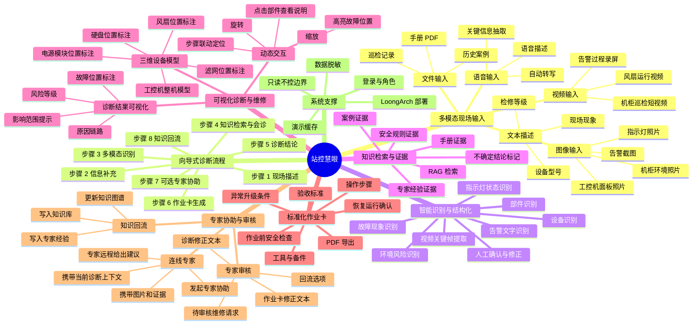
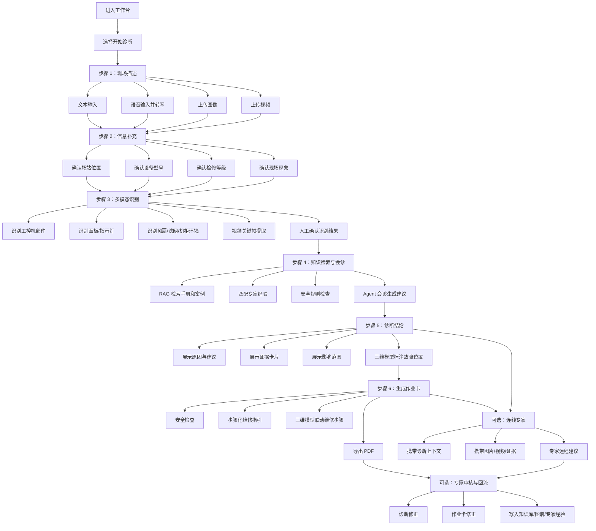

# 站控慧眼：功能需求分解图

## 1. 文档目的

本文档用于补充“站控慧眼——油气管道场站工控设备多模态检修知识助手”的功能分解视图，便于后续前端页面设计、功能排期和演示脚本梳理。

本分解图偏向产品功能结构，不代表所有功能都必须在首期完整实现。首期仍以“研华 ACP-4000 / IPC-610 工控机整机检修”为核心闭环。

---

## 2. 顶层功能分解图

---

## 3. 主业务流程分解图

---

## 4. 页面级功能分解

### 4.1 工作台

| 功能模块 | 子功能 | 说明 |
|---|---|---|
| 快速诊断入口 | 输入现场现象 | 支持直接输入一句现场问题 |
| 快捷问题 | 常见故障入口 | 如工控机高温、风扇异常、硬盘告警 |
| 最近记录 | 查看历史诊断 | 进入最近一次维修请求 |
| 待审核提醒 | 专家待审核数量 | 专家账号可快速进入审核页面 |
| 当前设备 | 主演示设备提示 | 展示研华 ACP-4000 / IPC-610 工控机整机 |

### 4.2 向导式智能诊断台

| 步骤 | 功能 | 页面表现 |
|---|---|---|
| 现场描述 | 文本/语音输入 | 主区域输入框，语音按钮 |
| 资料上传 | 图像/视频/文件 | 上传面板、预览缩略图 |
| 信息补充 | 场站、型号、等级确认 | 表单式确认，不依赖长对话 |
| 识别确认 | 识别结果人工确认 | 卡片展示识别字段，可修改 |
| 知识检索 | 检索手册、案例、经验 | 展示证据卡片 |
| 会诊生成 | Agent 汇总结论 | 展示诊断结论卡 |
| 下一步 | 生成作业卡/查看图谱/连线专家 | 按钮跳转 |

### 4.3 三维可视化诊断页

| 功能模块 | 子功能 | 说明 |
|---|---|---|
| 三维工控机模型 | 旋转、缩放、重置视角 | 用于展示整机结构 |
| 部件标注 | 风扇、滤网、电源、硬盘 | 高亮当前相关部件 |
| 故障定位 | 根据诊断结果定位 | 例如高温故障高亮风扇和滤网 |
| 步骤联动 | 点击作业步骤定位部件 | 维修步骤和模型位置联动 |
| 部件详情 | 点击部件查看说明 | 显示功能、故障、检查方法、证据来源 |

### 4.4 作业卡页面

| 功能模块 | 子功能 | 说明 |
|---|---|---|
| 作业概览 | 设备、故障、风险 | 展示作业卡基础信息 |
| 安全前置 | 断电、静电、防误操作 | 强制高亮安全项 |
| 步骤化维修 | 检查、处理、复测 | 支持逐步勾选 |
| 三维联动 | 步骤对应部件高亮 | 提升可视化指导效果 |
| 恢复确认 | 温度、风扇、数据上传 | 作为验收条件 |
| 导出 | 打印为 PDF | 首期采用浏览器打印 |

### 4.5 专家协助与审核页

| 功能模块 | 子功能 | 说明 |
|---|---|---|
| 连线专家 | 发起专家协助 | 携带当前维修请求上下文 |
| 专家查看上下文 | 查看输入、图片、证据、作业卡 | 不要求专家重新检索 |
| 专家修正 | 修正文本 + 修改原因 | 不做复杂结构化字段编辑 |
| 回流选项 | 知识库、图谱、专家经验、作业卡 | 专家选择回流目标 |
| 审核完成 | 标记维修请求处理完成 | 后续同类诊断可命中经验 |

---

## 5. 多模态输入需求分解

| 输入类型 | 首期建议 | 后续增强 | 说明 |
|---|---|---|---|
| 文本 | 必做 | 持续优化 | 现场描述、补充信息 |
| 图像 | 必做 | 支持更多标注 | 工控机面板、机柜环境、告警截图 |
| 语音 | 建议做轻量版 | 支持现场语音记录 | 首期可用浏览器录音或模拟转写 |
| 视频 | 可作为演示增强 | 关键帧识别 | 风扇运行、机柜巡检短视频 |
| 文件 | P1 | 文档入库流水线 | PDF、巡检记录、案例 |

---

## 6. 三维可视化需求分解

三维模型用于增强“诊断和维修位置可视化”，不要求首期实现复杂仿真。

首期可采用轻量实现：

1. 使用静态 3D 风格模型图或简化 Three.js 模型。
2. 标注工控机关键位置：风扇、滤网、电源模块、硬盘、前面板。
3. 根据诊断结果高亮相关部件。
4. 点击标注点显示部件说明、检查方法和证据来源。
5. 作业卡步骤与部件标注联动。

后续增强：

1. 可旋转三维模型。
2. 部件拆解视图。
3. 视频识别结果与模型位置联动。
4. 多设备模型库。

---

## 7. 首期与后续边界

### 首期优先实现

1. 文本输入。
2. 图像输入。
3. 向导式诊断流程。
4. RAG 证据卡片。
5. 诊断结论卡。
6. 作业卡。
7. 专家修正与回流。
8. 三维模型轻量标注或静态 3D 可视化。

### 可选增强

1. 语音输入与转写。
2. 视频上传与关键帧提取。
3. 可交互 Three.js 模型。
4. 连线专家实时协助。
5. PLC 控制柜完整诊断闭环。

### 明确不做

1. 不接入真实生产控制网络。
2. 不向 PLC、SCADA、现场仪表或执行机构下发控制指令。
3. 不做工控网络安全攻防。
4. 不做复杂三维仿真。
5. 不做本地大模型部署。
