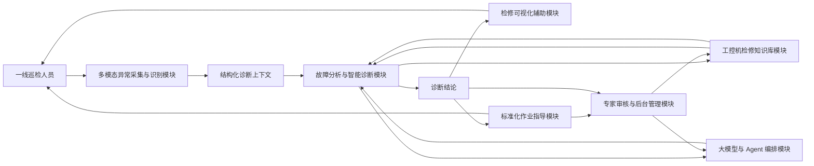
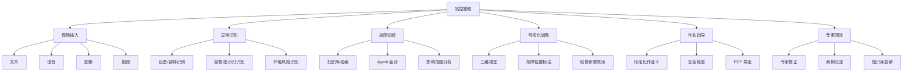

# 工控设备异常检测与故障分析系统：模块结构图

## 1. 总体模块结构

```mermaid
flowchart TB
  A[工控设备异常检测与故障分析系统]

  A --> M1[1. 多模态异常采集与识别模块]
  A --> M2[2. 故障分析与智能诊断模块]
  A --> M3[3. 工控机检修知识库模块]
  A --> M4[4. 大模型与 Agent 编排模块]
  A --> M5[5. 检修可视化辅助模块]
  A --> M6[6. 标准化作业指导模块]
  A --> M7[7. 专家审核与后台管理模块]

  M1 --> M11[图像输入分析]
  M1 --> M12[视频输入分析]
  M1 --> M13[语音输入分析]
  M1 --> M14[文本描述分析]
  M1 --> M15[工控机故障信息提取]
  M1 --> M16[人工确认识别结果]

  M2 --> M21[读取知识库信息分析]
  M2 --> M22[故障原因推理]
  M2 --> M23[风险等级判断]
  M2 --> M24[影响范围分析]
  M2 --> M25[生成诊断结论]
  M2 --> M26[连线专家辅助判断]

  M3 --> M31[维修手册与设备资料]
  M3 --> M32[历史维修案例]
  M3 --> M33[安全规范与检修规程]
  M3 --> M34[专家审核修改知识库]
  M3 --> M35[往期维修案例沉淀]

  M4 --> M41[接诊与知识检索 Agent]
  M4 --> M42[分析诊断 Agent]
  M4 --> M43[安全合规 Agent]
  M4 --> M44[作业指导生成 Agent]
  M4 --> M45[多 Agent 结果汇总]

  M5 --> M51[三维模型可视化诊断帮助]
  M5 --> M52[故障位置标注]
  M5 --> M53[维修可视化指示]
  M5 --> M54[诊断结果动态展示]
  M5 --> M55[部件说明与证据联动]

  M6 --> M61[文字作业指示文档]
  M6 --> M62[标准化作业卡]
  M6 --> M63[安全检查]
  M6 --> M64[恢复运行确认]
  M6 --> M65[PDF 导出]

  M7 --> M71[待审核维修请求]
  M7 --> M72[专家修正回流]
  M7 --> M73[知识库管理]
  M7 --> M74[用户管理]
  M7 --> M75[每次解决案例管理]
```



---

## 2. 模块协作流程图



---

## 3. 面向演示的简化模块图



---

## 4. 模块职责说明

| 模块 | 核心职责 | 主要输出 |
|---|---|---|
| 多模态异常采集与识别模块 | 接收文本、语音、图像、视频等现场输入，并提取设备、故障、告警和环境信息 | 结构化诊断上下文 |
| 故障分析与智能诊断模块 | 结合现场上下文、知识库和模型能力进行故障推理 | 诊断结论、原因分析、影响范围 |
| 工控机检修知识库模块 | 管理维修手册、历史案例、安全规范和专家经验 | RAG 证据、案例、专家经验 |
| 大模型与 Agent 编排模块 | 调度接诊、检索、诊断、安全、作业指导等 Agent | 会诊意见、汇总结论 |
| 检修可视化辅助模块 | 通过三维模型和动态标注展示故障位置与维修步骤 | 可视化诊断结果、部件定位 |
| 标准化作业指导模块 | 将诊断结论转化为可执行作业卡 | 作业卡、PDF、恢复确认 |
| 专家审核与后台管理模块 | 支持专家修正、案例沉淀、知识库管理和用户管理 | 已审核经验、知识库更新 |

---

## 5. 推荐 PPT 展示版本

如果放到 PPT 中，建议使用 6 模块简化表达：

```text
多模态输入
  -> 异常识别
  -> 智能诊断
  -> 三维可视化
  -> 作业指导
  -> 专家回流
```

完整文档和 PRD 中使用 7 模块结构，PPT 中使用 6 模块结构，便于评委快速理解。
