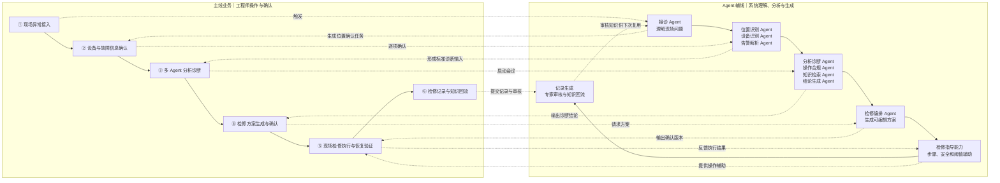
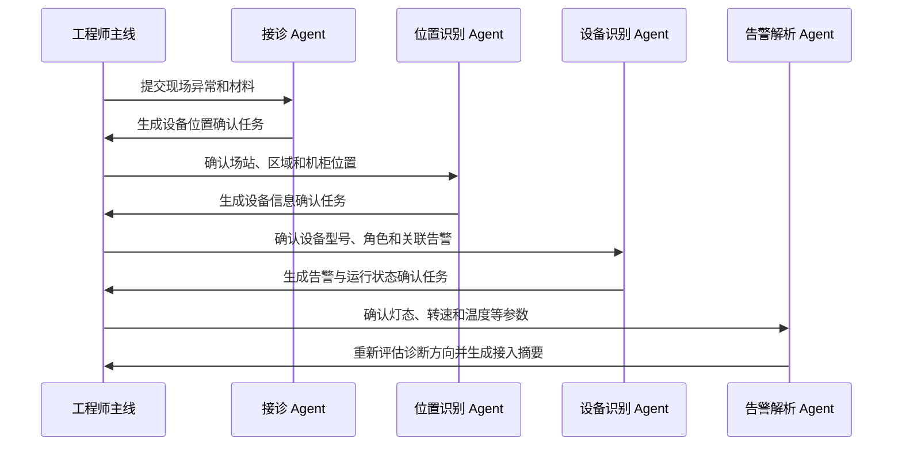
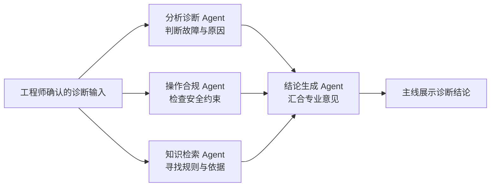

# LA 项目业务与 Agent 流程梳理

> 版本：V0.1
> 更新日期：2026-07-11
> 当前内容：主线业务流程
> 说明：本文档用于统一项目流程名称和对外讲解口径，后续将在本文件中继续补充 Agent 辅线、页面交互流程和数据流。

## 1. 项目整体主线业务流程

项目整体主线业务流程统一为以下六个阶段：

```text
现场异常接入
    ↓
设备与故障信息确认
    ↓
多 Agent 分析诊断
    ↓
检修方案生成与确认
    ↓
现场检修执行与恢复验证
    ↓
检修记录与知识回流
```

对外展示时可以压缩为：

```text
异常接入 → 信息确认 → 智能诊断 → 方案确认 → 检修执行 → 记录回流
```

### 1.1 现场异常接入

一线人员发现设备异常后，通过系统提交现场情况，包括文字描述、故障图片、故障视频和故障音频。

本阶段主要解决：

> 现场发生了什么？

阶段输出为未经系统加工的原始故障信息和现场证据。

### 1.2 设备与故障信息确认

系统根据现场信息匹配设备位置、设备台账、设备型号、告警状态和运行参数，再由工程师确认或修改。

本阶段主要解决：

> 哪里出现了问题？是哪台设备？当前有哪些异常信号？

阶段输出为一份经过工程师确认的标准化诊断输入。

### 1.3 多 Agent 分析诊断

系统将确认后的信息交给多个专业 Agent，从故障分析、安全合规、维修知识和历史案例等角度协同判断。

系统需要说明：

- 当前判断是什么；
- 为什么得出这个判断；
- 使用了哪些现场证据；
- 参考了哪些知识依据；
- 可能原因的优先级是什么。

本阶段主要解决：

> 设备可能为什么出现故障？

阶段输出为带原因、证据和风险说明的诊断结论。

### 1.4 检修方案生成与确认

系统根据诊断结论生成一份分层的检修预方案，包括大的检修阶段和具体维修步骤。

工程师可以对方案进行增删、修改和排序。断电、防静电等强制安全项由系统保护，不能删除。

本阶段主要解决：

> 应该按照什么顺序进行检修？

阶段输出为一份经过工程师确认、可以正式执行的检修方案。

### 1.5 现场检修执行与恢复验证

系统按照确认后的方案生成步骤式检修向导，一线人员逐步执行检查、清理、维修和更换等操作。

完成维修后，还需要进行恢复验证，确认：

- 告警是否解除；
- 设备参数是否恢复正常；
- 设备运行是否稳定；
- 数据上传和业务功能是否正常。

本阶段主要解决：

> 具体怎么修？修完后是否真正恢复正常？

阶段输出为完整的步骤执行结果和恢复验证结果。

### 1.6 检修记录与知识回流

系统把本次异常、诊断结论、检修方案、执行步骤、安全确认和恢复结果汇总成检修记录。

专家可以进一步审核记录、修正诊断或补充现场经验。审核后的经验再沉淀到知识库、专家经验库和知识图谱中，供后续类似故障使用。

本阶段主要解决：

> 这次维修如何留痕？经验如何供下一次复用？

阶段输出为检修记录和经过审核的维修知识。

## 2. 主线业务总结

整个项目最核心的业务逻辑是：

> 先把现场异常接进来，再确认设备和故障信息；然后通过多 Agent 完成有依据的诊断，由系统生成、工程师确认检修方案；最后指导现场执行、验证恢复，并将本次维修经验沉淀回知识系统。

## 3. 主线与 Agent 辅线如何配合

项目同时存在上下两条流程：

- **主线业务**：工程师正在完成的业务，包括提交、确认、修改和执行；
- **Agent 辅线**：系统在主线背后完成的信息理解、识别、分析、生成和解释。

Agent 不是脱离业务单独运行，也不是多个机器人轮流聊天。它们只在主线到达相应节点、获得工程师确认后出现，完成自己的专业任务，再为主线生成下一项任务或结果。

两条线的基本协作方式是：

```text
工程师提交或确认
    ↓
对应 Agent 开始处理
    ↓
Agent 生成下一项任务或结果，并说明原因与依据
    ↓
工程师确认、修改或执行
    ↓
触发下一位 Agent
```

## 4. 主线业务与 Agent 辅线总图



## 5. 哪个主线阶段出现哪个 Agent

这张表是主线与 Agent 辅线的统一对应关系，也是制作 PPT 时最直接的讲解顺序。

| 主线到达的阶段 | 什么时候触发 | 此时出现的 Agent / 模块 | 大概做什么 | 返回主线的结果 |
| --- | --- | --- | --- | --- |
| 现场异常接入 | 工程师提交文字、图片、视频或音频并开始接诊 | **接诊 Agent** | 理解现场问题，提取设备、告警、状态和位置线索，判断还缺什么信息 | 生成“设备位置确认”任务 |
| 设备与故障信息确认 | 工程师确认位置、设备和告警信息时逐个触发 | **位置识别 Agent、设备识别 Agent、告警解析 Agent** | 先匹配场站和机柜，再匹配设备台账，最后判断告警与运行参数是否互相印证 | 形成经过工程师确认的标准诊断输入和接入摘要 |
| 多 Agent 分析诊断 | 工程师确认接入摘要并点击启动诊断 | **分析诊断 Agent、操作合规 Agent、知识检索 Agent** | 分别判断故障原因、检查安全要求、查找维修知识和历史依据 | 将三类专业意见交给结论生成 Agent |
| 诊断结果形成 | 三个会诊 Agent 都完成后自动触发 | **结论生成 Agent** | 汇总故障判断、原因排序、安全约束和知识依据 | 输出一份可解释的诊断结论 |
| 检修方案生成与确认 | 工程师认可诊断方向并点击生成预方案 | **检修编排 Agent** | 把诊断结论转成“大阶段 + 小维修步骤”的两级提纲，并锁定强制安全项 | 输出可由工程师修改和确认的检修预方案 |
| 现场检修执行与恢复验证 | 工程师确认检修方案并进入向导 | **检修指导能力** | 根据当前步骤提供操作说明、图片位置、安全提醒、判断阈值和完成条件 | 帮助工程师逐步完成检修和恢复验证 |
| 检修记录与知识回流 | 检修和恢复验证完成后触发 | **记录生成模块、专家审核与知识回流模块** | 汇总全过程记录，接收专家修正，把审核经验沉淀到知识库和知识图谱 | 生成检修记录，并让审核知识供下一次故障复用 |

## 6. 第二阶段内部的 Agent 接力

“设备与故障信息确认”阶段包含多次确认，因此不是三个 Agent 同时出现，而是按工程师的确认结果依次接力：



这段接力可以用一句话解释：

> 接诊 Agent 先判断“还需要确认位置”，位置确认后再识别设备，设备确认后再解析告警，最终把模糊的现场问题整理成可以正式诊断的标准输入。

## 7. 多 Agent 会诊如何汇合

进入诊断后，三个专业 Agent 从不同角度处理同一份诊断输入，再由结论生成 Agent 汇合：



这四个 Agent 的分工分别是：

- 分析诊断 Agent 回答“最可能哪里出现了问题”；
- 操作合规 Agent 回答“后续操作必须满足哪些安全条件”；
- 知识检索 Agent 回答“这个判断和阈值有什么依据”；
- 结论生成 Agent 把三方意见整理成工程师能理解和确认的统一结论。

## 8. 整体 Agent 辅线的核心逻辑

```text
接诊 Agent 理解问题
    ↓
位置、设备、告警 Agent 明确诊断对象
    ↓
诊断、合规、知识 Agent 分别提出专业意见
    ↓
结论生成 Agent 汇合证据并形成诊断结论
    ↓
检修编排 Agent 生成可编辑方案
    ↓
检修指导能力辅助现场执行
    ↓
记录与专家审核模块沉淀知识
    ↓
沉淀的知识重新服务下一次接诊和诊断
```

一句话概括：

> Agent 辅线通过“理解问题、明确对象、协同诊断、汇合结论、编排方案、辅助执行、沉淀经验”七类能力，在不替代工程师决策的前提下，持续推动主线业务向前运行。

对外讲解时应强调：

> 多 Agent 不是多个机器人轮流说话，而是多个具有不同专业职责的处理角色，共同服务同一条检修业务主线。

## 9. 当前实现边界

- 当前 Agent 推理、会诊轨迹和结果主要使用预置数据进行高保真模拟；
- 图片、视频和音频目前支持接入与展示，不进行真实内容识别；
- 检修指导能力目前由步骤式向导和右侧辅助对话共同承担，尚未独立接入真实模型；
- 记录生成和专家审核已有基础演示，完整的知识上传、审核、归档和真实图谱写入仍待后续建设；
- 系统只提供诊断和检修辅助，不向 PLC、SCADA 或现场设备下发控制命令。

## 10. 后续待补充内容

1. 各阶段页面与交互流程；
2. 各阶段输入、处理和输出数据；
3. PPT 与评审讲解口径。
